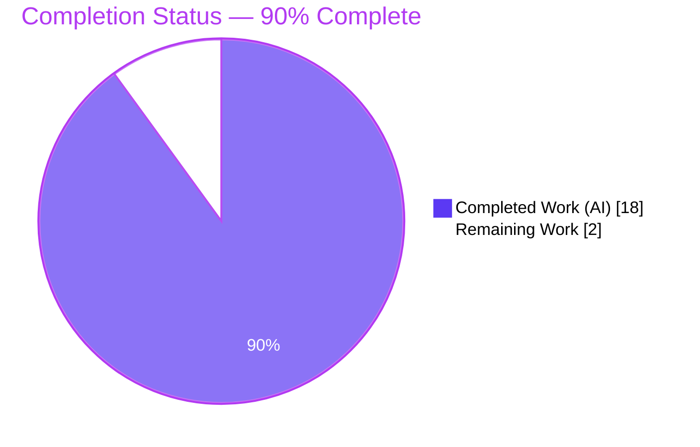
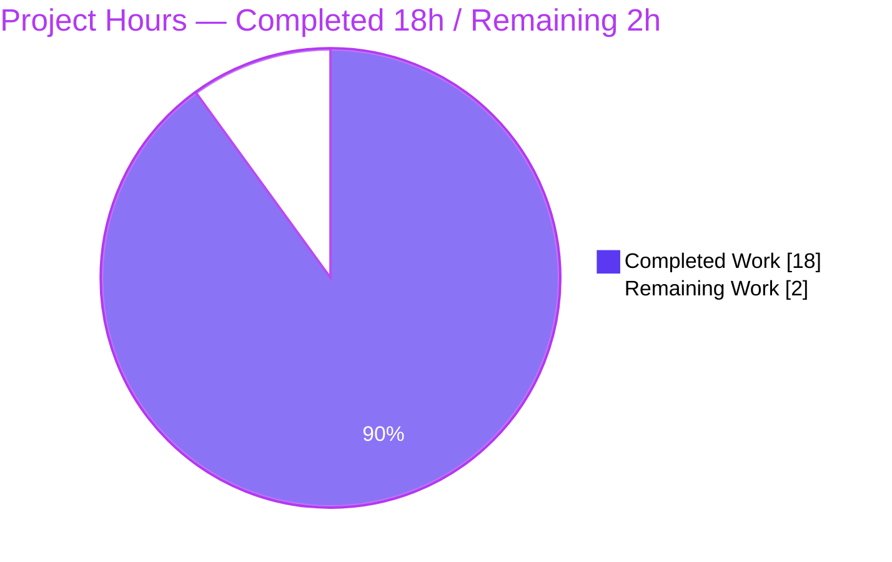
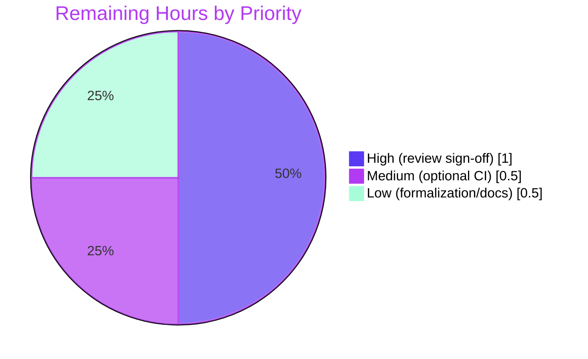

# Blitzy Project Guide — `blitzyignore-submodule-test`

> Autonomous unit-test suite delivery for a dependency-free Git-submodule fixture.
> Brand legend: <span style="color:#5B39F3">**Completed / AI Work = Dark Blue (#5B39F3)**</span> · **Remaining / Not Completed = White (#FFFFFF)** · Headings/Accents = Violet-Black (#B23AF2) · Highlight = Mint (#A8FDD9).

---

## 1. Executive Summary

### 1.1 Project Overview

The `blitzyignore-submodule-test` repository is a deliberately dependency-free Git-submodule **fixture** whose entire executable surface is six pure, zero-argument Python "marker" functions distributed across a superproject and three submodule tiers. The project's objective was to author a comprehensive, deterministic, isolated unit-test suite that exercises 100% of that logic, with byte-exact assertions and full statement/branch coverage. Target users are the fixture's maintainers and the downstream `.blitzyignore` composition tooling that relies on the markers as verification oracles. Technical scope: a standard-library `unittest` suite plus optional developer-only coverage tooling, all confined to the superproject so the pinned submodules remain pristine.

### 1.2 Completion Status



*Center metric: **90.0% Complete**. Completed slice = Dark Blue (#5B39F3); Remaining slice = White (#FFFFFF).*

| Metric | Hours |
|--------|-------|
| **Total Hours** | **20.0** |
| Completed Hours (AI + Manual) | 18.0 (AI: 18.0 · Manual: 0.0) |
| Remaining Hours | 2.0 |
| **Percent Complete** | **90.0%** |

> Completion % is computed by the PA1 AAP-scoped hours method: `Completed ÷ (Completed + Remaining) × 100 = 18.0 ÷ 20.0 × 100 = 90.0%`. The entire autonomous AAP scope is delivered and independently re-verified; the remaining 2.0 h is a human/path-to-production tail (review + optional CI + optional formalization), not an autonomous gap.

### 1.3 Key Accomplishments

- ✅ **Full test suite authored (greenfield 0% → 100%)** — 8 in-scope artifacts created and committed: 6 test/helper files + `.coveragerc` + `requirements-dev.txt` (280 insertions, 0 deletions).
- ✅ **37 tests pass on both runners** — `unittest` reports "Ran 37 tests … OK"; `pytest` reports "37 passed, 30 subtests passed."
- ✅ **100% statement & branch coverage** — 12 statements, 0 missed, 0 branches across exactly the six in-scope files; `fail_under=100` gate passes.
- ✅ **Reliable import mechanism** — `importlib` file-path loader handles the non-package layout, the hyphenated `nested-utils` directory, and the two distinct `build/` directories, with a `sys.dont_write_bytecode` guard that keeps submodules pristine.
- ✅ **Submodule & scope integrity preserved** — all three `160000` gitlink pins unchanged; zero files written inside submodules; `.blitzyignore`-excluded targets (`secrets.py`, `Vision_CENTRAL/build/`, `nested-utils/temp/`) never opened or measured.
- ✅ **Non-leakage gate G4 asserted** — `generated()` and `report()` verified to end with `(proves no cross-submodule leak)`.
- ✅ **Zero-dependency runtime maintained** — sources import nothing; coverage/pytest are optional dev-only tooling pinned in `requirements-dev.txt`.

### 1.4 Critical Unresolved Issues

| Issue | Impact | Owner | ETA |
|-------|--------|-------|-----|
| *None* — no compilation errors, no test failures, no coverage gaps, no scope violations were found during autonomous validation | None | — | — |

There are **no critical unresolved issues**. All five autonomous production-readiness gates passed with zero defects.

### 1.5 Access Issues

| System/Resource | Type of Access | Issue Description | Resolution Status | Owner |
|-----------------|----------------|-------------------|-------------------|-------|
| — | — | No access issues identified | N/A | — |

**No access issues identified.** The repository, both submodules, and their nested submodule resolved to their pinned commits; dev tooling was installed and verified offline (`pip check` → "No broken requirements found").

### 1.6 Recommended Next Steps

1. **[High]** Perform human code review and acceptance sign-off of the 8 artifacts; reproduce the 37/37 pass and 100% coverage locally (see §9).
2. **[Medium]** Add the optional single-job CI workflow so the suite (and the `fail_under=100` gate) runs automatically on every push (mitigates risk R2).
3. **[Low]** Optionally formalize the `pytest` runner (`conftest.py` fixture + `testpaths`) and add a brief repository quickstart note.
4. **[Low]** Optionally pin the interpreter (e.g., `.python-version`) to eliminate local/CI version drift between Python 3.12.x and 3.13.x.

---

## 2. Project Hours Breakdown

### 2.1 Completed Work Detail

| Component | Hours | Description |
|-----------|-------|-------------|
| Test-infra discovery & layout analysis | 2.0 | Greenfield scan (§0.2.1); confirmed no framework/CI/config; analyzed non-package + hyphenated `nested-utils` + dual `build/` layout |
| Import-mechanism design & proof-of-concept | 2.0 | `importlib.util.spec_from_file_location` file-path loading (§0.2.1/§0.4.4); POC proving all six modules load |
| Tooling version research & compatibility | 1.0 | Verified compatible `coverage 7.15.2`, `pytest 9.1.1`, `pytest-cov 7.1.0` (§0.2.2) |
| `tests/_loader.py` + `tests/__init__.py` | 2.0 | Shared loader with `sys.dont_write_bytecode` guard + root resolution; package marker (§0.5.2) |
| `tests/test_root_markers.py` | 1.0 | 5 unit tests for `main()`: value, type, non-empty, determinism, signature (§0.5.2) |
| `tests/test_vision_central.py` | 2.0 | 16 unit tests for `run()`, `helper()`, `generated()` incl. G4 non-leak suffix (§0.5.2) |
| `tests/test_vision_merchandising.py` | 1.5 | 11 unit tests for `totals()`, `report()` incl. G4 non-leak suffix (§0.5.2) |
| `tests/test_marker_contract.py` | 2.0 | Parametrized cross-cutting contract over all 6 markers (30 subtests) (§0.5.2) |
| `.coveragerc` | 1.0 | `branch=True`, `include` = exactly the 6 in-scope files, `fail_under=100` (§0.5.4/§0.7.1) |
| `requirements-dev.txt` | 0.5 | Pins dev-only tooling to exact versions (§0.6.1) |
| Coverage + dual-runner validation | 1.5 | Ran `unittest` + `pytest` + `coverage.py`; confirmed 37/37 and 100% (§0.9.1) |
| Submodule-integrity & excluded-target verification + commit hygiene | 1.5 | Verified 3 pins unchanged, 0 submodule writes, excluded targets untouched, clean tree (§0.8.2/§0.10.1) |
| **Total Completed** | **18.0** | Matches Section 1.2 Completed Hours |

### 2.2 Remaining Work Detail

| Category | Hours | Priority |
|----------|-------|----------|
| Human code review & acceptance sign-off of the test suite | 1.0 | High |
| Optional CI single-job workflow to auto-run the suite (path-to-production, §6.6.4) | 0.5 | Medium |
| Optional `pytest`-runner formalization (`conftest.py`/`testpaths`) + env quickstart note | 0.5 | Low |
| **Total Remaining** | **2.0** | Matches Section 1.2 Remaining Hours & Section 7 pie |

### 2.3 Hours Reconciliation

- Section 2.1 total (Completed) = **18.0 h**
- Section 2.2 total (Remaining) = **2.0 h**
- **18.0 + 2.0 = 20.0 h = Total Project Hours** (Section 1.2) ✓
- Completion = 18.0 ÷ 20.0 = **90.0%** (Sections 1.2, 7, 8) ✓

---

## 3. Test Results

All tests below originate from Blitzy's autonomous validation logs for this project and were **independently re-executed** during this assessment. Two runners were exercised against the identical suite.

| Test Category | Framework | Total Tests | Passed | Failed | Coverage % | Notes |
|---------------|-----------|-------------|--------|--------|-----------|-------|
| Unit — Root markers | `unittest` | 5 | 5 | 0 | 100% | `app.py::main()` |
| Unit — Vision_CENTRAL tier | `unittest` | 16 | 16 | 0 | 100% | `run()`, `helper()`, `generated()` + G4 non-leak suffix |
| Unit — Vision_Merchandising tier | `unittest` | 11 | 11 | 0 | 100% | `totals()`, `report()` + G4 non-leak suffix |
| Unit — Cross-cutting contract | `unittest` (subTest) | 5 | 5 | 0 | 100% | 30 subtests × (value, type, non-empty, determinism, signature) over all 6 markers |
| **TOTAL** | **`unittest`** | **37** | **37** | **0** | **100%** | "Ran 37 tests in 0.005s / OK" |

**Alternative runner (documented):** `pytest 9.1.1` + `pytest-cov 7.1.0` → **37 passed, 30 subtests passed** in 0.05 s; "Required test coverage of 100.0% reached. Total coverage: 100.00%."

**Coverage detail (`coverage.py 7.15.2` via `.coveragerc`):**

| File | Stmts | Miss | Branch | BrPart | Cover |
|------|-------|------|--------|--------|-------|
| `app.py` | 2 | 0 | 0 | 0 | 100% |
| `Vision_CENTRAL/service.py` | 2 | 0 | 0 | 0 | 100% |
| `Vision_CENTRAL/nested-utils/util.py` | 2 | 0 | 0 | 0 | 100% |
| `Vision_CENTRAL/nested-utils/build/generated.py` | 2 | 0 | 0 | 0 | 100% |
| `Vision_Merchandising/sales.py` | 2 | 0 | 0 | 0 | 100% |
| `Vision_Merchandising/build/report.py` | 2 | 0 | 0 | 0 | 100% |
| **TOTAL** | **12** | **0** | **0** | **0** | **100%** |

*Test types present: Unit only. Integration, E2E, performance, security-suite, and UI tests are intentionally excluded — the pure, branch-free functions have no referent for them (§0.9.1).*

---

## 4. Runtime Validation & UI Verification

**Runtime health — each marker invoked via the `importlib` loader and asserted byte-exact, deterministic, and zero-argument:**

- ✅ **Operational** — `app.py::main()` → `"root: always included"`
- ✅ **Operational** — `Vision_CENTRAL/service.py::run()` → `"vision-central: always included"`
- ✅ **Operational** — `Vision_CENTRAL/nested-utils/util.py::helper()` → `"nested-utils: always included"`
- ✅ **Operational** — `Vision_CENTRAL/nested-utils/build/generated.py::generated()` → `"nested-utils/build: included (proves no cross-submodule leak)"`
- ✅ **Operational** — `Vision_Merchandising/sales.py::totals()` → `"vision-merchandising: always included"`
- ✅ **Operational** — `Vision_Merchandising/build/report.py::report()` → `"vision-merchandising/build: included (proves no cross-submodule leak)"`

**Non-leakage gate (G4):** ✅ `generated()` and `report()` both verified to end with `(proves no cross-submodule leak)`.

**Submodule integrity:** ✅ All three pins unchanged; ✅ zero `__pycache__` written into submodules (loader `sys.dont_write_bytecode` guard confirmed).

**UI verification:** ⚪ **Not applicable** — this is a headless Python test fixture with no user interface.

**API integration:** ⚪ **Not applicable** — the functions perform no I/O and call no external services, databases, or network endpoints (nothing to mock).

---

## 5. Compliance & Quality Review

Cross-map of AAP deliverables/constraints to Blitzy quality benchmarks. All items validated during autonomous execution; **no fixes were required** (zero defects found).

| Benchmark / AAP Requirement | Status | Progress | Evidence / Fix Applied |
|-----------------------------|--------|----------|------------------------|
| All 8 in-scope artifacts created & committed | ✅ Pass | 100% | HEAD `b4869e6`; 8 files, 280 insertions, 0 deletions |
| 100% statement + branch coverage (§0.7.1) | ✅ Pass | 100% | 12 stmts, 0 miss, 0 branch; `fail_under=100` passes |
| Byte-exact value assertions, all 6 markers (§0.4.2) | ✅ Pass | 100% | Per-tier tests + `test_exact_values` (6 subtests) |
| Type / non-empty / determinism / signature (§0.1.1) | ✅ Pass | 100% | Per-tier tests + contract suite |
| Non-leak G4 suffix on `generated()`/`report()` (§4.4) | ✅ Pass | 100% | `test_generated_non_leak_suffix`, `test_report_non_leak_suffix` |
| Reliable importlib loading (non-package/hyphenated) (§0.2.1) | ✅ Pass | 100% | `tests/_loader.py`; all 6 load incl. `nested-utils` |
| Determinism / isolation / no flakiness (§0.7.2) | ✅ Pass | 100% | No I/O/net/time/random; fresh load per test; 0.005 s |
| Zero-dependency runtime preserved (§2.6.2/§0.6.1) | ✅ Pass | 100% | Sources import nothing; tooling dev-only & pinned |
| No source-module modification (§0.8.2) | ✅ Pass | 100% | `git diff` shows 0 source changes |
| No writes inside pinned submodules (§0.8.2) | ✅ Pass | 100% | All artifacts in superproject; pins unchanged |
| Excluded targets never opened/measured (§0.10.1) | ✅ Pass | 100% | `.coveragerc` include-list; loader never touches them |
| Naming/layout conventions (§6.6.2) | ✅ Pass | 100% | `Test<Module>` classes, `test_<fn>_returns_marker` methods |
| CI/CD pipeline (explicitly out of AAP scope) | ⚪ Deferred | Optional | Path-to-production item (§6.6.4); see §2.2 / HT-2 |
| Human acceptance sign-off | ⚪ Pending | Manual | See §2.2 / HT-1 |

**Outstanding compliance items:** only the optional/deferred CI workflow and the manual acceptance sign-off remain — both are path-to-production, not autonomous scope.

---

## 6. Risk Assessment

Overall posture: **LOW**. A pure, dependency-free fixture with 100% coverage and no external service/DB/network/auth surface. No High or Critical risks exist.

| # | Risk | Category | Severity | Probability | Mitigation | Status |
|---|------|----------|----------|-------------|------------|--------|
| R1 | Python version drift (validated on 3.13.7; AAP assumed 3.12.3) | Technical | Low | Low | Dev tooling pinned in `requirements-dev.txt`; document interpreter; optional `.python-version` | Mitigated |
| R2 | No CI to catch future regressions | Technical | Low | Medium | Add optional single-job CI workflow (§2.2 / HT-2) | Open |
| R3 | Loader depends on repo-root path resolution | Technical | Low | Low | `_ROOT` derived from `Path(__file__).resolve()`; paths centralized | Mitigated |
| R4 | Excluded `secrets.py` files present in tree | Security | Low | Low | `.blitzyignore` + `.coveragerc` include-list; loader never opens them | Mitigated |
| R5 | Dev-dependency vulnerabilities accruing over time | Security | Low | Low | Zero runtime deps; dev tooling pinned; periodic review | Mitigated |
| R6 | Submodules not initialized on a fresh clone | Operational | Medium | Medium | Documented `git submodule update --init --recursive` (see §9) | Mitigated |
| R7 | Submodule pin drift could alter marker strings | Integration | Medium | Low | Pins verified; assertions sourced from §1.2.3; suite itself flags any mismatch | Mitigated |
| R8 | Source-file relocation would break file-path loading | Integration | Low | Low | Relative paths centralized in loader calls + contract table | Mitigated |

---

## 7. Visual Project Status

**Project hours breakdown** (Completed = Dark Blue #5B39F3, Remaining = White #FFFFFF):



**Remaining work by priority** (from §2.2, total = 2.0 h):



> Integrity check: pie "Remaining Work" = **2.0 h** = Section 1.2 Remaining = Section 2.2 total. Pie "Completed Work" = **18.0 h** = Section 1.2 Completed = Section 2.1 total.

---

## 8. Summary & Recommendations

**Achievements.** The autonomous effort delivered the complete AAP scope for `blitzyignore-submodule-test`: a thorough, deterministic `unittest` suite that covers 100% of the six marker functions with byte-exact assertions plus type, non-emptiness, determinism, zero-argument-signature, and non-leakage (G4) checks. All 8 in-scope artifacts are committed; **37/37 tests pass on both `unittest` and `pytest`**, and coverage is **100%** (12 statements, 0 branches) with a `fail_under=100` gate. Submodule pins are intact and no excluded target was ever touched.

**Remaining gaps.** The project is **90.0% complete**. The remaining 2.0 hours is entirely a human/path-to-production tail: (1) human code review and acceptance sign-off [High], (2) an optional single-job CI workflow [Medium], and (3) optional `pytest` formalization plus a quickstart note [Low]. None of these represent autonomous-scope defects.

**Critical path to production.** Reproduce the suite locally → review and sign off (HT-1) → (optional) wire the CI gate (HT-2). Once HT-1 is complete, the suite is production-ready as a verification fixture.

**Success metrics (all met):** 100% coverage of in-scope logic ✓ · 37/37 pass on two runners ✓ · zero flakiness (0.005 s deterministic) ✓ · zero submodule perturbation ✓ · zero excluded-target access ✓.

**Production readiness assessment:** **Ready pending human sign-off.** The codebase is functionally complete and quality-gated; the outstanding work is verification and optional automation rather than implementation.

| Metric | Value |
|--------|-------|
| Completion | 90.0% |
| Tests passing | 37 / 37 (100%) |
| Coverage | 100% (12/12 stmts, 0 branches) |
| Defects found | 0 |
| Remaining effort | 2.0 h (path-to-production) |

---

## 9. Development Guide

Every command below was executed during this assessment and produced the output shown. Run all commands from the **repository root** unless noted.

### 9.1 System Prerequisites

- **OS:** Linux/macOS (validated on an Ubuntu 25.10 container)
- **Python:** 3.13.7 (any CPython ≥ 3.10 works; the AAP baseline was 3.12.3)
- **Git:** 2.51.0 with submodule support; **Git LFS** present (repo hooks are git-lfs only)

```bash
python3 --version   # -> Python 3.13.7
git --version       # -> git version 2.51.0
```

### 9.2 Environment Setup

```bash
# 1) Clone (or enter) the repository, then initialize submodules to their pinned commits
git submodule update --init --recursive
# Expected: three pins resolve
#   7fee06d... Vision_CENTRAL
#   62d3372... Vision_CENTRAL/nested-utils
#   8e9b0e2... Vision_Merchandising

# 2) Create and activate an isolated interpreter
python3 -m venv .venv
. .venv/bin/activate
```

### 9.3 Dependency Installation (optional — dev-only)

The **primary** `unittest` path needs **no** third-party packages. Install the optional dev tooling only if you want coverage/pytest:

```bash
pip install -r requirements-dev.txt
# Installs pinned: coverage==7.15.2, pytest==9.1.1, pytest-cov==7.1.0
pip check
# Expected: "No broken requirements found."
```

### 9.4 Running the Suite

```bash
# PRIMARY (zero-dependency) — standard-library unittest
python -m unittest discover -s tests
# Expected: "Ran 37 tests in 0.005s" then "OK"

# Verbose
python -m unittest discover -s tests -v

# Single test
python -m unittest tests.test_root_markers.TestRootMarkers.test_main_returns_marker
# Expected: "Ran 1 test in 0.000s" then "OK"

# Debug — stop on first failure
python -m unittest discover -s tests -v -f
```

### 9.5 Coverage (optional, dev-only)

```bash
coverage run --rcfile=.coveragerc -m unittest discover -s tests && coverage report -m
# Expected TOTAL: 12 stmts, 0 miss, 0 branch, 100% (exit 0; fail_under=100 gate passes)

# HTML report
coverage html   # then open htmlcov/index.html
```

### 9.6 Alternative Runner — `pytest`

```bash
python -m pytest tests -v
# Expected: "37 passed, 30 subtests passed"

python -m pytest tests --cov --cov-config=.coveragerc --cov-report=term-missing
# Expected: "37 passed" + "Required test coverage of 100.0% reached."

python -m pytest tests/test_root_markers.py -q   # single file -> "5 passed"
```

### 9.7 Verification / Example Usage

```bash
# Invoke a marker through the shared loader (proves the import mechanism)
python -c "from tests._loader import load_marker; print(load_marker('app','app.py').main())"
# Expected: root: always included

# Confirm submodule pins are unchanged and clean
git submodule status --recursive
git status --porcelain   # empty output = clean working tree
```

### 9.8 Troubleshooting

| Symptom | Cause | Resolution |
|---------|-------|------------|
| `ModuleNotFoundError: No module named 'tests'` | Not run from repo root | `cd` to the repository root; ensure `tests/__init__.py` exists |
| `FileNotFoundError` / empty source in loader | Submodules not initialized | `git submodule update --init --recursive` |
| Coverage < 100% or `fail_under` trips | Missing `--rcfile` or wrong CWD | Pass `--rcfile=.coveragerc`; run from repo root |
| Stray `__pycache__` near sources | Bytecode written outside the loader | Loader sets `sys.dont_write_bytecode=True`; otherwise `export PYTHONDONTWRITEBYTECODE=1` |
| Regenerable artifacts (`.coverage`, `.pytest_cache`) appear | Normal tool output | Safe to delete; they are untracked and not committed |

---

## 10. Appendices

### Appendix A — Command Reference

| Purpose | Command |
|---------|---------|
| Init submodules | `git submodule update --init --recursive` |
| Create venv | `python3 -m venv .venv && . .venv/bin/activate` |
| Install dev tooling | `pip install -r requirements-dev.txt` |
| Run suite (primary) | `python -m unittest discover -s tests` |
| Run verbose | `python -m unittest discover -s tests -v` |
| Single test | `python -m unittest tests.test_root_markers.TestRootMarkers.test_main_returns_marker` |
| Stop on first failure | `python -m unittest discover -s tests -v -f` |
| Coverage + report | `coverage run --rcfile=.coveragerc -m unittest discover -s tests && coverage report -m` |
| Coverage HTML | `coverage html` |
| pytest (all) | `python -m pytest tests -v` |
| pytest + coverage | `python -m pytest tests --cov --cov-config=.coveragerc --cov-report=term-missing` |

### Appendix B — Port Reference

⚪ **Not applicable.** This is a headless test fixture; it binds no network ports and runs no services.

### Appendix C — Key File Locations

| Path | Role |
|------|------|
| `app.py` | Root marker `main()` (in-scope source) |
| `Vision_CENTRAL/service.py` | Marker `run()` (submodule source) |
| `Vision_CENTRAL/nested-utils/util.py` | Marker `helper()` (nested submodule source) |
| `Vision_CENTRAL/nested-utils/build/generated.py` | Marker `generated()` — G4 non-leak |
| `Vision_Merchandising/sales.py` | Marker `totals()` (submodule source) |
| `Vision_Merchandising/build/report.py` | Marker `report()` — G4 non-leak |
| `tests/_loader.py` | Shared `importlib` file-path loader |
| `tests/__init__.py` | Superproject test-package marker |
| `tests/test_root_markers.py` | Root-tier unit tests |
| `tests/test_vision_central.py` | Vision_CENTRAL-tier unit tests |
| `tests/test_vision_merchandising.py` | Vision_Merchandising-tier unit tests |
| `tests/test_marker_contract.py` | Parametrized cross-cutting contract |
| `.coveragerc` | Coverage config (`branch`, `include`, `fail_under=100`) |
| `requirements-dev.txt` | Pinned dev-only tooling |
| `.blitzyignore` (each tier) | Scoping rules — **read-only**, never edited |
| `.gitmodules` | Submodule declarations — **read-only** |

### Appendix D — Technology Versions

| Component | Version | Notes |
|-----------|---------|-------|
| Python (validated) | 3.13.7 | AAP baseline 3.12.3; any ≥ 3.10 works |
| `unittest` | stdlib | Primary runner — zero external dependency |
| `importlib` / `inspect` | stdlib | File-path loading; signature assertions |
| `coverage` | 7.15.2 | Optional dev-only |
| `pytest` | 9.1.1 | Optional alternative runner |
| `pytest-cov` | 7.1.0 | Optional coverage plugin |
| Git | 2.51.0 | Submodule support |

### Appendix E — Environment Variable Reference

| Variable | Purpose | Default |
|----------|---------|---------|
| `PYTHONDONTWRITEBYTECODE` | Prevent `__pycache__` when sources are executed outside the loader (protects submodules) | Loader sets `sys.dont_write_bytecode=True` at runtime; export `=1` for ad-hoc runs |

*No application/runtime environment variables are required — the fixture reads none.*

### Appendix F — Developer Tools Guide

- **Coverage HTML:** `coverage html` → open `htmlcov/index.html` to inspect per-file line coverage.
- **Coverage scope:** `.coveragerc` `include` restricts measurement to exactly the six in-scope files, guaranteeing `.blitzyignore`-excluded paths are never measured.
- **pytest subtests:** the contract suite uses `unittest.TestCase.subTest`; `pytest` surfaces these as the "30 subtests passed."
- **Cleanliness:** delete `.coverage`, `.pytest_cache`, and `tests/__pycache__` freely — they are untracked, regenerable, and never committed.

### Appendix G — Glossary

| Term | Meaning |
|------|---------|
| **Marker function** | A pure, zero-argument function returning a constant string used as its own verification oracle |
| **Gate G4 (non-leak)** | Assertion that `build/` markers end with `(proves no cross-submodule leak)`, proving `.blitzyignore` rules don't leak across submodule boundaries |
| **Gitlink pin (`160000`)** | The exact submodule commit recorded by the superproject; must remain unchanged |
| **`.blitzyignore`** | Directory-scoped ignore rules; excluded targets (`secrets.py`, `build/`, `temp/`) must never be opened |
| **Non-package layout** | Source directories lack `__init__.py`, so ordinary `import` is unreliable — hence file-path loading |
| **Path-to-production** | Standard activities (review, CI) required to deploy delivered work, beyond authoring it |

---

*Generated by the Blitzy Platform · Completion measured against the Agent Action Plan (PA1 AAP-scoped hours method) · All test data sourced from Blitzy autonomous validation logs and independently re-verified.*