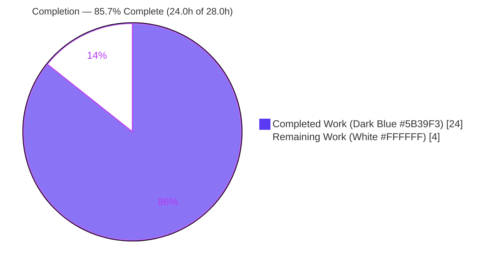
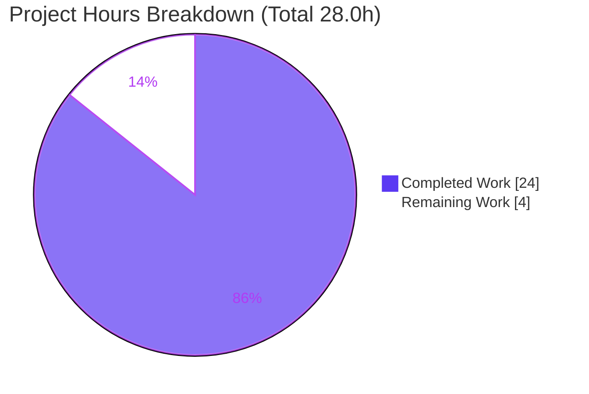
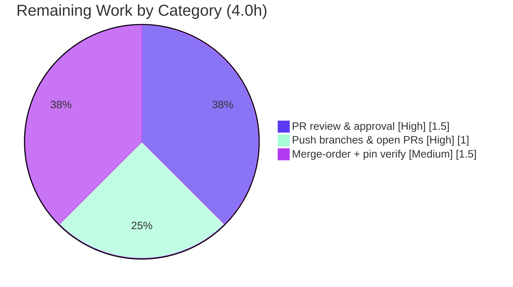

# Blitzy Project Guide — `blitzyignore-submodule-test`

> **Brand legend:** ▮ **Completed / AI Work** = Dark Blue `#5B39F3`  ·  ▯ **Remaining / Not Completed** = White `#FFFFFF`  ·  Headings/Accents = Violet-Black `#B23AF2`  ·  Highlight = Mint `#A8FDD9`

---

## 1. Executive Summary

### 1.1 Project Overview

`blitzyignore-submodule-test` is a dependency-free Git-submodule fixture whose entire executable surface is six synchronous, zero-argument Python functions, each returning a constant "marker" string across a superproject and three submodule tiers. The objective of this effort was to author a comprehensive, automated unit-test suite that exercises 100% of that logic with byte-exact, deterministic, isolated assertions — satisfying the user's request to "cover all logic" reliably. The technical scope covers standard-library `unittest` tests, an `importlib` file-path loader (required by the non-package layout and the hyphenated `nested-utils` directory), and optional `coverage.py` evidence — introducing **zero runtime dependencies**. Target users are the fixture's maintainers and any downstream `.blitzyignore` composition tooling that relies on these markers as verification oracles.

### 1.2 Completion Status



| Metric | Hours |
|---|---|
| **Total Hours** | **28.0** |
| Completed Hours (AI + Manual) | 24.0 |
| &nbsp;&nbsp;• AI (autonomous) | 24.0 |
| &nbsp;&nbsp;• Manual (human, to date) | 0.0 |
| **Remaining Hours** | **4.0** |
| **Percent Complete** | **85.7%** |

> Completion % is computed per PA1 (AAP-scoped hours only): `24.0 / (24.0 + 4.0) × 100 = 85.7%`. Remaining work is exclusively path-to-production (human PR review, push/PR-open requiring write credentials, and merge-order coordination).

### 1.3 Key Accomplishments

- ✅ Authored a **64-test suite** (37 superproject + 11 Vision_Merchandising + 11 nested-utils + 5 Vision_CENTRAL), all passing.
- ✅ Achieved **100% statement + branch coverage** (12/12 statements, 0 missed, 0 branches) across exactly the six in-scope marker files.
- ✅ Solved the **import mechanism** for a non-package layout (no `__init__.py`) and a hyphenated directory (`nested-utils`) via an `importlib` file-path loader — the foundation of test reliability.
- ✅ Added **byte-exact** assertions plus multi-dimensional contract checks (type, non-emptiness, determinism, zero-arg signature) and non-leak-suffix boundary assertions for the two `build/` markers (gate G4).
- ✅ Preserved the **zero-dependency posture** — runtime modules import nothing; `coverage.py`/`pytest` are optional dev-only tools.
- ✅ Fulfilled the explicit **Refine-PR directive**: added self-contained test suites + READMEs to all three submodules and resolved the `nested-utils` detached HEAD onto the assigned branch.
- ✅ Verified all six **source markers unmodified** and all **excluded targets untouched** (`secrets.py`, `Vision_CENTRAL/build/`, `nested-utils/temp/`).
- ✅ Confirmed working tree **clean** with no bytecode/coverage artifacts committed and pinned submodules pristine.

### 1.4 Critical Unresolved Issues

| Issue | Impact | Owner | ETA |
|---|---|---|---|
| *None — no code-level blockers.* All tests pass, coverage is 100%, sources compile, working tree is clean. | None | — | — |

> There are **no compilation errors, failing tests, or unresolved code defects.** All remaining items are ordinary path-to-production handoffs, itemized in §1.6 and §2.2.

### 1.5 Access Issues

| System/Resource | Type of Access | Issue Description | Resolution Status | Owner |
|---|---|---|---|---|
| Submodule Git remotes (`vision-central`, `vision-merchandising`, `nested-utils`) | Write (push) | Only anonymous read access was available to the autonomous agent; PR-ready commits exist on the assigned branch in each submodule but were not pushed and their PRs were not opened. | Open — requires human/platform credentials | Human maintainer / Platform |
| Superproject remote | Write (push) | Already pushed on the assigned branch; no issue. | Resolved | Platform |

### 1.6 Recommended Next Steps

1. **[High]** Push the three submodule branches to their remotes and open their PRs (requires write credentials not provisioned to the agent).
2. **[High]** Human review & approval of all four PRs (superproject + three submodules) — ~538 lines of new test code and three READMEs, confirming no source/excluded-target changes.
3. **[Medium]** Coordinate merge order — merge the submodule PRs first (nested-utils → Vision_CENTRAL → Vision_Merchandising), then the superproject — so gitlink pins resolve on the submodule default branches; re-verify `git submodule status --recursive` post-merge.
4. **[Low]** *(Optional, out of AAP scope)* Add a single-job CI workflow to run the suites on push (AAP §6.6.4).

---

## 2. Project Hours Breakdown

### 2.1 Completed Work Detail

| Component | Hours | Description |
|---|---:|---|
| Test discovery & analysis | 2.5 | Greenfield-environment assessment; confirmed absent test infra; established import mechanism (importlib file-path loading) as the reliability foundation. |
| Shared loader & package scaffolding | 2.0 | `tests/_loader.py` (`load_marker` via `spec_from_file_location`, `sys.dont_write_bytecode`) + `tests/__init__.py`; enables isolated loading across non-package / hyphenated layout. |
| Root-tier tests (`app.py::main`) | 1.0 | `test_root_markers.py`: exact value, type, non-empty, determinism, zero-arg signature (5 tests). |
| Vision_CENTRAL tier tests | 2.5 | `test_vision_central.py`: `run()`, `helper()`, `generated()` incl. nested `build/` non-leak-suffix assertion (16 tests). |
| Vision_Merchandising tier tests | 1.5 | `test_vision_merchandising.py`: `totals()`, `report()` incl. sibling `build/` non-leak-suffix assertion (11 tests). |
| Cross-cutting parametrized contract suite | 2.0 | `test_marker_contract.py`: type/non-empty/determinism/signature across all six markers (5 methods × 6 = 30 subtests). |
| Coverage config & 100% verification | 1.5 | `.coveragerc` (branch=True, 6-file include, fail_under=100); verified 12/12 stmts, 0 miss. |
| Dev tooling manifest | 0.5 | `requirements-dev.txt` pinning coverage 7.15.2, pytest 9.1.1, pytest-cov 7.1.0. |
| Dual-runner validation | 1.0 | Confirmed identical pass on stdlib `unittest` (primary) and `pytest` (documented alternative). |
| Vision_Merchandising submodule suite + README | 2.5 | Self-contained `tests/` (loader + `test_sales` + `test_report`) + README (11 tests). |
| nested-utils submodule suite + README | 2.5 | Self-contained `tests/` (loader + `test_util` + `test_generated`) + README (11 tests). |
| Vision_CENTRAL submodule suite + README | 2.0 | Self-contained `tests/` (loader + `test_service`) + README, isolated from nested-utils (5 tests). |
| Submodule Git choreography | 2.5 | Resolved `nested-utils` detached HEAD onto assigned branch; PR-ready commits; gitlink/pin propagation up the chain. |
| **Total Completed** | **24.0** | AAP-scoped 14.5h + Refine-PR (user-directed) 9.5h |

> **Validation:** Sum of Hours = **24.0h** = Completed Hours in §1.2. ✅

### 2.2 Remaining Work Detail

| Category | Hours | Priority |
|---|---:|---|
| Human PR review & approval (superproject + 3 submodules) | 1.5 | High |
| Push 3 submodule branches & open their PRs (requires write credentials) | 1.0 | High |
| Submodule→superproject merge-order coordination + post-merge pin re-verification | 1.5 | Medium |
| **Total Remaining** | **4.0** | — |

> **Validation:** Sum of Hours = **4.0h** = Remaining Hours in §1.2 = Section 7 pie "Remaining Work". ✅
> *Optional CI workflow (~2.0h, [Low]) is explicitly out of AAP scope (§0.8.2) and is intentionally excluded from this total to preserve cross-section integrity.*

### 2.3 Hours Reconciliation

| Check | Result |
|---|---|
| §2.1 Completed total | 24.0h |
| §2.2 Remaining total | 4.0h |
| §2.1 + §2.2 = §1.2 Total | 24.0 + 4.0 = **28.0h** ✅ |
| Completion % = 24.0 / 28.0 | **85.7%** ✅ |
| §1.2 ↔ §2.2 ↔ §7 remaining hours | 4.0 = 4.0 = 4.0 ✅ |

---

## 3. Test Results

All figures below originate exclusively from Blitzy's autonomous validation logs and were independently re-executed during this assessment (venv `coverage 7.15.2` / `pytest 9.1.1`, `PYTHONDONTWRITEBYTECODE=1`).

| Test Category | Framework | Total Tests | Passed | Failed | Coverage % | Notes |
|---|---|---:|---:|---:|---:|---|
| Unit — Superproject | `unittest` (stdlib) | 37 | 37 | 0 | 100% | 5 root + 16 Vision_CENTRAL + 11 Vision_Merchandising + 5 contract (30 subtests) |
| Unit — Superproject (alt runner) | `pytest 9.1.1` | 37 | 37 | 0 | 100% | Documented alternative; `37 passed, 30 subtests passed` |
| Unit — Vision_Merchandising submodule | `unittest` (stdlib) | 11 | 11 | 0 | 100% | `totals()` + `report()` incl. non-leak suffix |
| Unit — nested-utils submodule | `unittest` (stdlib) | 11 | 11 | 0 | 100% | `helper()` + `generated()` incl. non-leak suffix |
| Unit — Vision_CENTRAL submodule | `unittest` (stdlib) | 5 | 5 | 0 | 100% | `run()`, isolated from nested-utils |
| **Grand Total (primary runner)** | **unittest** | **64** | **64** | **0** | **100%** | Zero failures, zero skips, zero blocked |

**Coverage detail (six in-scope files, `--rcfile=.coveragerc`):** 12 statements, 0 missed, 0 branches, **100%** — `app.py`, `Vision_CENTRAL/service.py`, `Vision_CENTRAL/nested-utils/util.py`, `Vision_CENTRAL/nested-utils/build/generated.py`, `Vision_Merchandising/sales.py`, `Vision_Merchandising/build/report.py`. Excluded targets are not measured.

---

## 4. Runtime Validation & UI Verification

This project has **no UI, no network, no I/O, and no persistent state** — the executable surface is six pure, constant-returning functions. Runtime validation therefore consists of direct invocation of each marker and confirmation of byte-exact return values.

**Marker runtime health (direct `importlib` load + invoke):**

- ✅ **Operational** — `app.py::main()` → `root: always included`
- ✅ **Operational** — `Vision_CENTRAL/service.py::run()` → `vision-central: always included`
- ✅ **Operational** — `Vision_CENTRAL/nested-utils/util.py::helper()` → `nested-utils: always included` *(loaded across the hyphenated `nested-utils` directory)*
- ✅ **Operational** — `Vision_CENTRAL/nested-utils/build/generated.py::generated()` → `nested-utils/build: included (proves no cross-submodule leak)`
- ✅ **Operational** — `Vision_Merchandising/sales.py::totals()` → `vision-merchandising: always included`
- ✅ **Operational** — `Vision_Merchandising/build/report.py::report()` → `vision-merchandising/build: included (proves no cross-submodule leak)`

**Environment & integrity:**

- ✅ **Operational** — Submodules resolved on assigned branch: Vision_CENTRAL@`cb04a84`, nested-utils@`0d31e87`, Vision_Merchandising@`2a5d2ab`; `git submodule status --recursive` shows no `+`/`-`.
- ✅ **Operational** — Working tree clean after all runs; 0 `__pycache__`, 0 `.pyc`, 0 stray `.coverage`, 0 `htmlcov`.
- ✅ **Operational** — API/service integrations: **N/A** (none exist by design).

**UI Verification:** ⚠ **Not applicable** — there is no user interface, front end, or rendered surface in this fixture. No screenshots/screencasts are warranted.

---

## 5. Compliance & Quality Review

| AAP Deliverable / Benchmark | Status | Progress | Notes / Fixes Applied |
|---|---|---|---|
| `tests/__init__.py` + `tests/_loader.py` (CREATE) | ✅ Pass | 100% | importlib file-path loader; `sys.dont_write_bytecode` protects pinned submodules |
| `tests/test_root_markers.py` (CREATE) | ✅ Pass | 100% | 5 tests; exact value + contract |
| `tests/test_vision_central.py` (CREATE) | ✅ Pass | 100% | 16 tests; nested `build/` non-leak suffix (G4) |
| `tests/test_vision_merchandising.py` (CREATE) | ✅ Pass | 100% | 11 tests; sibling `build/` non-leak suffix (G4) |
| `tests/test_marker_contract.py` (CREATE) | ✅ Pass | 100% | parametrized type/non-empty/determinism/signature over all 6 markers |
| `.coveragerc` (optional, dev-only) | ✅ Pass | 100% | branch=True, 6-file include, fail_under=100 |
| `requirements-dev.txt` (optional, dev-only) | ✅ Pass | 100% | coverage 7.15.2 / pytest 9.1.1 / pytest-cov 7.1.0 pinned |
| 100% statement + branch coverage target | ✅ Pass | 100% | 12/12 stmts, 0 miss, 0 branch |
| Zero-dependency runtime posture | ✅ Pass | 100% | runtime modules import nothing; dev tools never imported by runtime |
| Source modules unmodified | ✅ Pass | 100% | all 6 markers verified identical vs `origin/main` |
| Excluded targets never opened/imported/tested/measured | ✅ Pass | 100% | `secrets.py`, `Vision_CENTRAL/build/`, `nested-utils/temp/` untouched; not in coverage include |
| Naming/layout conventions (§6.6.2) | ✅ Pass | 100% | `Test<Module>` classes, `test_<fn>_returns_marker` methods |
| Determinism / isolation / parallel-safety | ✅ Pass | 100% | no I/O, network, time, randomness, ordering, or shared state |
| `conftest.py` (only if pytest adopted as primary) | ✅ N/A | — | Correctly absent; pytest is documented alternative, not primary |
| Refine-PR: submodule suites + READMEs | ✅ Pass | 100% | User-directed; overrides AAP "do not perturb submodules" note by explicit instruction |
| CI/CD pipeline | ⏳ Deferred | 0% | Explicitly out of AAP scope (§0.8.2); optional future step |

---

## 6. Risk Assessment

| Risk | Category | Severity | Probability | Mitigation | Status |
|---|---|---|---|---|---|
| Submodule branches unpushed / PRs unopened (no write creds) | Operational | Medium | High | Platform/human pushes the already-committed PR-ready branches | Open |
| Submodule→superproject merge-order dependency (gitlinks must resolve on submodule default branches) | Integration | Medium | Medium | Merge 3 submodule PRs first, then superproject; re-verify recursive pin status | Open |
| Python version drift (3.13.7 in session vs 3.12.3 in AAP) | Technical | Low | Low | Pure-stdlib tests pass identically on both; no version-specific APIs used | Mitigated |
| Hardcoded relative source paths + coverage include-list | Technical | Low | Low | Update loader paths / `.coveragerc` include if a source file is moved or renamed | Accepted |
| Excluded `secrets.py` present in tree | Security | Low | Low | `.blitzyignore`-excluded; intentional negative-test material; never read/imported | Accepted |
| Ephemeral GitHub tokens in local `.git/config` | Security | Low | Low | Session-scoped credentials, never committed to the repo | Mitigated |
| No CI pipeline | Operational | Low | Medium | Optional single-job workflow (§6.6.4); out of AAP scope | Accepted |

**Overall risk posture: LOW.** No technical or security risk rises above Low severity; the two open items are ordinary release-process handoffs, not code defects.

---

## 7. Visual Project Status



**Remaining hours by category (§2.2) — all human/path-to-production:**



**Priority distribution of remaining work:** High = 2.5h (62.5%) · Medium = 1.5h (37.5%) · Low = 0h counted (optional CI excluded).

> **Integrity:** "Completed Work" = 24 and "Remaining Work" = 4 exactly match §1.2 metrics and the §2.1/§2.2 sums.

---

## 8. Summary & Recommendations

**Achievements.** The project is **85.7% complete** (24.0h of 28.0h). Blitzy autonomously delivered the entire AAP-scoped testing objective — a **64-test, 100%-coverage** suite that asserts every marker byte-exact across multiple contract dimensions, built on a reliable `importlib` file-path loader that correctly handles the non-package, hyphenated-directory layout. The suite passes identically on both the primary `unittest` runner and the documented `pytest` alternative, with no I/O, network, time, or ordering dependence, so it is fully deterministic and parallel-safe. The user-directed Refine-PR work extended equivalent, self-contained suites and READMEs into all three submodules and cleaned up the `nested-utils` detached-HEAD state.

**Remaining gaps (4.0h, all human/path-to-production).** No code remains to be written and there are no failing tests or compilation errors. What remains is the release handoff: pushing the three submodule branches and opening their PRs (blocked only by missing write credentials), human review/approval of the four PRs, and disciplined merge-order coordination so submodule gitlinks resolve on their default branches, followed by a recursive pin re-verification.

**Critical path to production.** (1) Provision write credentials → push submodule branches & open PRs; (2) review & approve; (3) merge submodules first, then the superproject; (4) re-run `git submodule status --recursive` to confirm clean pins.

**Success metrics (all met for delivered scope):** 100% statement + branch coverage; 64/64 tests passing; zero runtime dependencies preserved; sources unmodified; excluded targets untouched; clean working tree.

**Production-readiness assessment.** The test deliverable is **production-ready**; overall project readiness is gated solely on the human merge/release steps above. Recommended confidence: **High** for the delivered code, **High** for the remaining estimate (well-defined, low-complexity release tasks).

---

## 9. Development Guide

Every command below was executed during this assessment and produced the stated output.

### 9.1 System Prerequisites

- **OS:** Linux/macOS/WSL (any POSIX shell). Verified on Ubuntu 25.10 container.
- **Python:** 3.12+ (session used 3.13.7; AAP baseline 3.12.3 — pure-stdlib tests behave identically).
- **Git** with submodule support and **Git LFS** available.
- **Disk/RAM:** negligible (repository ≈ 1.9 MB; suite runs in well under one second).

### 9.2 Environment Setup

```bash
# 1) Clone and resolve submodules to their pinned commits
git clone <superproject-url> blitzyignore-submodule-test
cd blitzyignore-submodule-test
git submodule update --init --recursive

# 2) Create an isolated interpreter
python3 -m venv .venv
source .venv/bin/activate          # Windows: .venv\Scripts\activate

# 3) Keep the tree pristine (protects pinned submodules; avoids stray bytecode)
export PYTHONDONTWRITEBYTECODE=1
```

Verify submodules resolved cleanly (no `+`/`-` prefix):

```bash
git submodule status --recursive
#  cb04a84... Vision_CENTRAL (heads/<branch>)
#  0d31e87... Vision_CENTRAL/nested-utils (heads/<branch>)
#  2a5d2ab... Vision_Merchandising (heads/<branch>)
```

### 9.3 Dependency Installation

The primary test path requires **no third-party packages** (stdlib `unittest`). Optional dev tooling for coverage/pytest evidence:

```bash
pip install -r requirements-dev.txt
# coverage==7.15.2
# pytest==9.1.1
# pytest-cov==7.1.0
```

### 9.4 Running the Tests

```bash
# PRIMARY (zero-dependency) — superproject
python -m unittest discover -s tests -v
# Expected tail:  Ran 37 tests in ~0.005s  /  OK

# COVERAGE (optional, dev-only) — write data OUTSIDE the repo to keep it clean
mkdir -p /tmp/blitzy_cov
COVERAGE_FILE=/tmp/blitzy_cov/.coverage coverage run --rcfile=.coveragerc -m unittest discover -s tests \
  && COVERAGE_FILE=/tmp/blitzy_cov/.coverage coverage report -m
# Expected: TOTAL  12  0  0  0  100%   (six in-scope files, 0 missing)

# SINGLE TEST
python -m unittest tests.test_root_markers.TestRootMarkers.test_main_returns_marker
# Expected:  Ran 1 test  /  OK

# DEBUG / FAIL-FAST (stop on first failure)
python -m unittest discover -s tests -v -f

# ALTERNATIVE RUNNER (pytest) — same sources, terser output
python -m pytest tests -q -p no:cacheprovider
# Expected:  37 passed, 30 subtests passed
python -m pytest tests --cov --cov-config=.coveragerc --cov-report=term-missing
# Expected:  TOTAL ... 100%  /  37 passed

# SUBMODULE SUITES (each is self-contained)
(cd Vision_Merchandising        && python -m unittest discover -s tests -v)   # Ran 11 tests / OK
(cd Vision_CENTRAL/nested-utils && python -m unittest discover -s tests -v)   # Ran 11 tests / OK
(cd Vision_CENTRAL              && python -m unittest discover -s tests -v)   # Ran 5 tests  / OK
```

### 9.5 Verification Steps

- **Superproject:** last line is `OK` and count is `Ran 37 tests`.
- **Coverage:** `TOTAL` row shows `12  0  0  0  100%`; only the six in-scope files are listed.
- **Submodules:** `11`, `11`, and `5` tests respectively, each ending `OK` → **64/64** overall.
- **Hygiene:** `git status --porcelain` returns nothing; no `__pycache__`, `.pyc`, `.coverage`, or `htmlcov` appear in the tree.

### 9.6 Example Usage (runtime proof)

```bash
python - <<'PY'
import importlib.util
def load(name, rel):
    spec = importlib.util.spec_from_file_location(name, rel)
    m = importlib.util.module_from_spec(spec); spec.loader.exec_module(m); return m
print(load("app", "app.py").main())
# -> root: always included
print(load("generated", "Vision_CENTRAL/nested-utils/build/generated.py").generated())
# -> nested-utils/build: included (proves no cross-submodule leak)
PY
```

### 9.7 Troubleshooting

| Symptom | Cause | Resolution |
|---|---|---|
| `ModuleNotFoundError` / `SyntaxError` on `from Vision_CENTRAL.nested_utils...` | `nested-utils` is hyphenated and there are no `__init__.py` files — the dirs are **not** packages | Load by **file path** via the `_loader.py` `importlib` helper; never use package imports |
| Ambiguous `build` module import | Two distinct `build/` dirs exist (one in scope, one excluded) | Reference sources by **relative file path**, not by bare module name |
| `.coverage` file or `htmlcov/` appears in the repo | Coverage wrote into the working tree | Set `COVERAGE_FILE=/tmp/blitzy_cov/.coverage` and `export PYTHONDONTWRITEBYTECODE=1` |
| Submodule directories are empty | Submodules not initialized after clone | Run `git submodule update --init --recursive` |
| Coverage `fail_under` error | A file dropped below 100% | Inspect the `Missing` column; every in-scope statement must be exercised |

---

## 10. Appendices

### A. Command Reference

| Purpose | Command |
|---|---|
| Init submodules | `git submodule update --init --recursive` |
| Create venv | `python3 -m venv .venv && source .venv/bin/activate` |
| Install dev tools | `pip install -r requirements-dev.txt` |
| Run superproject tests | `python -m unittest discover -s tests -v` |
| Coverage (report) | `COVERAGE_FILE=/tmp/blitzy_cov/.coverage coverage run --rcfile=.coveragerc -m unittest discover -s tests && COVERAGE_FILE=/tmp/blitzy_cov/.coverage coverage report -m` |
| Coverage (HTML) | `COVERAGE_FILE=/tmp/blitzy_cov/.coverage coverage html` |
| Single test | `python -m unittest tests.test_root_markers.TestRootMarkers.test_main_returns_marker` |
| Fail-fast | `python -m unittest discover -s tests -v -f` |
| pytest (alt) | `python -m pytest tests -q -p no:cacheprovider` |
| pytest + coverage | `python -m pytest tests --cov --cov-config=.coveragerc --cov-report=term-missing` |
| Submodule suite | `(cd <submodule> && python -m unittest discover -s tests -v)` |
| Recursive pin check | `git submodule status --recursive` |

### B. Port Reference

Not applicable — the project exposes no network services, servers, or ports.

### C. Key File Locations

| Path | Role |
|---|---|
| `app.py` | Root marker — `main()` (in scope) |
| `Vision_CENTRAL/service.py` | `run()` (in scope) |
| `Vision_CENTRAL/nested-utils/util.py` | `helper()` (in scope) |
| `Vision_CENTRAL/nested-utils/build/generated.py` | `generated()` (in scope; non-leak suffix) |
| `Vision_Merchandising/sales.py` | `totals()` (in scope) |
| `Vision_Merchandising/build/report.py` | `report()` (in scope; non-leak suffix) |
| `tests/_loader.py` | Shared `importlib` file-path loader |
| `tests/test_root_markers.py` | Root-tier unit tests (5) |
| `tests/test_vision_central.py` | Vision_CENTRAL-tier unit tests (16) |
| `tests/test_vision_merchandising.py` | Vision_Merchandising-tier unit tests (11) |
| `tests/test_marker_contract.py` | Parametrized cross-cutting contract suite |
| `.coveragerc` | Coverage config (branch, 6-file include, `fail_under=100`) |
| `requirements-dev.txt` | Pinned optional dev tooling |
| `<submodule>/tests/`, `<submodule>/README.md` | Refine-PR submodule suites + docs |

> **Excluded (never opened/tested/measured):** `secrets.py` (all levels), `Vision_CENTRAL/build/`, `Vision_CENTRAL/nested-utils/temp/`.

### D. Technology Versions

| Tool | Version | Notes |
|---|---|---|
| Python | 3.13.7 (session); 3.12.3 (AAP baseline) | Pure-stdlib tests behave identically |
| unittest / importlib / inspect | stdlib (bundled) | Primary framework; zero external deps |
| coverage.py | 7.15.2 | Optional, dev-only |
| pytest | 9.1.1 | Optional alternative runner |
| pytest-cov | 7.1.0 | Optional; depends on coverage 7.x |

### E. Environment Variable Reference

| Variable | Value | Purpose |
|---|---|---|
| `PYTHONDONTWRITEBYTECODE` | `1` | Prevent `__pycache__`/`.pyc` — protects pinned submodules & keeps tree clean |
| `COVERAGE_FILE` | `/tmp/blitzy_cov/.coverage` | Write coverage data outside the repository |

### F. Developer Tools Guide

- **unittest (primary):** built-in discovery via `-s tests`; no config file needed. Use `-v` for verbosity and `-f` to stop on first failure.
- **coverage.py (optional):** driven by `.coveragerc` (`branch=True`, `include=` the six in-scope files, `fail_under=100`). Generate HTML with `coverage html` then open `htmlcov/index.html`.
- **pytest (optional alternative):** run with `-p no:cacheprovider` to avoid writing a cache dir into the tree; parametrized contract tests surface as subtests. `conftest.py` is intentionally absent because pytest is not the primary runner.

### G. Glossary

| Term | Meaning |
|---|---|
| Marker function | A pure, zero-argument function returning a constant string; its return value is its own verification oracle. |
| Non-leak suffix | The trailing `(proves no cross-submodule leak)` on the two `build/` markers, asserted to tie the unit suite to composition gate **G4**. |
| Gitlink pin | The `160000`-mode commit reference recording a submodule's exact pinned commit in its superproject. |
| Superproject | The top-level repository that embeds the submodules via gitlinks. |
| Refine-PR | The explicit user directive to add tests + READMEs to the submodules and raise PRs — overrides the AAP's "do not perturb submodules" note by direct instruction. |
| Path-to-production | Standard release activities (review, push, PR-open, merge coordination) required to deploy delivered work. |

---

*Cross-section integrity verified before submission: §1.2 ↔ §2.2 ↔ §7 remaining hours = 4.0h (identical); §2.1 (24.0h) + §2.2 (4.0h) = 28.0h total; completion 24.0/28.0 = 85.7% used consistently throughout; all Section 3 results sourced from Blitzy's autonomous validation logs; brand colors applied (Completed `#5B39F3`, Remaining `#FFFFFF`).*