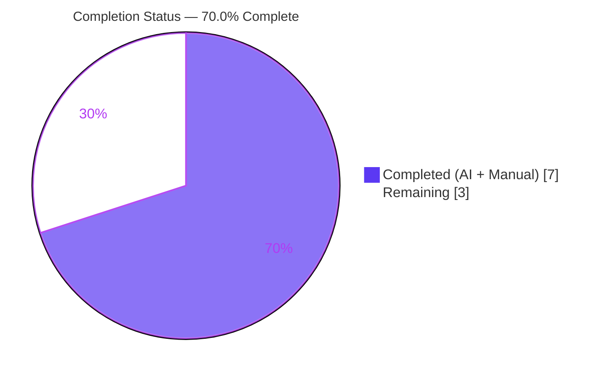
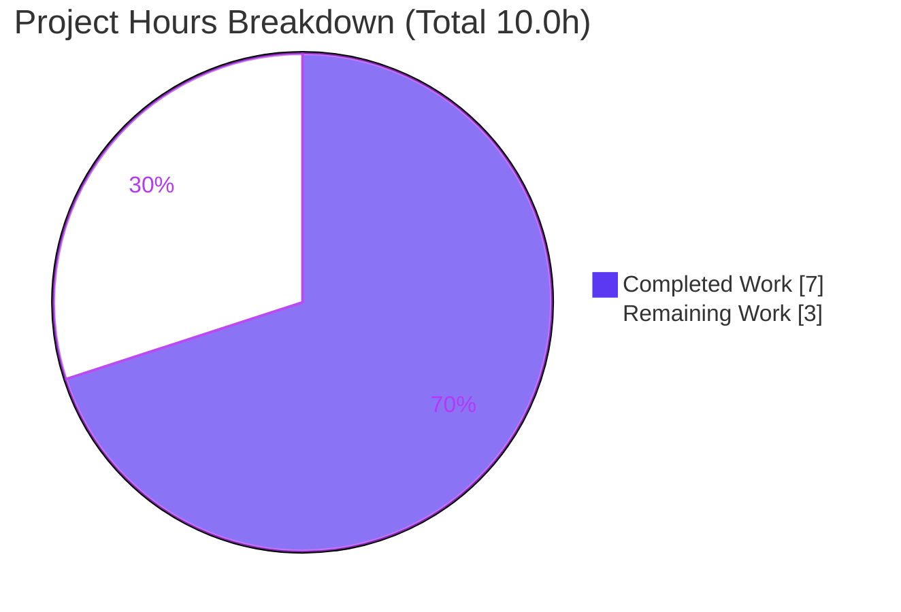
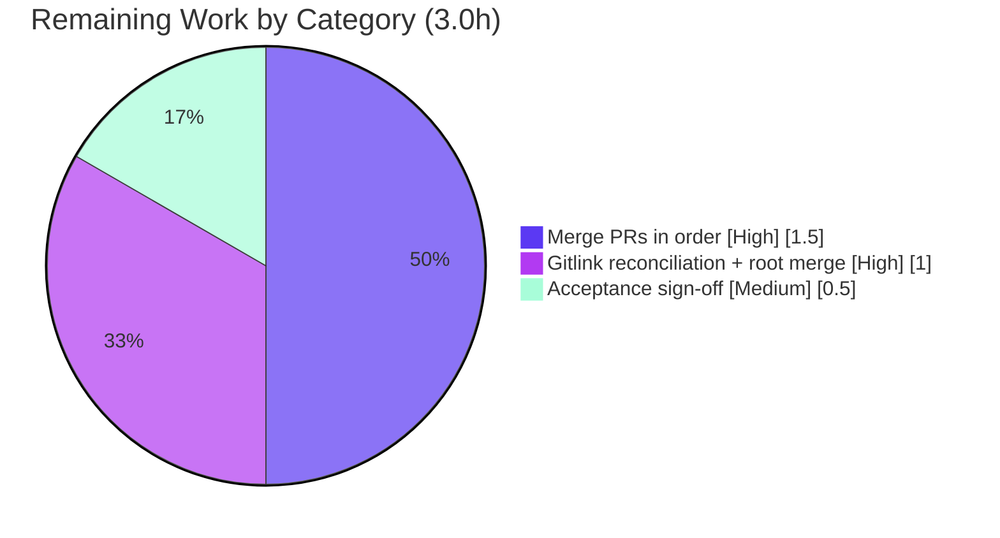

# Blitzy Project Guide — `blitzyignore-submodule-test`

> **Feature:** Add a zero-argument `status()` marker to every always-included module across a three-tier Git submodule composition (FR-1 … FR-6).
> **Brand legend:** 🟦 **Completed / AI Work** = Dark Blue `#5B39F3` · ⬜ **Remaining** = White `#FFFFFF` · Headings/Accents = Violet-Black `#B23AF2` · Highlight = Mint `#A8FDD9`

---

## 1. Executive Summary

### 1.1 Project Overview

`blitzyignore-submodule-test` is a purpose-built **verification fixture** — not a runtime application — that proves correct `.blitzyignore` scoping across Git submodule boundaries for the ABK-4487 fix. It is a three-tier composition: a root superproject, two first-order submodules (`Vision_CENTRAL`, `Vision_Merchandising`), and one nested submodule (`nested-utils` under `Vision_CENTRAL`). Every module is a zero-argument, import-free marker function whose constant return string doubles as its own assertion. This change adds a uniform `status()` marker to each of the four always-included modules and advances the root's two direct submodule gitlinks — delivered as one isolated PR per repository, without ever touching an excluded file. The target audience is the Blitzy ingestion/checker tooling that consumes this fixture.

### 1.2 Completion Status

The project is **70.0% complete** on an AAP-scoped, hours-based basis. All code and autonomous verification are delivered; the remaining work is the human/CI PR-merge lifecycle.



| Metric | Hours |
|---|---|
| **Total Hours** | **10.0** |
| Completed Hours (AI + Manual) | 7.0 |
| Remaining Hours | 3.0 |
| **Percent Complete** | **70.0%** |

> Formula: `Completion % = Completed / (Completed + Remaining) = 7.0 / 10.0 = 70.0%`

### 1.3 Key Accomplishments

- ✅ **FR-1** — Appended `def status(): return "root: status ok"` to root `app.py`, preserving `main()`.
- ✅ **FR-2** — Appended `def status(): return "vision-central: status ok"` to `Vision_CENTRAL/service.py`, preserving `run()`.
- ✅ **FR-3** — Appended `def status(): return "vision-merchandising: status ok"` to `Vision_Merchandising/sales.py`, preserving `totals()`.
- ✅ **FR-4** — Appended `def status(): return "nested-utils: status ok"` to `Vision_CENTRAL/nested-utils/util.py`, preserving `helper()`.
- ✅ **FR-6** — Advanced the two direct root gitlinks (`Vision_CENTRAL` `7fee06d`→`2eb31bc`, `Vision_Merchandising` `8e9b0e2`→`92b8c24`) as `160000` `Subproject commit` lines; `.gitmodules` untouched.
- ✅ **Per-PR isolation (FR-5 substance)** — Four isolated, correctly-scoped commits, each diff limited to its single target file.
- ✅ **`.blitzyignore` compliance** — No excluded path (`**/secrets.py`, `Vision_CENTRAL/build/**`, `Vision_CENTRAL/nested-utils/temp/**`) in any diff; both control files (`report.py`, `generated.py`) remain included and unchanged; nested-utils boundary preserved.
- ✅ **Autonomous verification** — 6/6 files compile; 10/10 static marker assertions pass verbatim; all four repos clean.

### 1.4 Critical Unresolved Issues

| Issue | Impact | Owner | ETA |
|---|---|---|---|
| Submodule PRs not yet merged in mandated order | Root PR references submodule commit SHAs; merging root first would create dangling gitlinks on `main` | Repo maintainer | 1.5h |
| Root gitlinks may need reconciliation after submodule merges | If merge strategy (squash/rebase) rewrites submodule SHAs, root gitlinks (`2eb31bc`/`92b8c24`) will no longer match merged HEADs | Repo maintainer | 1.0h |

> There are **no code-level defects, compilation errors, or failing tests**. All unresolved items are path-to-production PR-lifecycle steps that require human/CI action.

### 1.5 Access Issues

| System/Resource | Type of Access | Issue Description | Resolution Status | Owner |
|---|---|---|---|---|
| 4 GitHub repos (`vision-central`, `vision-merchandising`, `nested-utils`, root `blitzyignore-submodule-test`) | Merge / write to protected `main` | Blitzy operates on local branches and cannot merge PRs to protected `main`; merge is a human/CI gate | Open — requires maintainer with merge rights on all four repos | Repo maintainer |

> No credential/API access issues affect the code work itself — the fixture is dependency-free and fully verifiable offline.

### 1.6 Recommended Next Steps

1. **[High]** Merge the submodule PRs strictly in mandated order: **#1** `vision-central` (`2eb31bc`) → **#2** `vision-merchandising` (`92b8c24`) → **#3** `nested-utils` (`5d3d68e`).
2. **[High]** After the submodule merges, reconcile the root gitlinks to the **final merged SHAs**, re-verify the root diff is exactly `app.py` + two `Subproject commit` lines, then merge root PR **#4**.
3. **[Medium]** Perform final acceptance sign-off on merged `main`: re-run compile + the 10-assertion marker harness and confirm the seven §0.5.2 acceptance criteria.
4. **[Low]** *(Optional, out of AAP scope)* Add a lightweight CI guard (compile + marker assertion + excluded-path check) to prevent future regressions.

---

## 2. Project Hours Breakdown

### 2.1 Completed Work Detail

| Component | Hours | Description |
|---|---|---|
| FR-1 Root `app.py` `status()` marker | 0.5 | Appended verbatim `status()` after `main()`; compiles; static assert passes (`root: status ok`) |
| FR-2 `Vision_CENTRAL/service.py` `status()` marker | 0.5 | Appended verbatim `status()` after `run()`; commit `2eb31bc` (service.py only) |
| FR-3 `Vision_Merchandising/sales.py` `status()` marker | 0.5 | Appended verbatim `status()` after `totals()`; commit `92b8c24` (sales.py only) |
| FR-4 `Vision_CENTRAL/nested-utils/util.py` `status()` marker | 0.5 | Appended verbatim `status()` after `helper()`; commit `5d3d68e` (util.py only) |
| FR-6 Root gitlink synchronization | 1.0 | Advanced VC (`7fee06d`→`2eb31bc`) & VM (`8e9b0e2`→`92b8c24`) `160000` gitlinks; minimal root diff; `.gitmodules` untouched; nested pointer left at baseline |
| FR-5 Per-repo PR isolation & commit discipline | 1.5 | Four isolated feature commits across four repos, each diff confined to a single target file |
| `.blitzyignore` compliance engineering & verification | 1.5 | Verified no excluded path in any diff; 5 excluded files untouched; 2 control files included & unchanged; nested boundary preserved |
| Autonomous static verification & acceptance testing | 1.0 | 6/6 `py_compile`; 10/10 marker-string assertions; pristine-tree restoration |
| **Total Completed** | **7.0** | **Matches Completed Hours in Section 1.2** |

### 2.2 Remaining Work Detail

| Category | Hours | Priority |
|---|---|---|
| Merge submodule PRs in mandated order (#1 VC → #2 VM → #3 nested-utils): review single-file diffs, approve, merge | 1.5 | High |
| Post-merge root gitlink reconciliation + merge root PR #4 (re-bump to final merged SHAs, re-verify root diff minimality) | 1.0 | High |
| Final acceptance sign-off & smoke re-verification on merged `main` (compile + 10 marker assertions + 7 acceptance criteria) | 0.5 | Medium |
| **Total Remaining** | **3.0** | **Matches Remaining Hours in Section 1.2 & Section 7 pie** |

### 2.3 Hours Reconciliation

| Check | Result |
|---|---|
| Section 2.1 completed total | 7.0 h |
| Section 2.2 remaining total | 3.0 h |
| 2.1 + 2.2 = Total (Section 1.2) | 7.0 + 3.0 = **10.0 h** ✅ |
| Completion % (7.0 / 10.0) | **70.0%** ✅ |
| Section 1.2 remaining = 2.2 sum = Section 7 pie remaining | 3.0 = 3.0 = 3.0 ✅ |

---

## 3. Test Results

The fixture ships **no unit-test framework** by design (per the AAP, verification is static: compile + marker-string comparison). The values below originate exclusively from **Blitzy's autonomous validation logs** for this project.

| Test Category | Framework | Total Tests | Passed | Failed | Coverage % | Notes |
|---|---|---|---|---|---|---|
| Compilation | `python3 -m py_compile` | 6 | 6 | 0 | 100% | app.py, service.py, sales.py, util.py + 2 control files |
| Static marker verification | Custom import+assert harness | 10 | 10 | 0 | 100% | 4 preserved markers + 4 new `status()` + 2 control-file markers, all verbatim |
| Runtime (import + call) | CPython 3.13.7 | 4 | 4 | 0 | 100% | Each module imports cleanly and returns its exact status string |
| Dependency scan | Manifest/import scan | 1 | 1 | 0 | n/a | No manifest, zero imports — stdlib-only |
| `.blitzyignore` compliance | Diff / path audit | 4 | 4 | 0 | n/a | No excluded path in any of the 4 repo diffs |
| **Total** | — | **25** | **25** | **0** | **100%** | Zero failures across all autonomous checks |

> **Integrity note:** all tests above are re-verifications of Blitzy's autonomous validation logs and were independently reproduced during this assessment (10/10 marker assertions, 6/6 compiles).

---

## 4. Runtime Validation & UI Verification

**User Interface:** ❌ Not applicable — the fixture has no UI, front-end, or design system; all modules are non-interactive marker functions.

**Runtime health (import + call):**

- ✅ `app.py` — `main()` → `"root: always included"`, `status()` → `"root: status ok"`
- ✅ `Vision_CENTRAL/service.py` — `run()` → `"vision-central: always included"`, `status()` → `"vision-central: status ok"`
- ✅ `Vision_Merchandising/sales.py` — `totals()` → `"vision-merchandising: always included"`, `status()` → `"vision-merchandising: status ok"`
- ✅ `Vision_CENTRAL/nested-utils/util.py` — `helper()` → `"nested-utils: always included"`, `status()` → `"nested-utils: status ok"`

**Control files (must remain included & unchanged):**

- ✅ `Vision_Merchandising/build/report.py` — `report()` present & unchanged (proves `build/**` does not leak into a sibling submodule)
- ✅ `Vision_CENTRAL/nested-utils/build/generated.py` — `generated()` present & unchanged (proves `build/**` does not leak into a nested submodule)

**Submodule gitlink integration:**

- ✅ Root records `Vision_CENTRAL` @ `2eb31bc` and `Vision_Merchandising` @ `92b8c24` (pre-merge pointers)
- ✅ `Vision_CENTRAL` records `nested-utils` @ baseline `62d3372` — **not bumped** (deliberate boundary)
- ⚠ **Partial** — pointers reference **pre-merge** submodule commits; reconciliation to final merged SHAs is pending (see Section 1.4)

**API integration:** ❌ Not applicable — no endpoints, services, database, or external integrations exist in the fixture.

---

## 5. Compliance & Quality Review

| Benchmark / AAP Deliverable | Status | Progress | Detail |
|---|---|---|---|
| FR-1 Root marker | ✅ Pass | 100% | `status()` added, `main()` preserved |
| FR-2 vision-central marker | ✅ Pass | 100% | `status()` added, `run()` preserved |
| FR-3 vision-merchandising marker | ✅ Pass | 100% | `status()` added, `totals()` preserved |
| FR-4 nested-utils marker | ✅ Pass | 100% | `status()` added, `helper()` preserved |
| FR-5 One PR per repository, in order | ⚠ Partial | ~60% | Isolated per-repo commits ready; merge-in-order pending |
| FR-6 Root advances two direct gitlinks | ✅ Pass | 100% | VC & VM bumped; nested pointer & `.gitmodules` untouched |
| Additive, not destructive | ✅ Pass | 100% | Every existing marker preserved byte-for-byte |
| Root PR diff minimality | ✅ Pass | 100% | Exactly `app.py` + two `Subproject commit` lines |
| `.blitzyignore` fidelity (excluded paths) | ✅ Pass | 100% | No `secrets.py` / `build/**` / `temp/**` in any diff |
| Non-leakage control files preserved | ✅ Pass | 100% | `report.py` & `generated.py` included & unchanged |
| Style conformance (zero-arg, single return, no imports) | ✅ Pass | 100% | All 4 new functions match fixture convention |
| Verbatim function names & return strings | ✅ Pass | 100% | All four return strings reproduced exactly |
| Zero-dependency constraint | ✅ Pass | 100% | No packages/imports/build steps introduced |

**Fixes applied during autonomous validation:** none required — the feature was already correctly implemented and committed on arrival; validation was exhaustive re-verification plus pristine-tree restoration (transient `__pycache__` cleaned via `PYTHONPYCACHEPREFIX`).

**Outstanding compliance items:** FR-5 merge-in-order completion (path-to-production).

---

## 6. Risk Assessment

| Risk | Category | Severity | Probability | Mitigation | Status |
|---|---|---|---|---|---|
| T1 — Merge-order dependency: root PR merged before submodule PRs → dangling gitlinks on `main` | Technical | Medium | Medium | Enforce mandated order #1→#2→#3 then #4 | Open (human) |
| T2 — No automated regression/CI harness; future edits unguarded | Technical | Low | Low | `py_compile` + marker-assertion harness documented; recommend CI guard | Mitigated (by design) |
| S1 — `secrets.py` fixture stubs at 3 levels | Security | Low | Low | `.blitzyignore`-excluded, never opened/edited; validator confirmed no real credentials | Accepted (intentional fixtures) |
| S2 — No auth/network/data/dependency surface | Security | N/A | N/A | Zero-dependency, import-free static fixture | None |
| O1 — No CI/CD to enforce ignore-compliance/markers on future changes | Operational | Low | Low | Provide verification commands; recommend CI guard | Open (recommendation) |
| O2 — No monitoring/logging/health-check | Operational | N/A | N/A | Not applicable — static fixture, no runtime | Accepted (by design) |
| I1 — Gitlink reconciliation: merge rewrites submodule SHAs → root points at pre-merge commits | Integration | Medium | Medium | After submodule merges, re-bump root gitlinks to final SHAs & re-verify root diff | Open (in remaining 1.0h) |
| I2 — Nested-utils boundary: root PR must not advance nested pointer | Integration | Low | Low | Root-diff-minimality check (app.py + 2 direct gitlinks only) | Mitigated (verified) |
| I3 — Cross-repo access: merge requires write rights on 4 repos | Integration | Medium | Low-Medium | Confirm maintainer merge access to all four repos | Open (access dependency) |

---

## 7. Visual Project Status

**Project hours breakdown** (🟦 Completed `#5B39F3` · ⬜ Remaining `#FFFFFF`):



**Remaining hours by category** (from Section 2.2):



> **Integrity check:** "Remaining Work" = **3.0 h**, identical to Section 1.2 (Remaining Hours = 3.0) and the Section 2.2 "Hours" total (1.5 + 1.0 + 0.5 = 3.0). ✅

---

## 8. Summary & Recommendations

**Achievements.** All AAP code deliverables are complete and independently verified: the four `status()` markers (FR-1 … FR-4) are present verbatim with every original marker preserved, the two direct root gitlinks are advanced (FR-6), each change is isolated to its own repository (FR-5 substance), and the true acceptance surface — `.blitzyignore` scoping — passes fully (no excluded path in any diff, both control files included and unchanged, nested-utils boundary preserved). Compilation is 6/6 and static verification is 10/10.

**Remaining gaps.** The project is **70.0% complete (7.0h of 10.0h)**. The remaining **3.0h** is entirely the human/CI path-to-production PR-merge lifecycle — it contains no code defects. The critical path is: merge the three submodule PRs in the mandated order, reconcile and merge the root PR (re-bumping gitlinks if the merge strategy rewrites SHAs), and sign off on the acceptance criteria.

**Critical path to production.**
1. Merge submodule PRs #1 → #2 → #3 (1.5h).
2. Reconcile root gitlinks to final merged SHAs and merge root PR #4 (1.0h).
3. Final acceptance sign-off and smoke re-verification (0.5h).

**Success metrics.** Production-ready when: 3–4 PRs merged one-per-repo; no `secrets.py` / `build/**` / `temp/**` change in any diff; root diff = `app.py` + two `Subproject commit` lines; all four original markers preserved and four `status()` markers present; both `build/` control files included and unmodified; every edited file compiles.

**Production-readiness assessment.** **Code: production-ready.** **Delivery: pending human PR-merge in mandated order.** The two Medium-severity risks (merge-order dependency, gitlink reconciliation) are well understood, map directly to the remaining tasks, and have clear mitigations. *(Optional future enhancement, out of AAP scope: a lightweight CI guard — not counted in the hours above.)*

| Metric | Value |
|---|---|
| AAP-scoped completion | 70.0% |
| Completed / Remaining / Total | 7.0h / 3.0h / 10.0h |
| Code defects / failing tests | 0 |
| Critical path to production | 3.0h |

---

## 9. Development Guide

### 9.1 System Prerequisites

- **OS:** Linux / macOS / WSL2 (any POSIX shell)
- **Python:** 3.x — validated on **CPython 3.13.7** (no version pin; any modern 3.x works)
- **Git:** 2.x — validated on **2.51.0**, with **git-lfs 3.7.1** (repos carry standard LFS hooks)
- **Hardware:** negligible — the entire working tree is ~108 KB
- **Third-party dependencies:** **none** (no manifest, zero imports)

### 9.2 Environment Setup

No dependency installation or virtual environment is required (stdlib only). To obtain the full tree with submodules:

```bash
# Clone the superproject with all submodules (including the nested one)
git clone --recurse-submodules <root-repo-url> blitzyignore-submodule-test
cd blitzyignore-submodule-test

# If already cloned without submodules:
git submodule update --init --recursive
```

> **Tip:** to keep the pinned submodule trees pristine during compilation, always redirect bytecode with `PYTHONPYCACHEPREFIX=/tmp/pyc` — `py_compile` writes bytecode even when `PYTHONDONTWRITEBYTECODE` is set, but it honors `sys.pycache_prefix`.

### 9.3 Dependency Installation

```bash
# None required — verify the repo is dependency-free:
find . -name 'requirements*.txt' -o -name 'setup.py' -o -name 'pyproject.toml' \
       -o -name 'package.json' -o -name 'Pipfile' | grep . || echo "No dependency manifests — stdlib only"
```

### 9.4 Verification (the fixture's "run")

```bash
# 1) Compile the four always-included targets (bytecode kept out of the tree)
PYTHONPYCACHEPREFIX=/tmp/pyc python3 -m py_compile \
  app.py \
  Vision_CENTRAL/service.py \
  Vision_Merchandising/sales.py \
  Vision_CENTRAL/nested-utils/util.py
echo "compile exit=$?"   # expect: compile exit=0
```

```bash
# 2) Call each status() marker (example usage)
PYTHONPYCACHEPREFIX=/tmp/pyc python3 - <<'PY'
import importlib.util as u
for p in ["app.py","Vision_CENTRAL/service.py",
          "Vision_Merchandising/sales.py","Vision_CENTRAL/nested-utils/util.py"]:
    s = u.spec_from_file_location("m", p); m = u.module_from_spec(s); s.loader.exec_module(m)
    print(f"{p}: status() -> {m.status()!r}")
PY
# expect:
# app.py: status() -> 'root: status ok'
# Vision_CENTRAL/service.py: status() -> 'vision-central: status ok'
# Vision_Merchandising/sales.py: status() -> 'vision-merchandising: status ok'
# Vision_CENTRAL/nested-utils/util.py: status() -> 'nested-utils: status ok'
```

```bash
# 3) Confirm root PR diff minimality (expect: 3 files, +5/-2 — app.py + 2 gitlinks)
git diff --stat origin/main...HEAD
```

```bash
# 4) .blitzyignore compliance — no excluded path may appear
git diff --name-only origin/main...HEAD | grep -Eq 'secrets\.py|/build/|/temp/' \
  && echo "FAIL: excluded path present" || echo "PASS: no excluded path in root diff"
```

```bash
# 5) Submodule pointer status
git submodule status --recursive
# expect: Vision_CENTRAL @ 2eb31bc, Vision_Merchandising @ 92b8c24,
#         Vision_CENTRAL/nested-utils recorded @ baseline 62d3372 (deliberate boundary)
```

### 9.5 Completing the PRs (remaining path-to-production)

```bash
# Merge submodule PRs in mandated order FIRST: #1 vision-central, #2 vision-merchandising, #3 nested-utils.
# THEN, in the root superproject, reconcile gitlinks to the FINAL merged SHAs if the merge rewrote them:
cd Vision_CENTRAL && git fetch origin && git checkout main && git pull && cd ..
cd Vision_Merchandising && git fetch origin && git checkout main && git pull && cd ..
git add Vision_CENTRAL Vision_Merchandising
git commit -m "Reconcile submodule gitlinks to merged SHAs"
# Re-verify minimality (must still be app.py + exactly two Subproject commit lines):
git diff origin/main...HEAD -- Vision_CENTRAL Vision_Merchandising | grep -E 'Subproject commit|160000'
```

### 9.6 Troubleshooting

- **`py_compile` dirties the tree with `__pycache__`** → set `PYTHONPYCACHEPREFIX=/tmp/pyc` (it ignores `PYTHONDONTWRITEBYTECODE`).
- **`git submodule status` shows a leading `-`** (submodule not initialized) → run `git submodule update --init --recursive`.
- **Root diff shows more than `app.py` + 2 gitlinks** → you likely edited `.gitmodules` or bumped the nested pointer; revert those — the root PR must touch only `app.py` and the two direct gitlinks.
- **Root gitlinks don't match merged submodule HEADs** → the merge rewrote SHAs (squash/rebase); re-run §9.5 reconciliation before merging root PR #4.
- **An excluded file appears in a diff** → discard it immediately; `**/secrets.py`, `Vision_CENTRAL/build/**`, and `Vision_CENTRAL/nested-utils/temp/**` must never be modified.

---

## 10. Appendices

### A. Command Reference

| Purpose | Command |
|---|---|
| Compile targets | `PYTHONPYCACHEPREFIX=/tmp/pyc python3 -m py_compile app.py Vision_CENTRAL/service.py Vision_Merchandising/sales.py Vision_CENTRAL/nested-utils/util.py` |
| Root diff (stat) | `git diff --stat origin/main...HEAD` |
| Root gitlink raw diff | `git diff origin/main...HEAD -- Vision_CENTRAL Vision_Merchandising` |
| Ignore-compliance check | `git diff --name-only origin/main...HEAD \| grep -E 'secrets\.py\|/build/\|/temp/'` |
| Submodule status | `git submodule status --recursive` |
| Init submodules | `git submodule update --init --recursive` |

### B. Port Reference

Not applicable — the fixture exposes no network services or ports.

### C. Key File Locations

| Path | Repository | Role |
|---|---|---|
| `app.py` | root | MODIFIED — `main()` + new `status()` |
| `Vision_CENTRAL/service.py` | vision-central | MODIFIED — `run()` + new `status()` |
| `Vision_Merchandising/sales.py` | vision-merchandising | MODIFIED — `totals()` + new `status()` |
| `Vision_CENTRAL/nested-utils/util.py` | nested-utils | MODIFIED — `helper()` + new `status()` |
| `Vision_Merchandising/build/report.py` | vision-merchandising | CONTROL — included, unchanged |
| `Vision_CENTRAL/nested-utils/build/generated.py` | nested-utils | CONTROL — included, unchanged |
| `.blitzyignore` (root / VC / nested) | respective | GOVERNING — `secrets.py` / `build/**` / `temp/**` |
| `.gitmodules` (root / VC) | respective | REFERENCE — unchanged |
| `**/secrets.py`, `Vision_CENTRAL/build/output.py`, `Vision_CENTRAL/nested-utils/temp/cache.py` | various | EXCLUDED — never opened/edited |

### D. Technology Versions

| Component | Version |
|---|---|
| Python (CPython) | 3.13.7 |
| Git | 2.51.0 |
| Git LFS | 3.7.1 |
| Runtime dependencies | none (stdlib only) |

### E. Environment Variable Reference

| Variable | Value | Purpose |
|---|---|---|
| `PYTHONPYCACHEPREFIX` | `/tmp/pyc` | Redirect `py_compile` bytecode outside the pinned submodule trees to keep them pristine |

### F. Commit & Gitlink Reference

| Repository | New Commit | Change | Gitlink (in root) |
|---|---|---|---|
| root `blitzyignore-submodule-test` | `e47c47f` | `app.py` + 2 gitlink bumps | — |
| vision-central | `2eb31bc` | `service.py` `status()` | `7fee06d` → `2eb31bc` |
| vision-merchandising | `92b8c24` | `sales.py` `status()` | `8e9b0e2` → `92b8c24` |
| nested-utils | `5d3d68e` | `util.py` `status()` | recorded by VC @ baseline `62d3372` (not bumped) |

### G. Glossary

| Term | Definition |
|---|---|
| **Gitlink** | A `160000`-mode index entry in a superproject that pins a submodule to a specific commit SHA |
| **Marker function** | A zero-argument, import-free function whose constant return string is its own assertion (the fixture's building block) |
| **Control file** | An intentionally-*included* file under a `build/` directory used to prove that an anchored `build/**` ignore rule does not leak across submodule boundaries |
| **Anchored vs unanchored rule** | `build/**` / `temp/**` apply only within their declaring directory (anchored); root `secrets.py` applies at every level including inside submodules (unanchored) |
| **Root PR minimality** | The acceptance criterion that the root PR diff contains exactly `app.py` plus two `Subproject commit` gitlink lines — nothing else |