# Technical Specification

# 1. Introduction

## 1.1 Executive Summary

The `blitzyignore-submodule-test` repository is a compact, deliberately dependency-free **verification fixture**. Its single purpose is to prove that ignore rules declared in `.blitzyignore` files are honored with correct, **directory-scoped** semantics across **nested Git submodule** boundaries. It is not a business application: it ships no runtime framework, no persistent state, no configuration surface, and no external service integrations. Instead, it encodes a set of expected inclusion and exclusion outcomes as a small collection of Python "marker" modules whose return values state, in plain language, whether the file that contains them must be *included* or *excluded* by a consuming tool.

**Core business problem being solved.** Automated systems that ingest a source tree — for example documentation generators, code-indexing pipelines, and context-collection agents — must reliably suppress sensitive or irrelevant files (credentials, build artifacts, temporary caches) while continuing to include everything else. This is materially harder when a repository is composed of Git submodules, because each submodule is an independent repository that may declare its own ignore rules. The specific failure mode this fixture guards against is **ignore-rule leakage**: a rule declared in one directory incorrectly suppressing a same-named directory in a sibling or nested submodule, or conversely an explicitly excluded file being ingested anyway. The repository operationalizes this concern with a root exclusion of `secrets.py`, a `Vision_CENTRAL/build/**` exclusion, and a `Vision_CENTRAL/nested-utils/temp/**` exclusion, alongside deliberately retained sibling and nested `build/` directories that must remain included.

**Key stakeholders and users.** Because the artifact is a test fixture rather than an end-user product, its "users" are the engineering and tooling roles that must trust ignore-boundary handling.

| Stakeholder / User | Role in relation to the fixture | Primary evidence |
|---|---|---|
| Ignore/indexing pipeline engineers | Build and maintain the logic that reads `.blitzyignore` and decides inclusion; this fixture is their regression guard | `.blitzyignore` files at root, `Vision_CENTRAL/`, and `nested-utils/` |
| Documentation & context-collection agents | Must never open or reproduce excluded files while still covering included ones | Marker strings in `service.py`, `sales.py`, `generated.py`, `report.py` |
| QA / verification owners | Compare an ingesting tool's actual inclusion set against the encoded expectations | The constant "always included" / "proves no cross-submodule leak" return values |
| Security-conscious reviewers | Confirm sensitive files (`secrets.py`) are excluded at every level | Root `.blitzyignore` entry `secrets.py` |

**Expected business impact and value proposition.** The fixture provides a **deterministic, human-readable pass/fail oracle** for ignore-boundary behavior. Each marker string is simultaneously the test input and its own expected result, so a consuming tool can be validated by a straightforward comparison of "which files were ingested" against "which files were supposed to be ingested" — with no build step, no dependencies, and no runtime harness required. In this documentation environment specifically, the repository-inspection layer was observed to apply these rules correctly: excluded paths (`secrets.py` at all levels, `Vision_CENTRAL/build/`, and `nested-utils/temp/`) were omitted from tool listings, while the intentionally retained `Vision_CENTRAL/nested-utils/build/` and `Vision_Merchandising/build/` directories remained visible. The value delivered is confidence that automated ingestion respects both security-sensitive exclusions and the scoping boundaries between submodules.

## 1.2 System Overview

The system under documentation is a three-tier **Git submodule composition** governed by per-directory `.blitzyignore` rules. A root superproject (`blitzyignore-submodule-test`) links two first-order submodules — `Vision_CENTRAL` and `Vision_Merchandising` — and `Vision_CENTRAL` in turn links a nested submodule, `nested-utils`. Every directory of interest contains a minimal Python "marker" module and, where relevant, a scoped `.blitzyignore` file. The composition is engineered so that a correct ignore-aware consumer produces one exact inclusion set, while any scoping or submodule-traversal defect produces a detectably different set.

### 1.2.1 Project Context

**Business context and positioning.** This repository is internal verification tooling rather than a market-facing product. It exists to give ignore-aware ingestion systems — documentation generators, indexers, and context-collection agents — a stable, self-checking target for the specific problem of applying `.blitzyignore` rules correctly when a repository spans multiple Git submodules. The three root commits make the intent explicit: the tree was initialized as a *"root fixture with Vision_CENTRAL + Vision_Merchandising submodules,"* then hardened to *"use absolute GitHub URLs for submodules"* and to *"bump Vision_CENTRAL to commit with absolute nested-utils submodule URL."*

**Limitation being addressed.** The repository does not replace a named legacy application; there is no prior product embedded in the tree. What it targets is a class of *implementation limitation* in naive ignore handling — for example, applying a single root ignore file globally, flattening submodules into the parent tree, or matching a directory rule such as `build/**` against every same-named directory regardless of which submodule declared it. Each of those defects would either leak an exclusion into a sibling/nested submodule or fail to exclude a sensitive file. The fixture's structure (a root `secrets.py` rule, a `Vision_CENTRAL/build/**` rule, a `nested-utils/temp/**` rule, and deliberately retained sibling/nested `build/` directories) is the concrete expression of the behavior that must hold.

**Integration with the existing landscape.** The fixture integrates with two external mechanisms. First, standard **Git submodule machinery**: the root `.gitmodules` and `Vision_CENTRAL/.gitmodules` declare the submodule paths and public URLs, and the superproject records each submodule as a `160000` gitlink pinned to a specific commit (`Vision_CENTRAL` → `7fee06d`, `Vision_Merchandising` → `8e9b0e2`, `nested-utils` → `62d3372`). Second, any **`.blitzyignore`-consuming ingestion layer** that walks the tree. In this documentation environment that consumer is the repository-inspection/indexing layer, which was observed to honor the rules — omitting excluded paths from its folder listings while surfacing the retained ones.

### 1.2.2 High-Level Description

**Primary system capabilities.** The fixture exercises four distinct ignore-boundary behaviors and encodes their expected results:

- **Root-level file exclusion** — the root `.blitzyignore` entry `secrets.py` must suppress `secrets.py`.
- **First-order submodule directory exclusion** — `Vision_CENTRAL/.blitzyignore` (`build/**`) must suppress the `Vision_CENTRAL/build/` subtree.
- **Nested submodule directory exclusion** — `Vision_CENTRAL/nested-utils/.blitzyignore` (`temp/**`) must suppress the `nested-utils/temp/` subtree.
- **Non-leakage across submodule boundaries** — the `Vision_CENTRAL`-scoped `build/**` rule must NOT affect the same-named `Vision_Merchandising/build/` (sibling) or `nested-utils/build/` (nested) directories, both of which must remain included.

**Major system components.**

| Component | Type | Responsibility |
|---|---|---|
| `blitzyignore-submodule-test` (root) | Git superproject | Hosts `app.py` marker, root `.blitzyignore` (`secrets.py`), and the two submodule gitlinks |
| `app.py` | Python marker module | `main()` returns `"root: always included"` |
| `Vision_CENTRAL` | First-order submodule (gitlink `7fee06d`) | `service.py::run()` marker; declares `build/**` exclusion; hosts the `nested-utils` submodule |
| `Vision_Merchandising` | First-order submodule (gitlink `8e9b0e2`) | `sales.py::totals()` marker; retains `build/report.py` to prove non-leakage |
| `nested-utils` | Nested submodule under `Vision_CENTRAL` (`62d3372`) | `util.py::helper()` marker; declares `temp/**` exclusion; retains `build/generated.py` |
| `.blitzyignore` rule set | Scoped ignore configuration | Three files declaring `secrets.py`, `build/**`, and `temp/**` in their respective directories |

**Core technical approach.** Each capability is expressed by a synchronous, zero-argument Python function that returns a fixed marker string; the string is simultaneously the assertion label and its expected value. Inclusion markers return `"…: always included"`, while the two intentionally retained `build/` markers return strings ending in `"(proves no cross-submodule leak)"`. The comments in `Vision_Merchandising/build/report.py` and `Vision_CENTRAL/nested-utils/build/generated.py` state the governing principle directly: each `.blitzyignore` is scoped to the directory that declares it and must not leak into a sibling or nested submodule. There is no build step, dependency, runtime, or test framework — verification is a comparison of the ingested inclusion set against these encoded expectations.

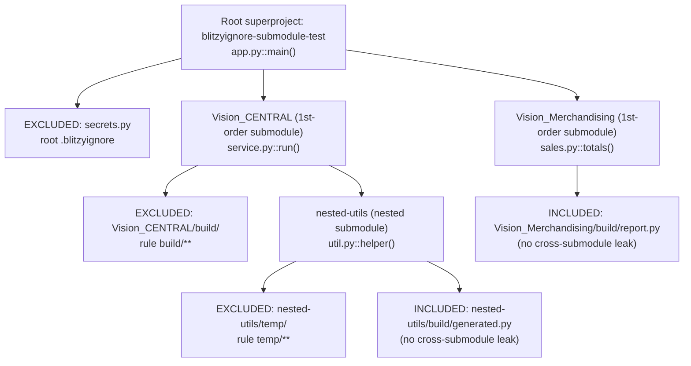
```mermaid
graph TD
    Root["Root superproject: blitzyignore-submodule-test<br/>app.py::main()"]
    Sec["EXCLUDED: secrets.py<br/>root .blitzyignore"]
    VC["Vision_CENTRAL (1st-order submodule)<br/>service.py::run()"]
    VM["Vision_Merchandising (1st-order submodule)<br/>sales.py::totals()"]
    VCB["EXCLUDED: Vision_CENTRAL/build/<br/>rule build/**"]
    NU["nested-utils (nested submodule)<br/>util.py::helper()"]
    NUT["EXCLUDED: nested-utils/temp/<br/>rule temp/**"]
    NUB["INCLUDED: nested-utils/build/generated.py<br/>(no cross-submodule leak)"]
    VMB["INCLUDED: Vision_Merchandising/build/report.py<br/>(no cross-submodule leak)"]

    Root --> Sec
    Root --> VC
    Root --> VM
    VC --> VCB
    VC --> NU
    NU --> NUT
    NU --> NUB
    VM --> VMB
```

### 1.2.3 Success Criteria

**Measurable objectives.** Success is defined as an ignore-aware consumer producing exactly the following per-path outcomes:

| Path | Required outcome | Governing rule |
|---|---|---|
| `app.py` | Included | Default (no rule) |
| `Vision_CENTRAL/service.py` | Included | Default (no rule) |
| `Vision_CENTRAL/nested-utils/util.py` | Included | Default (no rule) |
| `Vision_CENTRAL/nested-utils/build/generated.py` | Included | Parent `build/**` must not leak |
| `Vision_Merchandising/sales.py` | Included | Default (no rule) |
| `Vision_Merchandising/build/report.py` | Included | Sibling `build/**` must not leak |
| `secrets.py` (every level) | Excluded | Root `.blitzyignore`: `secrets.py` |
| `Vision_CENTRAL/build/` | Excluded | `Vision_CENTRAL/.blitzyignore`: `build/**` |
| `Vision_CENTRAL/nested-utils/temp/` | Excluded | `nested-utils/.blitzyignore`: `temp/**` |

**Critical success factors.** (1) *Per-directory scoping* — each `.blitzyignore` governs only the subtree of the directory that declares it. (2) *Submodule traversal* — the consumer must descend into each gitlinked submodule and apply that submodule's local rules. (3) *Non-leakage* — identical directory names (`build/`) in different scopes must be evaluated independently. (4) *Security enforcement* — the `secrets.py` exclusion must hold everywhere it appears.

**Key performance indicators.** The fixture reduces to three binary, countable KPIs. The right-hand column records what was observed in this documentation environment's inspection layer.

| KPI | Target | Observed here |
|---|---|---|
| Inclusion markers retained | 6 of 6 | 6 of 6 surfaced |
| Exclusion targets suppressed | All (`secrets.py` ×3, `Vision_CENTRAL/build/`, `nested-utils/temp/`) | All omitted from listings |
| Cross-submodule leaks | 0 | 0 (sibling & nested `build/` retained) |

## 1.3 Scope

Scope is defined against what the repository actually contains: a root superproject, two first-order submodules, one nested submodule, a set of constant-returning Python marker modules, and three scoped `.blitzyignore` files. The fixture defines *expectations* for an ignore-aware consumer; it deliberately does not implement the consumer, any application behavior, or any runtime.

### 1.3.1 In-Scope

**Core features and functionalities (must-have capabilities).**

- Declaring a **root-level file exclusion** (`secrets.py`) and providing the corresponding placeholder target files that must be suppressed.
- Declaring a **first-order submodule directory exclusion** (`Vision_CENTRAL/build/**`).
- Declaring a **nested submodule directory exclusion** (`Vision_CENTRAL/nested-utils/temp/**`).
- Providing **non-leakage control cases**: the retained `Vision_Merchandising/build/report.py` (sibling) and `Vision_CENTRAL/nested-utils/build/generated.py` (nested), which must remain included despite the `Vision_CENTRAL`-scoped `build/**` rule.
- Encoding each expected outcome as a **deterministic, self-describing marker string** returned by a zero-argument Python function.

**Primary user workflow.** The workflow the fixture supports is an *ingest-and-verify* loop: a consuming tool (1) resolves and descends into each Git submodule, (2) parses every `.blitzyignore` and applies it scoped to its declaring directory, (3) produces an inclusion set, and (4) is judged correct when that set matches the encoded expectations — all six inclusion markers present, all exclusion targets absent, and zero cross-submodule leaks.

**Essential integrations.** Two integrations are intrinsic to the fixture: **Git submodule resolution** (via the root `.gitmodules` and `Vision_CENTRAL/.gitmodules`, with submodules recorded as pinned `160000` gitlinks) and **`.blitzyignore` parsing** by whatever ingestion layer consumes the tree.

**Key technical requirements.** Directory-scoped rule application; correct traversal into nested and sibling submodules; independent evaluation of identically named directories; enforcement of the `secrets.py` exclusion at every level; and zero external dependencies so verification requires no build or runtime.

**Implementation boundaries.**

| Boundary dimension | In-scope definition |
|---|---|
| System boundary | The root superproject and its declared submodules (`Vision_CENTRAL`, `Vision_Merchandising`, `nested-utils`), their marker modules, and the three `.blitzyignore` files |
| User groups covered | Engineering/tooling roles: ignore-pipeline engineers, documentation/context agents, QA/verification owners, security reviewers |
| Geographic / market coverage | None — an internal engineering fixture with no deployment, locale, or market dimension |
| Data domains included | None of business significance; the only "data" are constant marker strings and ignore patterns. `secrets.py` is a placeholder exclusion target whose contents are out-of-scope and were not inspected |

### 1.3.2 Out-of-Scope

**Explicitly excluded features and capabilities.** The repository contains no application or business logic, no executable service or API, no user interface, no persistence or database, no authentication/authorization, no configuration management, and no build, CI, packaging, or test-framework tooling. The Python functions perform no I/O, control flow, or side effects beyond returning a constant.

**Paths intentionally excluded from ingestion.** By design, the following are out-of-scope for any consuming tool and were not read during documentation: `secrets.py` at every level (root, `Vision_CENTRAL`, `Vision_Merchandising`), the `Vision_CENTRAL/build/` subtree (`build/**`), and the `Vision_CENTRAL/nested-utils/temp/` subtree (`temp/**`).

**Consumer implementation.** The fixture specifies expected outcomes only; the implementation of the ignore-aware ingestion/checker tool that consumes these expectations lives outside this repository and is out-of-scope here.

**Future-phase / not-currently-exercised considerations.** The present fixture does not exercise several `.blitzyignore` variations, and their absence should be read as "not represented today" rather than a committed roadmap: negation/re-inclusion patterns (`!`), broader glob edge cases beyond `**`, exclusions targeting non-Python file types, submodule nesting deeper than the single `nested-utils` level, and `.blitzyignore` files declared inside `Vision_Merchandising`.

**Integration points not covered.** No CI/CD pipeline, package registry, artifact store, or external runtime service is integrated. The submodule URLs in `.gitmodules` are declarations for Git resolution only; the fixture itself performs no network calls.

**Unsupported use cases.** The repository is not a runnable application, a project template/starter, or a library intended for reuse. The marker return values carry no business meaning outside their role as inclusion/exclusion assertions, and the fixture is not intended to validate anything beyond `.blitzyignore` scoping and submodule-boundary behavior.

## 1.4 References

**Files examined**

- `app.py` — root marker module; `main()` returns `"root: always included"`.
- `.gitmodules` (root) — declares the `Vision_CENTRAL` and `Vision_Merchandising` submodules and their public GitHub URLs.
- `.blitzyignore` (root) — declares the `secrets.py` exclusion pattern.
- `Vision_CENTRAL/service.py` — `run()` returns `"vision-central: always included"`.
- `Vision_CENTRAL/.gitmodules` — declares the nested `nested-utils` submodule and its URL.
- `Vision_CENTRAL/.blitzyignore` — declares the `build/**` exclusion pattern.
- `Vision_CENTRAL/nested-utils/util.py` — `helper()` returns `"nested-utils: always included"`.
- `Vision_CENTRAL/nested-utils/.blitzyignore` — declares the `temp/**` exclusion pattern.
- `Vision_CENTRAL/nested-utils/build/generated.py` — `generated()` returns the "proves no cross-submodule leak" marker; comment establishes that `.blitzyignore` rules are scoped to their declaring directory.
- `Vision_Merchandising/sales.py` — `totals()` returns `"vision-merchandising: always included"`.
- `Vision_Merchandising/build/report.py` — `report()` returns the sibling "proves no cross-submodule leak" marker.

**Folders examined**

- `` (repository root) — established the superproject structure and its four first-order children.
- `Vision_CENTRAL/` — first-order Git submodule; contents and scoped ignore rule.
- `Vision_Merchandising/` — first-order Git submodule; contents and retained `build/`.
- `Vision_CENTRAL/nested-utils/` — nested Git submodule; contents and scoped ignore rule.
- `Vision_CENTRAL/nested-utils/build/` — retained nested build directory (inclusion control case).
- `Vision_Merchandising/build/` — retained sibling build directory (inclusion control case).

**Repository (Git) metadata**

- Git submodule state — established that `Vision_CENTRAL` and `Vision_Merchandising` are `160000` gitlinks pinned to commits `7fee06d` and `8e9b0e2`, that `nested-utils` is pinned to `62d3372`, and that the repository name is `blitzyignore-submodule-test` on branch `main`. (An access token embedded in the remote URL was intentionally excluded from this document.)

**Paths honored as exclusions (NOT inspected)**

- `secrets.py` (root, `Vision_CENTRAL/`, `Vision_Merchandising/`), the `Vision_CENTRAL/build/` subtree, and the `Vision_CENTRAL/nested-utils/temp/` subtree — identified as exclusion targets from the `.blitzyignore` files; their contents were deliberately not opened in accordance with those rules.

**Web sources**

- None. All evidence was drawn directly from the repository.

# 2. Product Requirements

## 2.1 Feature Catalog

The `blitzyignore-submodule-test` repository is a deliberately dependency-free **verification fixture** rather than a business application (see §1.1 Executive Summary and §1.3 Scope). Consequently, its product requirements decompose not into user-facing application functions but into **discrete, independently testable ignore-boundary behaviors** that a consuming ignore-aware tool (documentation generator, indexer, or context-collection agent) must satisfy, plus the substrate that makes those behaviors verifiable. Every feature below maps directly to observed repository artifacts — the three scoped `.blitzyignore` files, the `.gitmodules` submodule declarations, the pinned `160000` gitlinks, and the constant-returning Python marker modules. No feature is inferred beyond what these artifacts encode.

The four ignore-boundary behaviors (F-001–F-004) correspond one-to-one with the "Primary system capabilities" enumerated in §1.2.2; F-005 and F-006 are the foundational composition and verification-substrate capabilities that the four behaviors depend upon. All six features are **Completed** — the fixture is fully built and committed across root commits `3dbe53c`, `7896094`, and `d16d0c3`, and the §1.2.3 KPIs record the current documentation-environment consumer passing all cases.

**Feature Catalog Summary — Identity and Priority**

| Feature ID | Feature Name | Category | Priority |
|---|---|---|---|
| F-001 | Root-Level File Exclusion (`secrets.py`) | Security Exclusion Enforcement | Critical |
| F-002 | First-Order Submodule Directory Exclusion (`build/**`) | Directory-Scoped Ignore Enforcement | High |
| F-003 | Nested Submodule Directory Exclusion (`temp/**`) | Directory-Scoped Ignore Enforcement | High |
| F-004 | Cross-Submodule Ignore Non-Leakage | Submodule Boundary Isolation | Critical |
| F-005 | Multi-Level Submodule Traversal & Composition | Repository Composition & Traversal | Critical |
| F-006 | Deterministic Inclusion-Marker Substrate | Verification Substrate | Medium |

**Feature Catalog Summary — Status and Governing Artifact**

| Feature ID | Status | Primary Evidence Path | Governing Rule / Artifact |
|---|---|---|---|
| F-001 | Completed | `.blitzyignore` (root) | Pattern `secrets.py` |
| F-002 | Completed | `Vision_CENTRAL/.blitzyignore` | Pattern `build/**` |
| F-003 | Completed | `Vision_CENTRAL/nested-utils/.blitzyignore` | Pattern `temp/**` |
| F-004 | Completed | `Vision_Merchandising/build/report.py`, `Vision_CENTRAL/nested-utils/build/generated.py` | Per-directory scoping of `build/**` |
| F-005 | Completed | `.gitmodules`, `Vision_CENTRAL/.gitmodules` | `160000` gitlinks `7fee06d` / `8e9b0e2` / `62d3372` |
| F-006 | Completed | `app.py`, `service.py`, `util.py`, `sales.py`, `generated.py`, `report.py` | Constant marker strings |

### 2.1.1 F-001: Root-Level File Exclusion

**Feature Metadata**

| Attribute | Value |
|---|---|
| Unique ID | F-001 |
| Feature Name | Root-Level File Exclusion (`secrets.py`) |
| Feature Category | Security Exclusion Enforcement |
| Priority Level | Critical |
| Status | Completed |

**Description**

- **Overview:** The root `.blitzyignore` declares exactly one bare-filename pattern — `secrets.py`. A consuming ignore-aware tool must suppress every file named `secrets.py` present in the fixture. Three such placeholder targets exist: the root `secrets.py`, `Vision_CENTRAL/secrets.py`, and `Vision_Merchandising/secrets.py`.
- **Business Value:** Guarantees that credential-like or sensitive files are never ingested by automated systems that walk the tree — the security concern raised in §1.1 for "security-conscious reviewers." A defect here would leak a sensitive file into a generated document or index.
- **User Benefits:** Security reviewers obtain a deterministic assurance that a bare-filename exclusion holds not only at the root but at every level where the filename appears (§1.2.3 critical success factor #4, "security enforcement").
- **Technical Context:** The rule is a single line (`secrets.py`) with no path component, so it matches the filename at any depth of the consumer's traversal. The contents of all three `secrets.py` targets were **not inspected** in accordance with the ignore rule; only their existence and expected suppression are documented.

**Dependencies**

| Dependency Type | Detail |
|---|---|
| Prerequisite Features | F-005 (submodule traversal) is required to reach `Vision_CENTRAL/secrets.py` and `Vision_Merchandising/secrets.py`; F-006 supplies the inclusion baseline against which the exclusion is measured |
| System Dependencies | Root `.blitzyignore`; the three `secrets.py` placeholder targets at root, `Vision_CENTRAL/`, and `Vision_Merchandising/` |
| External Dependencies | An ignore-aware consuming tool that parses `.blitzyignore` (implemented outside this repository, per §1.3.2) |
| Integration Requirements | Git submodule resolution so that submodule-level `secrets.py` files are exposed for evaluation |

### 2.1.2 F-002: First-Order Submodule Directory Exclusion

**Feature Metadata**

| Attribute | Value |
|---|---|
| Unique ID | F-002 |
| Feature Name | First-Order Submodule Directory Exclusion (`build/**`) |
| Feature Category | Directory-Scoped Ignore Enforcement |
| Priority Level | High |
| Status | Completed |

**Description**

- **Overview:** The `Vision_CENTRAL/.blitzyignore` file declares the directory-glob pattern `build/**`. The entire `Vision_CENTRAL/build/` subtree — containing the placeholder `Vision_CENTRAL/build/output.py` — must be suppressed by the consuming tool.
- **Business Value:** Confirms that build-artifact directories declared inside a first-order submodule are honored, so that transient or generated output within a component repository is not ingested.
- **User Benefits:** Ignore-pipeline engineers receive verification that a path-anchored directory glob is applied correctly within a first-order submodule's own subtree.
- **Technical Context:** The pattern `build/**` is anchored to the `Vision_CENTRAL/` directory that declares it. The target `Vision_CENTRAL/build/output.py` was **not inspected** (honored as an exclusion). This feature's scoping is the positive counterpart to the non-leakage control cases in F-004.

**Dependencies**

| Dependency Type | Detail |
|---|---|
| Prerequisite Features | F-005 (traversal into `Vision_CENTRAL`); directly related to F-004, which verifies this rule does not leak beyond `Vision_CENTRAL/` |
| System Dependencies | `Vision_CENTRAL/.blitzyignore`; the `Vision_CENTRAL/build/` subtree |
| External Dependencies | Ignore-aware consuming tool that parses `.blitzyignore` directory globs |
| Integration Requirements | Git resolution of the `Vision_CENTRAL` submodule (gitlink `7fee06d`) declared in the root `.gitmodules` |

### 2.1.3 F-003: Nested Submodule Directory Exclusion

**Feature Metadata**

| Attribute | Value |
|---|---|
| Unique ID | F-003 |
| Feature Name | Nested Submodule Directory Exclusion (`temp/**`) |
| Feature Category | Directory-Scoped Ignore Enforcement |
| Priority Level | High |
| Status | Completed |

**Description**

- **Overview:** The `Vision_CENTRAL/nested-utils/.blitzyignore` file declares the pattern `temp/**`. The entire `Vision_CENTRAL/nested-utils/temp/` subtree — containing the placeholder `temp/cache.py` — must be suppressed.
- **Business Value:** Confirms that ignore rules declared at the deepest tier of the composition (a nested, second-level submodule) are honored, so temporary caches within a transitively linked repository are excluded from ingestion.
- **User Benefits:** Verifies that a consuming tool applies local rules correctly even after descending two submodule boundaries deep, not merely at the root or first-order level.
- **Technical Context:** The pattern `temp/**` is anchored to the `nested-utils/` directory that declares it. The target `Vision_CENTRAL/nested-utils/temp/cache.py` was **not inspected** (honored as an exclusion).

**Dependencies**

| Dependency Type | Detail |
|---|---|
| Prerequisite Features | F-005 (traversal into the nested `nested-utils` submodule via `Vision_CENTRAL`) |
| System Dependencies | `Vision_CENTRAL/nested-utils/.blitzyignore`; the `nested-utils/temp/` subtree |
| External Dependencies | Ignore-aware consuming tool that parses `.blitzyignore` directory globs |
| Integration Requirements | Git resolution of the nested `nested-utils` submodule (gitlink `62d3372`) declared in `Vision_CENTRAL/.gitmodules` |

### 2.1.4 F-004: Cross-Submodule Ignore Non-Leakage

**Feature Metadata**

| Attribute | Value |
|---|---|
| Unique ID | F-004 |
| Feature Name | Cross-Submodule Ignore Non-Leakage |
| Feature Category | Submodule Boundary Isolation |
| Priority Level | Critical |
| Status | Completed |

**Description**

- **Overview:** The `Vision_CENTRAL`-scoped `build/**` rule (F-002) must **not** affect same-named `build/` directories declared in other scopes. Two control cases must remain **included**: the sibling `Vision_Merchandising/build/report.py` and the nested `Vision_CENTRAL/nested-utils/build/generated.py`.
- **Business Value:** This is the fixture's namesake correctness property (see §1.1: the "ignore-rule leakage" failure mode). Leakage would wrongly exclude legitimate files in sibling or nested submodules simply because they share a directory name with an excluded directory elsewhere.
- **User Benefits:** QA / verification owners gain explicit control cases proving that identically named directories in different submodule scopes are evaluated independently (§1.2.3 KPI "Cross-submodule leaks: 0").
- **Technical Context:** Both retained modules carry source comments stating the governing principle directly — each `.blitzyignore` is scoped to the directory that declares it and must not leak into a sibling or nested submodule. Their marker return values both end in `"(proves no cross-submodule leak)"`, doubling as self-describing assertions.

**Dependencies**

| Dependency Type | Detail |
|---|---|
| Prerequisite Features | F-002 (defines the `build/**` rule whose non-leakage is being verified); F-005 (traversal into sibling and nested submodules) |
| System Dependencies | `Vision_Merchandising/build/report.py`; `Vision_CENTRAL/nested-utils/build/generated.py` |
| External Dependencies | Ignore-aware consuming tool that evaluates each `.blitzyignore` scoped to its declaring directory |
| Integration Requirements | Git resolution of both the sibling (`Vision_Merchandising`, `8e9b0e2`) and nested (`nested-utils`, `62d3372`) submodules |

### 2.1.5 F-005: Multi-Level Submodule Traversal & Composition

**Feature Metadata**

| Attribute | Value |
|---|---|
| Unique ID | F-005 |
| Feature Name | Multi-Level Submodule Traversal & Composition |
| Feature Category | Repository Composition & Traversal |
| Priority Level | Critical |
| Status | Completed |

**Description**

- **Overview:** The fixture is a three-tier Git submodule composition. The root superproject links two first-order submodules — `Vision_CENTRAL` and `Vision_Merchandising` — via the root `.gitmodules`, and `Vision_CENTRAL` in turn links the nested `nested-utils` submodule via `Vision_CENTRAL/.gitmodules`. All three are recorded as pinned `160000` gitlinks. A consuming tool must resolve and descend into each submodule and apply that submodule's local rules.
- **Business Value:** Enables every other feature; without correct traversal, a consumer would flatten or skip submodule content, defeating the exclusion and inclusion checks that depend on descending submodule boundaries.
- **User Benefits:** Confirms that the consumer treats each gitlink as an independent repository, walking both first-order and nested tiers rather than ignoring or inlining them.
- **Technical Context:** Root `.gitmodules` declares `Vision_CENTRAL` (`https://github.com/Adarsh26062002/vision-central.git`) and `Vision_Merchandising` (`https://github.com/Adarsh26062002/vision-merchandising.git`); `Vision_CENTRAL/.gitmodules` declares `nested-utils` (`https://github.com/Adarsh26062002/nested-utils.git`). The gitlinks pin `Vision_CENTRAL`→`7fee06d`, `Vision_Merchandising`→`8e9b0e2`, and `nested-utils`→`62d3372`. The submodule URLs are declarations for Git resolution only; the fixture performs no network calls (§1.3.2).

**Dependencies**

| Dependency Type | Detail |
|---|---|
| Prerequisite Features | None — F-005 is the foundational capability that F-001, F-002, F-003, and F-004 depend on |
| System Dependencies | Root `.gitmodules`; `Vision_CENTRAL/.gitmodules`; the three pinned gitlink commits |
| External Dependencies | Standard Git submodule machinery (resolution of `160000` gitlinks) |
| Integration Requirements | A consumer capable of descending into submodules and evaluating each tier's rules independently |

### 2.1.6 F-006: Deterministic Inclusion-Marker Substrate

**Feature Metadata**

| Attribute | Value |
|---|---|
| Unique ID | F-006 |
| Feature Name | Deterministic Inclusion-Marker Substrate |
| Feature Category | Verification Substrate |
| Priority Level | Medium |
| Status | Completed |

**Description**

- **Overview:** Every expected outcome in the fixture is encoded as a synchronous, zero-argument Python function that returns a fixed constant string; the string is simultaneously the assertion label and its own expected value. Six inclusion markers exist. Four are default (no-rule) inclusions — `app.py::main`, `Vision_CENTRAL/service.py::run`, `Vision_CENTRAL/nested-utils/util.py::helper`, and `Vision_Merchandising/sales.py::totals` — and two are the non-leakage controls owned by F-004. This feature establishes the baseline requirement that all default markers are retained.
- **Business Value:** Provides a deterministic, human-readable pass/fail oracle for ignore-boundary behavior with no build step, no dependencies, and no runtime harness (§1.1). A consuming tool is validated by a simple set comparison of ingested files against encoded expectations.
- **User Benefits:** QA owners can verify correctness by inspecting whether each marker string surfaced, rather than executing code or interpreting complex output.
- **Technical Context:** Each module defines exactly one function with no imports, globals, classes, control flow, I/O, or side effects. Inclusion markers return strings ending in `": always included"`; the two F-004 controls end in `"(proves no cross-submodule leak)"`. This substrate underpins the §1.2.3 KPI "Inclusion markers retained: 6 of 6."

**Dependencies**

| Dependency Type | Detail |
|---|---|
| Prerequisite Features | None — foundational; supplies the inclusion baseline that F-001–F-004 measure exclusions and non-leakage against |
| System Dependencies | The six marker modules (`app.py`, `service.py`, `util.py`, `sales.py`, `generated.py`, `report.py`) |
| External Dependencies | Python source syntax only (the marker functions are read as text, not executed, for verification) |
| Integration Requirements | Consumed by the ingesting tool's inclusion-set comparison; no framework or interpreter dependency |


## 2.2 Functional Requirements

Each feature is expanded below into testable functional requirements using the identifier format `F-XXX-RQ-YYY`. Because the repository is a verification fixture that encodes *expected outcomes* (§1.3.1), every requirement is expressed as an observable inclusion/exclusion outcome whose acceptance criterion is a direct comparison against the §1.2.3 success-criteria table and KPIs. All requirements are **Must-Have**: the fixture represents only mandatory expected behaviors and deliberately omits optional or future variations (negation patterns, non-Python targets, deeper nesting), which are listed as out-of-scope in §1.3.2. "Input Parameters" refer to the ignore patterns and candidate paths a consuming tool evaluates; the marker functions themselves are zero-argument. No runtime timing SLA is defined anywhere in the repository — verification is a static, deterministic comparison — so performance criteria are stated in those terms rather than as fabricated latency targets.

### 2.2.1 F-001 — Root-Level File Exclusion

**Requirement Details**

| Requirement ID | Description | Priority | Complexity |
|---|---|---|---|
| F-001-RQ-001 | Root `.blitzyignore` pattern `secrets.py` suppresses the root `secrets.py` | Must-Have | Low |
| F-001-RQ-002 | The `secrets.py` exclusion holds at every level — `Vision_CENTRAL/secrets.py` and `Vision_Merchandising/secrets.py` are also suppressed | Must-Have | Medium |

**Acceptance Criteria**

- **F-001-RQ-001:** The root `secrets.py` is absent from the consuming tool's inclusion set / folder listings.
- **F-001-RQ-002:** All three `secrets.py` files (root, `Vision_CENTRAL/`, `Vision_Merchandising/`) are absent; the count of ingested files named `secrets.py` equals `0`, satisfying the §1.2.3 exclusion KPI.

**Technical Specifications**

| Aspect | Specification |
|---|---|
| Input Parameters | Root `.blitzyignore` line `secrets.py`; every candidate path whose filename is `secrets.py`, at any depth |
| Output/Response | Exclusion decision — the path is omitted from the inclusion set |
| Performance Criteria | Deterministic filename match at any traversal depth; no timing SLA defined in the fixture |
| Data Requirements | The literal pattern `secrets.py`; no target file contents are required (and were not read) |

**Validation Rules**

| Rule Type | Specification |
|---|---|
| Business Rules | A bare filename pattern (no path separator) matches that filename at every level of the tree |
| Data Validation | Match is by exact filename `secrets.py` |
| Security Requirements | Critical — sensitive placeholder files must never be surfaced or opened; enforced at all three levels (§1.2.3 CSF #4) |
| Compliance Requirements | None defined in the repository beyond the ignore rule itself |

### 2.2.2 F-002 — First-Order Submodule Directory Exclusion

**Requirement Details**

| Requirement ID | Description | Priority | Complexity |
|---|---|---|---|
| F-002-RQ-001 | `Vision_CENTRAL/.blitzyignore` pattern `build/**` suppresses the entire `Vision_CENTRAL/build/` subtree | Must-Have | Low |

**Acceptance Criteria**

- **F-002-RQ-001:** No path under `Vision_CENTRAL/build/` (e.g., `Vision_CENTRAL/build/output.py`) appears in the inclusion set.

**Technical Specifications**

| Aspect | Specification |
|---|---|
| Input Parameters | Pattern `build/**` anchored to `Vision_CENTRAL/`; candidate paths under `Vision_CENTRAL/build/` |
| Output/Response | Exclusion of the entire `Vision_CENTRAL/build/` subtree |
| Performance Criteria | Deterministic recursive-glob match within the declaring directory; no timing SLA defined |
| Data Requirements | The pattern `build/**`; target contents not read |

**Validation Rules**

| Rule Type | Specification |
|---|---|
| Business Rules | `build/**` is scoped to the `Vision_CENTRAL/` directory that declares it |
| Data Validation | Recursive glob `**` matches all descendants of `Vision_CENTRAL/build/` |
| Security Requirements | None specific — the target is a build artifact, not a secret |
| Compliance Requirements | None defined |

### 2.2.3 F-003 — Nested Submodule Directory Exclusion

**Requirement Details**

| Requirement ID | Description | Priority | Complexity |
|---|---|---|---|
| F-003-RQ-001 | `Vision_CENTRAL/nested-utils/.blitzyignore` pattern `temp/**` suppresses the entire `nested-utils/temp/` subtree | Must-Have | Medium |

**Acceptance Criteria**

- **F-003-RQ-001:** No path under `Vision_CENTRAL/nested-utils/temp/` (e.g., `temp/cache.py`) appears in the inclusion set. Complexity is Medium because the rule resides at the deepest (nested-submodule) tier and requires two-level traversal to reach.

**Technical Specifications**

| Aspect | Specification |
|---|---|
| Input Parameters | Pattern `temp/**` anchored to `nested-utils/`; candidate paths under `nested-utils/temp/` |
| Output/Response | Exclusion of the entire `Vision_CENTRAL/nested-utils/temp/` subtree |
| Performance Criteria | Deterministic recursive-glob match within the declaring directory; no timing SLA defined |
| Data Requirements | The pattern `temp/**`; target contents not read |

**Validation Rules**

| Rule Type | Specification |
|---|---|
| Business Rules | `temp/**` is scoped to the `nested-utils/` directory that declares it |
| Data Validation | Recursive glob `**` matches all descendants of `nested-utils/temp/` |
| Security Requirements | None specific — the target is a temporary cache, not a secret |
| Compliance Requirements | None defined |

### 2.2.4 F-004 — Cross-Submodule Ignore Non-Leakage

**Requirement Details**

| Requirement ID | Description | Priority | Complexity |
|---|---|---|---|
| F-004-RQ-001 | Sibling `Vision_Merchandising/build/report.py` remains included despite the `Vision_CENTRAL` `build/**` rule | Must-Have | Medium |
| F-004-RQ-002 | Nested `Vision_CENTRAL/nested-utils/build/generated.py` remains included despite the `Vision_CENTRAL` `build/**` rule | Must-Have | Medium |

**Acceptance Criteria**

- **F-004-RQ-001:** The `report()` marker string `"vision-merchandising/build: included (proves no cross-submodule leak)"` is present in the inclusion set.
- **F-004-RQ-002:** The `generated()` marker string `"nested-utils/build: included (proves no cross-submodule leak)"` is present. Together these satisfy the §1.2.3 KPI "Cross-submodule leaks: 0".

**Technical Specifications**

| Aspect | Specification |
|---|---|
| Input Parameters | The `Vision_CENTRAL` `build/**` rule; the sibling and nested `build/` paths in other scopes |
| Output/Response | Inclusion (retention) of both `build/` marker modules |
| Performance Criteria | Independent per-scope evaluation of identically named directories; no timing SLA defined |
| Data Requirements | The two marker strings (both end in `"(proves no cross-submodule leak)"`) |

**Validation Rules**

| Rule Type | Specification |
|---|---|
| Business Rules | Each `.blitzyignore` is scoped to its declaring directory and must not leak into sibling or nested submodules that merely share a directory name |
| Data Validation | `Vision_Merchandising/build/` and `nested-utils/build/` are distinct scopes from `Vision_CENTRAL/build/` |
| Security Requirements | N/A |
| Compliance Requirements | None defined |

### 2.2.5 F-005 — Multi-Level Submodule Traversal & Composition

**Requirement Details**

| Requirement ID | Description | Priority | Complexity |
|---|---|---|---|
| F-005-RQ-001 | Resolve and descend into first-order gitlinks `Vision_CENTRAL` (`7fee06d`) and `Vision_Merchandising` (`8e9b0e2`) declared in root `.gitmodules` | Must-Have | Medium |
| F-005-RQ-002 | Descend into the nested submodule `nested-utils` (`62d3372`) declared in `Vision_CENTRAL/.gitmodules` | Must-Have | High |
| F-005-RQ-003 | Parse each submodule's local `.blitzyignore` and apply it scoped to that submodule's subtree | Must-Have | High |

**Acceptance Criteria**

- **F-005-RQ-001:** The `run()` and `totals()` markers from both first-order submodules surface, and each submodule's `.blitzyignore` rule takes effect.
- **F-005-RQ-002:** The nested `util.py::helper()` marker surfaces and the `nested-utils/temp/**` rule takes effect.
- **F-005-RQ-003:** Each of the three `.blitzyignore` files affects only its own declaring subtree (jointly validated with F-004).

**Technical Specifications**

| Aspect | Specification |
|---|---|
| Input Parameters | Root and `Vision_CENTRAL` `.gitmodules` declarations; the three `160000` gitlink pins |
| Output/Response | A fully traversed three-tier tree with each submodule's rules applied locally |
| Performance Criteria | A single traversal descending all three tiers; no timing SLA defined |
| Data Requirements | `.gitmodules` path/URL declarations and gitlink commit pins; the fixture performs no network calls (§1.3.2) |

**Validation Rules**

| Rule Type | Specification |
|---|---|
| Business Rules | Each gitlink is an independent repository pinned to a specific commit; the consumer must descend into it, not flatten or skip it |
| Data Validation | Submodule paths/URLs match `.gitmodules`; gitlinks are recorded as mode `160000` |
| Security Requirements | Where a remote URL embeds an access token in some environments, that token must never be reproduced; only clean public URLs are cited |
| Compliance Requirements | None defined |

### 2.2.6 F-006 — Deterministic Inclusion-Marker Substrate

**Requirement Details**

| Requirement ID | Description | Priority | Complexity |
|---|---|---|---|
| F-006-RQ-001 | The four default (no-rule) markers — `main`, `run`, `helper`, `totals` — are retained/included | Must-Have | Low |
| F-006-RQ-002 | Each marker is a zero-argument function returning its exact constant string (label = expected value) with no imports, state, or I/O | Must-Have | Low |

**Acceptance Criteria**

- **F-006-RQ-001:** All four default marker strings (`"root: always included"`, `"vision-central: always included"`, `"nested-utils: always included"`, `"vision-merchandising: always included"`) surface; combined with F-004's two markers, the §1.2.3 KPI "6 of 6 inclusion markers retained" is met.
- **F-006-RQ-002:** Each module contains exactly one zero-argument function returning the documented constant, so verification requires only text comparison — no execution, build, or runtime.

**Technical Specifications**

| Aspect | Specification |
|---|---|
| Input Parameters | None — the marker functions are zero-argument |
| Output/Response | The exact constant marker string per module |
| Performance Criteria | Verification is a static set/text comparison; no build, runtime, or timing SLA |
| Data Requirements | The six constant marker strings; no external data, configuration, or persistence |

**Validation Rules**

| Rule Type | Specification |
|---|---|
| Business Rules | A path with no applicable ignore rule must be included (default-include) |
| Data Validation | Each function's return value equals the documented constant exactly |
| Security Requirements | N/A — marker strings carry no sensitive data |
| Compliance Requirements | None defined |


## 2.3 Feature Relationships

The relationships below are drawn only from dependencies that are directly evident in the repository — the per-directory scoping of the three `.blitzyignore` files, the submodule composition declared in the `.gitmodules` files and gitlinks, and the shared marker substrate. Two features are foundational: **F-005 (traversal/composition)** exposes the submodule content that the exclusion features operate on, and **F-006 (marker substrate)** supplies the inclusion baseline against which every exclusion and non-leakage outcome is measured. The four ignore-boundary features (F-001–F-004) build on that foundation; additionally, **F-004 depends on F-002** because it verifies that F-002's `build/**` rule does not leak beyond its declaring scope.

### 2.3.1 Feature Dependency Map

The map reads *dependent → prerequisite*. This complements the structural composition diagram in §1.2.2 and the ingest-and-verify workflow described in §1.3.1.

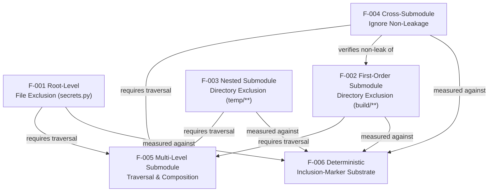
```mermaid
graph TD
    F001["F-001 Root-Level<br/>File Exclusion (secrets.py)"]
    F002["F-002 First-Order Submodule<br/>Directory Exclusion (build/**)"]
    F003["F-003 Nested Submodule<br/>Directory Exclusion (temp/**)"]
    F004["F-004 Cross-Submodule<br/>Ignore Non-Leakage"]
    F005["F-005 Multi-Level Submodule<br/>Traversal & Composition"]
    F006["F-006 Deterministic<br/>Inclusion-Marker Substrate"]

    F001 -->|requires traversal| F005
    F002 -->|requires traversal| F005
    F003 -->|requires traversal| F005
    F004 -->|requires traversal| F005
    F004 -->|verifies non-leak of| F002
    F001 -->|measured against| F006
    F002 -->|measured against| F006
    F003 -->|measured against| F006
    F004 -->|measured against| F006
```

### 2.3.2 Integration Points

Two integrations are intrinsic to the fixture (§1.3.1), plus the verification comparison the consumer performs. Each is an interface between the fixture's declared expectations and the external ignore-aware consumer.

| Integration Point | Mechanism | Features Involved | Evidence |
|---|---|---|---|
| Git submodule resolution | Descend into `160000` gitlinks pinned by `.gitmodules` | F-005 (provides); F-001, F-002, F-003, F-004 (rely on) | `.gitmodules`, `Vision_CENTRAL/.gitmodules`, gitlinks `7fee06d`/`8e9b0e2`/`62d3372` |
| `.blitzyignore` parsing | Parse and apply each ignore file scoped to its declaring directory | F-001, F-002, F-003, F-004 | `.blitzyignore` (root), `Vision_CENTRAL/.blitzyignore`, `nested-utils/.blitzyignore` |
| Inclusion-set comparison | Compare ingested paths/marker strings against encoded expectations | All features (verification) | Marker strings in `app.py`, `service.py`, `util.py`, `sales.py`, `generated.py`, `report.py` |

### 2.3.3 Shared Components

The features are not independent modules but overlapping views onto a small set of shared artifacts. The table maps each shared artifact to the features that consume it.

| Shared Component | Path(s) | Consuming Features |
|---|---|---|
| Scoped ignore-rule set | `.blitzyignore` (root), `Vision_CENTRAL/.blitzyignore`, `Vision_CENTRAL/nested-utils/.blitzyignore` | F-001 (root), F-002 (Vision_CENTRAL), F-003 (nested-utils); F-004 depends on the scoping of `build/**` |
| Submodule declarations & gitlinks | `.gitmodules`, `Vision_CENTRAL/.gitmodules`; pins `7fee06d`/`8e9b0e2`/`62d3372` | F-005 (owns); F-001–F-004 (traverse through) |
| Deterministic marker modules | `app.py`, `service.py`, `util.py`, `sales.py`, `generated.py`, `report.py` | F-006 (owns substrate); F-004 owns `report.py` & `generated.py`; all use as inclusion baseline |
| Submodule container directories | `Vision_CENTRAL/`, `Vision_Merchandising/`, `Vision_CENTRAL/nested-utils/` | F-005 (composition); scope boundaries for F-002, F-003, F-004 |

### 2.3.4 Common Services

The fixture is deliberately dependency-free and exposes **no runtime services** — no executable service, API, database, authentication, configuration surface, or build/CI tooling exists anywhere in the tree (§1.3.2). Consequently there are no shared application services in the conventional sense. The only cross-cutting "service" every feature relies upon is the **external ignore-aware consumer** — the ingestion/checker tool (implemented outside this repository) that performs the three shared operations of submodule traversal, `.blitzyignore` parsing, and inclusion-set comparison. Because that consumer is out-of-scope here (§1.3.2), the fixture's role is limited to declaring the expectations that this common consumer is measured against.


## 2.4 Implementation Considerations

Several considerations apply uniformly across all six features because the repository is a single, cohesive, dependency-free fixture (§1.1, §1.3.2): there is **no external dependency, build step, runtime, or test framework**; the Python marker files are consumed as **text, not executed**; verification is a **static, deterministic comparison** of the ingested inclusion set against encoded expectations; and ignore rules are strictly **per-directory scoped**. No latency, throughput, or availability SLA is defined anywhere in the repository, so performance and scalability are discussed in terms of the fixture's fixed, small footprint and the consumer's traversal work rather than fabricated numeric targets. The feature-specific considerations below refine these cross-cutting points.

### 2.4.1 F-001 — Root-Level File Exclusion

| Dimension | Consideration |
|---|---|
| Technical Constraints | The bare-filename pattern `secrets.py` must match at every depth, including inside both first-order submodules; the three `secrets.py` targets must never be opened |
| Performance Requirements | A per-path filename comparison; no timing SLA defined |
| Scalability Considerations | Additional `secrets.py` placed at any new level require no rule change (a no-slash pattern already matches globally); reaching new submodule levels depends on F-005 |
| Security Implications | Highest severity — a miss leaks a sensitive placeholder file; the access token embedded in the remote URL must likewise never be reproduced in any artifact |
| Maintenance Requirements | The rule is a single line; the only maintenance is adding placeholder targets; target contents are deliberately never inspected |

### 2.4.2 F-002 — First-Order Submodule Directory Exclusion

| Dimension | Consideration |
|---|---|
| Technical Constraints | `build/**` must remain anchored to the declaring `Vision_CENTRAL/` directory and must not be applied globally |
| Performance Requirements | A recursive-glob match confined to one subtree; no timing SLA defined |
| Scalability Considerations | Adding files under `Vision_CENTRAL/build/` requires no rule change (`**` already covers descendants) |
| Security Implications | Low — the excluded target is a build artifact, not a secret |
| Maintenance Requirements | The rule lives in the `Vision_CENTRAL` submodule; changing it requires re-pinning the `Vision_CENTRAL` gitlink (currently `7fee06d`) in the superproject |

### 2.4.3 F-003 — Nested Submodule Directory Exclusion

| Dimension | Consideration |
|---|---|
| Technical Constraints | The rule sits at the deepest tier and requires two-level descent; `temp/**` must remain anchored to `nested-utils/` |
| Performance Requirements | A recursive-glob match confined to the nested subtree; no timing SLA defined |
| Scalability Considerations | Adding files under `nested-utils/temp/` requires no rule change |
| Security Implications | Low — the excluded target is a temporary cache, not a secret |
| Maintenance Requirements | The rule lives in the `nested-utils` submodule; changes require re-pinning `nested-utils` (`62d3372`) and, transitively, the `Vision_CENTRAL` gitlink that pins it |

### 2.4.4 F-004 — Cross-Submodule Ignore Non-Leakage

| Dimension | Consideration |
|---|---|
| Technical Constraints | Identically named `build/` directories must be evaluated independently per scope; the two retained markers must never be excluded |
| Performance Requirements | Independent per-scope evaluation; no timing SLA defined |
| Scalability Considerations | Any additional same-named directory introduced in another scope becomes a new non-leakage control case |
| Security Implications | Not a security case; a leak here is a correctness (over-exclusion) failure that would hide legitimate files |
| Maintenance Requirements | Self-documenting via the scoping comments in `report.py` and `generated.py`; changes require re-pinning the `Vision_Merchandising` and `nested-utils` submodules respectively |

### 2.4.5 F-005 — Multi-Level Submodule Traversal & Composition

| Dimension | Consideration |
|---|---|
| Technical Constraints | Gitlinks are pinned to exact commits; the consumer must resolve and descend rather than flatten or skip; the fixture itself performs no network calls |
| Performance Requirements | A single multi-tier traversal across three tiers; no timing SLA defined |
| Scalability Considerations | The composition is fixed at two first-order plus one nested submodule; deeper nesting is out-of-scope (§1.3.2); adding submodules means new `.gitmodules` entries and gitlinks |
| Security Implications | The remote URL may embed an access token in some environments; only clean public URLs are cited and the token is never reproduced |
| Maintenance Requirements | Pins are recorded in superproject commits; updating a submodule requires bumping its gitlink (as commit `d16d0c3` did when moving `Vision_CENTRAL` to the absolute `nested-utils` URL) |

### 2.4.6 F-006 — Deterministic Inclusion-Marker Substrate

| Dimension | Consideration |
|---|---|
| Technical Constraints | Each module contains exactly one zero-argument function returning a constant, with no imports, state, or I/O; modules are read as text, never executed |
| Performance Requirements | A static text/set comparison; no build, runtime, or timing SLA |
| Scalability Considerations | Adding a verification case is a single new marker module; the substrate scales linearly with the number of files |
| Security Implications | None — marker strings carry no sensitive data |
| Maintenance Requirements | Each marker string is simultaneously the assertion label and its expected value, keeping maintenance low; the string must remain stable to serve as a reliable oracle |


## 2.5 Requirements Traceability Matrix

This matrix provides end-to-end traceability for all **6 features** and **11 functional requirements**, linking each requirement to the concrete repository artifact that governs it and to the measurable acceptance outcome defined in the §1.2.3 Success Criteria and KPIs. The three KPIs referenced are: **KPI-1** — inclusion markers retained (target 6 of 6); **KPI-2** — exclusion targets suppressed (`secrets.py` ×3, `Vision_CENTRAL/build/`, `nested-utils/temp/`); **KPI-3** — cross-submodule leaks (target 0).

**Requirement-to-Artifact Traceability**

| Requirement ID | Feature | Evidence Artifact | Governing Rule / Pin |
|---|---|---|---|
| F-001-RQ-001 | F-001 | `.blitzyignore` (root); root `secrets.py` | Pattern `secrets.py` |
| F-001-RQ-002 | F-001 | `Vision_CENTRAL/secrets.py`; `Vision_Merchandising/secrets.py` | Pattern `secrets.py` (every level) |
| F-002-RQ-001 | F-002 | `Vision_CENTRAL/.blitzyignore`; `Vision_CENTRAL/build/` | Pattern `build/**` |
| F-003-RQ-001 | F-003 | `Vision_CENTRAL/nested-utils/.blitzyignore`; `nested-utils/temp/` | Pattern `temp/**` |
| F-004-RQ-001 | F-004 | `Vision_Merchandising/build/report.py` | Per-directory scoping of `build/**` |
| F-004-RQ-002 | F-004 | `Vision_CENTRAL/nested-utils/build/generated.py` | Per-directory scoping of `build/**` |
| F-005-RQ-001 | F-005 | `.gitmodules` (root) | Gitlinks `7fee06d`, `8e9b0e2` |
| F-005-RQ-002 | F-005 | `Vision_CENTRAL/.gitmodules` | Gitlink `62d3372` |
| F-005-RQ-003 | F-005 | The three `.blitzyignore` files | Per-directory scoping |
| F-006-RQ-001 | F-006 | `app.py`, `service.py`, `util.py`, `sales.py` | Default-include (no rule) |
| F-006-RQ-002 | F-006 | All six marker modules | Constant return values |

**Requirement-to-Success-Criteria Traceability**

| Requirement ID | Expected Path Outcome | §1.2.3 Success Criterion | KPI |
|---|---|---|---|
| F-001-RQ-001 | Root `secrets.py` excluded | `secrets.py` (every level) excluded | KPI-2 |
| F-001-RQ-002 | Submodule `secrets.py` (×2) excluded | `secrets.py` (every level) excluded | KPI-2 |
| F-002-RQ-001 | `Vision_CENTRAL/build/` excluded | `Vision_CENTRAL/build/` excluded | KPI-2 |
| F-003-RQ-001 | `nested-utils/temp/` excluded | `Vision_CENTRAL/nested-utils/temp/` excluded | KPI-2 |
| F-004-RQ-001 | `Vision_Merchandising/build/report.py` included | Sibling `build/**` must not leak | KPI-1, KPI-3 |
| F-004-RQ-002 | `nested-utils/build/generated.py` included | Parent `build/**` must not leak | KPI-1, KPI-3 |
| F-005-RQ-001 | First-order submodule content traversed | Submodule-traversal success factor | Enables KPI-1/2/3 |
| F-005-RQ-002 | Nested submodule content traversed | Submodule-traversal success factor | Enables KPI-1/2/3 |
| F-005-RQ-003 | Each rule applied to its own subtree | Per-directory scoping success factor | Enables KPI-2/3 |
| F-006-RQ-001 | 4 default markers included | Default (no rule) → included | KPI-1 |
| F-006-RQ-002 | Exact constant returns | Deterministic verification substrate | Enables KPI-1 |

**Coverage Summary**

Every feature (F-001–F-006) traces to at least one functional requirement, and every requirement traces to a governing artifact and a §1.2.3 success criterion. Collectively the requirements cover all nine per-path outcomes in the §1.2.3 success table (three `secrets.py` exclusions, `Vision_CENTRAL/build/` and `nested-utils/temp/` exclusions, and the four default plus two non-leak inclusions) and all three KPIs. The §1.2.3 "Observed here" column records these outcomes already holding in the current documentation-environment consumer (6 of 6 markers surfaced, all exclusion targets omitted, 0 leaks).


## 2.6 Assumptions, Constraints, and Requirement Versioning

This sub-section records the assumptions the requirements depend on, the constraints that bound them, and how requirement versions are tracked. Because the fixture encodes requirements structurally (ignore rules, marker strings, and gitlink pins) rather than in prose, versioning is realized through the repository's Git history.

### 2.6.1 Assumptions

- **A consuming ignore-aware tool exists.** All requirements are expectations *about* an external consumer (documentation generator, indexer, or context-collection agent) that parses `.blitzyignore` and resolves Git submodules. That consumer is implemented outside this repository and is out-of-scope here (§1.3.2).
- **Gitignore-style matching semantics.** The requirements assume a bare filename pattern (`secrets.py`) matches that filename at any depth, while a path-bearing glob (`build/**`, `temp/**`) is anchored to its declaring directory and `**` matches all descendants.
- **Submodules are resolvable at their pinned commits.** F-005 assumes the consumer can descend into each `160000` gitlink (`7fee06d`, `8e9b0e2`, `62d3372`); the fixture declares public URLs but performs no network calls itself (§1.3.2).
- **Excluded targets exist but are unreadable.** The placeholder exclusion targets (`secrets.py` ×3, `Vision_CENTRAL/build/output.py`, `nested-utils/temp/cache.py`) are assumed present on disk yet treated as never-to-be-opened; their contents were not inspected during documentation.
- **Marker strings are the authoritative oracle.** F-006 assumes each marker's return value is simultaneously the assertion label and its expected value, so no separate expected-results file is required.

### 2.6.2 Constraints

- **Zero external dependencies.** No build step, runtime, package manifest, CI, or test framework exists; verification must be a static comparison (§1.1, §1.3.2).
- **Strict per-directory scoping.** Each `.blitzyignore` governs only the subtree of the directory that declares it; a path-bearing rule must never leak into a sibling or nested submodule (F-004).
- **Security constraint on submodule URLs.** Where the remote origin URL embeds an access token in some environments, that token must never be reproduced in any artifact; only the clean public URLs from `.gitmodules` are documented.
- **No runtime surface.** There are no services, APIs, persistence, authentication, configuration, network calls, or defined SLAs — performance and scalability are bounded by the fixture's fixed, small footprint.
- **Fixed composition depth.** The tree is fixed at three tiers (root + two first-order submodules + one nested submodule); deeper nesting, negation/re-inclusion patterns, non-Python targets, and `.blitzyignore` files inside `Vision_Merchandising` are out-of-scope (§1.3.2).

### 2.6.3 Requirement Version Tracking

Because requirements are encoded as repository artifacts, each requirement version corresponds to a superproject state (HEAD commit plus the submodule gitlink pins it records). All requirements documented here are at the single current baseline.

| Version | Scope | Anchor (superproject HEAD / gitlink pins) | Notes |
|---|---|---|---|
| 1.0 | All features F-001–F-006 (11 requirements) | HEAD `d16d0c3`; pins `Vision_CENTRAL`→`7fee06d`, `Vision_Merchandising`→`8e9b0e2`, `nested-utils`→`62d3372` | Current committed baseline |

The three root commits show how this baseline was assembled; a future change to any requirement would manifest as a new superproject commit (for example, re-pinning a submodule or editing an ignore rule).

| Commit | Subject | Effect on Requirements Baseline |
|---|---|---|
| `3dbe53c` | init root fixture with Vision_CENTRAL + Vision_Merchandising submodules | Established the superproject and the two first-order submodules underpinning F-005 and the ignore/marker features |
| `7896094` | use absolute GitHub URLs for submodules | Hardened the F-005 submodule URL declarations in `.gitmodules` |
| `d16d0c3` | bump Vision_CENTRAL to commit with absolute nested-utils submodule URL | Re-pinned the `Vision_CENTRAL` gitlink so the nested `nested-utils` submodule (F-003, nested F-004 case) resolves via an absolute URL |


## 2.7 References

**Repository files examined**

- `app.py` — root marker module; `main()` returns `"root: always included"` (F-006 default inclusion).
- `.gitmodules` (root) — declares the `Vision_CENTRAL` and `Vision_Merchandising` submodules and their public URLs (F-005).
- `.blitzyignore` (root) — declares the `secrets.py` exclusion pattern (F-001).
- `Vision_CENTRAL/service.py` — `run()` returns `"vision-central: always included"` (F-006 default inclusion).
- `Vision_CENTRAL/.gitmodules` — declares the nested `nested-utils` submodule and its URL (F-005).
- `Vision_CENTRAL/.blitzyignore` — declares the `build/**` exclusion pattern (F-002).
- `Vision_CENTRAL/nested-utils/util.py` — `helper()` returns `"nested-utils: always included"` (F-006 default inclusion).
- `Vision_CENTRAL/nested-utils/.blitzyignore` — declares the `temp/**` exclusion pattern (F-003).
- `Vision_CENTRAL/nested-utils/build/generated.py` — `generated()` non-leakage marker; comment establishes per-directory scoping (F-004-RQ-002).
- `Vision_Merchandising/sales.py` — `totals()` returns `"vision-merchandising: always included"` (F-006 default inclusion).
- `Vision_Merchandising/build/report.py` — `report()` sibling non-leakage marker; comment establishes per-directory scoping (F-004-RQ-001).

**Repository folders examined**

- `` (repository root) — established the superproject structure and its four first-order children.
- `Vision_CENTRAL/` — first-order Git submodule; declares the `build/**` rule and hosts `nested-utils`.
- `Vision_Merchandising/` — first-order Git submodule; retains the sibling `build/` control case.
- `Vision_CENTRAL/nested-utils/` — nested Git submodule; declares the `temp/**` rule.
- `Vision_CENTRAL/nested-utils/build/` — retained nested build directory (F-004 control case).
- `Vision_Merchandising/build/` — retained sibling build directory (F-004 control case).

**Repository (Git) metadata**

- Git submodule state — established that `Vision_CENTRAL` and `Vision_Merchandising` are `160000` gitlinks pinned to `7fee06d` and `8e9b0e2`, and `nested-utils` is pinned to `62d3372`, on branch `main`.
- Commit history — subjects `3dbe53c`, `7896094`, and `d16d0c3` established the requirement-version baseline (§2.6.3). Any access token embedded in the remote URL was intentionally excluded from this document.

**Paths honored as exclusions (NOT inspected)**

- `secrets.py` at root, `Vision_CENTRAL/`, and `Vision_Merchandising/`; the `Vision_CENTRAL/build/` subtree; and the `Vision_CENTRAL/nested-utils/temp/` subtree — identified as exclusion targets from the `.blitzyignore` files and deliberately not opened.

**Cross-referenced specification sections**

- §1.1 Executive Summary — business problem, stakeholders, value proposition.
- §1.2 System Overview — primary capabilities (§1.2.2), success criteria and KPIs (§1.2.3), composition diagram.
- §1.3 Scope — in-scope capabilities and integrations (§1.3.1); out-of-scope exclusions (§1.3.2).
- §1.4 References — corroborating file/folder inventory.

**Web sources**

- None. All evidence was drawn directly from the repository.


# 3. Technology Stack

## 3.1 Programming Languages

The repository is a single-language codebase. Every source module across the root superproject and all three submodules is written in **Python**; the only other text artifacts are declarative Git and ignore configuration files (`.gitmodules`, `.blitzyignore`), which are covered in §3.6. No other programming or scripting language appears anywhere in the readable tree.

**Languages by component.** All executable source is Python, distributed across the root superproject and the three composed submodules:

| Component (path) | Language | Module / entry point | Role |
|---|---|---|---|
| Root superproject — `app.py` | Python | `main()` | Root inclusion marker |
| `Vision_CENTRAL` — `service.py` | Python | `run()` | First-order submodule marker |
| `Vision_Merchandising` — `sales.py` | Python | `totals()` | Sibling submodule marker |
| `Vision_Merchandising/build/report.py` | Python | `report()` | Sibling non-leakage control marker |
| `nested-utils` — `util.py` | Python | `helper()` | Nested submodule marker |
| `nested-utils/build/generated.py` | Python | `generated()` | Nested non-leakage control marker |

**Version posture.** The repository pins no interpreter version. There is no `.python-version`, `runtime.txt`, `pyproject.toml`, `setup.py`, or any other manifest that declares a language version. Each module consists solely of a zero-argument function that returns a constant string literal, using only the `def`/`return` constructs common to every modern CPython release. All six modules were verified to compile cleanly under CPython 3 (the documentation environment used Python 3.12.3).

**Selection rationale.** Python fits the fixture's single purpose — providing small, human-readable, deterministic "marker" modules whose return values double as verification oracles (§1.2.2). Its minimal syntax lets each assertion be expressed in two lines with no build step and no runtime scaffolding, which keeps the fixture interpreter-agnostic and dependency-free.

**Constraints and dependencies.** The language usage is deliberately constrained: the modules contain **zero `import` statements** (verified across the tree), perform no I/O, hold no state, and rely on nothing beyond the interpreter's ability to define a function and return a literal. This aligns with the project-wide "zero external dependencies" constraint recorded in §2.6.2 and ensures verification is a static comparison rather than an execution. There is consequently no language-level dependency to manage or upgrade.

Cross-references: §1.2 System Overview (component roles); §2.6 Assumptions, Constraints, and Requirement Versioning (zero-dependency constraint).

## 3.2 Frameworks & Libraries

No application, web, data, testing, or CLI framework is present in the repository, and no supporting library is used. This is an intentional characteristic of the fixture rather than a documentation gap.

**Frameworks.** There is no web framework (for example, Flask or Django), no test framework (no `pytest`/`unittest` usage), no CLI or task-runner framework, and no AI/orchestration framework. None of the conventional backend-template stack elements apply here, because the repository implements no runnable service, endpoint, or command-line entry point beyond the marker functions themselves.

**Supporting libraries.** The Python modules import nothing — not even the Python standard library. The complete behavior of every module is a single constant-string return (§3.1), so there are no supporting libraries, utility packages, or shared internal modules linked between components.

**Compatibility requirements.** With no frameworks or libraries in play, there are no inter-library version-compatibility matrices to maintain. The single compatibility requirement is a CPython 3.x interpreter able to parse the marker modules; all six were verified to compile under Python 3.12.3 (§3.1).

**Justification.** The absence is dictated by the fixture's verification model (§1.2.2, §2.6.2): correctness is judged by comparing an ingested inclusion set against encoded marker strings, so introducing a framework or runtime would add surface area without serving that goal. Keeping the tree framework-free also avoids framework-specific configuration files that could themselves complicate the `.blitzyignore` scoping tests the repository exists to exercise.

## 3.3 Open Source Dependencies

The repository declares and consumes **no open-source package dependencies**. There is no dependency manifest or lockfile of any kind — no `requirements.txt`, `pyproject.toml`, `Pipfile`/`Pipfile.lock`, `poetry.lock`, `setup.py`/`setup.cfg`, `package.json`, or equivalent — and no package registry (PyPI, npm, and so on) is referenced anywhere in the tree. Because the modules contain zero `import` statements (§3.1), there are no direct or transitive third-party packages to resolve.

**First-party composed repositories (not package dependencies).** The only externally sourced components are the Git submodules. These are first-party repositories under the same GitHub owner, composed by reference (a pinned commit) rather than installed as packages:

| Submodule | Declared in | Pinned commit | Declared remote URL |
|---|---|---|---|
| `Vision_CENTRAL` | root `.gitmodules` | `7fee06d` | `github.com/Adarsh26062002/vision-central.git` |
| `Vision_Merchandising` | root `.gitmodules` | `8e9b0e2` | `github.com/Adarsh26062002/vision-merchandising.git` |
| `nested-utils` | `Vision_CENTRAL/.gitmodules` | `62d3372` | `github.com/Adarsh26062002/nested-utils.git` |

**Registry and versioning model.** Rather than a package registry with semantic version ranges, the dependency pins here are immutable Git commit SHAs recorded as `160000` gitlinks in the superproject tree (baseline v1.0 at superproject HEAD `d16d0c3`, per §2.6.3). Integrity derives from Git's content-addressed object model rather than from a signed package.

**Security implication.** A zero-dependency posture removes the third-party supply-chain and CVE exposure that normally accompanies open-source packages: there are no transitive dependencies to audit, patch, or pin, and no registry account or install-time code execution in the trust boundary. The only integrity concern is keeping each submodule pinned to its intended commit, which the gitlink model enforces by construction.

## 3.4 Third-Party Services

The repository integrates with **no third-party runtime services**. There are no external APIs, no cloud-provider SDKs or configuration (no AWS, GCP, or Azure), no authentication/identity providers (no Auth0, OAuth, or OIDC), no monitoring/telemetry/observability agents, and no message brokers or notification gateways. The fixture performs no network calls at all (§1.3.2, §2.6.2).

**Source-hosting platform (the sole external system).** The only external system referenced is **GitHub**, and strictly as the remote host of the submodule Git repositories declared in the `.gitmodules` files (§3.3). This is a version-control resolution relationship exercised when cloning or updating submodules — not a runtime API integration, and the fixture itself invokes no GitHub API.

**Integration requirement.** The only cross-boundary requirement is Git remote reachability: a consumer that resolves the submodules must be able to reach the declared public URLs to fetch the pinned commits. No service credentials, API keys, tokens, or outbound trust relationships are required beyond standard Git remote access.

**Security implication.** In some environments the superproject's fetch/origin URL embeds an ephemeral access token; per the security constraint recorded in §2.6.2, that credential must never be reproduced in any artifact. Accordingly, only the clean public submodule URLs from `.gitmodules` are documented here. Because no runtime services are integrated, there is no service-credential, API-key, or third-party-data-processing surface to manage.

## 3.5 Databases & Storage

The repository uses **no database or storage service**. There is no primary or secondary database, no ORM or database driver, no connection string or data-source configuration, no caching layer (for example, Redis or Memcached), and no object/blob/file storage service. No persistence code exists because the modules hold no state and perform no I/O (§3.1, §1.3.2).

**Only persistence substrate — the Git object store.** The single form of durable state is the **Git repository itself**: the version history plus the submodule gitlink pins that fix each composed submodule to a specific commit (§3.3, §2.6.3). This is the version-control substrate, not an application datastore, and it stores only source text, ignore patterns, and commit metadata.

**Data domains.** Consistent with §1.3.1, there are no business data domains. The only "data" at rest are the constant marker strings returned by the Python functions and the `.blitzyignore` patterns — both of which serve as verification assertions rather than persisted records. There is therefore no schema, migration, backup, retention, or caching strategy to document.

## 3.6 Development & Deployment Tooling

The system's meaningful technology choices live here: it is defined not by an application runtime but by how its sources are **composed (Git submodules)** and **governed (the `.blitzyignore` convention)**. Build, containerization, infrastructure-as-code, and CI/CD tooling are all deliberately absent.

### 3.6.1 Version Control & Repository Composition

**Git with submodules** is the foundational and defining technology of the repository. The tree is a three-tier composition:

- The root superproject `blitzyignore-submodule-test` declares two first-order submodules in its root `.gitmodules` — `Vision_CENTRAL` and `Vision_Merchandising`.
- `Vision_CENTRAL` declares a nested submodule, `nested-utils`, in its own `Vision_CENTRAL/.gitmodules`.
- Each submodule is recorded in the superproject as a `160000` gitlink pinned to a specific commit — `Vision_CENTRAL` → `7fee06d`, `Vision_Merchandising` → `8e9b0e2`, `nested-utils` → `62d3372` (§1.2.1, §2.6.3).

The documentation environment resolved this composition using Git 2.43.0. Submodule support is long-established core Git functionality, and the current stable release line is Git 2.55; the repository pins no specific Git version, so any client that supports submodules suffices.

### 3.6.2 Ignore Governance Convention (`.blitzyignore`)

The repository carries a scoped ignore convention expressed in **`.blitzyignore`** files that use gitignore-style pattern syntax (§2.6.1). Three files govern the tree, each scoped to the directory that declares it:

| `.blitzyignore` location | Pattern | Effect |
|---|---|---|
| Root | `secrets.py` | Suppresses `secrets.py` at every level |
| `Vision_CENTRAL/` | `build/**` | Suppresses the `Vision_CENTRAL/build/` subtree only |
| `Vision_CENTRAL/nested-utils/` | `temp/**` | Suppresses the `nested-utils/temp/` subtree only |

Per-directory scoping is the governing rule: a path-bearing pattern such as `build/**` is anchored to its declaring directory and must not leak into a sibling (`Vision_Merchandising/build/`) or nested (`nested-utils/build/`) submodule, both of which remain included. Two declarative formats are therefore in play across the tree: gitignore-style globs (`.blitzyignore`) and Git's INI-style submodule configuration (`.gitmodules`).

### 3.6.3 Build, Containerization, IaC & CI/CD

None of these are present, by design:

| Capability | Status | Evidence |
|---|---|---|
| Build system / packaging | None | No `Makefile`, build script, or packaging manifest |
| Containerization | None | No `Dockerfile` or `docker-compose` |
| Infrastructure as Code | None | No Terraform (`*.tf`) or equivalent |
| CI/CD pipeline | None | No `.github/workflows` or other pipeline configuration |
| Deployment target | None | Not a deployable application |

Verification is a **static comparison** of the ingested inclusion set against the encoded marker expectations, which requires no build or runtime (§1.1, §2.6.2). The effective "release artifact" is simply the committed repository state at baseline v1.0 (superproject HEAD `d16d0c3`).

### 3.6.4 Component Integration & Technology Layering

Integration between components is achieved through Git and the ignore convention rather than through code:

- **Superproject ↔ submodules:** wired by `160000` gitlinks plus the `path`/`url` entries in the `.gitmodules` files; resolution descends root → first-order submodules → nested submodule.
- **Repository ↔ consumer:** an external ignore-aware consumer parses each `.blitzyignore` scoped to its declaring directory and produces the inclusion set (the ingest-and-verify workflow of §1.3.1).
- **Module ↔ module:** none — the marker functions import nothing and are fully standalone (§3.1, §3.2), so there is no build-time or runtime coupling between components.

The following diagram summarizes the technology layers that are present and those deliberately excluded:

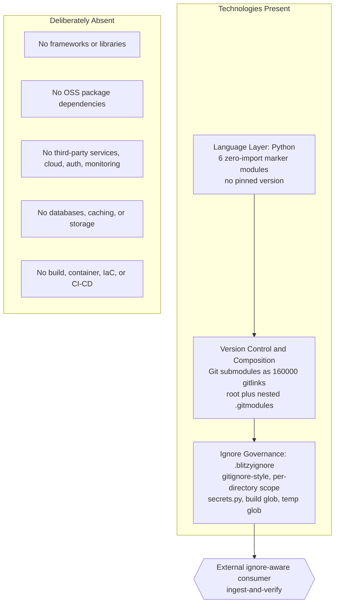
```mermaid
graph TD
    subgraph Present["Technologies Present"]
        LANG["Language Layer: Python<br/>6 zero-import marker modules<br/>no pinned version"]
        VCS["Version Control and Composition<br/>Git submodules as 160000 gitlinks<br/>root plus nested .gitmodules"]
        GOV["Ignore Governance: .blitzyignore<br/>gitignore-style, per-directory scope<br/>secrets.py, build glob, temp glob"]
    end
    subgraph Absent["Deliberately Absent"]
        NF["No frameworks or libraries"]
        ND["No OSS package dependencies"]
        NS["No third-party services, cloud, auth, monitoring"]
        NDB["No databases, caching, or storage"]
        NB["No build, container, IaC, or CI-CD"]
    end
    Consumer{{"External ignore-aware consumer<br/>ingest-and-verify"}}
    LANG --> VCS
    VCS --> GOV
    GOV --> Consumer
```

Cross-references: §1.2 System Overview; §1.3 Scope; §2.6 Assumptions, Constraints, and Requirement Versioning.

## 3.7 References

The following repository artifacts, technical-specification sections, and external sources were examined as evidence for this Technology Stack section. Paths declared in `.blitzyignore` (`secrets.py` at every level, `Vision_CENTRAL/build/`, and `Vision_CENTRAL/nested-utils/temp/`) were intentionally not opened.

**Source files**

- `app.py` — root Python marker module (`main()`); established the language and the import-free, constant-return module pattern.
- `Vision_CENTRAL/service.py` — first-order submodule Python marker (`run()`).
- `Vision_Merchandising/sales.py` — sibling submodule Python marker (`totals()`).
- `Vision_Merchandising/build/report.py` — Python marker (`report()`) confirming the retained (non-leaked) sibling `build/` path.
- `Vision_CENTRAL/nested-utils/util.py` — nested submodule Python marker (`helper()`).
- `Vision_CENTRAL/nested-utils/build/generated.py` — Python marker (`generated()`) confirming the retained (non-leaked) nested `build/` path.

**Configuration & composition files**

- `.gitmodules` (root) — declared the two first-order submodules (`Vision_CENTRAL`, `Vision_Merchandising`) and their public URLs.
- `Vision_CENTRAL/.gitmodules` — declared the nested `nested-utils` submodule and its URL.
- `.blitzyignore` (root) — established the `secrets.py` exclusion rule.
- `Vision_CENTRAL/.blitzyignore` — established the `build/**` exclusion rule.
- `Vision_CENTRAL/nested-utils/.blitzyignore` — established the `temp/**` exclusion rule.

**Folders**

- `Vision_CENTRAL/` — first-order submodule (gitlink `7fee06d`); contained `service.py`, `.gitmodules`, and the `nested-utils/` subtree.
- `Vision_Merchandising/` — first-order submodule (gitlink `8e9b0e2`); contained `sales.py` and the retained `build/` subtree.
- `Vision_CENTRAL/nested-utils/` — nested submodule (gitlink `62d3372`); contained `util.py` and the retained `build/` subtree.

**Technical-specification sections cross-referenced**

- §1.1 Executive Summary / §1.2 System Overview — component roles, three-tier composition, and the no-build/no-runtime verification model.
- §1.3 Scope — in-scope composition and explicitly out-of-scope runtime, persistence, services, and CI/CD.
- §2.6 Assumptions, Constraints, and Requirement Versioning — the zero-external-dependency constraint, gitignore-style matching semantics, the submodule-URL token security constraint, and the v1.0 baseline at superproject HEAD `d16d0c3`.

**External sources**

- [web] Phoronix and the GitHub Blog — confirmed the current stable Git release line (Git 2.55), used only as a tooling baseline reference; the repository itself pins no Git version.

# 4. Process Flowchart

## 4.1 System Workflows

    The `blitzyignore-submodule-test` repository is a **dependency-free verification fixture**, not a runtime application (see §1.2 System Overview, §1.3 Scope, and §3.1 Programming Languages). It exposes no service, API, user interface, scheduler, message bus, or persistence layer; every included Python module is a single zero-argument function that returns one constant marker string with no imports, control flow, I/O, or side effects. Consequently, the workflows documented in this section are the **two processes the repository actually encodes and exercises**, both of which are grounded directly in observed artifacts (the three scoped `.blitzyignore` files, the `.gitmodules` declarations and `160000` gitlinks, and the six marker modules):

1. **The ignore-aware ingest-and-verify process** — the end-to-end journey a consuming tool performs against the fixture (resolve submodules → parse each scoped `.blitzyignore` → build an inclusion set → compare against the encoded expectations). This is the fixture's primary user workflow per §1.3.1.
2. **Git submodule resolution and composition** — the integration by which the root superproject and its component repositories are assembled from pinned gitlinks (§2.1 F-005, §2.3.2).

The consuming tool itself is implemented **outside this repository and is out-of-scope** (§1.3.2, §2.3.4); the fixture's role is to declare the expectations the consumer is measured against. Where the section prompt calls for workflow elements that do not exist in this system (external APIs, event streams, batch jobs, runtime error handling, defined SLAs), that absence is stated explicitly rather than invented, in keeping with the "no runtime surface" constraint recorded in §2.6.2.

### 4.1.1 High-Level System Workflow

The master workflow is the *ingest-and-verify loop* defined in §1.3.1. An ignore-aware **Consumer** (the actor) drives the process; **Git submodule machinery** supplies the composed tree; and the **Fixture** contributes the scoped ignore rules and deterministic markers that are both the input and the oracle. The diagram below uses swim lanes (subgraphs) for these three participants. Start and end points are rounded; decision diamonds are shown; and the terminal `FAIL` branch links to the error/verification-failure handling in §4.4.

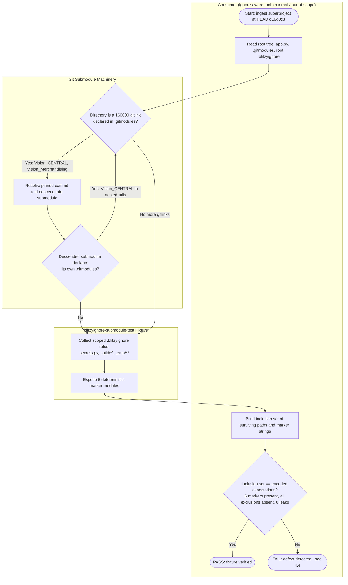
```mermaid
flowchart TD
    subgraph CONSUMER["Consumer (ignore-aware tool, external / out-of-scope)"]
        C1(["Start: ingest superproject at HEAD d16d0c3"])
        C2["Read root tree: app.py, .gitmodules, root .blitzyignore"]
        C3["Build inclusion set of surviving paths and marker strings"]
        C4{"Inclusion set == encoded expectations?<br/>6 markers present, all exclusions absent, 0 leaks"}
        C5(["PASS: fixture verified"])
        C6(["FAIL: defect detected - see 4.4"])
    end
    subgraph GIT["Git Submodule Machinery"]
        G1{"Directory is a 160000 gitlink<br/>declared in .gitmodules?"}
        G2["Resolve pinned commit and descend into submodule"]
        G3{"Descended submodule declares<br/>its own .gitmodules?"}
    end
    subgraph FIXTURE["blitzyignore-submodule-test Fixture"]
        F1["Collect scoped .blitzyignore rules:<br/>secrets.py, build/**, temp/**"]
        F2["Expose 6 deterministic marker modules"]
    end

    C1 --> C2 --> G1
    G1 -->|"Yes: Vision_CENTRAL, Vision_Merchandising"| G2
    G2 --> G3
    G3 -->|"Yes: Vision_CENTRAL to nested-utils"| G1
    G3 -->|No| F1
    G1 -->|No more gitlinks| F1
    F1 --> F2 --> C3 --> C4
    C4 -->|Yes| C5
    C4 -->|No| C6
```

**Actors and system boundaries.** The system boundary encloses only the superproject and its three declared submodules (`Vision_CENTRAL`, `Vision_Merchandising`, `nested-utils`), their marker modules, and the three `.blitzyignore` files (§1.3.1). The Consumer swim lane sits **outside** that boundary. The user touchpoints are not screens but the engineering roles that rely on the outcome — ignore-pipeline engineers, documentation/context agents, QA/verification owners, and security reviewers (§1.3.1).

**Timing and SLA considerations.** No SLAs, latency budgets, or timing constraints are defined anywhere in the repository (§2.6.2). Performance is bounded by the fixture's fixed, small footprint: a three-tier tree with six marker files and three ignore files. Each marker function is an O(1) constant return, and the traversal is a single linear walk over a fixed path set; there are no timed steps, timeouts, or scheduled windows to depict.

### 4.1.2 Core Business Process: Ignore-Aware Inclusion Evaluation

The core "business" logic is the per-path **inclusion/exclusion decision** the Consumer makes for every candidate path it encounters during traversal. This single decision procedure realizes features F-001 through F-004 (§2.1). The flowchart below shows the decision diamonds, the two exclusion outcomes, and the two inclusion outcomes, including the non-leakage branch (F-004) that keeps identically named `build/` directories in other submodules included.

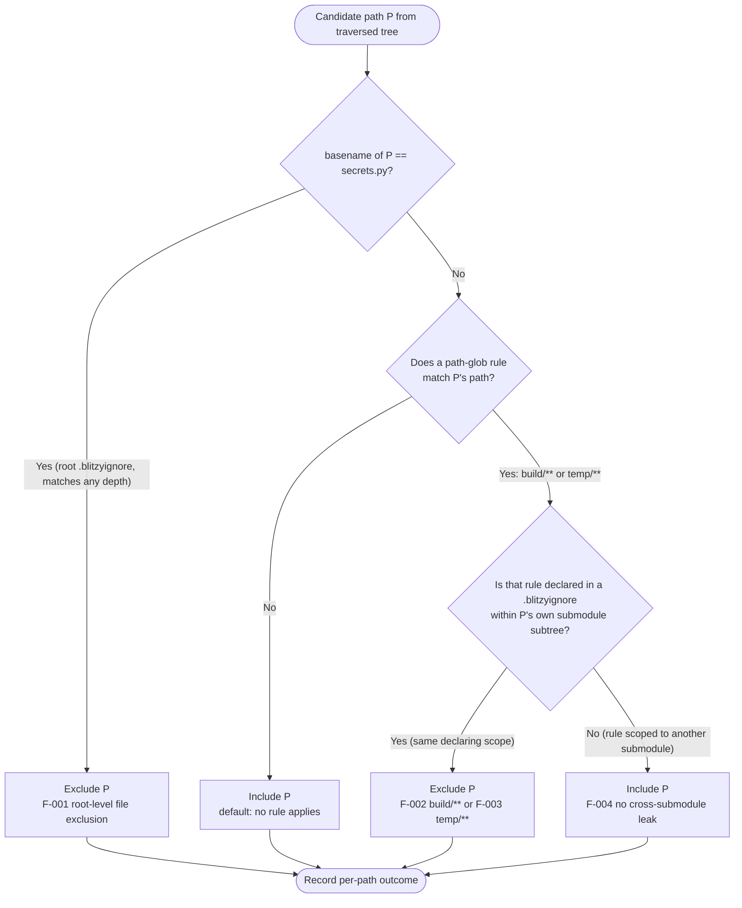
```mermaid
flowchart TD
    Start([Candidate path P from traversed tree]) --> Q1{"basename of P == secrets.py?"}
    Q1 -->|"Yes (root .blitzyignore, matches any depth)"| ExA["Exclude P<br/>F-001 root-level file exclusion"]
    Q1 -->|No| Q2{"Does a path-glob rule<br/>match P's path?"}
    Q2 -->|"No"| InA["Include P<br/>default: no rule applies"]
    Q2 -->|"Yes: build/** or temp/**"| Q3{"Is that rule declared in a .blitzyignore<br/>within P's own submodule subtree?"}
    Q3 -->|"Yes (same declaring scope)"| ExB["Exclude P<br/>F-002 build/** or F-003 temp/**"]
    Q3 -->|"No (rule scoped to another submodule)"| InB["Include P<br/>F-004 no cross-submodule leak"]
    ExA --> Done([Record per-path outcome])
    ExB --> Done
    InA --> Done
    InB --> Done
```

**Decision points explained (evidence and governing requirements).**

| Decision | Rule / Evidence | Outcome | Governing Requirement |
|---|---|---|---|
| `basename(P) == secrets.py`? | Root `.blitzyignore` bare-filename pattern `secrets.py` matches at any depth (§2.6.1) | Exclude `secrets.py` at root, `Vision_CENTRAL/`, and `Vision_Merchandising/` | F-001-RQ-001, F-001-RQ-002 |
| Does a path-glob match `P`? | `Vision_CENTRAL/.blitzyignore` (`build/**`), `nested-utils/.blitzyignore` (`temp/**`) | Candidate for exclusion | F-002-RQ-001, F-003-RQ-001 |
| Is the matching rule declared in `P`'s own subtree? | Each `.blitzyignore` is scoped to its declaring directory (source comments in `generated.py`, `report.py`) | Exclude only within scope; otherwise keep included | F-004-RQ-001, F-004-RQ-002 |

**End-to-end outcome.** Applying this decision to the whole tree yields exactly the inclusion set encoded by the fixture: the six markers are retained, the three `secrets.py` targets plus `Vision_CENTRAL/build/` and `nested-utils/temp/` are suppressed, and the sibling `Vision_Merchandising/build/report.py` and nested `Vision_CENTRAL/nested-utils/build/generated.py` remain included with zero cross-submodule leaks (§1.2.3 KPIs). **Error handling paths** for this process are not runtime exceptions (the fixture raises none) but verification-failure conditions — a leaked exclusion, a missed exclusion, or a skipped submodule — detailed in §4.4.

### 4.1.3 Per-Feature Detailed Process Flows

**Marker-invocation runtime flow (F-006).** The only executable process in the repository is invoking a marker function. It is deliberately trivial and identical for all six markers (`app.py::main`, `Vision_CENTRAL/service.py::run`, `Vision_CENTRAL/nested-utils/util.py::helper`, `Vision_CENTRAL/nested-utils/build/generated.py::generated`, `Vision_Merchandising/sales.py::totals`, `Vision_Merchandising/build/report.py::report`): a call enters a body with a single `return` of a string literal and exits. There is no branching, input parameter, state, or failure mode (F-006-RQ-002).

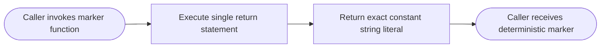
```mermaid
flowchart LR
    Call([Caller invokes marker function]) --> Exec[Execute single return statement]
    Exec --> Ret[Return exact constant string literal]
    Ret --> End([Caller receives deterministic marker])
```

**Per-feature decision flows.** Because the fixture encodes each expected outcome structurally rather than through distinct code paths, the "detailed process flow" for each core feature is the branch of §4.1.2 it exercises against a specific target. The table maps every feature to its governing artifact, the decision branch taken, and the required outcome.

| Feature | Governing Artifact | Decision Branch (from §4.1.2) | Target Path(s) | Required Outcome |
|---|---|---|---|---|
| F-001 Root-level file exclusion | Root `.blitzyignore` → `secrets.py` | `basename == secrets.py` → Exclude | `secrets.py`, `Vision_CENTRAL/secrets.py`, `Vision_Merchandising/secrets.py` | Excluded (not inspected) |
| F-002 First-order dir exclusion | `Vision_CENTRAL/.blitzyignore` → `build/**` | path-glob match, rule in same subtree → Exclude | `Vision_CENTRAL/build/` subtree | Excluded (not inspected) |
| F-003 Nested dir exclusion | `nested-utils/.blitzyignore` → `temp/**` | path-glob match, rule in same subtree → Exclude | `Vision_CENTRAL/nested-utils/temp/` subtree | Excluded (not inspected) |
| F-004 Cross-submodule non-leakage | Scoping of `build/**` | path-glob match, rule in **other** subtree → Include | `Vision_Merchandising/build/report.py`, `Vision_CENTRAL/nested-utils/build/generated.py` | Included |
| F-005 Submodule traversal | `.gitmodules`, gitlinks | (enables traversal; see §4.1.4) | `Vision_CENTRAL`, `Vision_Merchandising`, `nested-utils` | Descended |
| F-006 Marker substrate | Six marker modules | default no-rule → Include | `app.py`, `service.py`, `util.py`, `sales.py` (+ F-004's two) | Included |

### 4.1.4 Integration Workflows: Submodule Resolution and Composition

**Data flow between systems.** The only cross-system integration is Git submodule resolution (§2.3.2). The data that flows is Git metadata, not application payloads: from the root superproject, the Consumer reads `.gitmodules` (each submodule's `path` and public `url`) and the recorded `160000` gitlink (the pinned commit SHA); it then descends into each component repository and reads that repository's own tree, `.blitzyignore`, and — for `Vision_CENTRAL` — its nested `.gitmodules`. The composed tree flows back as the inclusion candidates evaluated in §4.1.2. The sequence diagram captures this traversal across the three-tier composition (pins per §2.6.3: `Vision_CENTRAL`→`7fee06d`, `Vision_Merchandising`→`8e9b0e2`, `nested-utils`→`62d3372`).

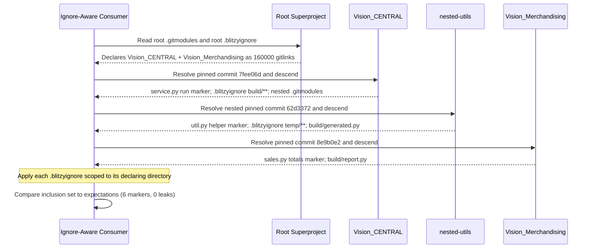
```mermaid
sequenceDiagram
    participant C as Ignore-Aware Consumer
    participant S as Root Superproject
    participant VC as Vision_CENTRAL
    participant NU as nested-utils
    participant VM as Vision_Merchandising

    C->>S: Read root .gitmodules and root .blitzyignore
    S-->>C: Declares Vision_CENTRAL + Vision_Merchandising as 160000 gitlinks
    C->>VC: Resolve pinned commit 7fee06d and descend
    VC-->>C: service.py run marker#59; .blitzyignore build/**#59; nested .gitmodules
    C->>NU: Resolve nested pinned commit 62d3372 and descend
    NU-->>C: util.py helper marker#59; .blitzyignore temp/**#59; build/generated.py
    C->>VM: Resolve pinned commit 8e9b0e2 and descend
    VM-->>C: sales.py totals marker#59; build/report.py
    Note over C: Apply each .blitzyignore scoped to its declaring directory
    C->>C: Compare inclusion set to expectations (6 markers, 0 leaks)
```

**API interactions.** None. The repository exposes and consumes no HTTP/RPC/GraphQL APIs; the `url` values in `.gitmodules` are Git-resolution declarations only and the fixture performs no network calls (§1.3.2). The submodule "interaction" is purely Git's local gitlink resolution.

**Event processing flows.** None. There is no message broker, queue, webhook, or event emitter anywhere in the tree; the marker modules contain no publishers or subscribers (verified: zero imports, zero side effects).

**Batch processing sequences.** No scheduler, cron, or batch job exists. The closest structural analog is the Consumer's **single recursive walk** of the fixed three-tier tree, which is a one-pass traversal rather than a scheduled batch — depicted as the linear descent in the sequence diagram above.

## 4.2 Validation Rules and Flowchart Requirements

The fixture encodes its rules **declaratively** — through the three scoped `.blitzyignore` files, the `.gitmodules`/gitlink declarations, and the six constant marker strings — rather than through executable validation code (there are zero conditionals or assertions in the modules themselves). This section states the business rules applied at each step of the §4.1 workflow, the data-validation semantics that define a correct result, the single security checkpoint present, and an explicit coverage assertion for the flowchart elements the section prompt enumerates. Every rule below is drawn from an observed artifact or a documented requirement (§2.1, §2.2, §2.6.1); items with no basis in the repository are marked *not applicable* rather than invented.

### 4.2.1 Business Rules at Each Workflow Step

The rules that govern each step of the ingest-and-verify traversal (§4.1.1, §4.1.2) are the gitignore-style pattern-matching semantics documented in §2.6.1, scoped per §2.3.2. They are applied in the order the Consumer encounters each construct:

| # | Step (from §4.1) | Business Rule | Governing Requirement |
|---|---|---|---|
| R1 | Encounter a `160000` gitlink | A directory recorded as a gitlink and declared in the enclosing `.gitmodules` MUST be resolved at its pinned commit and traversed (not treated as an opaque file) | F-005-RQ-001, F-005-RQ-002 |
| R2 | Enter a submodule | Each `.blitzyignore` governs ONLY paths within its own declaring directory's subtree; rules never apply to sibling or parent subtrees | F-005-RQ-003, F-004-RQ-001, F-004-RQ-002 |
| R3 | Match a bare-filename pattern | A pattern with no slash (`secrets.py`) matches a file of that basename at **any depth** beneath the declaring directory → exclude | F-001-RQ-001, F-001-RQ-002 |
| R4 | Match a path-bearing glob | A pattern containing a slash (`build/**`, `temp/**`) is **anchored** to the declaring directory; `**` matches all descendants; it does NOT match identically named directories in other subtrees | F-002-RQ-001, F-003-RQ-001 |
| R5 | No rule matches | A path matched by no in-scope pattern is included by default | F-006-RQ-001 |

The decisive interaction is between R3/R4 and R2: `build/**` declared in `Vision_CENTRAL/.blitzyignore` excludes `Vision_CENTRAL/build/` (R4) but, because of scoping (R2), does **not** exclude the sibling `Vision_Merchandising/build/` or the nested `Vision_CENTRAL/nested-utils/build/` — which is exactly the non-leakage property F-004 asserts.

### 4.2.2 Data Validation Requirements

There is no input, form, schema, type, range, or format validation in this repository — the marker functions accept no parameters and process no external data (F-006-RQ-002). The only "data" validated is **path membership in the inclusion set** and **the identity of each surfaced marker string**. The verification oracle is **exact string equality**: each marker's return value is simultaneously the assertion label and its own expected value, so a consumer validates the fixture by comparing the ingested inclusion set against the encoded expected set (§1.2.3, §2.6.1).

A result is judged valid only when all of the following hold (the §1.2.3 KPIs):

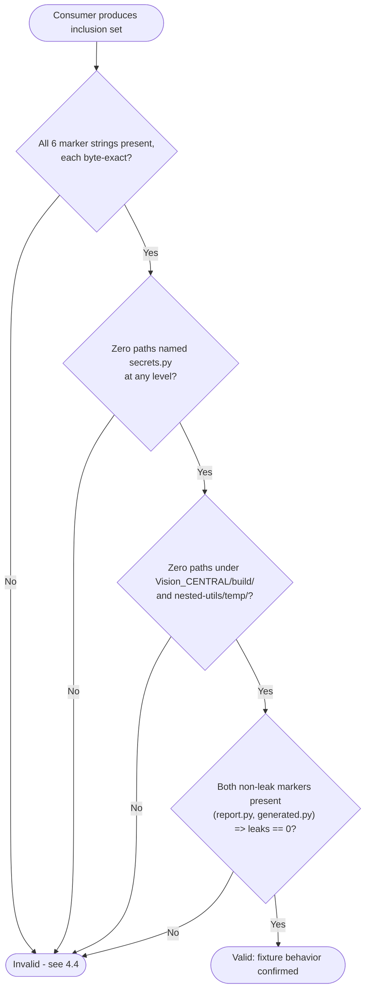
```mermaid
flowchart TD
    G0([Consumer produces inclusion set]) --> G1{"All 6 marker strings present,<br/>each byte-exact?"}
    G1 -->|No| Fail([Invalid - see 4.4])
    G1 -->|Yes| G2{"Zero paths named secrets.py<br/>at any level?"}
    G2 -->|No| Fail
    G2 -->|Yes| G3{"Zero paths under Vision_CENTRAL/build/<br/>and nested-utils/temp/?"}
    G3 -->|No| Fail
    G3 -->|Yes| G4{"Both non-leak markers present<br/>(report.py, generated.py) => leaks == 0?"}
    G4 -->|No| Fail
    G4 -->|Yes| Pass([Valid: fixture behavior confirmed])
```

| Validation gate | Expected value | Evidence / KPI |
|---|---|---|
| Inclusion markers | Exactly 6 byte-exact strings retained | §1.2.3 (6 of 6) |
| Root-file suppression | 0 occurrences of `secrets.py` (3 targets removed) | F-001-RQ-002 |
| Directory suppression | 0 paths under `Vision_CENTRAL/build/` or `nested-utils/temp/` | F-002-RQ-001, F-003-RQ-001 |
| Non-leakage | `report()` and `generated()` markers present → leaks == 0 | F-004-RQ-001, F-004-RQ-002 |

### 4.2.3 Authorization Checkpoints and Regulatory Compliance

**Authorization checkpoints.** The repository implements exactly one security-classified control, and it is a **content-suppression** control rather than an identity/permission gate: feature F-001 (Critical / Security) excludes any file named `secrets.py` at every level of the composition, preventing such files from entering the inclusion set surfaced to a consumer (F-001-RQ-001, F-001-RQ-002). This is the "authorization checkpoint" analog in the flow — a gate that withholds sensitive-by-convention content. Observation confirms it is enforced by the inspection layer: excluded `secrets.py` files are omitted from every directory listing while the six markers are surfaced.

Beyond that single control, there is **no** authentication, authorization, RBAC, permission model, session handling, or access-token validation logic anywhere in the codebase (verified: zero imports, zero control flow, zero side effects across all six modules). The access token that appears in the local clone's Git remote URL is transport credential handling supplied by the execution environment, not part of the repository's documented surface; per the §2.6 security constraint it is never reproduced in this document, and only the clean public `.gitmodules` URLs (`vision-central.git`, `vision-merchandising.git`, `nested-utils.git`) are cited.

**Regulatory compliance checks.** None. No regulatory or compliance regime (e.g., GDPR, HIPAA, PCI-DSS, SOC 2) is referenced, encoded, or checked anywhere in the repository. There is no personal, financial, or health data, and no compliance gate to depict. This absence is stated plainly in keeping with the evidence-only constraint (§2.6.2).

### 4.2.4 Flowchart Requirements Coverage

The section prompt enumerates a set of elements every major workflow diagram should contain. Because this system has no runtime surface, several of those elements have no basis in the repository; the table below asserts, element by element, whether the element is represented in §4.1/§4.3/§4.4 and — where it is not — states plainly that it does not exist here.

| Required flowchart element | Represented? | Where / Rationale |
|---|---|---|
| Start and end points | Yes | Stadium start/PASS/FAIL nodes in §4.1.1; Start/End in §4.1.3 |
| Process steps | Yes | Rectangular steps across §4.1.1, §4.1.2, §4.1.3 |
| Decision diamonds | Yes | Gitlink? / nested-.gitmodules? / set-matches? (§4.1.1); three per-path diamonds (§4.1.2); four validation gates (§4.2.2) |
| System boundaries | Yes | Swim-lane subgraphs (Consumer / Git machinery / Fixture) in §4.1.1 |
| User touchpoints | Roles only | Engineering roles (ignore-pipeline engineers, documentation/context agents, QA, security reviewers) — no UI exists; documented in §4.1.1 |
| Swim lanes for actors/systems | Yes | Three lanes in §4.1.1; five participants in the §4.1.4 sequence diagram |
| Error states and recovery paths | Yes | FAIL branch (§4.1.1) and the verification-failure/recovery flow in §4.4 |
| Timing and SLA considerations | Not applicable | No SLAs, latency budgets, timeouts, or schedules are defined anywhere (§2.6.2); operations are O(1)/single-pass over a fixed tree |
| Regulatory compliance checks | Not applicable | No compliance regime exists in the repository (§4.2.3) |

## 4.3 State Management and Transaction Boundaries

This system holds **no runtime state**: the six marker modules declare no variables, mutate no data, open no files, and reach no database or cache (verified: zero imports, zero assignments beyond the constant return, zero side effects). "State management" therefore describes two design-time/traversal-time state machines that the fixture's structure implies — the **classification state** each candidate path moves through during the §4.1.2 evaluation, and the **resolution state** of each Git submodule (§4.1.4) — followed by an honest account of where data is persisted and why there are no caches or transactions to manage.

### 4.3.1 Path Classification State Transitions

Every candidate path discovered during traversal moves through a small, terminal state machine. It begins *Undecided*, and the single decision procedure of §4.1.2 drives it to exactly one terminal state — *Included* (surfaced to the consumer, with its marker string) or *Excluded* (suppressed). The states are mutually exclusive and never revisited within a single evaluation pass.

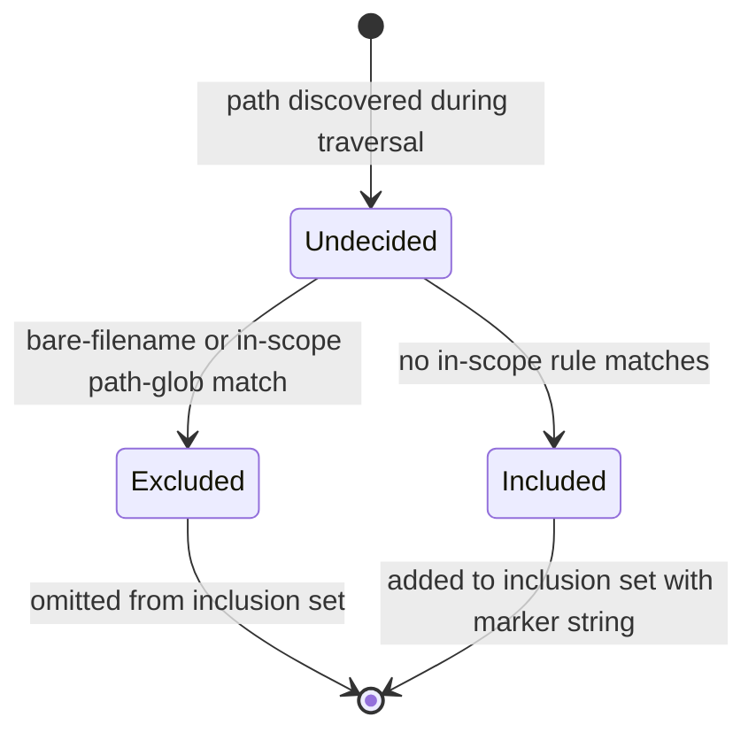
```mermaid
stateDiagram-v2
    [*] --> Undecided: path discovered during traversal
    Undecided --> Excluded: bare-filename or in-scope path-glob match
    Undecided --> Included: no in-scope rule matches
    Excluded --> [*]: omitted from inclusion set
    Included --> [*]: added to inclusion set with marker string
```

The transition guards are precisely the business rules R3, R4, and R5 of §4.2.1. The important asymmetry is that an out-of-scope glob match (e.g., `build/**` evaluated against `Vision_Merchandising/build/report.py`) does **not** fire the `Undecided → Excluded` transition, leaving the default `Undecided → Included` path — the mechanism behind F-004 non-leakage.

### 4.3.2 Submodule Resolution State Transitions

Each component repository progresses through a resolution lifecycle before its paths can be classified. A submodule is first *Declared* (an entry in the enclosing `.gitmodules`), then *Pinned* (recorded in the superproject tree as a `160000` gitlink at an exact commit), then *CheckedOut* (that commit materialized in the working tree), and finally *Traversed* (descended into, with its own `.blitzyignore` parsed in scope). Only when a submodule reaches *Traversed* do its paths enter the §4.3.1 classifier.

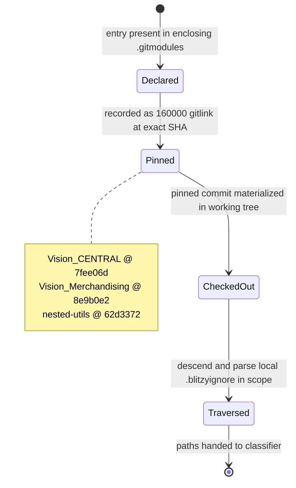
```mermaid
stateDiagram-v2
    [*] --> Declared: entry present in enclosing .gitmodules
    Declared --> Pinned: recorded as 160000 gitlink at exact SHA
    Pinned --> CheckedOut: pinned commit materialized in working tree
    CheckedOut --> Traversed: descend and parse local .blitzyignore in scope
    Traversed --> [*]: paths handed to classifier
    note right of Pinned
        Vision_CENTRAL @ 7fee06d
        Vision_Merchandising @ 8e9b0e2
        nested-utils @ 62d3372
    end note
```

This lifecycle runs once per submodule and recurses for the nested tier: `Vision_CENTRAL` reaching *Traversed* is what exposes its own `.gitmodules`, which starts a fresh *Declared → … → Traversed* cycle for `nested-utils` (F-005-RQ-002). The pinned SHAs are the fixed, reproducible inputs recorded at superproject `HEAD d16d0c3`.

### 4.3.3 Data Persistence, Caching, and Transaction Boundaries

**Persistence points.** All durable state lives in Git, not in any runtime store. Three persistence points exist:

| Persistence point | What is stored | Evidence |
|---|---|---|
| Git object store | Commits, trees, and blobs for the superproject and each submodule | Repository history (root: `3dbe53c` → `7896094` → `d16d0c3`) |
| Pinned gitlinks | The exact submodule commit SHAs recorded in the superproject tree | `160000` entries: VC `7fee06d`, VM `8e9b0e2`, nested-utils `62d3372` |
| Working-tree files | The `.py` sources, three `.blitzyignore` files, two `.gitmodules` | On-disk fixed three-tier tree |

The marker strings themselves are persisted as **source literals** inside each `def` — there is no serialization, database row, or state file. There is **no** application database, key-value store, object storage, or runtime persistence layer of any kind.

**Caching requirements.** None. There is no cache layer, no memoization, and no need for either: every marker function is an O(1) constant-string return, and traversal is a single linear pass over a fixed, small path set (§4.1.1). No cache invalidation, TTL, or warm-up behavior exists to document.

**Transaction boundaries.** There are no ACID/database transactions, no multi-step commit/rollback logic, and no distributed-transaction coordination in the codebase. The only consistency boundary present is **Git's own atomic commit**: the superproject commit `d16d0c3` atomically fixes the complete set of submodule pins, so the composed three-tier tree is reproducible as a single unit. Each commit is therefore the effective "transaction" — the smallest unit that either fully defines the composition or does not. No finer-grained transactional boundary is applicable to a fixture with no mutable runtime state.

## 4.4 Error Handling and Recovery

Because the six marker modules contain zero imports, zero control flow, and zero side effects, there is **no runtime error handling in the codebase** — no `try`/`except`, no retry loop, no fallback branch, and no notification/logging call anywhere. Rather than invent behavior that does not exist, this section documents error handling in the only sense that applies to a verification fixture: the **detection of, and recovery from, verification failures** in a consuming ignore-aware tool. This is the destination of the failure branches raised earlier — the `FAIL` terminal of §4.1.1, the negative decision paths of §4.1.2, and the `Invalid - see 4.4` gate of §4.2.2 all resolve here.

### 4.4.1 Absence of Runtime Error Handling

The fixture defines no runtime error-handling constructs, and none are needed: each marker is a deterministic, zero-argument constant-string return that cannot raise a domain error.

| Mechanism the prompt asks about | Present in code? | Evidence / substitute |
|---|---|---|
| Exception handling (`try`/`except`) | No | Zero control-flow keywords across all six modules |
| Retry mechanisms | No | No loops, no I/O, nothing transient to retry |
| Fallback / degraded-mode processes | No | Verification is binary pass/fail; no alternate path exists |
| Error notification flows (logging/alerting) | No | No logging, no imports, no external sinks |

Consequently, "error handling" for this repository is not a property of the fixture's own execution but of the **verification workflow that consumes it** (§4.1.1). The remaining sub-sections document that workflow's failure detection and recovery.

### 4.4.2 Verification-Failure Modes and Detection

A verification run fails whenever a consumer's inclusion set diverges from the encoded expectations. The failure surfaces at one of the four validation gates of §4.2.2, and each gate isolates a distinct defect class. The most consequential defects are the anti-patterns the fixture was built to catch: treating scoped `.blitzyignore` rules as global, flattening submodules instead of descending into gitlinks, and matching a path-glob such as `build/**` against every identically named directory.

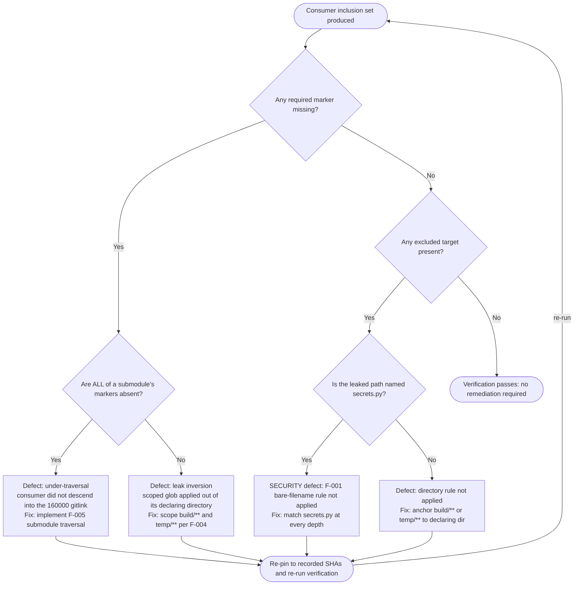
```mermaid
flowchart TD
    E0([Consumer inclusion set produced]) --> E1{"Any required marker missing?"}
    E1 -->|Yes| D1{"Are ALL of a submodule's markers absent?"}
    D1 -->|Yes| R1["Defect: under-traversal<br/>consumer did not descend into the 160000 gitlink<br/>Fix: implement F-005 submodule traversal"]
    D1 -->|No| R2["Defect: leak inversion<br/>scoped glob applied out of its declaring directory<br/>Fix: scope build/** and temp/** per F-004"]
    E1 -->|No| E2{"Any excluded target present?"}
    E2 -->|Yes| D2{"Is the leaked path named secrets.py?"}
    D2 -->|Yes| R3["SECURITY defect: F-001 bare-filename rule not applied<br/>Fix: match secrets.py at every depth"]
    D2 -->|No| R4["Defect: directory rule not applied<br/>Fix: anchor build/** or temp/** to declaring dir"]
    E2 -->|No| PASS([Verification passes: no remediation required])
    R1 --> RE([Re-pin to recorded SHAs and re-run verification])
    R2 --> RE
    R3 --> RE
    R4 --> RE
    RE -->|re-run| E0
```

The mapping between the §4.2.2 gates and the defect classes is summarized below:

| Failure symptom | Detecting gate (§4.2.2) | Root-cause defect | Violated requirement |
|---|---|---|---|
| A required marker missing | G1 (6 markers byte-exact) | Under-traversal, or scoped glob applied too broadly | F-005-RQ-001/002, F-004 |
| `secrets.py` present in the set | G2 (0 `secrets.py`) | Bare-filename rule not applied at all depths | F-001-RQ-001/002 |
| A path under `build/` or `temp/` present | G3 (0 suppressed-dir paths) | Directory glob not anchored/applied | F-002-RQ-001, F-003-RQ-001 |
| `report()` or `generated()` marker missing | G4 (leaks == 0) | Sibling/nested dir wrongly excluded (leak inversion) | F-004-RQ-001/002 |

### 4.4.3 Recovery Procedures

Recovery is a **manual engineering loop**, not an automated one — the fixture contains no self-healing code. Because each marker string is simultaneously the assertion label and its own expected value (§4.2.2), a failed comparison is self-describing: it names exactly which expectation was unmet, which is the only "error notification" analog present in the system. There is no automated alerting, retry scheduler, or fallback service to configure.

The recovery procedure, driven by the §4.4.2 detection flow, is:

1. **Diagnose.** Identify which validation gate failed and read off the defect class from the §4.4.2 table.
2. **Remediate the consumer.** Fix the offending logic in the consuming tool — implement gitlink descent (F-005), scope each `.blitzyignore` to its declaring directory (F-004), or correct the pattern-matching semantics (F-001/F-002/F-003).
3. **Re-establish the composition.** If a submodule pointer has drifted, re-pin each submodule to its recorded SHA (`Vision_CENTRAL` `7fee06d`, `Vision_Merchandising` `8e9b0e2`, `nested-utils` `62d3372`) so the reproducible tree fixed by superproject commit `d16d0c3` is restored.
4. **Re-run.** Repeat verification (the `re-run` edge in §4.4.2) until all four gates pass — 6 of 6 markers present, all exclusion targets suppressed, and 0 cross-submodule leaks (§1.2.3).

There is no partial-success or rollback state: a run either satisfies every gate or is remediated and re-run in full. This all-or-nothing recovery model mirrors the atomic-commit consistency boundary described in §4.3.3.

## 4.5 References

The following repository artifacts and Technical Specification sections were cited as evidence for Section 4. Excluded paths are listed **by path only**; their contents were never viewed, honoring the governing `.blitzyignore` files. No credential material is reproduced — only the clean public repository names from `.gitmodules` are cited.

**Included source files (the six inclusion markers)**

- `app.py` - root superproject marker `main()`; the always-included root path
- `Vision_CENTRAL/service.py` - first-order submodule marker `run()`
- `Vision_CENTRAL/nested-utils/util.py` - nested submodule marker `helper()`
- `Vision_CENTRAL/nested-utils/build/generated.py` - non-leak marker `generated()`; proves `build/**` does not leak into the nested tier
- `Vision_Merchandising/sales.py` - first-order submodule marker `totals()`
- `Vision_Merchandising/build/report.py` - non-leak marker `report()`; proves the sibling `build/` is not excluded

**Ignore-rule and submodule-declaration files**

- `.blitzyignore` (root) - bare-filename rule `secrets.py` (F-001), matching at any depth
- `Vision_CENTRAL/.blitzyignore` - anchored path-glob rule `build/**` (F-002)
- `Vision_CENTRAL/nested-utils/.blitzyignore` - anchored path-glob rule `temp/**` (F-003)
- `.gitmodules` (root) - declares the `Vision_CENTRAL` and `Vision_Merchandising` submodules (public URLs `vision-central.git`, `vision-merchandising.git`)
- `Vision_CENTRAL/.gitmodules` - declares the nested `nested-utils` submodule (public URL `nested-utils.git`)

**Folders (submodule composition)**

- `Vision_CENTRAL/` - first-order submodule, pinned at gitlink `7fee06d`
- `Vision_Merchandising/` - first-order submodule, pinned at gitlink `8e9b0e2`
- `Vision_CENTRAL/nested-utils/` - nested (second-tier) submodule, pinned at gitlink `62d3372`
- `Vision_Merchandising/build/` - included directory demonstrating cross-submodule non-leakage (F-004)
- `Vision_CENTRAL/nested-utils/build/` - included directory demonstrating cross-submodule non-leakage (F-004)

**Exclusion targets (paths/patterns only; contents never viewed)**

- `secrets.py` (basename, any depth) - F-001 suppression target
- `Vision_CENTRAL/build/` - F-002 suppression target
- `Vision_CENTRAL/nested-utils/temp/` - F-003 suppression target

**Repository metadata**

- Git submodule pins (`160000` gitlinks) and superproject history `3dbe53c` → `7896094` → `d16d0c3` - established the reproducible, atomically pinned three-tier composition documented in §4.3

**Cross-referenced Technical Specification sections**

- §1.2.2 System Overview (structural composition and consumer anti-patterns) - source of the high-level composition and failure modes in §4.1/§4.4
- §1.2.3 System Overview (success-criteria KPIs) - the 6-of-6 / 0-leak validation gates in §4.2.2 and §4.4.3
- §2.1 Feature Catalog - features F-001 through F-006 and their criticality
- §2.2 Functional Requirements - the `F-00x-RQ-00y` requirement IDs mapped throughout §4.2 and §4.4
- §2.3.1 Feature Relationships (dependency map) - traversal-prerequisite and measured-against relationships
- §2.3.2 Feature Relationships (integration points) - the three integration points framing §4.1.4
- §2.6.1 Assumptions, Constraints, and Requirement Versioning - the gitignore-style pattern-matching semantics governing §4.2.1
- §2.6.2 Assumptions, Constraints, and Requirement Versioning - the evidence-only / no-SLA constraint underpinning the "not applicable" determinations in §4.2.4

# 5. System Architecture

## 5.1 High-Level Architecture

The `blitzyignore-submodule-test` repository is a **hierarchical Git-submodule composite** rather than a runtime application. It is a deliberately dependency-free verification fixture (see §1.2 System Overview and §2.1 Feature Catalog) whose "architecture" is the *composition topology* of a root superproject plus three submodules and the *per-directory ignore policy* layered over that topology. This section documents that architecture from a systems perspective: its style and rationale, its core components and their relationships, how data flows through it, and its external integration points. Every claim is grounded in observed artifacts — the root and `Vision_CENTRAL/.gitmodules` files, the three scoped `.blitzyignore` files, the pinned `160000` gitlinks, and the six constant-returning Python marker modules.

### 5.1.1 System Overview

**Overall architecture style and rationale.** The system is composed as a *superproject-of-submodules*: a root superproject (`blitzyignore-submodule-test`) aggregates independently versioned component repositories instead of embedding a single monolithic codebase. The root `.gitmodules` declares two first-order submodules — `Vision_CENTRAL` and `Vision_Merchandising` — and `Vision_CENTRAL/.gitmodules` declares a third, nested submodule, `nested-utils`, yielding a **three-tier composition** (root → `Vision_CENTRAL` → `nested-utils`; root → `Vision_Merchandising`). This style is chosen deliberately: the system's purpose is to reproduce, in minimal and fully deterministic form, the multi-repository topology under which ignore-rule scoping is hardest to implement correctly, so the composition itself *is* the product.

Because there is no service, API, scheduler, or persistence layer anywhere in the tree, the operative style is best described as a **declarative-policy plus composite-repository architecture**: structure and behavior are expressed as *data* — gitlink pointers in `.gitmodules`, glob rules in `.blitzyignore`, and constant strings returned by the marker modules — rather than as executing logic. All six included modules (`app.py`, `Vision_CENTRAL/service.py`, `Vision_CENTRAL/nested-utils/util.py`, `Vision_CENTRAL/nested-utils/build/generated.py`, `Vision_Merchandising/sales.py`, `Vision_Merchandising/build/report.py`) are single zero-argument functions that return a fixed string with no imports, control flow, I/O, or side effects.

**Key architectural principles and patterns.**

- **Composition over implementation (Composite / Aggregator).** The tree is assembled from pinned `160000` gitlinks; each submodule is an independent repository with its own `.git` pointer (`Vision_CENTRAL/.git`, `Vision_Merchandising/.git`, `Vision_CENTRAL/nested-utils/.git`) and history.
- **Locality of policy (scoped, cascading configuration).** Each `.blitzyignore` governs only the subtree of the directory that declares it — root declares `secrets.py`, `Vision_CENTRAL` declares `build/**`, and `nested-utils` declares `temp/**` — analogous to cascading `.gitignore` semantics.
- **Boundary isolation / non-leakage.** Identically named directories in different submodule scopes are evaluated independently; this namesake correctness property (F-004) is proven by the retained sibling (`Vision_Merchandising/build/report.py`) and nested (`Vision_CENTRAL/nested-utils/build/generated.py`) markers.
- **Determinism and immutability.** Submodules are pinned to exact commits and markers are pure constant returns, so a correct consumer derives one reproducible inclusion set.
- **Self-describing oracle (Marker pattern).** Each module's return string is simultaneously its assertion label and its expected value, giving a build-free, dependency-free pass/fail oracle (F-006).

**System boundaries and major interfaces.** The system boundary encloses the superproject, its three declared submodules, the six marker modules, and the three `.blitzyignore` files. Two participant classes sit **outside** the boundary: (a) the ignore-aware **Consumer** — documentation generators, indexers, and context-collection agents that walk and filter the tree, which is external and out-of-scope per §1.3.2 and §2.3.4; and (b) the **GitHub remotes** from which the submodules resolve. Three interfaces connect these participants to the system:

1. **Git submodule interface** — `.gitmodules` entries (submodule `path` and public `url`) plus the recorded `160000` gitlink commit SHAs; this is how the tree is composed and traversed (F-005).
2. **`.blitzyignore` policy interface** — declarative glob rules parsed and applied by the Consumer, scoped to each declaring directory.
3. **Python marker interface** — six zero-argument functions returning constant strings, read as the verification oracle (F-006).

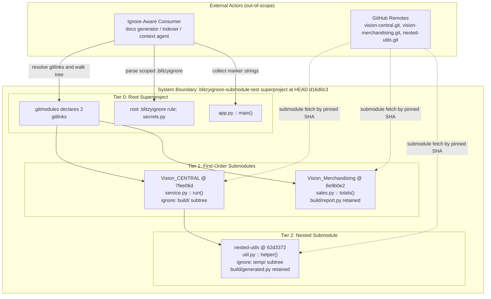
```mermaid
flowchart TB
    subgraph EXT["External Actors (out-of-scope)"]
        CONS["Ignore-Aware Consumer<br/>docs generator / indexer / context agent"]
        GH["GitHub Remotes<br/>vision-central.git, vision-merchandising.git, nested-utils.git"]
    end
    subgraph SYS["System Boundary: blitzyignore-submodule-test superproject at HEAD d16d0c3"]
        subgraph T0["Tier 0: Root Superproject"]
            R1["app.py :: main()"]
            R2[".gitmodules declares 2 gitlinks"]
            R3["root .blitzyignore rule: secrets.py"]
        end
        subgraph T1["Tier 1: First-Order Submodules"]
            VC["Vision_CENTRAL @ 7fee06d<br/>service.py :: run()<br/>ignore: build/ subtree"]
            VM["Vision_Merchandising @ 8e9b0e2<br/>sales.py :: totals()<br/>build/report.py retained"]
        end
        subgraph T2["Tier 2: Nested Submodule"]
            NU["nested-utils @ 62d3372<br/>util.py :: helper()<br/>ignore: temp/ subtree<br/>build/generated.py retained"]
        end
    end

    CONS -->|"resolve gitlinks and walk tree"| R2
    CONS -->|"parse scoped .blitzyignore"| R3
    CONS -->|"collect marker strings"| R1
    GH -.->|"submodule fetch by pinned SHA"| VC
    GH -.->|"submodule fetch by pinned SHA"| VM
    GH -.->|"submodule fetch by pinned SHA"| NU
    R2 --> VC
    R2 --> VM
    VC --> NU
```

### 5.1.2 Core Components

The system decomposes into six core components: the root superproject, the three submodules, the cross-cutting `.blitzyignore` policy set, and the cross-cutting inclusion-marker substrate. Because the section format limits tables to four columns, the requested component attributes are split across two complementary tables — the first covering responsibility and dependencies, the second covering integration points and critical considerations.

**Core Components — Responsibility and Dependencies**

| Component | Primary Responsibility | Key Dependencies |
|---|---|---|
| Root superproject (`blitzyignore-submodule-test`) | Compose the tree; host `app.py::main()`, the root `.blitzyignore` (`secrets.py`), and the two first-order gitlinks | Git submodule machinery; root `.gitmodules` |
| `Vision_CENTRAL` submodule (`7fee06d`) | Provide `service.py::run()`; declare `build/**` exclusion; host the nested `nested-utils` gitlink | Root gitlink; `Vision_CENTRAL/.gitmodules`; `nested-utils` submodule |
| `nested-utils` nested submodule (`62d3372`) | Provide `util.py::helper()`; declare `temp/**` exclusion; retain `build/generated.py` non-leak control | Reached only via `Vision_CENTRAL` (two-level nesting) |
| `Vision_Merchandising` submodule (`8e9b0e2`) | Provide `sales.py::totals()`; retain `build/report.py` non-leak control | Root gitlink |
| `.blitzyignore` policy set (3 files) | Declare scoped exclusion rules `secrets.py`, `build/**`, `temp/**` | Declaring directories; ignore-aware Consumer |
| Inclusion-marker substrate (6 modules) | Encode expected inclusion outcomes as constant strings (the oracle) | Python source syntax only — no imports or frameworks |

**Core Components — Integration Points and Critical Considerations**

| Component | Integration Points | Critical Considerations |
|---|---|---|
| Root superproject | Consumer entry point at HEAD `d16d0c3`; gitlinks into `Vision_CENTRAL` and `Vision_Merchandising` | Bare-filename `secrets.py` rule must suppress at every depth (security control, F-001) |
| `Vision_CENTRAL` submodule | Linked from root; links downward into `nested-utils`; `build/**` scoped to its own subtree | Its `build/**` rule must NOT leak into sibling or nested scopes (F-004) |
| `nested-utils` nested submodule | Reachable only after descending two submodule boundaries via `Vision_CENTRAL` | Consumer must traverse the nested tier; `build/generated.py` must stay included |
| `Vision_Merchandising` submodule | Linked from root; has no nested submodule and no local `.blitzyignore` | `build/report.py` must stay included despite `Vision_CENTRAL`'s `build/**` |
| `.blitzyignore` policy set | Parsed by the Consumer, evaluated per declaring directory | Bare filename vs. path-glob semantics differ (any-depth vs. subtree-anchored) |
| Inclusion-marker substrate | Consumed by the Consumer's inclusion-set comparison | Byte-exact strings; no runtime or harness — a pure text oracle |

### 5.1.3 Data Flow Description

**Primary data flows.** The system carries no application payloads; the only data in motion is Git composition metadata and policy/marker text. During the ingest-and-verify pass (§4.1.1), the Consumer reads the superproject's root tree — `app.py`, `.gitmodules`, and the root `.blitzyignore` — then follows each `160000` gitlink into its pinned submodule commit, descending two tiers (root → `Vision_CENTRAL` → `nested-utils`, and root → `Vision_Merchandising`). From each tier it reads that repository's tree, its local `.blitzyignore`, and — for `Vision_CENTRAL` — its nested `.gitmodules`. The composed path set flows back to the Consumer as the inclusion candidates it will filter and compare.

**Integration patterns and protocols.** The single cross-system integration is **Git submodule resolution**, a local gitlink-resolution mechanism; the `url` values in `.gitmodules` (`vision-central.git`, `vision-merchandising.git`, `nested-utils.git` under `github.com/Adarsh26062002`) are declarations for `git submodule` fetch/clone only. There are no HTTP/RPC/GraphQL APIs, no message brokers or queues, and no runtime network calls (§4.1.4). Policy is consumed via a filesystem-walk-plus-glob-match pattern, and markers are read as source text — not executed — for verification.

**Data transformation points.** Three transformations occur along the flow: (1) **composition assembly** — the independent submodule trees are inlined into one unified path namespace through gitlink resolution; (2) **inclusion/exclusion filtering** — the raw path set is transformed into a filtered inclusion set by applying each scoped `.blitzyignore` (the per-path decision procedure of §4.1.2), suppressing the three `secrets.py` targets, the `Vision_CENTRAL/build/` subtree, and the `nested-utils/temp/` subtree; and (3) **oracle evaluation** — each surviving marker module maps to its constant string, which is compared against the encoded expectations.

**Key data stores and caches.** There is no application datastore, database, or cache — the system defines none (§3.5, §4.3.3). The only durable stores are Git's own: the object store under `.git/modules/…` that holds each submodule's pinned commit, and the working-tree files themselves. Incidental `__pycache__/` bytecode artifacts (for example `app.cpython-312.pyc`) may appear when a marker is executed by CPython but are not source-tracked state. No caching layer, session store, or runtime persistence exists anywhere in the tree.

### 5.1.4 External Integration Points

The system integrates with exactly two classes of external entity: the GitHub remotes that back the three submodules, and the ignore-aware Consumer that ingests the tree. All submodule integrations are one-way, read-only, pinned-commit resolutions; the Consumer integration is a read-only tree walk. The "SLA Requirements" attribute requested by the prompt is addressed in the note below the table because no such requirements exist to tabulate.

| System Name | Integration Type | Data Exchange Pattern | Protocol / Format |
|---|---|---|---|
| GitHub remote `vision-central.git` | First-order Git submodule source (F-005) | One-way fetch/clone at pinned SHA `7fee06d` | HTTPS Git transport; `.gitmodules` INI |
| GitHub remote `vision-merchandising.git` | First-order Git submodule source (F-005) | One-way fetch/clone at pinned SHA `8e9b0e2` | HTTPS Git transport; `.gitmodules` INI |
| GitHub remote `nested-utils.git` | Nested Git submodule source, declared in `Vision_CENTRAL` | One-way fetch/clone at pinned SHA `62d3372` | HTTPS Git transport; `.gitmodules` INI |
| Ignore-aware Consumer (external, out-of-scope) | `.blitzyignore` policy ingestion | Read-only tree walk producing an inclusion set | `.blitzyignore` glob patterns; Python source text |

**SLA requirements.** No SLA requirements are defined for any of these integration points. The repository specifies no latency, throughput, availability, or freshness targets anywhere (§2.6.2). Submodule resolution is a local, one-pass operation over a fixed, small three-tier tree, and the Consumer's verification is a single deterministic set comparison; accordingly, the SLA dimension is documented as **not applicable** rather than invented. For security, only the clean public submodule URLs from `.gitmodules` are cited here; no credential-bearing remote URL is reproduced.

## 5.2 Component Details

This section details each major component identified in §5.1.2. Because the system is a dependency-free composition fixture, every component's "technology" is limited to Git submodule machinery, `.blitzyignore` glob files, and zero-import Python 3 source; every "API" is either a zero-argument marker function or a declarative Git/ignore interface; and no component defines runtime persistence, so the persistence discussion is confined to Git's own object store. These uniform characteristics are stated per component rather than assumed, and the three required diagrams (component interaction, state transition, sequence) follow in §5.2.7.

### 5.2.1 Root Superproject

- **Purpose and responsibilities.** The composition root that anchors the entire fixture at superproject HEAD `d16d0c3`. It hosts the root inclusion marker `app.py::main()`, the root `.blitzyignore` (`secrets.py`), and the two first-order gitlinks, and it establishes the outermost ignore scope and the Consumer's traversal entry point (F-005).
- **Technologies and frameworks.** A Git superproject defined by the root `.gitmodules`, plus a single Python 3-compatible module (`app.py`). No frameworks and no third-party dependencies (zero imports).
- **Key interfaces and APIs.** The marker API `main()` returns the constant `"root: always included"`. The Git submodule interface is the root `.gitmodules`, which declares `Vision_CENTRAL` and `Vision_Merchandising` with their public URLs and records them as `160000` gitlinks. No network API is exposed.
- **Data persistence requirements.** None beyond Git itself: the superproject commit history (`3dbe53c` → `7896094` → `d16d0c3`) and the recorded gitlink SHAs are the only persisted state. No database or runtime storage.
- **Scaling considerations.** Fixed footprint — exactly two first-order submodules and one marker. Traversal cost is proportional to the number of gitlinks (constant here); "scaling" would be a manual `.gitmodules` edit rather than a runtime concern.

### 5.2.2 Vision_CENTRAL Submodule

- **Purpose and responsibilities.** A first-order component repository pinned at `7fee06d`. It provides `service.py::run()`, declares the `build/**` exclusion whose scoping is the fixture's namesake correctness test, and hosts the nested `nested-utils` submodule (the tier-2 link).
- **Technologies and frameworks.** An independent Git repository (its own gitlink pointer `Vision_CENTRAL/.git` → `../.git/modules/Vision_CENTRAL`), a `Vision_CENTRAL/.gitmodules` declaring `nested-utils`, and zero-import Python 3 source.
- **Key interfaces and APIs.** `run()` returns `"vision-central: always included"`. The `Vision_CENTRAL/.blitzyignore` policy interface declares `build/**`; the nested Git submodule interface (`Vision_CENTRAL/.gitmodules`) declares the `nested-utils` public URL and pins gitlink `62d3372`.
- **Data persistence requirements.** The submodule's Git object store, pinned at commit `7fee06d`. The path `Vision_CENTRAL/build/output.py` exists on disk but is suppressed by the local `build/**` rule and was not inspected. No runtime persistence.
- **Scaling considerations.** Introduces exactly one downstream traversal boundary (the nested submodule). Two-level nesting is the maximum observed depth; there is no runtime scaling behavior.

### 5.2.3 nested-utils Nested Submodule

- **Purpose and responsibilities.** The deepest tier (tier 2), pinned at `62d3372` and reachable only through `Vision_CENTRAL`. It provides `util.py::helper()`, declares the `temp/**` exclusion, and retains `build/generated.py` as the **nested** non-leakage control (F-004).
- **Technologies and frameworks.** An independent Git repository (gitlink pointer `Vision_CENTRAL/nested-utils/.git` → `../../.git/modules/Vision_CENTRAL/modules/nested-utils`) and zero-import Python 3 source.
- **Key interfaces and APIs.** `helper()` returns `"nested-utils: always included"`; `generated()` returns `"nested-utils/build: included (proves no cross-submodule leak)"`. The `nested-utils/.blitzyignore` policy interface declares `temp/**`.
- **Data persistence requirements.** The submodule's Git object store, pinned at `62d3372`. The path `nested-utils/temp/cache.py` exists but is suppressed by `temp/**` and was not inspected. Notably, `git submodule status --recursive` shows this gitlink with a leading `-` (not fully initialized at the gitlink level) even though its working-tree files are present. No runtime persistence.
- **Scaling considerations.** A terminal tier — it declares no further submodules, fixing the composition depth at two. Its role is to prove the Consumer descends both boundaries and that the parent's `build/**` does not reach here.

### 5.2.4 Vision_Merchandising Submodule

- **Purpose and responsibilities.** The sibling first-order component pinned at `8e9b0e2`. It provides `sales.py::totals()` and retains `build/report.py` as the **sibling** non-leakage control (F-004). It has no nested submodule and no local `.blitzyignore`.
- **Technologies and frameworks.** An independent Git repository (gitlink pointer `Vision_Merchandising/.git` → `../.git/modules/Vision_Merchandising`) and zero-import Python 3 source; it declares no `.gitmodules` of its own.
- **Key interfaces and APIs.** `totals()` returns `"vision-merchandising: always included"`; `report()` returns `"vision-merchandising/build: included (proves no cross-submodule leak)"`. No policy interface is declared within this submodule.
- **Data persistence requirements.** The submodule's Git object store, pinned at `8e9b0e2`. Its `build/` directory is **included** (no rule covers it); a `secrets.py` present in this submodule is suppressed by the root bare-filename rule and was not inspected. No runtime persistence.
- **Scaling considerations.** A flat single-tier component. Its `build/` directory is deliberately retained to demonstrate that this sibling scope is unaffected by `Vision_CENTRAL`'s `build/**`.

### 5.2.5 .blitzyignore Policy Set

- **Purpose and responsibilities.** The cross-cutting configuration component — three declarative ignore files that encode the exclusion behavior the fixture verifies: root `secrets.py` (F-001), `Vision_CENTRAL` `build/**` (F-002), and `nested-utils` `temp/**` (F-003).
- **Technologies and frameworks.** Plain-text `.blitzyignore` files using gitignore-style glob semantics. There is no executable code in this component.
- **Key interfaces and APIs.** Consumed by the ignore-aware Consumer, with each file scoped to its declaring directory. The bare-filename pattern `secrets.py` matches at any depth, whereas the path-bearing globs `build/**` and `temp/**` are anchored to their declaring subtree (per §2.6.1 semantics).
- **Data persistence requirements.** Version-controlled text files; no runtime state.
- **Scaling considerations.** One file per scope that requires a rule; the policy scales by adding a file in a new scope. The rule count is small and fixed.

### 5.2.6 Inclusion-Marker Substrate

- **Purpose and responsibilities.** The cross-cutting verification substrate (F-006): six zero-argument Python functions whose return strings serve as both assertion labels and expected values. Four are default (no-rule) inclusions (`main`, `run`, `helper`, `totals`) and two are the F-004 non-leakage controls (`generated`, `report`).
- **Technologies and frameworks.** Python 3 source read as text for verification (execution is not required); zero imports, zero control flow, zero side effects. The modules compile and, when executed, return identical values under CPython 3.12.3 (the environment interpreter, not a repo-pinned requirement).
- **Key interfaces and APIs.** `main()`, `run()`, `helper()`, `totals()`, `generated()`, and `report()` — each zero-argument and returning its fixed constant string.
- **Data persistence requirements.** None — the "state" is the literal string embedded in source; there is no external persistence.
- **Scaling considerations.** One marker per scope of interest; the substrate is trivially extensible by adding another constant-returning module. Each invocation is an O(1) constant return.

### 5.2.7 Component Interaction, State, and Sequence Diagrams

**Component interaction diagram.** The following diagram shows how the six components relate: the superproject links its submodules through pinned gitlinks, the two `build/` markers are hosted inside their respective submodules, and each `.blitzyignore` rule applies only within its declaring scope. The external Consumer enters at the root and drives resolution, filtering, and comparison.

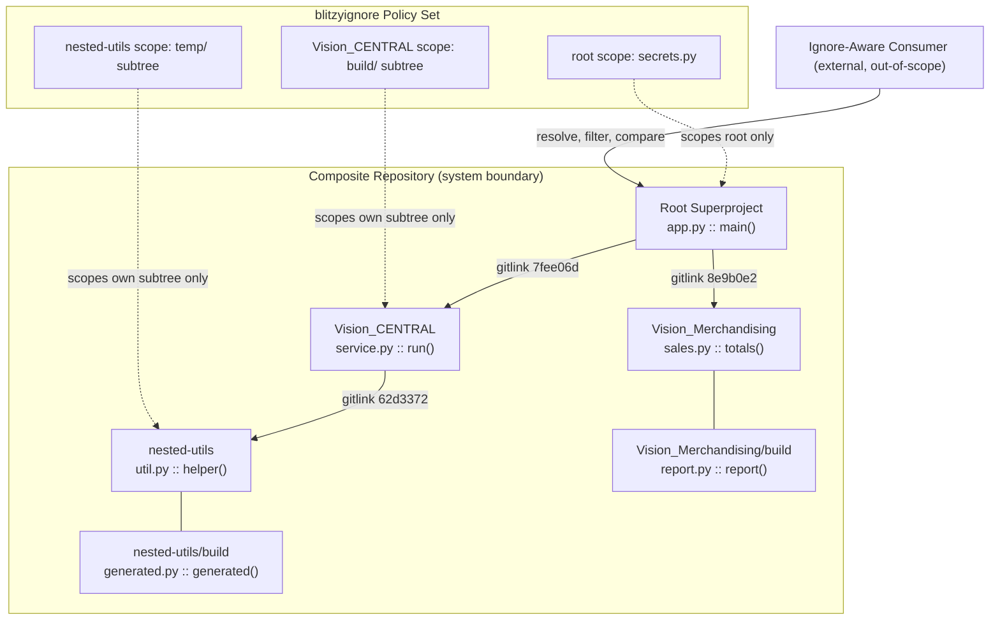
```mermaid
flowchart TB
    Consumer["Ignore-Aware Consumer (external, out-of-scope)"]
    subgraph Composition["Composite Repository (system boundary)"]
        Root["Root Superproject<br/>app.py :: main()"]
        VC["Vision_CENTRAL<br/>service.py :: run()"]
        VM["Vision_Merchandising<br/>sales.py :: totals()"]
        NU["nested-utils<br/>util.py :: helper()"]
        NUB["nested-utils/build<br/>generated.py :: generated()"]
        VMB["Vision_Merchandising/build<br/>report.py :: report()"]
    end
    subgraph Policy["blitzyignore Policy Set"]
        P1["root scope: secrets.py"]
        P2["Vision_CENTRAL scope: build/ subtree"]
        P3["nested-utils scope: temp/ subtree"]
    end

    Root -->|"gitlink 7fee06d"| VC
    Root -->|"gitlink 8e9b0e2"| VM
    VC -->|"gitlink 62d3372"| NU
    NU --- NUB
    VM --- VMB
    P1 -.->|"scopes root only"| Root
    P2 -.->|"scopes own subtree only"| VC
    P3 -.->|"scopes own subtree only"| NU
    Consumer -->|"resolve, filter, compare"| Root
```

**State transition diagram.** At the architecture level, the composition transitions through a fixed lifecycle as a Consumer processes it — from an unresolved superproject to a verified inclusion set. This complements the finer-grained path-classification and submodule-resolution state machines in §4.3; the diagram below is the composition-level view. A detected defect returns the process to re-resolution (the recovery loop of §5.4 / §4.4).

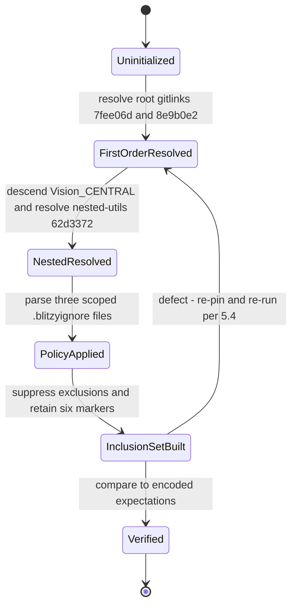
```mermaid
stateDiagram-v2
    [*] --> Uninitialized
    Uninitialized --> FirstOrderResolved: resolve root gitlinks 7fee06d and 8e9b0e2
    FirstOrderResolved --> NestedResolved: descend Vision_CENTRAL and resolve nested-utils 62d3372
    NestedResolved --> PolicyApplied: parse three scoped .blitzyignore files
    PolicyApplied --> InclusionSetBuilt: suppress exclusions and retain six markers
    InclusionSetBuilt --> Verified: compare to encoded expectations
    Verified --> [*]
    InclusionSetBuilt --> FirstOrderResolved: defect - re-pin and re-run per 5.4
```

**Sequence diagram for the key flow (F-004 non-leakage evaluation).** The architecturally critical flow is the evaluation of the three `build/`-related paths, which distinguishes a correctly scoped consumer from a leaking one: the `Vision_CENTRAL/build/` path is excluded by the locally declared rule, while the identically named sibling and nested `build/` paths remain included because that rule is out of their scope.

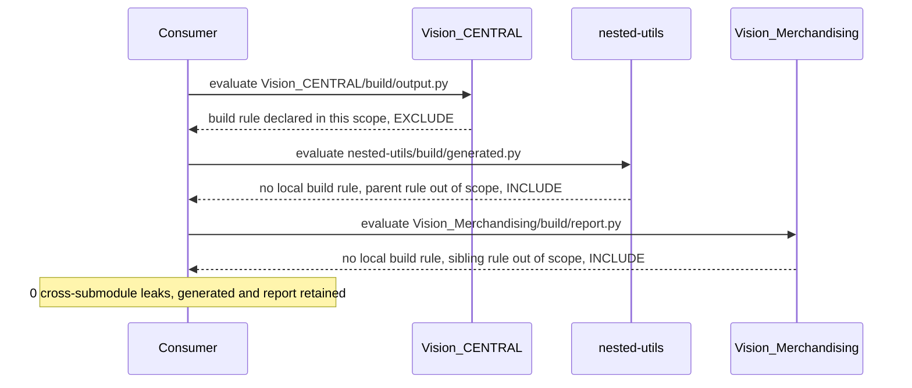
```mermaid
sequenceDiagram
    participant C as Consumer
    participant VC as Vision_CENTRAL
    participant NU as nested-utils
    participant VM as Vision_Merchandising

    C->>VC: evaluate Vision_CENTRAL/build/output.py
    VC-->>C: build rule declared in this scope, EXCLUDE
    C->>NU: evaluate nested-utils/build/generated.py
    NU-->>C: no local build rule, parent rule out of scope, INCLUDE
    C->>VM: evaluate Vision_Merchandising/build/report.py
    VM-->>C: no local build rule, sibling rule out of scope, INCLUDE
    Note over C: 0 cross-submodule leaks, generated and report retained
```

## 5.3 Technical Decisions

This section records the architecture decisions that shaped the fixture and the rationale behind each. Because the system deliberately has no runtime, several conventional decision areas (communication patterns, storage, caching) resolve to a justified *absence* rather than a positive technology choice; those are documented as explicit decisions with their reasoning, not omitted. A consolidated decision tree (§5.3.5) and a set of Architecture Decision Records (§5.3.6) close the section.

### 5.3.1 Architecture Style Decisions and Tradeoffs

The defining decision is to model the problem as a **genuine Git-submodule composite** rather than a monorepo or a flat single repository. Only real `160000` gitlinks reproduce the per-repository boundaries and traversal that the non-leakage property (F-004) and multi-level traversal (F-005) require; a monorepo or vendored copies would collapse those boundaries and make the namesake test impossible to express. The second style decision is to encode expected outcomes as **declarative constant-string markers** instead of executable tests, so that any ignore-aware consumer can verify the fixture by a simple set comparison with no build step, dependency, or test harness (F-006). The third is to **pin every submodule to a fixed commit**, making the composed tree deterministic and reproducible at superproject HEAD `d16d0c3`.

| Decision Area | Chosen Approach | Primary Rationale | Key Tradeoff |
|---|---|---|---|
| Repository composition | Git submodules: superproject + three gitlinks over three tiers | Faithfully reproduces cross-repo boundaries required by F-004/F-005 | Submodule init/traversal complexity vs. a simpler monorepo |
| Ignore policy | Per-directory `.blitzyignore`, scoped to its declaring dir | Tests locality-of-policy and non-leakage; mirrors `.gitignore` cascade | Consumer must track declaring scope, not just the pattern |
| Verification substrate | Constant-string marker functions, not tests | Build-free, dependency-free oracle via set comparison (F-006) | No self-executing assertions; requires an external consumer |
| Composition pinning | Fixed `160000` gitlink SHAs (baseline v1.0 @ `d16d0c3`) | Deterministic, reproducible inclusion set | Manual re-pin needed to advance a submodule |

### 5.3.2 Communication and Integration Pattern Choices

The fixture chooses **no runtime communication pattern**. There is no HTTP/RPC/GraphQL service, no message broker or event stream, and no inter-module calls — every marker module has zero imports and is a standalone inclusion probe. This is a deliberate decision: introducing any inter-process or in-process communication would add behavior irrelevant to the ignore-scoping property under test and could mask it. The single integration that does exist is **Git submodule resolution**, a local gitlink-resolution mechanism used only to compose and traverse the tree; the `.gitmodules` URLs are declarations for `git submodule` fetch, and no network call occurs at verification time (§4.1.4).

| Communication Concern | Decision | Rationale |
|---|---|---|
| Inter-module calls | None (zero imports across all six modules) | Keep each marker an independent, side-effect-free inclusion probe |
| Service / API (HTTP, RPC, GraphQL) | None | No runtime surface is needed to test ignore scoping (§1.3.2) |
| Messaging / events | None | Determinism preferred; no asynchronous behavior exists |
| Cross-repository integration | Git submodule gitlink resolution (local) | The only integration required to compose and descend the tree (F-005) |

### 5.3.3 Data Storage and Caching Rationale

The fixture chooses **no database, no application storage, and no caching layer**. Its data is entirely static configuration (`.gitmodules`, `.blitzyignore`) and constant strings, so there is nothing to persist at runtime; a datastore would be inert. Determinism is achieved through pinned commits, not through a database. Likewise, **no caching is introduced**: each marker is an O(1) constant return and traversal is a single linear pass over a small, fixed three-tier tree, so there is no expensive computation or repeated I/O to amortize — a cache would add invalidation complexity for zero benefit. The only durable state is Git's own object store plus the recorded gitlink SHAs and working-tree files; the incidental `__pycache__/` bytecode is a CPython execution artifact, not a designed cache (see §4.3.3).

| Storage / Cache Concern | Decision | Rationale |
|---|---|---|
| Primary datastore / database | None | No runtime data to persist; state is static config + constant strings |
| Durable state of record | Git object store + pinned gitlink SHAs | Reproducibility via pinning, not via a database (baseline `d16d0c3`) |
| Caching layer | None | O(1) markers and a single fixed-tree pass leave nothing to amortize |
| Incidental artifacts | `__pycache__/` bytecode tolerated, not relied upon | Byproduct of CPython execution; not source-tracked or required |

### 5.3.4 Security Mechanism Selection

The sole security mechanism is the **`secrets.py` bare-filename exclusion** declared in the root `.blitzyignore` (F-001). It suppresses any file named `secrets.py` at every depth — including the copies in `Vision_CENTRAL` and `Vision_Merchandising` — preventing an ignore-aware consumer from ingesting credential-like files into generated documents or indexes. A bare-filename rule that matches at any depth is the minimal, robust control for that specific threat. No authentication, authorization, RBAC, session, or token-validation mechanism exists, because there is no runtime, no users, and no protected resource surface to guard (§4.2.3). Two supporting posture decisions reinforce this: zero third-party dependencies eliminate the supply-chain/CVE surface (§3.3), and only clean public submodule URLs are ever documented — the credential-bearing origin remote URL is never reproduced.

| Security Concern | Mechanism | Rationale |
|---|---|---|
| Sensitive-file ingestion | Root bare-filename rule `secrets.py`, any depth | Minimal robust suppression of credential-like files (F-001) |
| AuthN / AuthZ / RBAC | None | No runtime, users, or protected resources to guard (§4.2.3) |
| Supply-chain exposure | Zero third-party dependencies | No external packages means no CVE/supply-chain surface (§3.3) |
| Credential disclosure | Cite only public `.gitmodules` URLs | Never reproduce the access-token-bearing origin URL |

### 5.3.5 Decision Tree

The following decision tree summarizes how each design requirement maps to the approach that was chosen. It is a design-rationale tree (distinct from the per-path inclusion flowchart in §4.1.2): each requirement branches to the concrete mechanism that satisfies it.

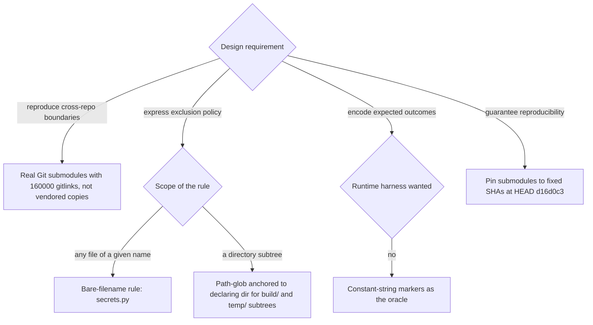
```mermaid
flowchart TD
    Q0{"Design requirement"}
    Q0 -->|"reproduce cross-repo boundaries"| D1["Real Git submodules with 160000 gitlinks, not vendored copies"]
    Q0 -->|"express exclusion policy"| Q1{"Scope of the rule"}
    Q1 -->|"any file of a given name"| D2["Bare-filename rule: secrets.py"]
    Q1 -->|"a directory subtree"| D3["Path-glob anchored to declaring dir for build/ and temp/ subtrees"]
    Q0 -->|"encode expected outcomes"| Q2{"Runtime harness wanted"}
    Q2 -->|"no"| D4["Constant-string markers as the oracle"]
    Q0 -->|"guarantee reproducibility"| D5["Pin submodules to fixed SHAs at HEAD d16d0c3"]
```

### 5.3.6 Architecture Decision Records (ADRs)

The following ADRs capture the accepted decisions and their consequences. All are **Accepted** and are reflected in the committed fixture (root history `3dbe53c` → `7896094` → `d16d0c3`); none has been superseded.

| ADR | Context | Decision | Consequence |
|---|---|---|---|
| ADR-01 | Ignore scoping must be tested across real repo boundaries | Use genuine Git submodules (three gitlinks, three tiers) | Faithful boundaries; consumer must be submodule-aware (F-005) |
| ADR-02 | Rules must not leak across identically named directories | Scope each `.blitzyignore` to its declaring directory | Sibling and nested `build/` retained; namesake property holds (F-004) |
| ADR-03 | An oracle is needed without a build or runtime | Encode outcomes as constant-string marker functions | Set-comparison verification; no test harness required (F-006) |
| ADR-04 | Sensitive files must never be ingested | Root bare-filename rule `secrets.py` matching at any depth | Name-based suppression at all levels; not content-based (F-001) |
| ADR-05 | The composition must be reproducible | Pin submodules to fixed SHAs; baseline v1.0 at `d16d0c3` | Deterministic tree; manual re-pin to advance (§2.6.3) |
| ADR-06 | No runtime or persistence is required by the problem | Omit databases, caching, services, and dependencies | Zero supply-chain surface; runtime behavior is out of scope |

## 5.4 Cross-Cutting Concerns

Cross-cutting concerns in a conventional system (monitoring, logging, tracing, error handling, authentication, performance SLAs, disaster recovery) are typically runtime properties. This fixture has no runtime, so most of these resolve to a justified *absence* with an evidence-based substitute rather than an implemented mechanism. Each concern is addressed explicitly below; the error-handling discussion defers to and cross-references §4.4 rather than redefining its validation gates.

### 5.4.1 Monitoring, Observability, Logging, and Tracing

The fixture implements no monitoring, observability, logging, or tracing instrumentation. There are no logging imports, no metrics or telemetry emitters, and no trace context anywhere — a direct consequence of the modules having zero imports and zero side effects. The observability model that *does* apply is the **marker-string oracle**: each included module's constant return value is a human-readable, self-describing signal, and the observable system state is the Consumer's inclusion set compared against the encoded expectations. The effective "dashboard" is therefore the §1.2.3 KPI set — 6 of 6 markers retained, all exclusion targets suppressed, and 0 cross-submodule leaks — evaluated by inspection rather than by runtime telemetry.

| Concern | In-Repo Mechanism | Substitute / Where Observed |
|---|---|---|
| Monitoring / metrics | None | Inclusion-set KPIs (§1.2.3): 6/6 markers, 0 leaks |
| Observability | None (no telemetry) | Self-describing marker strings inspected by the Consumer |
| Logging | None (no logging imports) | The marker string is the only human-readable signal |
| Tracing | None (no trace context) | The single linear traversal path is fully determined by the tree |

### 5.4.2 Error Handling Patterns

As established in §4.4, there is **no runtime error handling in the codebase** — no `try`/`except`, retry loop, fallback branch, or notification call — because each marker is a deterministic constant-string return that cannot raise a domain error. The only error surface is **verification divergence** in the consuming tool: an inclusion set that does not match the encoded expectations. That surface is diagnosed at the four validation gates (G1–G4) and remediated through the manual loop defined in §4.4.2 and §4.4.3. The diagram below is the cross-cutting routing view — it shows how any "error concern" is triaged into the not-possible runtime branch or the verification-divergence remediation loop; the detailed gate-by-gate diagnosis lives in §4.4.2.

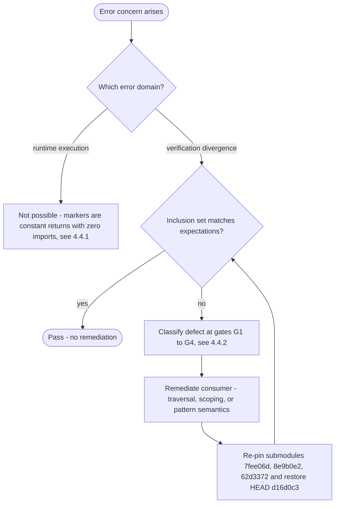
```mermaid
flowchart TD
    A(["Error concern arises"]) --> B{"Which error domain?"}
    B -->|"runtime execution"| C["Not possible - markers are constant returns with zero imports, see 4.4.1"]
    B -->|"verification divergence"| D{"Inclusion set matches expectations?"}
    D -->|"yes"| E(["Pass - no remediation"])
    D -->|"no"| F["Classify defect at gates G1 to G4, see 4.4.2"]
    F --> G["Remediate consumer - traversal, scoping, or pattern semantics"]
    G --> H["Re-pin submodules 7fee06d, 8e9b0e2, 62d3372 and restore HEAD d16d0c3"]
    H --> D
```

### 5.4.3 Authentication and Authorization

The fixture contains **no authentication or authorization framework** — no users, sessions, tokens, RBAC, or protected resources exist, and there is no runtime to guard (§4.2.3). The only security-adjacent control is the `secrets.py` exclusion rule (F-001), which is a **data-suppression** control (keeping credential-like files out of an ingested set), not an access-control mechanism. For submodule resolution, authentication is delegated entirely to Git's transport layer against the public HTTPS remotes declared in `.gitmodules`; the credential-bearing origin remote URL is never reproduced in this documentation. No regulatory-compliance controls (for example GDPR, HIPAA, PCI, or SOC 2) are declared anywhere in the repository (§4.2.3).

### 5.4.4 Performance Requirements and SLAs

No performance requirements, latency budgets, throughput targets, or SLAs are defined anywhere in the repository (§2.6.2). Rather than invent figures, the table records the evidence-based performance characteristics: each marker is an O(1) constant return, and a Consumer's traversal is a single linear pass over a fixed, small three-tier tree (six marker modules, three ignore files, and three gitlinks). There are no timed steps, timeouts, or scheduled windows (§4.1.1), and the footprint is fixed by construction.

| Performance Dimension | Defined Target? | Observed Characteristic |
|---|---|---|
| Latency / response time | No | O(1) constant-return marker functions |
| Throughput | No | Single one-pass traversal of a fixed tree |
| Availability / uptime | No | No runtime service to keep available |
| Footprint | No explicit target | Fixed: 6 marker files, 3 ignore files, 3 gitlinks |

### 5.4.5 Disaster Recovery

The fixture defines no backup, failover, or replication infrastructure, and none is required. Because the entire composition is captured by the superproject commit `d16d0c3` and the three pinned gitlink SHAs (`7fee06d`, `8e9b0e2`, `62d3372`), the exact tree is reproducible from Git at any time. "Disaster recovery" therefore reduces to the recovery loop of §4.4.3: re-clone the superproject and restore the recorded submodule pins. There is no mutable runtime state and thus no data-loss surface, and recovery is all-or-nothing rather than partial, mirroring the atomic-commit consistency boundary described in §4.3.3.

| DR Aspect | Approach | Rationale |
|---|---|---|
| Backup | Git history is the backup (commits `3dbe53c` → `d16d0c3`) | The composition is fully captured in version control |
| Recovery | Re-clone superproject; restore pins `7fee06d`/`8e9b0e2`/`62d3372` | Reproducible tree from HEAD `d16d0c3` (§4.4.3) |
| Failover / replication | None | No runtime service and no availability requirement |
| Data-loss surface | None (no mutable runtime state) | State is static config plus constant strings |

## 5.5 References

**Repository files examined**

- `app.py` — Root inclusion marker; `main()` returns `"root: always included"`; established the composition-root entry point (F-006).
- `.gitmodules` (root) — Declared the two first-order submodules (`Vision_CENTRAL`, `Vision_Merchandising`) and their public URLs; established the first-order gitlink composition (F-005).
- `.blitzyignore` (root) — Declared the `secrets.py` bare-filename rule; established the root-level security exclusion (F-001).
- `Vision_CENTRAL/service.py` — `run()` returns `"vision-central: always included"`; established the Vision_CENTRAL marker.
- `Vision_CENTRAL/.gitmodules` — Declared the nested `nested-utils` submodule and its public URL; established the second (nested) tier.
- `Vision_CENTRAL/.blitzyignore` — Declared the `build/**` rule; established the first-order directory exclusion (F-002).
- `Vision_CENTRAL/nested-utils/util.py` — `helper()` returns `"nested-utils: always included"`; established the nested marker.
- `Vision_CENTRAL/nested-utils/.blitzyignore` — Declared the `temp/**` rule; established the nested directory exclusion (F-003).
- `Vision_CENTRAL/nested-utils/build/generated.py` — `generated()` returns the nested non-leak marker; established the nested non-leakage control (F-004).
- `Vision_Merchandising/sales.py` — `totals()` returns `"vision-merchandising: always included"`; established the sibling marker.
- `Vision_Merchandising/build/report.py` — `report()` returns the sibling non-leak marker; established the sibling non-leakage control (F-004).

**Repository folders examined**

- `` (repository root) — The superproject; confirmed `app.py`, root `.gitmodules`, and the two first-order gitlinks.
- `Vision_CENTRAL/` — First-order submodule (gitlink `7fee06d`); confirmed `service.py`, `.gitmodules`, and `.blitzyignore`.
- `Vision_CENTRAL/nested-utils/` — Nested submodule (gitlink `62d3372`); confirmed `util.py`, `.blitzyignore`, and the retained `build/` subtree.
- `Vision_CENTRAL/nested-utils/build/` — Retained (included) folder; confirmed `generated.py` proving no nested leak.
- `Vision_Merchandising/` — First-order submodule (gitlink `8e9b0e2`); confirmed `sales.py` and the retained `build/` subtree.
- `Vision_Merchandising/build/` — Retained (included) folder; confirmed `report.py` proving no sibling leak.

**Excluded targets referenced by path only (contents never inspected, per `.blitzyignore`)**

- `secrets.py` (root, `Vision_CENTRAL/`, and `Vision_Merchandising/`) — Suppressed by the root bare-filename rule (F-001).
- `Vision_CENTRAL/build/` — Suppressed by the `Vision_CENTRAL` `build/**` rule (F-002).
- `Vision_CENTRAL/nested-utils/temp/` — Suppressed by the `nested-utils` `temp/**` rule (F-003).

**Git metadata and incidental artifacts**

- `160000` submodule gitlinks and pinned commit SHAs — `Vision_CENTRAL` `7fee06d`, `Vision_Merchandising` `8e9b0e2`, `nested-utils` `62d3372`; established the deterministic, reproducible composition.
- Superproject HEAD `d16d0c3` and history (`3dbe53c` → `7896094` → `d16d0c3`) — Established the version baseline and the "Git history as backup" DR posture.
- Submodule `.git` gitlink pointers (`Vision_CENTRAL/.git`, `Vision_Merchandising/.git`, `Vision_CENTRAL/nested-utils/.git`) — Confirmed the two-level nesting.
- `__pycache__/` bytecode (e.g., `app.cpython-312.pyc`) — Confirmed CPython 3.12.3 execution artifacts; cited as incidental, not designed state.

**Cross-referenced Technical Specification sections**

- §1.2 System Overview; §1.3 Scope (§1.3.1, §1.3.2) — Canonical framing, actors, and in/out-of-scope boundaries.
- §2.1 Feature Catalog (F-001–F-006) — Feature identities, priorities, and governing artifacts.
- §2.3 Feature Relationships (§2.3.2, §2.3.4) — Integration points and the out-of-scope external Consumer.
- §2.6 Assumptions, Constraints, and Versioning (§2.6.1, §2.6.2, §2.6.3) — Matching semantics, absence of SLAs, and the version baseline.
- §3.3 Open Source Dependencies; §3.5 Databases & Storage — Zero-dependency posture and absence of any datastore.
- §4.1 System Workflows (§4.1.1, §4.1.2, §4.1.4) — Ingest-and-verify workflow, per-path decision, and submodule integration.
- §4.2 Validation Rules (§4.2.3) — Absence of authorization and regulatory-compliance controls.
- §4.3 State Management (§4.3.1, §4.3.2, §4.3.3) — Path-classification and submodule-resolution state machines and the atomic-commit boundary.
- §4.4 Error Handling and Recovery (§4.4.1, §4.4.2, §4.4.3) — Verification-failure gates and the manual recovery loop.

No external web sources were consulted for this section; all evidence derives from direct repository inspection and the cross-referenced sections above.

# 6. SYSTEM COMPONENTS DESIGN

## 6.1 Core Services Architecture

### 6.1.1 Applicability Determination and Rationale

**Core Services Architecture is not applicable for this system.**

The `blitzyignore-submodule-test` repository is a deliberately dependency-free verification fixture, not a microservice system, a distributed application, or any deployable runtime composed of distinct service components. As established in §5.1 High-Level Architecture, it is a *hierarchical Git-submodule composite* whose entire "architecture" is a static composition topology — a root superproject plus three submodules — overlaid with a per-directory `.blitzyignore` policy. There is no service tier, API, scheduler, message broker, or persistence layer anywhere in the tree (§5.1.1, §3.4 Third-Party Services, §3.5 Databases & Storage).

The determination rests on the following directly observed facts:

- **No runtime process.** None of the six included modules defines a `__main__` guard, server, or loop, and nothing imports or invokes them; there is no entrypoint wiring or orchestration (§5.1.1).
- **No inter-process or network communication.** Every module has zero imports and no HTTP/RPC/socket/broker usage, so no two units communicate at runtime (§5.1.3, §4.1 System Workflows).
- **No deployment or orchestration artifacts.** A whole-tree sweep found no Dockerfile, Compose file, Kubernetes/Helm manifest, Terraform, Procfile, systemd unit, or reverse-proxy/ingress configuration (§3.6 Development & Deployment Tooling).
- **No service-fabric dependencies.** There are no third-party dependencies of any kind — no service-discovery client, load balancer, service mesh, circuit breaker, or retry library (§3.3 Open Source Dependencies).

**A note on naming.** The tree contains service-suggestive names — two submodules, `Vision_CENTRAL` and `Vision_Merchandising`, and a module literally named `service.py` — but these are *inclusion markers*, not services. `Vision_CENTRAL/service.py` exposes a single zero-argument `run()` that returns the constant string `"vision-central: always included"`; it defines no server, endpoint, or process. The names denote repository components within a submodule composition, not deployable services that communicate at runtime.

**Evidence basis for the determination**

| Precondition for a core-services architecture | Observation in this repository | Evidence source |
|---|---|---|
| Multiple independently deployable services | None — six constant-returning Python modules; no deployable unit | `app.py`, `service.py`, `util.py`, `generated.py`, `sales.py`, `report.py` |
| A runtime process or entrypoint | None — no `__main__`, server, or loop; nothing invokes the functions | All six modules; §5.1.1 |
| Inter-service or network communication | None — zero imports; no HTTP/RPC/socket/broker | All six modules; §5.1.3 |
| Deployment / orchestration manifests | None — no Docker, Kubernetes, Terraform, Procfile, or proxy config | Whole-tree file sweep; §3.6 |
| Discovery, LB, circuit-breaker, or retry libraries | None — zero third-party dependencies | §3.3, §3.4 |

**Applicability of the prompt-required areas**

| Prompt-required area | Applicable? | Basis (detailed in) |
|---|---|---|
| Service Components | No | No runtime services or communication exist (§6.1.2) |
| Scalability Design | No | No runtime process to scale; fixed static footprint (§6.1.3) |
| Resilience Patterns | Only Git-native durability | No runtime to fail; Git history and pinned commits are the sole recovery mechanism (§6.1.4) |

The remaining sub-sections address each prompt-required area in turn — documenting the absent mechanism, the evidence-based reason, and the required Mermaid diagram, each rendered to depict the actual static, non-service system rather than an invented service topology.

### 6.1.2 Service Components Assessment

This system has no runtime service components. The concept of a *service boundary* maps here only to repository/submodule boundaries fixed at composition time, not to independently running services that expose interfaces and communicate. Per §5.1.3 and §4.1 System Workflows there are no HTTP/RPC/GraphQL APIs, no message brokers or queues, and no runtime network calls; the six modules are pure constant-returning functions with zero imports (§5.1.1). Every service-component concern enumerated by the prompt therefore resolves to *not applicable*, as summarized below.

**Service-component concerns**

| Service-component concern | Status | Evidence and rationale |
|---|---|---|
| Service boundaries and responsibilities | Composition boundaries only | Boundaries are Git submodule scopes — root, `Vision_CENTRAL`, `nested-utils`, `Vision_Merchandising` — each hosting one marker function, not a runtime service (§5.1.2) |
| Inter-service communication patterns | Not applicable | Zero imports and no network/RPC/broker in any module; markers never call one another (§5.1.3) |
| Service discovery mechanisms | Not applicable | Composition resolves statically through pinned `160000` gitlinks in `.gitmodules`; no registry, DNS, or discovery client |
| Load balancing strategy | Not applicable | No runtime process, no replicas, and no traffic to distribute |
| Circuit breaker patterns | Not applicable | No downstream calls exist to protect; functions are deterministic constant returns |
| Retry and fallback mechanisms | Not applicable at runtime | No runtime failure surface; the only analog is the manual verification re-run and re-pin loop of §4.4.3 |

The only relationships in the system are build-time or checkout-time: (a) Git submodule resolution, in which each `160000` gitlink is resolved to its pinned commit, and (b) the ignore-aware Consumer's read-only tree walk — an external, out-of-scope participant per §1.3 Scope and §5.1.4. Both are one-way and occur around ingestion, never between running services. Diagram 6.1-1 depicts this static composition and the deliberate absence of runtime inter-service edges.

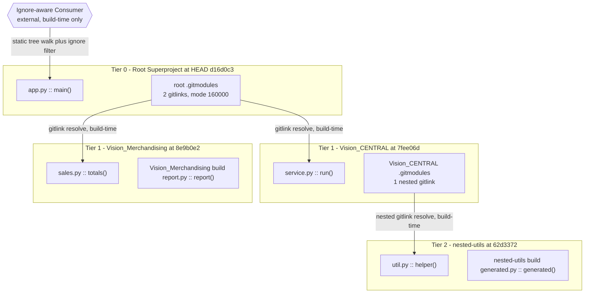
```mermaid
flowchart TB
    CONS{{"Ignore-aware Consumer<br/>external, build-time only"}}
    subgraph ROOT["Tier 0 - Root Superproject at HEAD d16d0c3"]
        APP["app.py :: main()"]
        GM["root .gitmodules<br/>2 gitlinks, mode 160000"]
    end
    subgraph VCEN["Tier 1 - Vision_CENTRAL at 7fee06d"]
        SVC["service.py :: run()"]
        GMVC["Vision_CENTRAL .gitmodules<br/>1 nested gitlink"]
    end
    subgraph NUTIL["Tier 2 - nested-utils at 62d3372"]
        UTIL["util.py :: helper()"]
        GEN["nested-utils build generated.py :: generated()"]
    end
    subgraph VMER["Tier 1 - Vision_Merchandising at 8e9b0e2"]
        SAL["sales.py :: totals()"]
        REP["Vision_Merchandising build report.py :: report()"]
    end
    CONS -->|"static tree walk plus ignore filter"| APP
    GM -->|"gitlink resolve, build-time"| SVC
    GM -->|"gitlink resolve, build-time"| SAL
    GMVC -->|"nested gitlink resolve, build-time"| UTIL
```

**Diagram 6.1-1 — Service Interaction (build-time composition only; no runtime service interaction).** Solid edges are build-time Git submodule resolution and the Consumer's read-only walk; the marker modules — including the retained non-leak markers `generated()` and `report()` — exchange no messages at runtime. There are no service-to-service edges because there are no services.

### 6.1.3 Scalability Design Assessment

Scalability design is not applicable because there is no runtime process, request load, or elastic resource to scale. The system's footprint is fixed by construction — six marker modules, three `.blitzyignore` files, and three pinned gitlinks across a three-tier composition (§5.4.4). Conventional scaling — adding compute to serve more load — has no meaning here; the artifact "grows" only when an author adds fixture files or submodules at authoring time, which is a source-control change tracked in Git rather than an elastic runtime behavior.

**Scalability concerns**

| Scalability concern | Status | Evidence and rationale |
|---|---|---|
| Horizontal / vertical scaling approach | Not applicable | No runtime service or process to replicate or resize (§5.1.1) |
| Auto-scaling triggers and rules | Not applicable | No metrics, telemetry, or autoscaler manifests to trigger on (§5.4.1) |
| Resource allocation strategy | Not applicable | No compute or memory to allocate; a Consumer reads a fixed, small tree in one pass (§5.4.4) |
| Performance optimization techniques | Inherent, not engineered | Each marker is an O(1) constant return and verification is a single linear traversal — optimal by construction, with nothing to tune (§5.4.4) |
| Capacity planning guidelines | Fixed footprint | Six markers, three ignore files, three gitlinks; capacity changes only by authoring new fixtures, versioned in Git |

Diagram 6.1-2 renders this reality: a fixed static footprint feeding a single one-pass traversal, with no runtime scaling dimension and only an authoring-time growth vector.

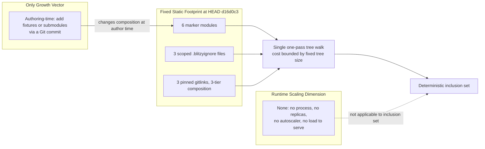
```mermaid
flowchart LR
    subgraph FIXED["Fixed Static Footprint at HEAD d16d0c3"]
        M["6 marker modules"]
        I["3 scoped .blitzyignore files"]
        G["3 pinned gitlinks, 3-tier composition"]
    end
    WALK["Single one-pass tree walk<br/>cost bounded by fixed tree size"]
    SET["Deterministic inclusion set"]
    subgraph RUNTIME["Runtime Scaling Dimension"]
        NONE["None: no process, no replicas,<br/>no autoscaler, no load to serve"]
    end
    subgraph GROWTH["Only Growth Vector"]
        AUTH["Authoring-time: add fixtures or submodules<br/>via a Git commit"]
    end
    M --> WALK
    I --> WALK
    G --> WALK
    WALK --> SET
    NONE -.->|"not applicable to inclusion set"| SET
    AUTH -->|"changes composition at author time"| M
```

**Diagram 6.1-2 — Scalability Architecture (fixed static footprint; no runtime scaling dimension).** The fixed footprint feeds one linear traversal that yields the deterministic inclusion set. There is no horizontal or vertical scaling path and no auto-scaling trigger; the sole way the composition changes size is an authoring-time Git commit that adds fixtures or submodules.

### 6.1.4 Resilience Patterns Assessment

Most resilience patterns presuppose a running service that can fail, degrade, or be failed over; this fixture has no such runtime, so fault tolerance, failover, and service-degradation policies are not applicable. The one resilience-relevant property that *does* apply is **Git-native durability and reproducibility**: the entire composition is captured by superproject commit `d16d0c3` together with the three pinned gitlink SHAs (`7fee06d`, `8e9b0e2`, `62d3372`), and it is redundantly stored in every clone of the repositories (§5.4.5, §5.1.3). Recovery is a re-clone and re-pin operation rather than a runtime failover, as detailed in §4.4 Error Handling and Recovery.

**Resilience concerns**

| Resilience concern | Status | Evidence and rationale |
|---|---|---|
| Fault tolerance mechanisms | Not applicable | No runtime to fault; markers are deterministic constant returns with no failure modes (§5.4.2) |
| Disaster recovery procedures | Git-native, documented | Re-clone the superproject and restore pins `7fee06d`, `8e9b0e2`, `62d3372` at HEAD `d16d0c3`; Git history is the backup (§5.4.5, §4.4) |
| Data redundancy approach | Git-native | Distributed clones and the object store under `.git/modules/` replicate every pinned commit; no separate datastore exists (§5.1.3) |
| Failover configurations | Not applicable | No runtime service, standby, or availability requirement (§5.4.4, §5.4.5) |
| Service degradation policies | Not applicable | No serviceable request path to degrade; the only "failure" is verification divergence, triaged by the §4.4 gates and remediated manually |

Diagram 6.1-3 depicts the only resilience mechanism present — Git durability and the re-clone/re-pin recovery loop — and its handoff to the verification gates defined in §4.4.

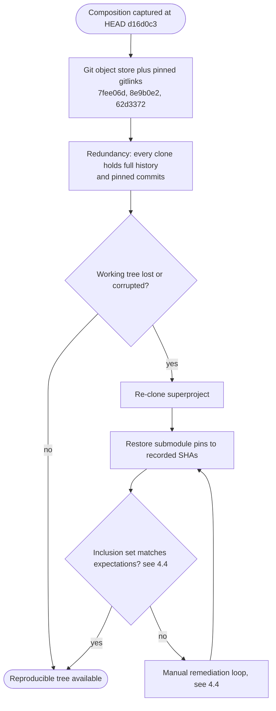
```mermaid
flowchart TD
    START(["Composition captured at HEAD d16d0c3"]) --> STORE["Git object store plus pinned gitlinks<br/>7fee06d, 8e9b0e2, 62d3372"]
    STORE --> REDUN["Redundancy: every clone holds full history<br/>and pinned commits"]
    REDUN --> Q{"Working tree lost or corrupted?"}
    Q -->|"no"| OK(["Reproducible tree available"])
    Q -->|"yes"| REC["Re-clone superproject"]
    REC --> PIN["Restore submodule pins to recorded SHAs"]
    PIN --> VERIFY{"Inclusion set matches expectations? see 4.4"}
    VERIFY -->|"yes"| OK
    VERIFY -->|"no"| REMED["Manual remediation loop, see 4.4"]
    REMED --> PIN
```

**Diagram 6.1-3 — Resilience Pattern Implementation (Git-native durability and recovery; no runtime failover).** Durability and data redundancy come from Git's distributed object store and pinned commit SHAs; recovery re-clones the superproject and restores the pins, then re-verifies against the encoded expectations of §4.4. No circuit breaking, failover, or graceful degradation exists because there is no runtime service to protect.

### 6.1.5 References

**Repository files examined**

- `app.py` - root marker module (`main()`); established the absence of a runtime entrypoint (no `__main__`, server, or loop).
- `Vision_CENTRAL/service.py` - `run()` marker; confirmed the service-named module is a constant return, not a runtime service.
- `Vision_CENTRAL/nested-utils/util.py` - `helper()` marker in the nested submodule.
- `Vision_CENTRAL/nested-utils/build/generated.py` - `generated()` non-leak inclusion marker retained in the nested submodule's `build/`.
- `Vision_Merchandising/sales.py` - `totals()` marker.
- `Vision_Merchandising/build/report.py` - `report()` non-leak inclusion marker retained in the sibling submodule's `build/`.
- `.gitmodules` (root) - declared the two first-order submodules (`Vision_CENTRAL`, `Vision_Merchandising`) and their clean public URLs.
- `Vision_CENTRAL/.gitmodules` - declared the nested `nested-utils` submodule.
- `.blitzyignore` (root), `Vision_CENTRAL/.blitzyignore`, `Vision_CENTRAL/nested-utils/.blitzyignore` - the scoped ignore-policy set (`secrets.py`, `build/**`, `temp/**`) that defines the composition's only policy layer.

**Repository folders examined**

- `Vision_CENTRAL/` - first-order submodule, pinned gitlink `7fee06d`.
- `Vision_CENTRAL/nested-utils/` - nested (Tier 2) submodule, pinned gitlink `62d3372`.
- `Vision_CENTRAL/nested-utils/build/` - retained non-leak marker folder.
- `Vision_Merchandising/` - first-order submodule, pinned gitlink `8e9b0e2`.
- `Vision_Merchandising/build/` - retained non-leak marker folder.

**Git metadata**

- Superproject HEAD `d16d0c3`; `160000`-mode gitlinks for `Vision_CENTRAL` and `Vision_Merchandising`; submodule pins `7fee06d`, `8e9b0e2`, `62d3372`. Only the clean public submodule URLs from `.gitmodules` are cited; no credential-bearing remote URL is reproduced.

**Excluded targets (path only; contents never inspected, per `.blitzyignore`)**

- `secrets.py` (root rule, matched at any depth), `Vision_CENTRAL/build/`, and `Vision_CENTRAL/nested-utils/temp/`.

**Cross-referenced Technical Specification sections**

- §1.2 System Overview; §1.3 Scope; §3.3 Open Source Dependencies; §3.4 Third-Party Services; §3.5 Databases & Storage; §3.6 Development & Deployment Tooling; §4.1 System Workflows; §4.4 Error Handling and Recovery; §5.1 High-Level Architecture; §5.2 Component Details; §5.4 Cross-Cutting Concerns.

## 6.2 Database Design

### 6.2.1 Applicability Determination and Rationale

**Database Design is not applicable to this system.**

The `blitzyignore-submodule-test` repository is a deliberately dependency-free Git-submodule and `.blitzyignore` boundary-verification fixture, not a runtime application. It defines no database, no persistent application storage, no object-relational mapping (ORM) layer, no caching tier, and no data model of any kind. Every source module is a single zero-argument function that returns a fixed constant marker string, performs no input/output, and holds no state. The only durable substrate present is Git's own content-addressable object store — commit history plus pinned submodule gitlinks — which is version-control infrastructure rather than an application datastore. This determination is consistent with the findings recorded in §3.5 Databases & Storage and §5.1 High-Level Architecture.

An exhaustive sweep of the repository confirmed the absence of every precondition that would necessitate a database-design treatment:

| Database Precondition | Observation in Repository | Evidence Source |
|---|---|---|
| Datastore engine or database driver dependency | None — the repository contains zero dependency manifests | `.gitmodules`; manifest sweep; §3.3 |
| Schema or migration artifacts (DDL, ORM models, migration tool) | None — no `.sql`, ORM model, or migration files exist | Repository file-type sweep |
| Connection or data-source configuration | None — no `.env`, `.ini`, `.cfg`, `.toml`, `.yaml`, or `.json` config present | Repository config sweep |
| Caching layer (e.g., Redis, Memcached) | None — no cache client, configuration, or keyword reference | Keyword sweep; §3.5 |
| Object, blob, or file storage integration | None — no storage client or bucket configuration | Keyword sweep; §3.5 |
| Application code performing reads, writes, or queries | None — six modules each return a constant string with no I/O | First-hand reads of all viewable `.py` files |

Because none of these preconditions hold, every area enumerated in the Database Design prompt is inapplicable:

| Prompt-Required Area | Applicable? | Basis |
|---|---|---|
| Schema design (entities, indexing, partitioning, replication, backup) | No | No datastore exists; only Git object-store durability is present |
| Data management (migration, versioning, archival, retrieval, caching) | No | No database; versioning is Git-native, not schema- or data-level |
| Compliance considerations (retention, backup, privacy, audit, access) | No | No stored application data subject to database-level controls |
| Performance optimization (query, cache, pooling, R/W split, batch) | No | No queries, connections, or datastore workload exist |

For completeness, and to mirror the assessment structure established in §6.1 Core Services Architecture, the remaining sub-sections (§6.2.2 through §6.2.5) document, for each prompt-required area, the closest Git-native architectural analog where one exists and explicitly confirm the absence of any conventional database mechanism. The `.blitzyignore`-protected paths — `secrets.py` at every depth, `Vision_CENTRAL/build/**`, and `Vision_CENTRAL/nested-utils/temp/**` — were never inspected and are referenced only by rule, never by content.

### 6.2.2 Schema Design Assessment

No relational, document, key-value, or columnar schema exists in this repository. There are no tables, collections, entities, or attributes to model. The assessment below addresses each schema-design concern from the prompt, records its status as *Not applicable*, and — where a meaningful parallel exists — describes the Git-native durable-state analog that the system relies upon instead of a database.

| Schema Design Concern | Status | Git-Native Analog / Notes |
|---|---|---|
| Entity relationships | Not applicable | Git object graph (commit → tree → blob) plus submodule gitlinks; no relational entities |
| Data models & structures | Not applicable | Constant marker strings, `.blitzyignore` glob patterns, and gitlink SHAs; no tables or documents |
| Indexing strategy | Not applicable | Content-addressable object store with pack `.idx`; no query indexes |
| Partitioning approach | Not applicable | Submodule boundaries partition the tree; no data partitions |
| Replication configuration | Not applicable | Distributed full clones; no primary/replica database topology |
| Backup architecture | Not applicable | Immutable commit history plus distributed clones; no database backup jobs |

#### 6.2.2.1 Durable-State Model (Entity-Relationship Analog)

The closest analog to a data model is the structure of the Git objects that persist the fixture. The entity-relationship diagram below depicts that Git-native durable state — commits, gitlinks, blobs, and the scoped ignore policies — and explicitly annotates that it carries no relational schema. It is provided to satisfy the prompt's ERD requirement while making clear that these are version-control constructs, not application database tables.

```mermaid
erDiagram
    SUPERPROJECT_COMMIT ||--o{ GITLINK : "records mode 160000"
    SUPERPROJECT_COMMIT ||--|| ROOT_BLITZYIGNORE : "contains"
    SUPERPROJECT_COMMIT ||--|| MARKER_BLOB : "contains app.py"
    GITLINK ||--|| SUBMODULE_COMMIT : "pins exact SHA"
    SUBMODULE_COMMIT ||--o{ MARKER_BLOB : "contains"
    SUBMODULE_COMMIT ||--o| SCOPED_BLITZYIGNORE : "may contain"
    SUBMODULE_COMMIT ||--o{ GITLINK : "may record nested"
    SUPERPROJECT_COMMIT {
        sha commit_id "d16d0c3 HEAD"
        text tables "none - no relational schema"
    }
    GITLINK {
        mode filemode "160000"
        sha pinned_sha "7fee06d 8e9b0e2 62d3372"
    }
    SUBMODULE_COMMIT {
        string repo "Vision_CENTRAL Vision_Merchandising nested-utils"
        sha commit_id "immutable pin"
    }
    MARKER_BLOB {
        string function "zero argument"
        string constant_return "inclusion assertion"
    }
    ROOT_BLITZYIGNORE {
        string pattern "secrets.py"
        string scope "every depth"
    }
    SCOPED_BLITZYIGNORE {
        string pattern "build glob or temp glob"
        string scope "declaring subtree only"
    }
```

*Diagram 6.2-1 — Git-native durable-state model. The superproject commit (`d16d0c3`) records two first-order gitlinks (mode `160000`) that pin `Vision_CENTRAL` at `7fee06d` and `Vision_Merchandising` at `8e9b0e2`; `Vision_CENTRAL` in turn pins `nested-utils` at `62d3372`. No table, index, or foreign-key structure exists — the only "data" at rest is the set of constant marker strings and scoped ignore patterns.*

#### 6.2.2.2 Indexes and Constraints

There are no database indexes or database constraints to enumerate. The prompt's requirement to document indexes and constraints is satisfied at the composition level: the fixture's invariants are the scoped ignore rules and the immutable submodule pins, which are enforced by Git and by `.blitzyignore` scoping rather than by a schema. Git's own content-addressable object store maintains a pack index (`.idx`) keyed by object SHA, which is infrastructure rather than an application-defined index.

| Constraint (Composition-Level) | Type | Enforced By |
|---|---|---|
| `secrets.py` suppressed at every depth | Exclusion invariant | Root `.blitzyignore` |
| `Vision_CENTRAL/build/**` excluded, no cross-boundary leak | Scoped exclusion | `Vision_CENTRAL/.blitzyignore` |
| `Vision_CENTRAL/nested-utils/temp/**` excluded | Scoped exclusion | `Vision_CENTRAL/nested-utils/.blitzyignore` |
| Each submodule pinned to one exact, immutable SHA | Referential pin | Superproject tree entry, mode `160000` |

#### 6.2.2.3 Replication Configuration (Analog)

No database replication is configured — there is no primary/standby topology, no write-ahead-log shipping, and no replica set. The system's durability model is instead Git's native distributed replication: the canonical GitHub remotes are the origin, and every clone holds a complete copy of the object store, including all pinned submodule commits. The diagram below depicts this replication analog.

```mermaid
flowchart TB
    subgraph ORIGIN["Canonical Git Remotes (GitHub, out-of-scope)"]
        RC["vision-central.git<br/>pinned 7fee06d"]
        RM["vision-merchandising.git<br/>pinned 8e9b0e2"]
        RN["nested-utils.git<br/>pinned 62d3372"]
    end
    subgraph SUPER["Superproject blitzyignore-submodule-test @ HEAD d16d0c3"]
        GL["2 first-order gitlinks (mode 160000)<br/>+ 1 nested gitlink"]
    end
    subgraph CLONEA["Full Replica A - Developer / CI clone"]
        OA[".git/modules object store<br/>holds every pinned commit"]
    end
    subgraph CLONEB["Full Replica B - Consumer clone"]
        OB[".git/modules object store<br/>holds every pinned commit"]
    end
    RC --> GL
    RM --> GL
    RN --> GL
    GL -->|"clone --recurse-submodules"| OA
    GL -->|"clone --recurse-submodules"| OB
    OA -.->|"peer push / pull (Git-native, symmetric)"| OB
    NODB{{"No database replica set<br/>no primary/standby, no WAL shipping"}}
    NODB -.->|"not applicable"| GL
```

*Diagram 6.2-2 — Replication architecture. Durability derives from full distributed Git clones rather than any database replication mechanism; recovery of any pinned state is achieved by re-cloning and re-pinning (see §4.4 Error Handling and Recovery).*

#### 6.2.2.4 Backup Architecture (Analog)

No database backup architecture exists — there are no snapshot schedules, dump jobs, or point-in-time-recovery mechanisms because there is no database to back up. The immutable Git commit history (root progression `3dbe53c` → `7896094` → `d16d0c3`) combined with the distributed full clones described in §6.2.2.3 provides the system's backup and point-in-time-restore capability. This is consistent with the disaster-recovery posture documented in §6.1 Core Services Architecture.

### 6.2.3 Data Management Assessment

No database data-management processes exist because there is no database. There are no schema migrations, no data-versioning tables, no archival tiers, no create/read/update/delete (CRUD) paths, and no caching policies. The table below records each data-management concern as *Not applicable* and notes the Git-native analog the system relies on instead.

| Data Management Concern | Status | Git-Native Analog / Notes |
|---|---|---|
| Migration procedures | Not applicable | Submodule-pin bumps via commits (`3dbe53c` → `7896094` → `d16d0c3`); no DDL |
| Versioning strategy | Not applicable | Git commit history and immutable pinned SHAs; no schema or data versions |
| Archival policies | Not applicable | Immutable full history retained by Git; no archive tier |
| Data storage & retrieval | Not applicable | Build-time, read-only file and gitlink resolution; no database CRUD |
| Caching policies | Not applicable | No application cache; incidental `.pyc` bytecode is not source-tracked |

#### 6.2.3.1 Migration and Versioning (Analog)

Because there is no schema, there are no forward or backward schema migrations. The nearest analog is the evolution of the fixture itself through Git commits: the recorded root history advances the submodule pins from the initial fixture commit through the switch to absolute submodule URLs and the subsequent `Vision_CENTRAL` pin bump, ending at superproject `HEAD d16d0c3`. Versioning is therefore entirely Git-native — each state is an immutable commit identified by SHA, and each submodule is pinned to one exact commit rather than a floating branch. There is no migration tool (such as Alembic or Flyway) and no version table.

#### 6.2.3.2 Storage, Retrieval, and Data Flow

The system performs no database reads or writes. The only "data at rest" is the set of constant marker strings, the three scoped `.blitzyignore` policy files, and the `.gitmodules` gitlink pins. "Retrieval" occurs exclusively at build or checkout time, when an external, ignore-aware consumer reads the source text, parses the scoped ignore globs, and resolves or descends the pinned gitlinks to compute a deterministic inclusion set. This flow is entirely read-only and involves no query engine, transaction, or datastore round-trip, as depicted below.

```mermaid
flowchart LR
    subgraph REST["Data at Rest - Git working tree + object store"]
        MK["6 marker modules<br/>constant strings"]
        IG["3 scoped .blitzyignore files<br/>secrets.py / build glob / temp glob"]
        GM[".gitmodules gitlinks<br/>pinned SHAs"]
    end
    CONS{{"Ignore-aware Consumer<br/>external, read-only, build-time"}}
    FILTER["Apply scoped ignore rules<br/>+ resolve/descend gitlinks"]
    OUT["Deterministic inclusion set<br/>verification oracle"]
    MK -->|"read source text"| CONS
    IG -->|"parse globs"| CONS
    GM -->|"resolve pins"| CONS
    CONS --> FILTER
    FILTER --> OUT
    NODB["No DB read/write path<br/>no SQL, no queries, no transactions,<br/>no cache lookups"]
    NODB -.->|"absent by design"| CONS
```

*Diagram 6.2-3 — Data flow. The consumer that exercises the fixture is external and out-of-scope (§1.3.2); the repository defines only the read-only inputs it consumes and no persistence path of its own.*

#### 6.2.3.3 Archival and Caching Policies

There is no archival policy because there is no data lifecycle to archive; Git retains the complete, immutable history indefinitely by default. There is likewise no caching policy: no application cache, session store, or in-memory data grid is defined. The only cache-like artifact that may appear is CPython's incidental `__pycache__/*.pyc` bytecode (for example, `app.cpython-312.pyc`) produced if a marker module is executed, but this is a runtime by-product rather than a source-tracked or managed cache, consistent with §5.1 High-Level Architecture.

### 6.2.4 Compliance Considerations Assessment

No database-level compliance controls apply because no application data is stored, processed, or transmitted by a datastore. There are no retention schedules, no database backup/fault-tolerance policies, no privacy controls over stored records, no audit tables, and no database roles or grants. Each concern is recorded below with the basis for its inapplicability and any Git-native analog.

| Compliance Concern | Status | Basis / Git-Native Analog |
|---|---|---|
| Data retention rules | Not applicable | No stored data; Git retains immutable history by default |
| Backup & fault tolerance | Not applicable | Distributed clones and immutable commits; no database backup/FT |
| Privacy controls | Not applicable | No PII datastore; `secrets.py` source-suppression is the only analog |
| Audit mechanisms | Not applicable | Git commit history is the immutable change-audit trail |
| Access controls | Not applicable | Governed at the Git/GitHub layer; no database roles or grants |

#### 6.2.4.1 Retention, Backup, and Fault Tolerance

There is no data-retention rule set because the system persists no application records. Git's default behavior retains the full, immutable history, so no expiry or purge policy is defined. Backup and fault tolerance are provided solely by the distributed-clone model described in §6.2.2.3 and §6.2.2.4: every clone is a complete replica, and any lost state is recovered by re-cloning from a canonical remote and re-pinning to the recorded SHAs. There is no failover cluster, no replica promotion, and no mutable runtime state that could be lost, which is consistent with the disaster-recovery posture in §6.1 Core Services Architecture.

#### 6.2.4.2 Privacy, Audit, and Access Controls

No privacy controls over stored data apply, as the repository holds no personal or sensitive records — only constant marker strings and ignore-policy patterns. The single privacy-adjacent mechanism is source-level suppression: the root `.blitzyignore` rule excludes every `secrets.py` file at all depths so that such files are never surfaced to consumers of the fixture; this is a file-exclusion control, not a database privacy control, and the excluded contents were never inspected during this documentation. Auditability is provided by Git's immutable, attributable commit history, which records every change to the fixture. Access control is enforced entirely at the Git and GitHub remote layer together with the `.blitzyignore` exclusions; there are no database users, roles, or `GRANT`/`REVOKE` privileges because there is no database. Any repository credentials used by the hosting environment are outside the documented scope and are deliberately not reproduced here.

### 6.2.5 Performance Optimization Assessment

No database performance-optimization techniques apply because there is no datastore workload to optimize. There are no queries to tune, no cache to warm, no connections to pool, no read/write traffic to split, and no batch jobs to schedule. Each concern is recorded below as *Not applicable* with its basis.

| Performance Concern | Status | Basis |
|---|---|---|
| Query optimization patterns | Not applicable | No datastore or queries exist |
| Caching strategy | Not applicable | No cache layer is defined |
| Connection pooling | Not applicable | No database connections are established |
| Read/write splitting | Not applicable | No database reads or writes to route |
| Batch processing approach | Not applicable | No batch jobs; a single linear pass over a fixed tree |

The only processing the fixture is designed to support is a single, deterministic, read-only traversal of a fixed three-tier submodule tree by an external consumer that applies the scoped ignore rules and resolves the pinned gitlinks. Because every marker module returns a constant string in constant time and the tree is small and fixed (six marker modules, three scoped ignore files, and three gitlink pins), there is no query cost, no connection overhead, and no workload to scale — consistent with the performance characterization in §6.1 Core Services Architecture. Consequently, none of the standard database performance-optimization patterns are relevant to this system.

### 6.2.6 References

The following repository files, folders, and previously authored specification sections were examined as evidence for this section. `.blitzyignore`-protected paths were referenced only by rule and never inspected.

**Files examined**

- `app.py` — root marker module (`main()` returns a constant inclusion string); confirmed no imports, I/O, or persistence.
- `.gitmodules` — root submodule declarations for `Vision_CENTRAL` and `Vision_Merchandising` (clean public URLs); source of the gitlink model.
- `.blitzyignore` (root) — establishes the `secrets.py` exclusion invariant applied at every depth.
- `Vision_CENTRAL/service.py` — marker module (`run()`); confirmed constant-return, stateless.
- `Vision_CENTRAL/.gitmodules` — declares the nested `nested-utils` submodule.
- `Vision_CENTRAL/.blitzyignore` — establishes the scoped `build/**` exclusion.
- `Vision_CENTRAL/nested-utils/util.py` — marker module (`helper()`); confirmed constant-return.
- `Vision_CENTRAL/nested-utils/.blitzyignore` — establishes the scoped `temp/**` exclusion.
- `Vision_CENTRAL/nested-utils/build/generated.py` — no-leak marker module (`generated()`), included to prove scoped ignore rules do not cross submodule boundaries.
- `Vision_Merchandising/sales.py` — marker module (`totals()`); confirmed constant-return.
- `Vision_Merchandising/build/report.py` — no-leak marker module (`report()`), included as a sibling boundary control.

**Folders examined**

- `Vision_CENTRAL/` — first-order submodule (pinned `7fee06d`); contains no datastore or storage artifacts.
- `Vision_CENTRAL/nested-utils/` — nested submodule (pinned `62d3372`); contains no datastore or storage artifacts.
- `Vision_Merchandising/` — first-order submodule (pinned `8e9b0e2`); contains no datastore or storage artifacts.

**Technical Specification sections cross-referenced**

- §1.3 Scope — confirmed persistence/database is out-of-scope and the consumer is external.
- §3.3 Open Source Dependencies — confirmed absence of any datastore driver or dependency manifest.
- §3.5 Databases & Storage — confirmed the repository uses no database, cache, or storage service.
- §4.4 Error Handling and Recovery — basis for the re-clone/re-pin recovery model.
- §5.1 High-Level Architecture — confirmed the Git-submodule composite nature and absence of an application datastore.
- §6.1 Core Services Architecture — established the applicability-assessment template and the Git-native durability facts reused here.

## 6.3 Integration Architecture

### 6.3.1 Applicability Determination and Rationale

**Integration Architecture is not applicable for this system.**

The repository `blitzyignore-submodule-test` is a deliberately dependency-free Git-submodule and `.blitzyignore` inclusion/exclusion boundary **test fixture**, not a runtime application that communicates with external systems or services. Direct inspection establishes that the system exposes no integration surface of any kind: there are no networked or programmatic APIs, no authentication or authorization, no rate limiting, no API versioning infrastructure, no message queues, streams, batch pipelines, or event buses, no API gateway, and no third-party runtime services. Consistent with §5.1 and §6.1, the codebase is a "hierarchical Git-submodule composite rather than a runtime application," and per §3.4 it depends on "no third-party runtime services."

The entire executable surface is six Python modules totalling eighteen lines, each defining a single synchronous, zero-argument function that returns a hard-coded constant marker string with zero imports, no I/O, no networking, and no external calls (`app.py`, `Vision_CENTRAL/service.py`, `Vision_CENTRAL/nested-utils/util.py`, `Vision_CENTRAL/nested-utils/build/generated.py`, `Vision_Merchandising/sales.py`, `Vision_Merchandising/build/report.py`). A token scan across every included `.py` file returns no `import`, `http`, `socket`, `request`, `url`, `api`, `async`/`await`, `open()`, `connect`, `queue`, `kafka`, `rabbit`, `redis`, `grpc`, `rest`, `flask`, `fastapi`, or `django` occurrences. No dependency manifest, configuration file, interface-definition artifact (`.proto`, `.graphql`, `.wsdl`, `.avsc`), CI pipeline, or infrastructure-as-code exists anywhere in the tree.

It is important to distinguish three categories of cross-boundary relationship, only the latter two of which exist here and neither of which is a runtime *integration*:

- **Runtime integration** — networked, request/response or message-driven communication between independently running systems or services. **Absent.** The fixture executes no network operations and calls no external service (§4.1.4, §5.4).
- **Source-control composition** — build/checkout-time assembly of the working tree from pinned Git submodules hosted on GitHub. **Present**, but this is a developer/CI-time concern, not a runtime endpoint (see §6.3.4).
- **External consumption** — a read-only, out-of-scope "ignore-aware Consumer" (documentation generator, indexer, or context agent) that walks the composed tree and applies the scoped `.blitzyignore` rules to compute the inclusion set. **Present**, but the Consumer reads static source text; the fixture neither serves nor calls it (§1.3.2, §2.3.4, §5.1).

Because none of the API Design, Message Processing, or External Systems concerns enumerated in the section prompt are satisfied by any runtime mechanism, this section documents the *assessment* of each area against the observed evidence rather than a design. The following subsections record, per concern, that the area is not implemented, together with the specific evidence and the actual (non-integration) behavior that stands in its place.

**Table 6.3-1 — Evidence Basis for the Not-Applicable Determination**

| Evidence Dimension | Observation | Source |
| --- | --- | --- |
| Dependency manifests | None present — no `package.json`, `requirements.txt`, `pyproject.toml`, `Dockerfile`; no client SDK, broker driver, or web framework is declared | Filesystem scan; §3.3 |
| Executable surface | 6 modules / 18 lines; each a single zero-argument function returning a constant string; zero imports and zero I/O | `app.py`, `Vision_CENTRAL/service.py`, `Vision_Merchandising/sales.py` and peers |
| Network/API tokens | No `import`/`http`/`socket`/`url`/`api`/`async`/`grpc`/`rest`/`flask`/`fastapi`/`queue`/`kafka` matches in any `.py` file | Token scan of included sources |
| Integration infrastructure | No API gateway, broker, IDL (`.proto`/`.graphql`/`.wsdl`), CI, IaC, or configuration files anywhere | Filesystem sweep; §6.1 |
| External references | The only external references are Git submodule remote URLs used at checkout time, not runtime endpoints | `.gitmodules`; `Vision_CENTRAL/.gitmodules`; §3.4 |
| Cross-boundary actors | GitHub submodule remotes (build/checkout time) and a read-only ignore-aware Consumer (ingestion time); neither is a runtime integration | §5.1 |

**Table 6.3-2 — Applicability of Prompt Areas**

| Prompt Area | Applicable | Rationale |
| --- | --- | --- |
| API Design (protocol, auth, authz, rate limiting, versioning, documentation) | No | No networked or programmatic API surface exists; the marker functions are in-process constants read as source text |
| Message Processing (events, queues, streams, batch, error handling) | No | No broker, queue, topic, stream processor, scheduler, or event bus is present or referenced |
| External Systems (third-party patterns, legacy interfaces, gateway, contracts) | Build/checkout time only | The sole external touchpoint is GitHub as a submodule host during clone/checkout; there is no runtime service contract |

The diagram below frames the complete cross-boundary landscape, separating the phases in which any interaction occurs (build/checkout and ingestion) from the fixture's runtime, which has no integration surface at all.

**Diagram 6.3-1 — Integration Landscape (Phase-Separated)**

```mermaid
flowchart TB
    subgraph EXTERNAL["External Systems"]
        GH["GitHub remotes<br/>3 submodule repositories"]
        CONS["Ignore-aware Consumer<br/>external, out-of-scope"]
    end
    subgraph BUILDTIME["Build and Checkout Time"]
        FETCH["git clone --recurse-submodules<br/>fetch each submodule at pinned SHA"]
        TREE["Composed working tree<br/>superproject HEAD d16d0c3"]
    end
    subgraph INGESTTIME["Ingestion Time"]
        WALK["Read-only tree walk<br/>apply scoped .blitzyignore"]
        SET["Deterministic inclusion set"]
    end
    subgraph RUNTIMEBOX["Fixture Runtime"]
        NONE["No integration surface<br/>no network, no HTTP or RPC, no broker or queue, no external service"]
    end
    GH -->|"HTTPS Git transport"| FETCH
    FETCH --> TREE
    CONS -->|"read-only"| WALK
    TREE -->|"static source text"| WALK
    WALK --> SET
    TREE --> NONE
```

As shown, every cross-boundary edge is confined to build/checkout time (submodule resolution from GitHub) or ingestion time (the external Consumer's read-only walk). The fixture runtime node is intentionally terminal: it neither originates nor receives an integration call.

### 6.3.2 API Design Assessment

The system exposes **no API in the integration sense** — there is no HTTP/REST, gRPC, GraphQL, WebSocket, or SOAP endpoint, no transport code, and no interface-definition artifact. The closest analog to an "API" is the set of six in-process Python functions, each of which is synchronous, zero-argument, deterministic, and returns a fixed constant string. These functions are not published over any protocol; they are read as static source text by the external ignore-aware Consumer (§6.3.1) and, if executed at all, are invoked by direct in-process call. Consequently, every API-design concern enumerated in the prompt evaluates to *not applicable*, as detailed below.

**Table 6.3-3 — API Design Concern Assessment**

| Concern | Status | Evidence |
| --- | --- | --- |
| Protocol specifications | Not applicable | No HTTP/REST, gRPC, GraphQL, WebSocket, or SOAP; no transport code or IDL. The only surface is in-process functions called directly, not over a wire protocol |
| Authentication methods | Not applicable | No runtime authentication. The single credential in play is Git remote access used only at checkout, handled by Git/CI and never by fixture code (§3.4) |
| Authorization framework | Not applicable | No roles, scopes, or policy engine. The scoped `.blitzyignore` files declare static inclusion/exclusion for an external Consumer, not runtime authorization (§5.1) |
| Rate limiting strategy | Not applicable | No request path exists to throttle; each function is an O(1) constant return with no shared resource |
| Versioning approach | Not applicable | No API version namespace or content negotiation. Versioning is Git-native: the superproject pins each submodule to an immutable commit SHA (§6.2, §6.3.4) |
| Documentation standards | Not applicable | No OpenAPI/Swagger, AsyncAPI, or JSON-Schema. Behavior is self-describing through the constant marker strings; the authoritative specification is this Technical Specification |

For completeness, the actual callable surface — the nearest thing the fixture has to a documented API — is enumerated below. Each entry is a public, side-effect-free function whose "response" is a compile-time constant; the build-tree markers additionally encode the fixture's cross-submodule non-leak assertion in their return value.

**Table 6.3-4 — In-Process Function Surface**

| Module | Function | Returned Marker String |
| --- | --- | --- |
| `app.py` | `main()` | `"root: always included"` |
| `Vision_CENTRAL/service.py` | `run()` | `"vision-central: always included"` |
| `Vision_CENTRAL/nested-utils/util.py` | `helper()` | `"nested-utils: always included"` |
| `Vision_CENTRAL/nested-utils/build/generated.py` | `generated()` | `"nested-utils/build: included (proves no cross-submodule leak)"` |
| `Vision_Merchandising/sales.py` | `totals()` | `"vision-merchandising: always included"` |
| `Vision_Merchandising/build/report.py` | `report()` | `"vision-merchandising/build: included (proves no cross-submodule leak)"` |

The next diagram contrasts a conventional networked API stack — every tier of which is absent here — with the fixture's actual in-process function surface.

**Diagram 6.3-2 — API Architecture (Absent Networked Stack vs. Actual Surface)**

```mermaid
flowchart LR
    subgraph CONV["Conventional Networked API Stack - ABSENT"]
        CLIENT["API client"]
        GW["API gateway"]
        AUTH["AuthN and AuthZ"]
        RL["Rate limiter"]
        SVC["Service endpoint"]
        DB["Datastore"]
        CLIENT -.->|"absent"| GW
        GW -.->|"absent"| AUTH
        AUTH -.->|"absent"| RL
        RL -.->|"absent"| SVC
        SVC -.->|"absent"| DB
    end
    subgraph ACTUAL["Actual Surface - in-process functions read as text"]
        READER["Reader of source text<br/>no transport layer"]
        F1["app.py :: main()"]
        F2["service.py :: run()"]
        F3["util.py :: helper()"]
        F4["generated.py :: generated()"]
        F5["sales.py :: totals()"]
        F6["report.py :: report()"]
        READER --> F1
        READER --> F2
        READER --> F3
        READER --> F4
        READER --> F5
        READER --> F6
    end
```

The following sequence diagram documents the single key "API" flow that actually occurs: how the external Consumer obtains a marker value. Note the complete absence of a network round-trip, authentication handshake, and rate-limit check — the value is obtained by reading source text from the local working tree.

**Diagram 6.3-3 — Key Flow: Marker Value Retrieval**

```mermaid
sequenceDiagram
    participant C as Ignore-aware Consumer
    participant FS as Local working tree
    participant M as Marker module source
    Note over C,M: No network, no auth, no rate limiting, no API endpoint
    C->>FS: Open file path from inclusion set
    FS-->>C: Return raw source bytes
    C->>M: Read constant return string as text
    M-->>C: Constant marker string
    Note over C: Compare against encoded expectation as oracle
```

### 6.3.3 Message Processing Assessment

The system performs **no message-oriented processing**. There is no producer or consumer, no broker, queue, or topic, no stream processor, and no batch job or scheduler. The token scan of every included source file returns no `queue`, `kafka`, `rabbit`, `redis`, `async`, `await`, or decorator (`@`) usage, and no dependency manifest declares a messaging client. The only "data movement" in the system is the external Consumer's single-pass, synchronous read of the static working tree (§6.3.1), which produces a deterministic inclusion set with no intermediary transport.

**Table 6.3-5 — Message Processing Concern Assessment**

| Concern | Status | Evidence |
| --- | --- | --- |
| Event processing patterns | Not applicable | No event emitters, subscribers, handlers, or event bus; no publish/subscribe or callback wiring in any module |
| Message queue architecture | Not applicable | No broker or queue (Kafka, RabbitMQ, SQS, Redis, NATS); no messaging client library is declared because no manifest exists (§3.3) |
| Stream processing design | Not applicable | No stream processor, windowing, or continuous source; the fixture is a fixed three-tier tree of constant markers |
| Batch processing flows | Not applicable | No scheduler, cron, job runner, or batch pipeline; no CI job definitions are present in the repository |
| Error handling strategy | Not applicable at runtime | Functions cannot fail — they are constant returns with no I/O. The only error handling is composition-time verification: the re-pin/verify gates and manual recovery loop documented in §4.4 |

The diagram below contrasts a conventional message-oriented infrastructure — every element of which is absent — with the fixture's actual data movement, a deterministic one-pass read-and-filter that involves no messaging at all.

**Diagram 6.3-4 — Message Flow (Absent Infrastructure vs. Actual Data Movement)**

```mermaid
flowchart TB
    subgraph ABSENT["Message-Oriented Infrastructure - ABSENT"]
        PROD["Producer"]
        BROKER["Broker or queue or topic"]
        MCONS["Message consumer"]
        STREAM["Stream processor"]
        BATCH["Batch job or scheduler"]
        PROD -.->|"no messages"| BROKER
        BROKER -.->|"no messages"| MCONS
        BROKER -.->|"no stream"| STREAM
        BATCH -.->|"no batch"| BROKER
    end
    subgraph ACTUAL["Actual Data Movement"]
        START(["Ingestion trigger"])
        READ["Single-pass read of static tree"]
        FILTER["Apply scoped .blitzyignore"]
        RESULT(["Deterministic inclusion set"])
        START --> READ
        READ --> FILTER
        FILTER --> RESULT
    end
```

Because the actual data movement is a bounded, synchronous walk over a fixed set of files, there is no asynchronous message lifecycle to manage: no delivery guarantees, ordering semantics, dead-letter handling, backpressure, or replay to design or document.

### 6.3.4 External Systems Assessment

The system touches exactly two external actors, and neither constitutes a runtime integration. The first is **GitHub**, which hosts the three submodule repositories that are assembled into the working tree at clone/checkout time; per §3.4 GitHub is the sole external system and acts purely as a submodule host, not a runtime API. The second is the **ignore-aware Consumer**, an out-of-scope, read-only external tool that walks the composed tree during ingestion (§1.3.2, §2.3.4, §5.1). All external dependencies are enumerated below.

**Table 6.3-6 — External Dependencies**

| Dependency | Type | Interaction | Protocol / Format |
| --- | --- | --- | --- |
| `github.com/Adarsh26062002/vision-central.git` | Git submodule remote | Checkout-time fetch of `Vision_CENTRAL` at pinned SHA `7fee06d` | HTTPS Git transport; declared in `.gitmodules` (INI) |
| `github.com/Adarsh26062002/vision-merchandising.git` | Git submodule remote | Checkout-time fetch of `Vision_Merchandising` at pinned SHA `8e9b0e2` | HTTPS Git transport; declared in `.gitmodules` (INI) |
| `github.com/Adarsh26062002/nested-utils.git` | Nested Git submodule remote (under `Vision_CENTRAL`) | Recursive checkout-time fetch of `nested-utils` at pinned SHA `62d3372` | HTTPS Git transport; declared in `Vision_CENTRAL/.gitmodules` (INI) |
| Ignore-aware Consumer | External read-only tooling (out-of-scope) | Ingestion-time tree walk applying scoped `.blitzyignore` to compute the inclusion set | Local filesystem read; no wire protocol |

The submodule pins are immutable commit identifiers recorded in the superproject at HEAD `d16d0c3fe80e3eee2524acdc014eae0484097dd6`: `Vision_CENTRAL` at `7fee06dadfdf3752fef3ee9f17c4beb93eb4b540`, `Vision_Merchandising` at `8e9b0e232b18634cf8e1b7564577ca83d19040d6`, and `nested-utils` at `62d3372fa300ba09f4dfbb3c19b9f664d2efe77b`. Each remote is referenced solely by its public HTTPS URL in the relevant `.gitmodules` file; resolution requires only Git remote reachability at checkout (§3.4) and no runtime credentials are consumed by any fixture code.

**Table 6.3-7 — External Systems Concern Assessment**

| Concern | Status | Evidence |
| --- | --- | --- |
| Third-party integration patterns | Not applicable at runtime | No SDK, API client, or webhook. The only third-party touchpoint is GitHub as a submodule host at checkout; the fixture invokes no GitHub API and makes no network calls (§3.4) |
| Legacy system interfaces | Not applicable | No legacy adapter, bridge, file-drop, or protocol shim; no legacy system is referenced anywhere in the tree |
| API gateway configuration | Not applicable | No gateway, reverse proxy, or ingress (no nginx/haproxy/envoy/ingress configuration exists); there is nothing to route, aggregate, or secure |
| External service contracts | Git-native pin only | No OpenAPI/AsyncAPI/WSDL/Pact contract. The only binding "contract" is the immutable submodule pin — the `.gitmodules` URL plus the gitlink SHA recorded in the superproject (§5.1, §6.2) |

The single external interaction that actually occurs — resolving the submodules from their GitHub remotes by pinned SHA during a recursive clone/checkout — is sequenced below. It is one-way and read-only: after the composed tree is materialized, no further calls are made.

**Diagram 6.3-5 — Key Flow: Git Submodule Resolution from External Remotes**

```mermaid
sequenceDiagram
    participant OP as Operator or CI checkout
    participant SP as Superproject clone
    participant GH as GitHub remotes
    Note over OP,GH: HTTPS Git transport#59; one-way read-only fetch by pinned SHA
    OP->>SP: git clone --recurse-submodules
    SP->>GH: Fetch Vision_CENTRAL at 7fee06d
    GH-->>SP: Objects for 7fee06d
    SP->>GH: Fetch nested-utils at 62d3372 via Vision_CENTRAL
    GH-->>SP: Objects for 62d3372
    SP->>GH: Fetch Vision_Merchandising at 8e9b0e2
    GH-->>SP: Objects for 8e9b0e2
    Note over SP: Composed tree pinned at HEAD d16d0c3#59; no runtime calls afterward
```

This resolution is a source-control composition step performed by Git and the CI/checkout environment, not a service integration exercised by the application at runtime. Recovery from a broken or moved pin is a manual re-pin operation validated by the verification gates described in §4.4, reinforcing that the relationship is build-time rather than an operational runtime dependency.

### 6.3.5 References

The following repository artifacts, Git metadata, and specification sections were examined as evidence for the not-applicable determination and the assessments in §6.3.1–§6.3.4.

**Repository files**

- `app.py` — root marker module; `main()` returns `"root: always included"`; confirmed zero imports and no I/O
- `Vision_CENTRAL/service.py` — `Vision_CENTRAL` marker; `run()` returns `"vision-central: always included"`
- `Vision_CENTRAL/nested-utils/util.py` — nested submodule marker; `helper()` returns `"nested-utils: always included"`
- `Vision_CENTRAL/nested-utils/build/generated.py` — included build marker; `generated()` return string asserts no cross-submodule ignore leak
- `Vision_Merchandising/sales.py` — `Vision_Merchandising` marker; `totals()` returns `"vision-merchandising: always included"`
- `Vision_Merchandising/build/report.py` — included build marker; `report()` return string asserts no cross-submodule ignore leak
- `.gitmodules` — root submodule declarations for `Vision_CENTRAL` and `Vision_Merchandising` with clean public HTTPS URLs (the only external references in the system)
- `Vision_CENTRAL/.gitmodules` — nested submodule declaration for `nested-utils` with its clean public HTTPS URL
- `.blitzyignore`, `Vision_CENTRAL/.blitzyignore`, `Vision_CENTRAL/nested-utils/.blitzyignore` — scoped inclusion/exclusion policy applied by the external ignore-aware Consumer

**Repository folders**

- `Vision_CENTRAL/` — first-tier submodule containing `service.py`, its own `.gitmodules`, and the nested submodule
- `Vision_CENTRAL/nested-utils/` — nested (second-tier) submodule
- `Vision_CENTRAL/nested-utils/build/` — included build directory demonstrating that the parent submodule's ignore rule does not leak across the boundary
- `Vision_Merchandising/` — sibling first-tier submodule containing `sales.py` and its build directory
- `Vision_Merchandising/build/` — included build directory demonstrating scoped ignore rules do not leak to siblings

**Git composition metadata (verified directly)**

- Superproject HEAD `d16d0c3fe80e3eee2524acdc014eae0484097dd6`; gitlinks (mode 160000) pinning `Vision_CENTRAL` @ `7fee06d…`, `Vision_Merchandising` @ `8e9b0e2…`, and `Vision_CENTRAL/nested-utils` @ `62d3372…` — establishes that the only cross-boundary contract is an immutable submodule pin resolved over HTTPS Git transport at checkout

**Cross-referenced specification sections**

- §1.3 Scope — the ignore-aware Consumer and persistence are out-of-scope
- §2.3 Feature Relationships — Consumer positioned as an external, out-of-scope actor
- §3.3 Open Source Dependencies — absence of dependency manifests
- §3.4 Third-Party Services — GitHub is the sole external system (submodule host, not a runtime API); no network calls
- §4.1 System Workflows — no runtime network communication (§4.1.4)
- §4.4 Error Handling and Recovery — verification gates and the manual re-pin recovery loop
- §5.1 High-Level Architecture — Git-submodule composite; three interfaces; external actors; SLA not applicable
- §5.4 Cross-Cutting Concerns — no runtime authentication, authorization, monitoring, or error handling
- §6.1 Core Services Architecture — the "not applicable" template; absence of APIs, brokers, and runtime network
- §6.2 Database Design — Git-native versioning and durability model

No external web sources were required: the system is dependency-free and references no third-party runtime service whose version or specification would need external confirmation.

## 6.4 Security Architecture

### 6.4.1 Applicability Determination and Rationale

**Detailed Security Architecture is not applicable for this system.**

The `blitzyignore-submodule-test` repository is a dependency-free verification fixture for `.blitzyignore` and Git submodule handling (§1.2, §2.1), not a deployed application. It exposes no authentication, authorization, or data-protection subsystem because it has no runtime process, no user population, no network-facing surface, and no datastore to protect. Consistent with §5.4.3, the fixture contains no authentication or authorization framework — no users, sessions, tokens, RBAC, or protected resources exist, and there is no runtime to guard — and per §3.5 it uses no database or storage service, so there is no application data at rest to encrypt. No regulatory-compliance obligations (for example GDPR, HIPAA, PCI, or SOC 2) are declared anywhere in the repository.

The single genuinely security-relevant control that is present is a data-suppression mechanism rather than an access-control mechanism: the root `.blitzyignore` rule `secrets.py` (feature F-001, categorized "Security Exclusion Enforcement" in §2.1), which keeps credential-like files out of any ingested or documented file set at every level it appears. This section therefore documents the standard, evidence-based security practices the fixture actually follows — secret suppression, a dependency-free supply chain, pinned-commit source integrity, transport security delegated to Git, and least exposure — instead of an authentication, authorization, and data-protection architecture that does not exist.

The preconditions that a meaningful security architecture would require are each absent, as summarized below.

| Precondition for a security architecture | Observation in this repository | Evidence source |
|---|---|---|
| A runtime process or network endpoint to protect | None — no `__main__`, server, socket, or listener; the six modules import nothing and return constants | `app.py` and the marker modules; §5.1, §6.1 |
| User identities, sessions, or credentials | None — no user model, login flow, or session store | Whole-tree source scan; §5.4.3 |
| A data store holding sensitive data at rest | None — the only durable state is the Git object store (source text and ignore patterns) | §3.5 Databases & Storage |
| Security dependencies (auth or crypto libraries) | None — zero third-party dependencies of any kind | §3.3 Open Source Dependencies; manifest scan |
| Declared regulatory-compliance obligations | None — no GDPR, HIPAA, PCI, or SOC 2 references anywhere | §5.4.3; §4.2 |

Mapping the three prompt-required areas onto this repository yields the following applicability determination, with each area assessed in detail in the sub-section noted.

| Prompt-required area | Applicable to this system? | Detailed in |
|---|---|---|
| Authentication Framework | No — no runtime or users; only Git transport authentication exists | §6.4.2 |
| Authorization System | No — no protected resources or RBAC; ignore-policy enforcement is the only analog | §6.4.3 |
| Data Protection | Partial — only secret suppression (F-001) and transport security apply | §6.4.4 |

The remaining sub-sections address each area in turn: they document the absent mechanism, the evidence-based reason for its absence, the standard practice applied where one genuinely exists, and the Mermaid diagram required by the section prompt, rendered to depict the actual static, non-runtime composition rather than an imagined runtime.

In place of a bespoke security architecture, the repository adheres to a small set of standard security practices, consolidated as a control matrix in §6.4.5:

- **Secret hygiene / data suppression** — every `secrets.py` file is excluded at any depth by the root `.blitzyignore` rule (F-001), and its contents are never opened.
- **Minimal attack surface** — no runtime, network listener, database, or dependency exists to attack.
- **Supply-chain integrity via pinning** — submodules are pinned to immutable commit SHAs (`160000` gitlinks) for a reproducible, tamper-evident composition.
- **Transport confidentiality delegated to Git** — source is fetched over public HTTPS/TLS remotes, and no credential-bearing remote URL is committed to tracked configuration or reproduced in this documentation.
- **Least privilege of tooling** — the ignore-aware consumer performs a read-only tree walk and honors the suppression policy, so sensitive paths are neither read nor emitted.

### 6.4.2 Authentication Framework Assessment

This system implements **no authentication framework**. There are no user identities, no login flow, no multi-factor mechanism, no session store, no tokens issued or validated, and no password material — a direct consequence of the fixture having no runtime process and no protected resource (§5.4.3, §6.1). Each of the six inclusion-marker modules is a zero-argument function that returns a constant string and imports nothing, so nothing in the repository ever establishes or verifies a principal. The concept of authentication maps here only to Git's transport layer during build-time submodule resolution, which is delegated entirely to Git and the hosting provider rather than implemented by the repository.

| Authentication concern | Status | Evidence and rationale |
|---|---|---|
| Identity management | Not applicable | No user or principal model, directory, or identity provider; nothing establishes identity (all six modules are constant returns) |
| Multi-factor authentication | Not applicable | No interactive login surface exists to which a second factor could be added |
| Session management | Not applicable | No runtime and no HTTP layer, hence no session, cookie, or token store (§5.4) |
| Token handling | Delegated to Git; none issued locally | The fixture issues and validates no tokens; the only token is Git's transport credential, held by Git and never committed to tracked configuration (§3.4) |
| Password policies | Not applicable | No accounts or credential storage exist, so there is nothing to govern with a password policy |

The only authentication interaction present is Git transport-layer authentication performed when a consumer or operator resolves the submodules. The remotes declared in `.gitmodules` are public HTTPS GitHub URLs, so read access requires no credentials; a private mirror would instead delegate to Git's credential helper. In all cases the fixture stores no secret in tracked configuration, and the credential-bearing origin URL of a working checkout is never reproduced in this documentation (§3.4, §5.4.3). Diagram 6.4-1 traces this single authentication-relevant path and contrasts it with the absent application-level authentication.

**Diagram 6.4-1 — Authentication interaction (Git transport only; no application authentication exists).**

```mermaid
flowchart TD
    A(["Build-time access to the composition begins"]) --> B{"Is application-level authentication invoked?"}
    B -->|"no application auth surface exists"| C["Application authentication NOT APPLICABLE: no identity provider, users, sessions, passwords, or login endpoint"]
    B -->|"only Git transport auth applies"| D["Git client opens an HTTPS TLS channel to the declared remote"]
    D --> E{"Declared remote visibility"}
    E -->|"public repo in .gitmodules"| F["Anonymous read, no credentials required"]
    E -->|"private mirror, not used here"| G["Git credential helper supplies a token, never committed to tracked config"]
    F --> H["Fetch the pinned commit by its recorded SHA"]
    G --> H
    H --> I(["Working tree materialized; no runtime authentication thereafter"])
```

As the diagram shows, no application login, session establishment, MFA challenge, or token-validation step occurs anywhere; the declared public remotes require no credentials, and authentication is confined to Git's transport layer at build time.

### 6.4.3 Authorization System Assessment

This system implements **no authorization system**. There is no role-based access control, no permission model, no protected resource, and no audit log, because there is no runtime and nothing to authorize access to (§5.4.3, §4.2). The nearest structural analog to a policy-enforcement point is the ignore-aware consumer's evaluation of the three scoped `.blitzyignore` rules, which decides content inclusion versus exclusion — a data-suppression policy, not a decision about which principal may access which resource.

| Authorization concern | Status | Evidence and rationale |
|---|---|---|
| Role-based access control | Not applicable | No roles, principals, or subjects, and no runtime against which to enforce them |
| Permission management | Not applicable | No permission model or grants; the markers expose no operations to gate |
| Resource authorization | Content-inclusion policy only | No runtime resources exist; the only decision is include or exclude a path per its scoped `.blitzyignore` rule (F-001 through F-004) |
| Policy enforcement points | Ignore-rule evaluation at build time | The consumer applies each `.blitzyignore` scoped to its declaring directory; per-directory scoping is the sole enforcement boundary (§4.2, §5.2) |
| Audit logging | Not applicable | No logging or telemetry exists anywhere; the marker-string oracle and the §1.2.3 KPIs are the only observable record (§5.4) |

The policy enforcement the fixture does perform is a content-suppression decision rather than access authorization: each path is included by default unless a rule scoped to its declaring subtree excludes it, and the per-directory scoping guarantees that a rule such as Vision_CENTRAL's `build/**` cannot leak into a sibling or nested submodule (feature F-004, non-leakage). Divergences from this policy are classified at the verification gates described in §4.4 rather than reported by any access-control monitor. Diagram 6.4-2 renders this enforcement decision.

**Diagram 6.4-2 — Ignore-policy enforcement decision flow (content inclusion/exclusion; the only policy-enforcement analog, not access authorization).**

```mermaid
flowchart TD
    A(["Consumer encounters a repository path during traversal"]) --> B{"Does the path match a rule in its own declaring scope?"}
    B -->|"secrets.py at any depth, rule F-001"| X["EXCLUDE from inclusion set as secret suppression"]
    B -->|"build subtree in Vision_CENTRAL, rule F-002"| X
    B -->|"temp subtree in nested-utils, rule F-003"| X
    B -->|"no matching rule in the declaring scope"| C{"Would a same-named rule from another submodule apply?"}
    C -->|"no, rules are scoped per declaring directory, F-004"| I["INCLUDE in inclusion set"]
    C -->|"yes, that would be a cross-submodule leak"| L["Enforcement defect, diagnosed at gates in 4.4"]
    X --> Z(["Per-path decision recorded"])
    I --> Z
```

As shown, the enforcement point governs whether repository content is surfaced, not whether a subject is permitted an action; the healthy path yields either a scoped exclusion or a default inclusion, and the cross-submodule "leak" branch represents a defect condition rather than a normal authorization outcome.

### 6.4.4 Data Protection Assessment

The fixture defines no application data and stores nothing sensitive at rest, so most data-protection controls resolve to a justified absence, with one genuine control — secret suppression — and one delegated control — transport security. Per §3.5, the only durable state is the Git object store, which holds source text, ignore patterns, and commit metadata; there is no database, blob store, or cache to encrypt (§6.2).

| Data-protection concern | Status | Mechanism and rationale |
|---|---|---|
| Encryption standards (at rest) | Not applicable | No datastore; the Git object store holds only non-sensitive source text and ignore patterns (§3.5) |
| Key management | Not applicable | No cryptographic keys or certificates in tracked source; `secrets.py` files are excluded and never inspected (F-001) |
| Data masking rules | Secret suppression (F-001) | The root `.blitzyignore` `secrets.py` rule suppresses credential-like files at every depth so tree-walking tools never ingest them (§2.1) |
| Secure communication | Delegated to Git over HTTPS/TLS | Submodule fetches use the public HTTPS remotes in `.gitmodules`; the fixture makes no runtime network calls (§3.4, §5.1) |
| Compliance controls | None declared | No GDPR, HIPAA, PCI, or SOC 2 obligations or controls exist anywhere (§5.4.3, §4.2) |

The one active data-protection control is the exclusion (suppression) of sensitive and derived paths. The matrix below records each suppression target, the rule that governs it, and the scope over which it applies. In accordance with those rules, the contents of every target were never inspected; only their existence and required suppression are documented (§2.1).

| Suppression target | Governing rule | Scope |
|---|---|---|
| `secrets.py` (root, Vision_CENTRAL, Vision_Merchandising) | root `.blitzyignore` entry `secrets.py` | Every directory at any depth (bare filename, no path anchor) |
| `Vision_CENTRAL/build/` subtree | `Vision_CENTRAL/.blitzyignore` entry `build/**` | Vision_CENTRAL's own subtree only |
| `Vision_CENTRAL/nested-utils/temp/` subtree | `nested-utils/.blitzyignore` entry `temp/**` | The nested-utils subtree only |

Diagram 6.4-3 renders the resulting security zones and trust boundaries: an external, build-time-only zone of actors; an included zone of the six marker modules and configuration that consumers may surface; and a suppressed sensitive zone whose contents are never ingested.

**Diagram 6.4-3 — Security zones and trust boundaries (included vs. suppressed content; external build-time actors).**

```mermaid
flowchart TB
    subgraph EXT["External Zone - out of scope, build-time only"]
        CONS["Ignore-aware Consumer<br/>read-only tree walk"]
        GH["GitHub remotes<br/>public HTTPS TLS transport"]
    end
    subgraph LOCAL["Local Repository Composition"]
        subgraph INCL["Included Zone - surfaced to consumers"]
            MARK["Six marker modules<br/>app.py, service.py, util.py,<br/>generated.py, sales.py, report.py"]
            CFG[".gitmodules plus three scoped .blitzyignore files"]
        end
        subgraph SUPP["Suppressed Sensitive Zone - never ingested, contents never inspected"]
            SEC["secrets.py at three levels<br/>root, Vision_CENTRAL, Vision_Merchandising"]
            BUILD["Vision_CENTRAL build subtree"]
            TEMP["nested-utils temp subtree"]
        end
    end
    GH -->|"fetch pinned commits over TLS"| CFG
    CONS -->|"walk and apply ignore policy"| MARK
    CONS -.->|"blocked at policy boundary"| SEC
    CONS -.->|"blocked at policy boundary"| BUILD
    CONS -.->|"blocked at policy boundary"| TEMP
```

The `.blitzyignore` policy boundary separates the included zone from the suppressed sensitive zone; solid edges denote content the consumer surfaces, while dashed edges denote paths blocked at that boundary. External actors — the ignore-aware consumer and the GitHub remotes reached over HTTPS/TLS — interact with the composition only at build time, and no sensitive data ever crosses into the included zone.

### 6.4.5 Security Control Matrix and Standard Practices

Because no authentication, authorization, or data-protection architecture exists, the system's security posture reduces to the standard practices the fixture actually follows. The control matrix below records each control that is present, its enforcement status, and the evidence and scope that establish it.

| Security control | Status | Evidence and scope |
|---|---|---|
| Secret suppression at every depth | Enforced (F-001) | root `.blitzyignore` `secrets.py`; three targets suppressed; §1.2.3 KPI "exclusion targets suppressed" met |
| Scoped exclusion and non-leakage | Enforced (F-002 to F-004) | `build/**` and `temp/**` scoped to their declaring directory; 0 cross-submodule leaks (§1.2.3) |
| Dependency-free supply chain | Enforced | Zero third-party dependencies, hence no CVE or supply-chain attack surface (§3.3) |
| Pinned-commit source integrity | Enforced | `160000` gitlinks pinned to 7fee06d, 8e9b0e2, and 62d3372 under superproject HEAD d16d0c3 (§4.3, §6.1) |
| Transport security | Delegated to Git | Public HTTPS/TLS remotes in `.gitmodules`; no credentials in tracked configuration (§3.4) |
| Least exposure | Inherent | No runtime, ports, listeners, or data at rest (§5.1, §6.1) |

Compliance is likewise a matter of declared absence rather than an implemented framework. The table below records each compliance dimension, whether any requirement is declared, and the basis for that determination.

| Compliance dimension | Requirement declared? | Basis |
|---|---|---|
| Regulatory frameworks (GDPR, HIPAA, PCI, SOC 2) | No | None referenced anywhere in the repository (§5.4.3, §4.2) |
| Data retention and privacy controls | No | No personal or business data is stored (§3.5, §6.2) |
| Access controls and audit trails | No | No runtime, principals, or protected resources exist (§5.4.3) |
| Credential-handling practice | Yes (practice, not framework) | Secrets excluded via F-001; credential-bearing URLs never reproduced (§3.4) |

In place of a bespoke security architecture, the repository adheres to the following standard, evidence-based practices, each of which is verifiable in the repository as cited:

- **Secret hygiene and data suppression** — every `secrets.py` is excluded at any depth by the root `.blitzyignore` rule (F-001), and its contents are never opened (§2.1).
- **Minimal attack surface** — no runtime, network listener, database, or dependency exists to attack (§3.3, §3.5, §6.1).
- **Supply-chain integrity via pinning** — submodules are pinned to immutable commit SHAs (`160000` gitlinks), making the composition reproducible and tamper-evident (§4.3, §6.1).
- **Transport confidentiality delegated to Git** — source is fetched over public HTTPS/TLS, the fixture embeds no credentials in tracked configuration, and no credential-bearing remote URL is reproduced in this documentation (§3.4, §5.4.3).
- **Least privilege of tooling** — the ignore-aware consumer performs a read-only walk and honors the suppression policy, so sensitive paths are neither read nor emitted (§1.3, §5.1).

### 6.4.6 References

**Repository files examined**

- `app.py` — root inclusion marker; confirmed no runtime entrypoint or authentication surface (zero-argument constant return, no imports).
- `Vision_CENTRAL/service.py` — constant-return inclusion marker; no security logic.
- `Vision_CENTRAL/nested-utils/util.py` — constant-return inclusion marker; no security logic.
- `Vision_Merchandising/sales.py` — constant-return inclusion marker; no security logic.
- `Vision_Merchandising/build/report.py` — constant-return marker demonstrating cross-submodule non-leakage; no security logic.
- `Vision_CENTRAL/nested-utils/build/generated.py` — included non-leakage marker (F-004), referenced via §1.2 and §2.1.
- `.blitzyignore` (root) — declares the `secrets.py` rule (F-001), the sole security-relevant control (secret suppression).
- `Vision_CENTRAL/.blitzyignore` — declares the `build/**` scoped exclusion (F-002).
- `Vision_CENTRAL/nested-utils/.blitzyignore` — declares the `temp/**` scoped exclusion (F-003).
- `.gitmodules` (root) — public HTTPS submodule remotes; basis for delegated transport authentication.
- `Vision_CENTRAL/.gitmodules` — public HTTPS remote for the nested-utils submodule.

**Repository folders examined**

- `Vision_CENTRAL/` — first-order submodule scope and ignore boundary.
- `Vision_CENTRAL/nested-utils/` — nested submodule scope and ignore boundary.
- `Vision_Merchandising/` — first-order submodule scope and ignore boundary.

**Excluded targets (path only; contents never inspected, per `.blitzyignore`)**

- `secrets.py` — root rule matched at the root, Vision_CENTRAL, and Vision_Merchandising levels (the data-suppression control, F-001).
- `Vision_CENTRAL/build/` — scoped exclusion under Vision_CENTRAL (F-002).
- `Vision_CENTRAL/nested-utils/temp/` — scoped exclusion under nested-utils (F-003).

**Git metadata**

- Superproject HEAD `d16d0c3`.
- `160000` gitlinks pinned to `7fee06d` (Vision_CENTRAL), `8e9b0e2` (Vision_Merchandising), and `62d3372` (nested-utils).
- Only the clean public `.gitmodules` remote URLs are cited; the credential-bearing origin URL of a checkout is never reproduced.

**Cross-referenced Technical Specification sections**

- §1.2 System Overview — fixture purpose, ignore-boundary behaviors, and the §1.2.3 success KPIs.
- §1.3 Scope — the read-only tooling boundary.
- §2.1 Feature Catalog — F-001 Security Exclusion Enforcement and the related scoped-exclusion and non-leakage features.
- §3.3 Open Source Dependencies — the zero-dependency supply chain.
- §3.4 Third-Party Services — GitHub as submodule host, HTTPS Git transport, and the absence of runtime API calls.
- §3.5 Databases & Storage — the absence of any datastore beyond the Git object store.
- §4.2 Validation Rules — the absence of authentication, authorization, and compliance validation.
- §4.3 State Management and Transaction Boundaries — pinned-commit source integrity.
- §4.4 Error Handling and Recovery — the verification gates that classify enforcement defects.
- §5.1 High-Level Architecture — external integration points and transport.
- §5.4 Cross-Cutting Concerns — §5.4.3 on the absence of an authentication and authorization framework.
- §6.1 Core Services Architecture — the not-applicable precedent and submodule pinning.
- §6.2 Database Design — the absence of data at rest.

## 6.5 Monitoring and Observability

### 6.5.1 Applicability Determination and Rationale

**Detailed Monitoring Architecture is not applicable for this system.**

The `blitzyignore-submodule-test` repository is a dependency-free verification fixture for `.blitzyignore` and Git-submodule handling (§1.2 System Overview), not a deployed application. It emits no telemetry because it has no runtime process, no network-facing surface, no datastore, and no dependencies: each of its six Python modules is a synchronous, zero-argument function that returns a constant string and imports nothing (`app.py`, `Vision_CENTRAL/service.py`, `Vision_Merchandising/sales.py`). Consistent with §5.4.1 Cross-Cutting Concerns, the fixture implements no monitoring, observability, logging, or tracing instrumentation — there are no metrics or telemetry emitters, no logging imports or sinks, and no trace context anywhere in the tree.

The observability model that genuinely applies is the one established in §5.4.1: a **marker-string oracle**, in which each included module's constant return value is a human-readable, self-describing signal, and the observable system state is an ignore-aware consumer's inclusion set compared against the encoded expectations of §1.2.3 Success Criteria. The "effective dashboard" is therefore the three-KPI verification result — 6 of 6 inclusion markers retained, all exclusion targets suppressed, and 0 cross-submodule leaks — evaluated by inspection at build time rather than by any runtime telemetry pipeline. This section documents that evidence-based observation model and the basic verification practices the fixture actually supports, in place of a metrics, logging, tracing, and alerting architecture that does not exist.

The preconditions that a meaningful monitoring and observability architecture would require are each absent, as summarized below.

| Precondition for a monitoring/observability architecture | Observation in this repository | Evidence source |
|---|---|---|
| A runtime process or service that emits telemetry | None — no `__main__`, server, loop, or process; the six modules return constants and import nothing | `app.py`, `service.py`, `sales.py`; §5.1, §6.1 |
| A metrics or telemetry client / exporter | None — no Prometheus, StatsD, OpenTelemetry, or SDK usage; zero imports | Whole-tree source and dependency scan; §3.3, §5.4.1 |
| A logging framework or log sink | None — no logging imports and no external sinks | §4.4.1; §5.4.1 |
| A tracing library or trace context | None — a single deterministic traversal fully determined by the tree | §5.4.1 |
| Alerting, dashboards, or monitoring configuration | None — no Alertmanager, Grafana, or any config/manifest file exists | Whole-tree config scan; §3.6 |
| Defined SLAs, latency, or throughput targets | None declared anywhere in the repository | §5.4.4; §2.6 |

Mapping the three prompt-required areas onto this repository yields the following determination, with each assessed in detail in the sub-section noted.

| Prompt-required area | Applicable to this system? | Detailed in |
|---|---|---|
| Monitoring Infrastructure (metrics, logs, tracing, alerting, dashboards) | No — no runtime or telemetry pipeline exists | §6.5.2 |
| Observability Patterns (health, performance, business metrics, SLA, capacity) | Substitute only — the marker-string oracle and §1.2.3 KPIs | §6.5.3 |
| Incident Response (routing, escalation, runbooks, post-mortems) | Substitute only — the §4.4 verification gates and manual remediation loop | §6.5.4 |

In place of a monitoring architecture, the repository follows a small set of standard, evidence-based verification practices, consolidated with a conceptual dashboard layout in §6.5.5:

- **Marker-string oracle inspection** — each included module returns a fixed, self-describing string that serves as its own health and correctness signal (§5.4.1).
- **Inclusion-set verification against encoded expectations** — the observable state is the consumer's inclusion set checked against the per-path outcomes of §1.2.3; this comparison is the "effective dashboard."
- **Four binary verification gates (G1–G4)** — 6/6 markers byte-exact, 0 `secrets.py`, 0 suppressed-directory paths, and 0 cross-submodule leaks act as the system's health checks and the only "alerts" (§4.4.2).
- **Submodule-pin integrity verification** — confirming the `160000` gitlinks resolve to their recorded SHAs (`7fee06d`, `8e9b0e2`, `62d3372`) under superproject HEAD `d16d0c3` (§4.4.3, §5.4.5).
- **Git history as the audit and improvement-tracking record** — composition changes are captured as commits (`3dbe53c` → `d16d0c3`), the only durable record of change (§5.4.5).

### 6.5.2 Monitoring Infrastructure Assessment

This system has **no monitoring infrastructure**. There is no metrics pipeline, log-aggregation tier, tracing backend, alert manager, or dashboard server, because there is no runtime process to instrument and no dependency through which instrumentation could be introduced (§5.4.1, §6.1 Core Services Architecture). Each of the six modules is a zero-argument function that returns a constant string and imports nothing, so no counter, gauge, log line, or span is ever produced. The five infrastructure components enumerated by the section prompt therefore resolve to a justified absence, with the only substitute being the inspection-based observation model rendered in Diagram 6.5-1.

| Monitoring infrastructure component | Status | Evidence and rationale |
|---|---|---|
| Metrics collection | Not applicable | No metrics or telemetry emitters; zero imports across all six modules; no Prometheus, StatsD, or OpenTelemetry client exists (§5.4.1, §3.3) |
| Log aggregation | Not applicable | No logging imports and no external sinks; the marker string is the only human-readable signal (§4.4.1, §5.4.1) |
| Distributed tracing | Not applicable | No trace context; the single linear traversal is fully determined by the tree, so there is nothing to correlate across spans (§5.4.1) |
| Alert management | Not applicable | No automated alerting, retry scheduler, or fallback service; the self-describing marker string is the only error-notification analog (§4.4.3) |
| Dashboard design | Substitute only | No runtime dashboard server; the "effective dashboard" is the §1.2.3 KPI set evaluated by inspection (§5.4.1), rendered conceptually in §6.5.5 |

The only "monitoring architecture" that exists is a build-time inspection loop: an ignore-aware consumer walks the composition once, produces an inclusion set, and that set is compared against the encoded expectations of §1.2.3. Diagram 6.5-1 depicts this observation model and, deliberately, the conventional monitoring stack that is absent — no metrics collector, log aggregator, tracer, alert manager, or runtime dashboard participates.

```mermaid
flowchart TB
    subgraph SIG["Signal Source (build-time only, no runtime emitters)"]
        M1["Six marker modules<br/>constant-string returns"]
        M2["Self-describing marker string<br/>the only signal"]
    end
    subgraph COLL["Collection (read-only inspection, no telemetry agent)"]
        WALK["Ignore-aware consumer<br/>single one-pass tree walk"]
        SET["Inclusion set produced"]
    end
    subgraph EVAL["Evaluation (effective dashboard, by inspection)"]
        EXP["Encoded expectations, see 1.2.3"]
        KPI["Three KPIs<br/>6 of 6 markers, exclusions suppressed, 0 leaks"]
    end
    subgraph ABSENT["Conventional Monitoring Stack - NOT PRESENT"]
        NM["No metrics collector or exporter"]
        NL["No log aggregator or sink"]
        NT["No distributed tracer"]
        NA["No alert manager"]
        ND["No runtime dashboards"]
    end
    M1 --> M2
    M2 -->|"inspected during walk"| WALK
    WALK --> SET
    SET -->|"compared against"| EXP
    EXP --> KPI
    NM -.->|"not applicable"| SET
    NL -.->|"not applicable"| SET
    NT -.->|"not applicable"| WALK
    NA -.->|"not applicable"| KPI
    ND -.->|"not applicable"| KPI
```

**Diagram 6.5-1 — Monitoring Architecture (build-time inspection model; the conventional telemetry stack is absent).** Solid edges trace the only observation path: marker strings are inspected during the consumer's one-pass walk, yielding an inclusion set that is compared against the encoded expectations to produce the three §1.2.3 KPIs. The dashed edges denote conventional components — metrics collector, log aggregator, distributed tracer, alert manager, and runtime dashboards — that are all not applicable because there is no runtime process to instrument.

### 6.5.3 Observability Patterns Assessment

Observability normally answers "is the system healthy, fast, and behaving correctly?" while a process runs. Because this fixture has no runtime process, four of the five patterns below have no runtime referent; the two that carry meaning — health and business signals — are satisfied by build-time inspection rather than instrumentation. The observable state is the consumer's inclusion set measured against the encoded expectations of §1.2.3, i.e. the marker-string oracle established in §5.4.1.

**Observability pattern status.**

| Observability pattern | Status | Evidence and substitute |
|---|---|---|
| Health checks | Substitute only | No liveness/readiness endpoint (no runtime process); the health analog is the four validation gates G1–G4 that confirm the inclusion set is correct (§4.4) |
| Performance metrics | Not applicable | No latency or throughput to measure; every function is an O(1) constant-string return and traversal is a single one-pass walk (§6.1.3, §5.4.4) |
| Business metrics | Substitute only | The only business signals are the three §1.2.3 KPIs (markers retained, exclusions suppressed, leaks), captured by inspection |
| SLA monitoring | Not applicable | No SLA, latency budget, or availability target is defined anywhere (§5.4.4); see the SLA requirements table below |
| Capacity tracking | Not applicable | Fixed footprint — 6 markers, 3 ignore files, 3 gitlinks — with no growth dimension or resource consumption to track (§5.4.4) |

**Metrics definitions (marker-string oracle).** The system emits no numeric metrics. Its "metrics" are the six deterministic marker strings; each is a self-describing signal whose presence in the consumer's inclusion set is the measured value. The catalog below is the full metric definition set, and its aggregate is the first KPI (6-of-6 retention).

| Signal source (module) | Emitted marker string | Expected state |
|---|---|---|
| `app.py::main()` | `root: always included` | Present |
| `Vision_CENTRAL/service.py::run()` | `vision-central: always included` | Present |
| `Vision_CENTRAL/nested-utils/util.py::helper()` | `nested-utils: always included` | Present |
| `Vision_CENTRAL/nested-utils/build/generated.py::generated()` | `nested-utils/build: included (proves no cross-submodule leak)` | Present (non-leak proof) |
| `Vision_Merchandising/sales.py::totals()` | `vision-merchandising: always included` | Present |
| `Vision_Merchandising/build/report.py::report()` | `vision-merchandising/build: included (proves no cross-submodule leak)` | Present (non-leak proof) |

The three aggregate KPIs of §1.2.3 are the only rolled-up "business metrics" and the effective scoreboard for a verification run:

| KPI (business metric) | Definition | Target value |
|---|---|---|
| Inclusion-marker retention | Count of marker modules present in the inclusion set | 6 of 6 |
| Exclusion suppression | All `.blitzyignore`-scoped targets absent from the inclusion set | All suppressed (secrets.py ×3, Vision_CENTRAL/build/, nested-utils/temp/) |
| Cross-submodule leakage | Scoped-ignore paths leaking outside their declaring submodule | 0 |

**SLA requirements.** No formal service-level agreement, latency budget, throughput target, or availability objective is defined anywhere in the repository (§5.4.4). The table documents each conventional SLA dimension against the observed characteristic; the only quantitative acceptance criterion is the binary correctness of the verification gates, which functions as an implicit acceptance target rather than a formal SLA.

| SLA dimension | Defined target? | Observed characteristic |
|---|---|---|
| Availability / uptime | No | No runtime service exists; nothing to keep available (§5.4.4) |
| Latency / response time | No | O(1) constant-string returns; no measurable latency budget (§6.1.3, §5.4.4) |
| Throughput / concurrency | No | Single one-pass traversal; no request rate or concurrency dimension (§5.4.4) |
| Verification correctness | No formal SLA (implicit binary acceptance) | All four gates must pass: 6/6 markers, 0 secrets.py, 0 suppressed-dir paths, 0 leaks (§4.4, §1.2.3) |

Because the footprint is fixed by construction, capacity tracking has no growth axis: the composition is exactly three submodule pins, three ignore files, and six markers, and it neither allocates memory nor consumes runtime resources that would need trending (§5.4.4).

### 6.5.4 Incident Response Assessment

Incident response presumes a running service that can fail and an operator who must be paged. This fixture has neither. The only "incident" is a **verification divergence**: a run of the ignore-aware consumer whose inclusion set does not match the encoded expectations of §1.2.3. §4.4 defines how such a divergence is detected, classified, and corrected through a manual loop rather than any automated pipeline. The elements below therefore map to inspection-and-remediation substitutes, not to an alerting or on-call system.

**Incident-response element status.**

| Incident-response element | Status | Evidence and substitute |
|---|---|---|
| Alert routing | Substitute only | No alert manager or notification channel; the divergence "alert" surfaces in-band as the self-describing marker mismatch seen by the consuming tool (§4.4.1) |
| Escalation procedures | Not applicable | No on-call, tiers, or paging; a single operator inspects gate output — there is no downstream service consumer to escalate to (§4.4.3) |
| Runbooks | Substitute only | No runbook documents exist in-repo; the §4.4.3 four-step manual remediation loop (diagnose → remediate → re-pin → re-run) is the de facto runbook |
| Post-mortem processes | Substitute only | No post-mortem tooling; Git history (commits `3dbe53c` → `d16d0c3`) is the durable record of what changed and why (§5.4.5) |
| Improvement tracking | Substitute only | No issue tracker or metrics store; corrective changes are captured as commits and re-pins in the superproject history (§5.4.5) |

**Alert threshold matrix.** The repository defines no severity taxonomy; because acceptance is all-or-nothing (§4.4), every threshold breach is blocking and each threshold is zero-tolerance (any deviation trips it). The severity column reflects the defect class, with the secrets.py gate elevated because F-001 is a Critical-priority security control (§2.1).

| Gate | Condition monitored | Divergence threshold | Severity |
|---|---|---|---|
| G1 | Inclusion-marker retention | Fewer than 6 of 6 markers present | Blocking — correctness |
| G2 | secrets.py suppression | Any `secrets.py` present (> 0) | Critical — security (F-001) |
| G3 | Directory-scoped suppression | Any path under `Vision_CENTRAL/build/` or `nested-utils/temp/` present (> 0) | Blocking — correctness |
| G4 | Cross-submodule leakage | Leak count > 0 | Blocking — correctness |

**Alert flow.** Diagram 6.5-2 traces a run from gate evaluation through divergence classification (the §4.4.2 defect classes) into the §4.4.3 manual remediation loop. There is no automated alerting, retry scheduler, or fallback service; remediation is a human loop that re-pins the submodules to their canonical commits and re-runs verification until all gates pass.

```mermaid
flowchart TD
    RUN["Verification run<br/>produce inclusion set"] --> GATES{"All four gates pass?<br/>G1 G2 G3 G4"}
    GATES -->|"Yes"| OK["Verified - no alert<br/>6/6 markers, exclusions suppressed, 0 leaks"]
    GATES -->|"No"| SIGNAL["Divergence signal<br/>self-describing marker mismatch"]
    SIGNAL --> CLASS{"Which gate failed?"}
    CLASS -->|"G1 marker missing"| D1["Under-traversal<br/>gitlink not descended (F-005)"]
    CLASS -->|"G2 secrets.py present"| D2["Security defect<br/>secrets.py rule not applied (F-001)"]
    CLASS -->|"G3 suppressed dir present"| D3["Directory rule not anchored (F-002/F-003)"]
    CLASS -->|"G4 leak detected"| D4["Leak inversion<br/>scoped glob applied out of scope (F-004)"]
    subgraph LOOP["Manual remediation loop (no automation, no rollback state)"]
        FIX["Remediate consumer logic"] --> REPIN["Re-pin submodules<br/>7fee06d / 8e9b0e2 / 62d3372, HEAD d16d0c3"]
        REPIN --> RERUN["Re-run verification"]
    end
    D1 --> FIX
    D2 --> FIX
    D3 --> FIX
    D4 --> FIX
    RERUN --> GATES
```

**Diagram 6.5-2 — Alert Flow (verification-divergence detection, classification, and manual remediation loop).** A passing run raises no alert. A failing gate raises the in-band divergence signal, which is classified against the §4.4.2 defect classes and fed into the §4.4.3 manual loop; the loop re-pins Vision_CENTRAL (`7fee06d`), Vision_Merchandising (`8e9b0e2`), and nested-utils (`62d3372`) to restore superproject HEAD `d16d0c3`, then re-runs until every gate passes.

### 6.5.5 Basic Monitoring Practices and Verification-Signal Dashboard

Although the system carries no monitoring stack, a small set of basic verification practices does apply, and they compose into a conceptual "dashboard" — the §1.2.3 KPI scoreboard that §5.4.1 identifies as the effective dashboard for this repository. This sub-section consolidates those practices and renders the panel layout an operator reads by inspection. No dashboard server, query language, or renderer exists; the layout is a documentation aid describing where each signal is observed.

**Practices and verification signals.** The five practices below are the monitoring-equivalent activities actually followed. Each produces a discrete, deterministic signal tied to one of the validation gates of §4.4.

| Basic practice | What it verifies | Signal and gate |
|---|---|---|
| Marker-string oracle inspection | Six markers present and byte-exact | Constant strings in the inclusion set (G1) |
| Inclusion-set verification | All ignore-scoped targets suppressed | Absence of secrets.py, `build/`, `temp/` (G2, G3) |
| Non-leakage check | Scoped globs confined to their declaring submodule | build markers present only within their own subtree (G4) |
| Submodule-pin integrity | Composition resolves to canonical commits | Gitlink SHAs `7fee06d` / `8e9b0e2` / `62d3372`; HEAD `d16d0c3` |
| Git-history audit trail | Provenance of every change | Commit chain `3dbe53c` → `d16d0c3` (§5.4.5) |

**Dashboard layout.** Diagram 6.5-3 arranges those signals into the panels an operator would scan: an inclusion-health row (marker retention and exclusion suppression), an integrity row (leakage count and submodule pin status), and a gate roll-up that yields the single all-or-nothing verdict. The layout is conceptual — the values shown are the expected passing state derived from §1.2.3 and §4.4, observed by inspecting the composition rather than queried from a metrics store.

```mermaid
flowchart TB
    subgraph DASH["Conceptual Verification Dashboard (by inspection; no runtime renderer)"]
        subgraph ROW1["Row 1 - Inclusion Health"]
            P1["Marker Retention<br/>6 of 6 present<br/>status PASS"]
            P2["Exclusion Suppression<br/>secrets.py x3, build/, temp/<br/>status ALL SUPPRESSED"]
        end
        subgraph ROW2["Row 2 - Integrity"]
            P3["Cross-Submodule Leaks<br/>count = 0<br/>status PASS"]
            P4["Submodule Pin Status<br/>7fee06d / 8e9b0e2 / 62d3372<br/>HEAD d16d0c3"]
        end
        subgraph ROW3["Row 3 - Gate Roll-up"]
            P5["Verdict G1 G2 G3 G4<br/>all-or-nothing<br/>PASS only when all pass"]
        end
    end
    P1 --> P5
    P2 --> P5
    P3 --> P5
    P4 --> P5
```

**Diagram 6.5-3 — Dashboard Layout (conceptual verification scoreboard; rendered by inspection, not by any runtime dashboard server).** The four inclusion and integrity panels feed the gate roll-up, which reports a single verdict that is green only when all four gates pass, mirroring the all-or-nothing acceptance model of §4.4.

### 6.5.6 References

The determination that detailed monitoring is not applicable, and every substitute signal documented above, was grounded in direct inspection of the following evidence.

**Repository files examined**

- `app.py` - root marker `main()` returning `root: always included`; established the zero-import, constant-return module shape and the absence of any logging/metrics/tracing
- `Vision_CENTRAL/service.py` - marker `run()` (`vision-central: always included`); confirmed no instrumentation in the first submodule tier
- `Vision_CENTRAL/nested-utils/util.py` - marker `helper()` (`nested-utils: always included`); confirmed no instrumentation in the nested tier
- `Vision_CENTRAL/nested-utils/build/generated.py` - marker `generated()` (`nested-utils/build: included (proves no cross-submodule leak)`); non-leak inclusion signal (G4)
- `Vision_Merchandising/sales.py` - marker `totals()` (`vision-merchandising: always included`); confirmed no instrumentation in the second submodule tier
- `Vision_Merchandising/build/report.py` - marker `report()` (`vision-merchandising/build: included (proves no cross-submodule leak)`); non-leak inclusion signal (G4)
- `.blitzyignore` (root) - `secrets.py` suppression rule (F-001), the security-exclusion signal for gate G2
- `Vision_CENTRAL/.blitzyignore` - `build/**` scoped suppression rule (F-002)
- `Vision_CENTRAL/nested-utils/.blitzyignore` - `temp/**` scoped suppression rule (F-003)
- `.gitmodules` (root) - two gitlink declarations and their public HTTPS URLs
- `Vision_CENTRAL/.gitmodules` - the nested `nested-utils` gitlink declaration

**Repository folders examined**

- `Vision_CENTRAL/` - first submodule tier (pin `7fee06d`)
- `Vision_Merchandising/` - second submodule tier (pin `8e9b0e2`)
- `Vision_CENTRAL/nested-utils/` - nested submodule (pin `62d3372`)
- `Vision_CENTRAL/nested-utils/build/` - contained the included non-leak marker
- `Vision_Merchandising/build/` - contained the included non-leak marker

**Excluded targets (path-only, never inspected)**

- `secrets.py` at root, `Vision_CENTRAL/`, and `Vision_Merchandising/` - suppressed by the root `.blitzyignore`; contents never viewed
- `Vision_CENTRAL/build/` - suppressed by `Vision_CENTRAL/.blitzyignore`
- `Vision_CENTRAL/nested-utils/temp/` - suppressed by `Vision_CENTRAL/nested-utils/.blitzyignore`

**Git metadata**

- Superproject HEAD `d16d0c3`; canonical `160000`-mode gitlink pins Vision_CENTRAL `7fee06d`, Vision_Merchandising `8e9b0e2`, nested-utils `62d3372`
- Commit chain `3dbe53c` → `7896094` → `d16d0c3`, the durable audit/backup record referenced by the post-mortem and improvement-tracking substitutes (§5.4.5)
- Public submodule URLs (as declared in `.gitmodules`): `https://github.com/Adarsh26062002/vision-central.git`, `https://github.com/Adarsh26062002/vision-merchandising.git`, `https://github.com/Adarsh26062002/nested-utils.git`

**Cross-referenced specification sections**

- §1.2 System Overview - the three §1.2.3 KPIs used as the business-metric scoreboard and effective dashboard
- §2.1 Feature Catalog - feature identifiers F-001 through F-005 and the Critical priority of the security-exclusion control
- §4.4 Error Handling and Recovery - the validation gates G1–G4, the §4.4.2 defect classes, and the §4.4.3 manual remediation loop underlying the alert-flow model
- §5.4 Cross-Cutting Concerns - §5.4.1 (authoritative monitoring/observability absence and marker-string oracle), §5.4.4 (no performance/SLA targets), §5.4.5 (Git-history disaster recovery)
- §6.1 Core Services Architecture - §6.1.3 O(1) constant-return performance characterization and the shared "not applicable" documentation pattern

## 6.6 Testing Strategy

### 6.6.1 Testing Strategy Applicability and Rationale

**Detailed Testing Strategy is not applicable for this system.**

The `blitzyignore-submodule-test` repository is a dependency-free verification fixture for `.blitzyignore` and Git-submodule handling (§1.2 System Overview), not a deployed application. It has no runtime process, no network-facing surface, no datastore, no user interface, and no third-party dependencies: each of its six Python modules is a synchronous, zero-argument function that returns a constant marker string and imports nothing (`app.py`, `Vision_CENTRAL/service.py`, `Vision_Merchandising/sales.py`). Consistent with §3.6 Development & Deployment Tooling, the tree contains no test framework, no test directory, no coverage configuration, and no CI/CD pipeline. Verification is a **static comparison** of an ignore-aware consumer's inclusion set against the encoded expectations of §1.2.3 Success Criteria, which requires neither a build step nor a runtime.

What genuinely applies in place of a multi-tier test pyramid is the **marker-string oracle** established in §5.4 Cross-Cutting Concerns and §1.2: each included module's constant return value is simultaneously the assertion label and its own expected value, so "testing" reduces to confirming that the six markers are present and byte-exact and that every `.blitzyignore`-scoped target is suppressed. That comparison is formalized by the four validation gates G1–G4 of §4.4 Error Handling and Recovery. This section documents the basic unit-testing approach the fixture actually supports and records, area by area, why the conventional integration, end-to-end, performance, and cross-browser testing layers have no referent here.

The preconditions a comprehensive testing strategy would require are each absent, as summarized below.

| Precondition for a comprehensive testing strategy | Observation in this repository | Evidence source |
|---|---|---|
| Non-trivial logic with branches or state to exercise | None — six zero-argument functions each return one constant string; no branches, state, or I/O | `app.py`, `service.py`, `sales.py`, `util.py`, `generated.py`, `report.py` |
| An installed test framework and runner | None — no unittest/pytest suite, `conftest.py`, or test directory exists | Whole-tree test scan; §3.6 |
| Dependencies or services to integrate and mock | None — every module imports nothing; no services, APIs, or datastores | Whole-tree import/dependency scan; §3.3, §3.5 |
| A CI/CD pipeline to run tests automatically | None — no `.github/workflows` or any pipeline configuration | Whole-tree config scan; §3.6 |
| Coverage tooling with configured thresholds | None — no coverage config, `.coveragerc`, or reports | Whole-tree config scan |
| Defined performance or latency targets to test against | None declared anywhere in the repository | §5.4; §2.6 |

Mapping the prompt-required testing areas onto this repository yields the following determination, each assessed in the sub-section noted.

| Prompt-required testing area | Applicable to this system? | Detailed in |
|---|---|---|
| Unit Testing | Yes — basic, for the six marker functions | §6.6.2 |
| Integration Testing | Substitute only — submodule-composition inclusion check | §6.6.3 |
| End-to-End Testing | Substitute only — full-tree ignore-aware traversal | §6.6.3 |
| Test Automation (CI/CD) | No — none present; minimal recommendation only | §6.6.4 |
| Quality Metrics and Gates | Substitute only — the §1.2.3 KPIs and §4.4 gates | §6.6.5 |

In place of a formal test strategy, the repository supports a small set of evidence-based verification practices, consolidated with the quality gates in §6.6.5:

- **Marker-string oracle assertions** — each included module returns a fixed, self-describing string that is its own expected value (§5.4).
- **Inclusion-set verification against encoded expectations** — the observable result is the consumer's inclusion set checked against the per-path outcomes of §1.2.3.
- **Four binary verification gates (G1–G4)** — 6 of 6 markers byte-exact, 0 `secrets.py`, 0 suppressed-directory paths, and 0 cross-submodule leaks (§4.4).
- **Submodule-pin integrity verification** — confirming the `160000` gitlinks resolve to their recorded SHAs (`7fee06d`, `8e9b0e2`, `62d3372`) under superproject HEAD `d16d0c3` (§4.4).
- **Git history as the regression record** — composition changes are captured as commits (`3dbe53c` → `d16d0c3`), the durable record against which a divergence is diagnosed (§5.4).

### 6.6.2 Unit Testing Approach (Basic)

Unit testing is the one testing layer that genuinely applies. The unit under test is the **marker function**: a zero-argument Python function that returns a constant string. A basic unit test invokes the function and asserts that its return value equals the expected marker recorded in §1.2.3. Because no test framework, runner, or coverage tool is present in the repository (§3.6), the tooling described below is the recommended minimal approach for the observed stack (Python 3.x — CPython 3.12 was observed in the documentation environment, standard library only), not an existing implementation.

**Testing frameworks and tools.** The default recommendation is Python's built-in `unittest`, because it ships with the interpreter and adds no dependency, keeping the fixture faithful to its zero-dependency design (§3.3).

| Testing concern | Recommended choice | Rationale |
|---|---|---|
| Test framework | Standard-library `unittest` | Zero-dependency; preserves the "no external dependencies" constraint (§3.3, §2.6) |
| Alternative runner | `pytest` (only if a dev dependency is permitted) | Terser assertions, but would introduce the repository's first third-party dependency |
| Interpreter | CPython 3.x (3.12 observed) | Matches the Python that compiled the modules; no version is pinned by the repo |
| Coverage (optional) | `coverage.py` | Only if coverage reporting is later required; not currently present |

**Test organization structure.** With six markers spread across three Git submodules, the least-invasive layout places a single `tests/` package in the superproject only, so the pinned submodules are not perturbed, with one test module per composition tier:

```text
tests/
  test_root_markers.py          # app.py::main
  test_vision_central.py        # service.py::run, util.py::helper, generated.py::generated
  test_vision_merchandising.py  # sales.py::totals, report.py::report
```

**Test naming conventions.** For `unittest`, name test classes `Test<Module>` and test methods `test_<function>_returns_marker` (for example, `test_main_returns_marker`); for a `pytest` style, name functions `test_<module>_<function>_returns_marker`. Each name states the unit and the single expected outcome — the marker string.

**Mocking strategy.** No mocking is required or appropriate. Each marker function is pure: zero arguments, no imports, no I/O, no shared state, and no dependence on time, network, or filesystem. There is nothing to stub, patch, or fake, so introducing test doubles would add complexity with no benefit.

**Code coverage requirements.** Each function body is a single `return` statement, so one assertion per function yields 100% line and branch coverage; six assertions exhaust the entire testable surface. In practical terms, the coverage requirement is simply that every marker function is invoked and asserted once. No coverage tooling is configured today (§3.6).

**Test data management.** There is no external, generated, or seeded test data. The test data is the set of six expected marker strings, which are constants defined by §1.2.3 and embedded in the modules themselves (label equals expected value). Expected values should be sourced from §1.2.3 to prevent drift; no fixtures, factories, databases, or seed files are needed, and there is no setup or teardown for a unit run.

**Example test pattern.** Because the functions are pure, a framework-agnostic equality assertion is sufficient:

```python
# Marker functions are pure (no args, no imports, no I/O): assert the constant return

assert main() == "root: always included"   # expected value sourced from 1.2.3
```

**Unit test strategy matrix.** The complete unit suite is the following six assertions, each tied to the verification gate it feeds (§4.4). The two `build/` markers additionally satisfy gate G4 because their retention is the proof of non-leakage (§1.2.3).

| Unit under test | Expected return value (assertion) | Gate |
|---|---|---|
| `app.py::main()` | `root: always included` | G1 |
| `Vision_CENTRAL/service.py::run()` | `vision-central: always included` | G1 |
| `nested-utils/util.py::helper()` | `nested-utils: always included` | G1 |
| `nested-utils/build/generated.py::generated()` | `nested-utils/build: included (proves no cross-submodule leak)` | G1, G4 |
| `Vision_Merchandising/sales.py::totals()` | `vision-merchandising: always included` | G1 |
| `Vision_Merchandising/build/report.py::report()` | `vision-merchandising/build: included (proves no cross-submodule leak)` | G1, G4 |

**Test execution flow.** Diagram 6.6-1 traces a verification run: submodules are checked out to their pinned commits, the six marker functions are invoked and asserted (the basic unit suite), and the composition-level gates G1–G4 are then evaluated. Any failure feeds the manual remediation loop of §4.4 rather than an automated pipeline.

```mermaid
flowchart TD
    START["Trigger: manual run or optional CI job"] --> CO["Checkout: git submodule update --init --recursive<br/>pins 7fee06d / 8e9b0e2 / 62d3372"]
    CO --> COLLECT["Discover 6 marker functions<br/>across superproject and submodules"]
    COLLECT --> UNIT["Run basic unit suite (Python unittest)<br/>assert each return equals expected marker"]
    UNIT --> UDEC{"All 6 unit assertions pass?"}
    UDEC -->|"No"| FAILU["Unit failure:<br/>marker string mismatch"]
    UDEC -->|"Yes"| GATES["Evaluate composition gates<br/>G1 G2 G3 G4 (see 4.4)"]
    GATES --> GDEC{"All gates pass?"}
    GDEC -->|"Yes"| PASS["PASS: 6/6 markers,<br/>exclusions suppressed, 0 leaks"]
    GDEC -->|"No"| FAILG["Gate divergence"]
    subgraph REMED["Manual remediation loop (no automation)"]
        FIX["Diagnose defect / re-pin submodules"] --> RERUN["Re-run verification"]
    end
    FAILU --> FIX
    FAILG --> FIX
    RERUN --> CO
```

**Diagram 6.6-1 — Test Execution Flow (basic unit assertions followed by the composition gates; failures enter the §4.4 manual remediation loop).**

**Test data flow.** Diagram 6.6-3 shows where the test data originates and how it converges on the verdict. The static, in-repo sources are the six expected marker strings (§1.2.3), the scoped `.blitzyignore` rules, and the submodule pins; execution produces the actual return strings and the actual inclusion set, which are compared against the expected values to yield the gate verdict. Nothing is written back, so there is no teardown.

```mermaid
flowchart LR
    subgraph SRC["Test Data Sources (static, in-repo)"]
        EXP["Expected markers:<br/>6 constant strings (1.2.3)"]
        RULES[".blitzyignore rules:<br/>secrets.py, build glob, temp glob"]
        PINS["Submodule pins:<br/>7fee06d / 8e9b0e2 / 62d3372"]
    end
    subgraph RUN["Execution"]
        FUNCS["Invoke 6 marker functions<br/>-> actual return strings"]
        WALK["Ignore-aware tree walk<br/>-> actual inclusion set"]
    end
    subgraph CHK["Assertion and Verdict"]
        CMP["Compare actual vs expected"]
        VERDICT["Gate verdict G1-G4"]
    end
    PINS --> FUNCS
    PINS --> WALK
    RULES --> WALK
    EXP --> CMP
    FUNCS --> CMP
    WALK --> CMP
    CMP --> VERDICT
```

**Diagram 6.6-3 — Test Data Flow (static in-repo test data converging on the gate verdict; no setup/teardown state is created).**

### 6.6.3 Integration, End-to-End, Security, and Test Environment Assessment

Integration and end-to-end testing presume components that talk to one another over services, APIs, databases, or a user interface. This fixture has none of those: the marker functions import nothing and have no inter-module coupling (§3.6), so there is no code-level integration to exercise. The concern that *does* behave like integration and end-to-end testing here is whether the scoped `.blitzyignore` rules compose correctly across submodule boundaries — verified by walking the whole composition and comparing the inclusion set against §1.2.3.

**Integration testing status.** The conventional integration concerns are not applicable; the substitute is the cross-boundary rule-composition check (features F-004 non-leakage and F-005 submodule traversal).

| Integration concern | Status | Evidence and substitute |
|---|---|---|
| Service integration approach | Not applicable | No services or processes; every module imports nothing (§3.6) |
| API testing strategy | Not applicable | No API, endpoint, or network surface exists |
| Database integration testing | Not applicable | No database or persistence layer (§3.5) |
| External service mocking | Not applicable | No external services or SDKs to mock |
| Test environment management | Substitute only | The Git submodule checkout is the only environment (detailed below) |
| Cross-boundary rule composition | Substitute only | The real integration concern: scoped rules must not leak across submodule boundaries (F-004, F-005) |

**End-to-end testing status.** The end-to-end analog is a single scenario — a full-tree, ignore-aware traversal that produces one inclusion set and compares it against the nine per-path outcomes of §1.2.3.

| End-to-end concern | Status | Evidence and substitute |
|---|---|---|
| E2E scenario | Substitute only | Full-tree ignore-aware traversal vs the nine per-path outcomes of §1.2.3 |
| UI automation approach | Not applicable | No user interface exists |
| Test data setup / teardown | Substitute only | Setup is a submodule checkout to pinned SHAs; no teardown (read-only) |
| Performance testing requirements | Not applicable | O(1) constant-string returns; no latency or throughput target (§5.4) |
| Cross-browser testing strategy | Not applicable | No browser or rendered surface exists |

**Composition-level verification scenario (the end-to-end substitute).** One scenario exercises the whole system end to end: initialize the superproject and all nested submodules at their pinned commits, walk the tree with an ignore-aware consumer, and confirm the nine outcomes of §1.2.3 — six markers included (including the two `build/` non-leak markers) and three exclusion targets suppressed (`secrets.py` at every level, `Vision_CENTRAL/build/`, and `nested-utils/temp/`). A pass is 6 of 6 markers retained, all exclusions suppressed, and 0 cross-submodule leaks.

**Security testing requirements.** The repository's only security control is F-001, the `secrets.py` exclusion, which §2.1 classifies as Critical. The security test is therefore a suppression check evaluated by gate G2; there is no authentication, authorization, network, or input surface to test, and the zero-dependency design leaves no third-party CVE or supply-chain surface (§3.3).

| Security control | Test requirement | Gate |
|---|---|---|
| F-001 `secrets.py` suppression (Critical) | Confirm no `secrets.py` appears in the inclusion set at any of the three levels (root, `Vision_CENTRAL`, `Vision_Merchandising`) | G2 |
| Supply-chain / dependency risk | None to test — zero third-party dependencies means no external CVE surface (§3.3) | n/a |

One operational security note applies to anyone building test automation: a checkout's transport (origin) URL may embed a short-lived access token, so scripts and logs must never echo it; only the clean public URLs declared in the `.gitmodules` files should ever be printed.

**Test environment needs and resource requirements.** The environment is a single machine — a developer workstation or an ephemeral CI runner — with a submodule-capable Git client and a Python interpreter. There are no servers, containers, databases, or network services at run time; the only network access is the initial submodule clone.

| Environment component | Requirement | Notes |
|---|---|---|
| Version control | Git client with submodule support (2.43.0 observed) | Resolves the superproject and nested submodules to pinned SHAs |
| Runtime | Python 3.x interpreter (3.12 observed), standard library only | Runs the marker functions and the recommended `unittest` suite |
| Verification consumer | An ignore-aware consumer that parses scoped `.blitzyignore` | Produces the inclusion set for the composition check |
| Compute footprint | Negligible CPU/memory; completes in well under a second | No servers, containers, DB, or run-time network (clone-time network only) |

**Test environment architecture.** Diagram 6.6-2 depicts the three layers an operator provisions — a composition layer (Git resolving the pinned submodules), a runtime layer (the Python interpreter and recommended runner), and a verification layer (the ignore-aware consumer) — alongside the conventional test infrastructure that is deliberately absent.

```mermaid
flowchart TB
    subgraph ENV["Test Environment (workstation or ephemeral CI runner)"]
        subgraph VCS["Composition Layer"]
            GIT["Git client 2.43.0+<br/>submodule-capable"]
            SUP["Superproject HEAD d16d0c3"]
            SM1["Vision_CENTRAL @ 7fee06d"]
            SM2["Vision_Merchandising @ 8e9b0e2"]
            SM3["nested-utils @ 62d3372"]
        end
        subgraph RTL["Runtime Layer"]
            PY["Python 3.x interpreter<br/>standard library only, no deps"]
            UT["unittest runner (recommended)"]
        end
        subgraph CON["Verification Layer"]
            IAC["Ignore-aware consumer<br/>parses scoped .blitzyignore"]
        end
    end
    subgraph ABSENT["Deliberately Absent"]
        NX["No servers, DB, or network services"]
        NC["No containers / IaC / CI pipeline"]
        NB["No browsers / UI harness"]
    end
    GIT --> SUP
    SUP --> SM1
    SUP --> SM2
    SM1 --> SM3
    SUP --> PY
    PY --> UT
    SUP --> IAC
```

**Diagram 6.6-2 — Test Environment Architecture (a single-machine composition, runtime, and verification stack; conventional test infrastructure is absent).**

### 6.6.4 Test Automation Assessment

No test automation exists in the repository. There is no CI/CD pipeline, no scheduler, and no Git hook (§3.6), so every prompt-required automation capability resolves either to a justified absence or to the manual, inspection-based substitutes documented in §4.4 and §6.5.

**Test automation status.**

| Automation capability | Status | Evidence and substitute |
|---|---|---|
| CI/CD integration | Not present | No `.github/workflows` or any pipeline configuration exists (§3.6) |
| Automated test triggers | Not present | No PR, push, schedule, or hook triggers are configured |
| Parallel test execution | Not applicable | Six independent O(1) assertions; parallelism is unnecessary (though trivially available if ever added) |
| Test reporting | Substitute only | The gate roll-up and marker-string oracle result are the report (§6.5) |
| Failed test handling | Substitute only | The §4.4 manual remediation loop: diagnose the failing gate, re-pin submodules, re-run |
| Flaky test management | Not applicable | Fully deterministic — no concurrency, I/O, time, or network — so no source of flakiness exists |

**Failed test handling.** A failure is a verification divergence, not a runtime exception. The response is the manual loop of §4.4: classify the divergence by the gate that failed (G1–G4), correct the consumer logic or restore the affected submodule pin, then re-run until every gate passes. There is no automated retry, rollback state, or fallback path — acceptance is all-or-nothing.

**Flaky-test management.** Flakiness requires a source of non-determinism; this system has none. Each marker function returns the same constant on every invocation, the traversal is a single deterministic one-pass walk, and the submodules are pinned to fixed SHAs. A test can only change its result if the code or a pin changes, in which case the change is intentional and recorded in Git history (§5.4).

**Minimal recommended automation.** Should automation later be desired, a single CI job suffices and would preserve the zero-dependency posture: check out submodules recursively (`git submodule update --init --recursive`), run the standard-library `unittest` suite over the six markers, and assert the composition gates; a failing assertion fails the job. No build matrix, parallel sharding, or external service is warranted given the fixed six-marker footprint, and a single runner with negligible CPU and memory is sufficient.

### 6.6.5 Quality Metrics and Quality Gates

Quality for this fixture is binary and all-or-nothing. The quality metrics are the three §1.2.3 KPIs (markers retained, exclusions suppressed, cross-submodule leaks) and the four validation gates G1–G4 of §4.4; there are no statistical thresholds, trend targets, or tolerances because the outcomes are deterministic.

**Code coverage targets.** The entire testable surface is six single-`return` functions, so full coverage is reached with one assertion each. No coverage tool is configured today (§3.6); the practical target is that every marker function is invoked and asserted exactly once.

| Coverage dimension | Target | Note |
|---|---|---|
| Line coverage of marker functions | 100% (6 of 6 functions) | Each body is a single `return`; one assertion covers it |
| Branch coverage | 100% (no branches exist) | The functions are branch-free |
| Coverage tooling | Not configured | Optional `coverage.py` only if reporting is later required |

**Test success rate requirements.** Acceptance is 100% pass with zero tolerance: 6 of 6 markers present and byte-exact, all exclusion targets suppressed, and 0 cross-submodule leaks. There is no partial-credit or "known-failure" allowance, and because the suite is fully deterministic there is no flaky-retry budget.

**Performance test thresholds.** None are defined anywhere in the repository (§5.4). Each function is an O(1) constant-string return and the composition walk is a single one-pass traversal, so there is no latency, throughput, or resource threshold to assert.

| Performance dimension | Threshold defined? | Observed characteristic |
|---|---|---|
| Latency / response time | No | O(1) constant-string return (§5.4) |
| Throughput / concurrency | No | Single one-pass traversal; no concurrency (§5.4) |
| Resource usage | No | Negligible; no runtime process to profile |

**Quality gates.** A verification run must clear all four gates; any breach is blocking, and the `secrets.py` gate is elevated to Critical because it enforces the security control F-001 (§2.1, §4.4).

| Gate | Condition | Pass threshold | Severity |
|---|---|---|---|
| G1 | Inclusion-marker retention | 6 of 6 markers present and byte-exact | Blocking |
| G2 | `secrets.py` suppression | 0 `secrets.py` in the inclusion set (all three levels) | Critical (F-001) |
| G3 | Directory-scoped suppression | 0 paths under `Vision_CENTRAL/build/` or `nested-utils/temp/` | Blocking |
| G4 | Cross-submodule non-leakage | 0 leaks (sibling and nested `build/` retained) | Blocking |

**Feature-to-gate test strategy matrix.** The matrix ties each verified feature to its check and gate, so a passing run demonstrates all five features at once.

| Feature | Verification | Gate | Target |
|---|---|---|---|
| F-001 `secrets.py` exclusion (Critical) | Suppression check at all three levels | G2 | 0 present |
| F-002 `Vision_CENTRAL/build/**` | Directory suppression check | G3 | 0 paths |
| F-003 `nested-utils/temp/**` | Directory suppression check | G3 | 0 paths |
| F-004 cross-submodule non-leakage | Sibling and nested `build/` retained | G1, G4 | 2 markers, 0 leaks |
| F-005 submodule traversal | Descend gitlinks; parse each local rule | G1 | all tiers reached |

**Documentation requirements.** The authoritative test documentation is this §6.6 together with §1.2.3 (the expected per-path outcomes that serve as test data) and §4.4 (the gate definitions). Within the repository, the marker strings are self-documenting, and the explanatory comments in `nested-utils/build/generated.py` and `Vision_Merchandising/build/report.py` state the non-leakage principle directly. No separate test plan, coverage report, or results dashboard exists or is warranted for a fixture of this size; the durable record of test-relevant change is the Git commit history (§5.4).

### 6.6.6 References

The determination that a detailed testing strategy is not applicable, the basic unit-testing approach, and every gate and metric above were grounded in direct inspection of the following evidence.

**Repository files examined**

- `app.py` - root marker `main()` returning `root: always included`; the root unit under test and the branch-free, zero-import module shape common to all six markers
- `Vision_CENTRAL/service.py` - marker `run()` (`vision-central: always included`); unit in the first submodule tier
- `Vision_CENTRAL/nested-utils/util.py` - marker `helper()` (`nested-utils: always included`); unit in the nested tier
- `Vision_CENTRAL/nested-utils/build/generated.py` - marker `generated()` (`nested-utils/build: included (proves no cross-submodule leak)`); non-leak unit feeding gate G4, with an in-file comment stating each rule is scoped to its declaring directory
- `Vision_Merchandising/sales.py` - marker `totals()` (`vision-merchandising: always included`); unit in the second submodule tier
- `Vision_Merchandising/build/report.py` - marker `report()` (`vision-merchandising/build: included (proves no cross-submodule leak)`); non-leak unit feeding gate G4
- `.blitzyignore` (root) - `secrets.py` suppression rule (F-001); the security test target for gate G2
- `Vision_CENTRAL/.blitzyignore` - `build/**` scoped suppression rule (F-002); target for gate G3
- `Vision_CENTRAL/nested-utils/.blitzyignore` - `temp/**` scoped suppression rule (F-003); target for gate G3
- `.gitmodules` (root) - the two first-order gitlink declarations resolved during test-environment setup
- `Vision_CENTRAL/.gitmodules` - the nested `nested-utils` gitlink declaration

**Repository-wide scans (established absence)**

- Whole-tree searches confirmed no test files or directories (no `*test*`, `*spec*`, or `conftest.py`), no test-runner artifacts (no `.coverage`, `pytest.ini`, or `.pytest_cache`), no CI/CD configuration (no `.github/workflows`, `*.yml`/`*.yaml`, or `Jenkinsfile`), and no package or build manifests (no `requirements.txt`, `pyproject.toml`, `setup.py`, `package.json`, `Makefile`, or `tox.ini`)

**Repository folders examined**

- `Vision_CENTRAL/` - first submodule tier (pin `7fee06d`)
- `Vision_Merchandising/` - second submodule tier (pin `8e9b0e2`)
- `Vision_CENTRAL/nested-utils/` - nested submodule (pin `62d3372`)
- `Vision_CENTRAL/nested-utils/build/` and `Vision_Merchandising/build/` - contained the two included non-leak markers
- `__pycache__/` directories - `*.cpython-312.pyc` artifacts established the Python 3.12 interpreter observed in the environment

**Excluded targets (path-only, never inspected)**

- `secrets.py` at root, `Vision_CENTRAL/`, and `Vision_Merchandising/` - suppressed by the root `.blitzyignore`; contents never viewed (they are the negative-test material for gate G2)
- `Vision_CENTRAL/build/` - suppressed by `Vision_CENTRAL/.blitzyignore`
- `Vision_CENTRAL/nested-utils/temp/` - suppressed by `Vision_CENTRAL/nested-utils/.blitzyignore`

**Git metadata**

- Superproject HEAD `d16d0c3`; canonical `160000`-mode gitlink pins Vision_CENTRAL `7fee06d`, Vision_Merchandising `8e9b0e2`, nested-utils `62d3372`
- Commit chain `3dbe53c` → `7896094` → `d16d0c3`, the durable regression/audit record referenced by the failed-test and documentation practices
- Git 2.43.0 was the submodule-capable client observed resolving the composition; no Git version is pinned by the repository

**Cross-referenced specification sections**

- §1.2 System Overview - the §1.2.3 per-path outcomes and three KPIs used as test data and success targets
- §2.1 Feature Catalog - features F-001 through F-005 and the Critical priority of the `secrets.py` security control
- §2.6 Assumptions, Constraints, and Requirement Versioning - the zero-dependency constraint and absence of defined targets
- §3.3 Open Source Dependencies - confirmation of zero third-party dependencies (no supply-chain test surface)
- §3.5 Databases & Storage - confirmation of no database or persistence layer
- §3.6 Development & Deployment Tooling - absence of build, CI/CD, and containerization, and the static-comparison verification model
- §4.4 Error Handling and Recovery - the validation gates G1–G4 and the manual remediation loop underlying failed-test handling
- §5.4 Cross-Cutting Concerns - the marker-string oracle, the absence of performance/SLA targets, and the O(1) constant-return characterization
- §6.5 Monitoring and Observability - the gate roll-up used as the test-reporting substitute and the shared "not applicable" documentation pattern

# 7. User Interface Design

## 7.1 User Interface Assessment

The `blitzyignore-submodule-test` repository defines **no user interface**. This section is therefore intentionally minimal, recording the following determination:

```
No user interface required.
```

**Rationale.** The repository is a dependency-free verification fixture for `.blitzyignore` rule scoping across Git submodules — it is not a runnable, user-facing application (see §1.2 System Overview and §5.1 High-Level Architecture). Its entire tracked, non-ignored source consists of six Python "marker" modules — `app.py::main()`, `Vision_CENTRAL/service.py::run()`, `Vision_CENTRAL/nested-utils/util.py::helper()`, `Vision_CENTRAL/nested-utils/build/generated.py::generated()`, `Vision_Merchandising/sales.py::totals()`, and `Vision_Merchandising/build/report.py::report()` — each a synchronous, zero-argument function that returns a fixed constant string. None renders a view, serves a page, draws a window, or accepts user input.

**Evidence for the absence of a user interface.** The following observations, gathered directly from the repository and corroborated by adjacent specification sections, establish that no presentation layer exists:

- **No frontend assets.** A tree-wide search found no HTML/CSS, no JavaScript/TypeScript, no JSX/TSX/Vue/Svelte components, no `templates/` or `static/` directories, and no `package.json` or frontend build tooling. The only tracked file types in the readable tree are `.py`, `.blitzyignore`, and `.gitmodules`.
- **No UI framework or toolkit.** Per §3.2 Frameworks & Libraries, there is no web framework (for example, Flask or Django), no test framework, and no CLI or task-runner framework. No desktop-GUI toolkit (Tkinter, PyQt/PySide, Kivy) and no interactive-CLI framework (argparse, click, curses) is imported anywhere; the marker modules import nothing — not even the Python standard library.
- **No backend request surface to drive a UI.** Per §5.1 High-Level Architecture, there is no service, API, scheduler, or persistence layer anywhere in the tree, and there are no HTTP/RPC/GraphQL APIs, message brokers, or runtime network calls.
- **The only reader is an external, out-of-scope consumer.** The single actor that ingests the repository is an ignore-aware "consumer" (a documentation generator, indexer, or context-collection agent) that walks the tree programmatically. It sits outside the system boundary (§5.1.4) and is not a user interface delivered by this repository.

**Screens in the repository.** The section scope calls for referencing actual UI screens found in the repository. A repository-wide search for screen, view, page, layout, and template definitions returned no results — there are no screens, view components, navigable routes, or rendered outputs to reference.

**Coverage of the requested UI dimensions.** Because no interface exists, each User Interface Design dimension enumerated in this section's scope is not applicable, as summarized below.

| UI Design Dimension | Applicability | Basis in the repository |
|---|---|---|
| Core UI technologies | Not applicable | No web, desktop, or CLI UI framework or toolkit; marker modules import nothing (§3.2) |
| UI use cases | Not applicable | Capabilities are the ignore-scoping and submodule-traversal verification behaviors catalogued in §2.1 Feature Catalog (F-001–F-005); none are user-facing |
| UI / backend interaction boundaries | Not applicable | No backend service, API, or request surface exists (§5.1) |
| UI schemas | Not applicable | No forms, view models, DTOs, or client/server data contracts are defined |
| Screens required | Not applicable | No screens, views, templates, or routes exist in the tree |
| User interactions | Not applicable | Marker functions take no arguments and expose no interactive entry point |
| Visual design considerations | Not applicable | No rendered output, styling, layout, theming, or visual assets exist |

Consequently, no further user-interface design detail is documented for this repository. Should a user-facing surface (for example, a web dashboard visualizing the inclusion/exclusion set, or an interactive CLI that reports per-path outcomes) be introduced in a future phase, this section should be revised to document its technologies, use cases, UI/backend boundaries, schemas, screens, interactions, and visual design.

## 7.2 References

The following repository artifacts and specification sections were examined as evidence for the User Interface Design determination in §7.1.

**Repository files inspected**

- `app.py` — Root marker module (`main()` returns a constant string); confirmed no view/rendering/input logic.
- `Vision_CENTRAL/service.py` — Marker module (`run()`); confirmed no UI logic.
- `Vision_CENTRAL/nested-utils/util.py` — Marker module (`helper()`); confirmed no UI logic.
- `Vision_CENTRAL/nested-utils/build/generated.py` — Marker module (`generated()`); confirmed no UI logic.
- `Vision_Merchandising/sales.py` — Marker module (`totals()`); confirmed no UI logic.
- `Vision_Merchandising/build/report.py` — Marker module (`report()`); confirmed no UI logic.
- `.gitmodules` (root) and `Vision_CENTRAL/.gitmodules` — Submodule composition declarations; confirmed the project is a Git-submodule fixture with no frontend package or UI dependency.
- `.blitzyignore` (root, `Vision_CENTRAL/`, `Vision_CENTRAL/nested-utils/`) — Scoped ignore rules; established the forbidden paths and confirmed they contain no UI-relevant content.

**Repository folders inspected**

- Repository root (`.`) — Contains only the root marker module and Git/ignore metadata; no frontend, `static/`, or `templates/` directories.
- `Vision_CENTRAL/` — Contains a marker module, submodule metadata, and the `nested-utils/` subtree; no UI assets.
- `Vision_CENTRAL/nested-utils/` — Contains a marker module and a `build/` marker; no UI assets.
- `Vision_Merchandising/` and `Vision_Merchandising/build/` — Contain marker modules only; no UI assets.

**Cross-referenced Technical Specification sections**

- §1.2 System Overview — Established that the repository is a three-tier Git-submodule verification fixture, not a user-facing application.
- §2.1 Feature Catalog — Established that the system's features are ignore-scoping and submodule-traversal verification behaviors, none of which are user-facing.
- §3.2 Frameworks & Libraries — Confirmed the absence of any web, CLI, GUI, or test framework and that the modules import nothing.
- §5.1 High-Level Architecture — Confirmed the absence of any service, API, or persistence layer; the only external actors are GitHub remotes and an out-of-scope ignore-aware consumer.

# 8. Infrastructure

## 8.1 Infrastructure Applicability Assessment

**Detailed Infrastructure Architecture is not applicable for this system.**

The `blitzyignore-submodule-test` repository is a dependency-free verification fixture for `.blitzyignore` and Git-submodule handling (§1.2 System Overview, §3.6 Development & Deployment Tooling), not a deployable application or a distributable library. It has no runtime process, no network-facing service, no datastore, and no build step: each of its six Python modules is a synchronous, zero-argument function that returns a constant marker string and imports nothing (`app.py`, `Vision_CENTRAL/service.py`, `Vision_Merchandising/sales.py`). Its entire purpose is to give an external, ignore-aware ingestion consumer a self-checking target for the specific problem of applying scoped ignore rules correctly across a multi-tier Git-submodule composition.

Because there is nothing to provision, host, scale, or keep available, there is no deployment infrastructure to architect. The system is, as established in §3.6, "defined not by an application runtime but by how its sources are composed (Git submodules) and governed (the `.blitzyignore` convention)." This section therefore records the *minimal build and distribution requirements* that genuinely apply, and documents each conventional infrastructure domain — Cloud Services (§8.3), Containerization (§8.4), Orchestration (§8.5), the CI/CD Pipeline (§8.6), and Infrastructure Monitoring (§8.7) — as a justified, evidence-based *not applicable* rather than inventing capabilities the repository does not contain.

### 8.1.1 Applicability Determination and Rationale

The determination rests on an exhaustive inspection of the repository tree (working tree of approximately 144 KB; 22 non-`.git` files comprising 11 `.py`, 6 compiled `.pyc` caches, 3 `.blitzyignore`, and 2 `.gitmodules`). None of the preconditions that a deployment-infrastructure architecture requires are present.

| Infrastructure precondition | Observation in this repository | Evidence source |
|---|---|---|
| Deployable runtime process or service | None — six zero-argument marker functions returning constants; no `__main__`, server, or loop | `app.py`, `Vision_CENTRAL/service.py`, `Vision_Merchandising/sales.py` |
| Container definitions | None | No `Dockerfile` or `docker-compose` anywhere in the tree |
| Orchestration manifests | None | No Kubernetes, Helm, or chart definitions |
| Infrastructure-as-Code | None | No Terraform (`*.tf`), Ansible, or CloudFormation |
| CI/CD pipeline configuration | None | No `.github/workflows`, `.gitlab-ci.yml`, or `Jenkinsfile` |
| Build / packaging manifest | None | No `setup.py`, `pyproject.toml`, `requirements.txt`, `Makefile`, `package.json`, or lockfiles |
| Cloud SDK / service configuration | None | No SDK imports, environment configs, or credentials (zero imports across all modules) |

The only "infrastructure" that genuinely exists is the source-composition and governance substrate: a Git superproject that pins three submodules as `160000` gitlinks, and the scoped `.blitzyignore` rule set that governs which paths an ignore-aware consumer retains. Diagram 8.1-1 depicts this substrate and, deliberately, the hosted runtime tier that is absent.

```mermaid
graph TD
    subgraph SrcHost["Source Hosting: GitHub over HTTPS (managed, free tier; no owned infrastructure)"]
        SUP["Superproject blitzyignore-submodule-test<br/>HEAD d16d0c3 (baseline v1.0)"]
        R1["vision-central.git<br/>pinned 7fee06d"]
        R2["vision-merchandising.git<br/>pinned 8e9b0e2"]
        R3["nested-utils.git<br/>pinned 62d3372"]
    end
    subgraph Host["Ephemeral Compute: developer workstation or CI runner (transient, unmanaged)"]
        GIT["Git client with submodule support<br/>2.43.0 observed; no version pinned"]
        WT["Working-tree checkout<br/>approx 144 KB source"]
        PY["Python 3.x interpreter<br/>3.12 observed; optional"]
    end
    GOV["Governance layer: .blitzyignore rules<br/>secrets.py, build/**, temp/**"]
    NONE["No hosted runtime infrastructure:<br/>no servers, containers, orchestration,<br/>databases, storage, or private networks"]

    SUP -->|"pins gitlink"| R1
    SUP -->|"pins gitlink"| R2
    R1 -->|"nested gitlink"| R3
    SUP ==>|"clone --recursive over HTTPS"| GIT
    GIT --> WT
    WT --> GOV
    GOV --> PY
    WT -.->|"deliberately absent"| NONE
```

**Diagram 8.1-1 — Infrastructure Architecture (source-composition and governance substrate; the hosted runtime tier is deliberately absent).** The managed source-hosting tier (GitHub) holds the superproject and the three pinned submodule remotes; a transient developer or CI host clones them recursively over HTTPS into a working tree, over which the `.blitzyignore` governance layer is applied. The dashed edge marks the conventional runtime infrastructure — servers, containers, orchestration, databases, storage, and networks — that does not exist because there is no application to run.

### 8.1.2 Minimal Build and Distribution Requirements

Consistent with §3.6.3, there is no build system: no compilation, bundling, transpilation, or packaging step is defined or required. The effective "release artifact" is simply the committed repository state at baseline **v1.0 (superproject HEAD `d16d0c3`)** with its three submodules pinned to their recorded commits. Distribution and consumption are performed entirely through Git.

| Concern | Requirement | Basis |
|---|---|---|
| Build step | None | No packaging manifest or build script exists (§3.6.3) |
| Release artifact | Committed tree at HEAD `d16d0c3` with pinned gitlinks | Version baseline v1.0 (§2.6, §3.6.3) |
| Acquisition | `git clone --recursive` (or clone + `git submodule update --init --recursive`) | Composition spans nested submodules; `nested-utils` is not pre-initialized in `.git/config` |
| Verification | Static comparison of the ingested inclusion set against encoded marker expectations | No build or runtime needed (§3.6.3, §6.5) |

The single non-trivial acquisition requirement is **recursive** submodule initialization: `git submodule status --recursive` shows the first-order submodules checked out (`Vision_CENTRAL` @ `7fee06d`, `Vision_Merchandising` @ `8e9b0e2`) but the nested `Vision_CENTRAL/nested-utils` (@ `62d3372`) marked as not yet registered in `.git/config`. A recursive clone or update is therefore mandatory to materialize the complete three-tier tree that the fixture verifies.

### 8.1.3 External Dependencies, Resource Sizing, and Cost Model

The system depends on general-purpose tooling and free source hosting only; it has no runtime third-party services, cloud accounts, or provisioned infrastructure.

| External dependency | Role | Notes |
|---|---|---|
| Git (with submodule support) | Composition and retrieval | Core tooling; 2.43.0 observed; no version pinned — any submodule-capable client suffices (current stable line 2.55) |
| GitHub (`github.com`) | Source hosting for the 3 submodule remotes | Public HTTPS; managed by GitHub; no owned infrastructure |
| Python 3.x interpreter | Optional marker execution | 3.12 observed; not required for verification, which is a static comparison |
| Ignore-aware consumer (external) | Ingest-and-verify of the tree | Not in-repo; parses each `.blitzyignore` scoped to its declaring directory (§1.2, §6.5) |

Resource sizing is governed by the fixed, minimal footprint of the tree (six marker modules, three ignore files, three gitlinks). Any commodity developer workstation or CI runner is sufficient; there are no runtime sizing dimensions because there is no runtime.

| Resource | Guideline | Basis |
|---|---|---|
| Disk | ~144 KB working tree; ~916 KB including `.git` history | Measured (`du -sh`) |
| Memory | Negligible (well under 100 MB for Git/Python) | O(1) marker functions; single-pass tree walk (§5.4.4) |
| CPU | 1 vCPU, transient | One-pass traversal; no compute workload |
| Network | HTTPS egress to `github.com` at checkout only | Submodule fetch; no runtime traffic |

Because no compute, storage, networking, or managed services are provisioned, the recurring infrastructure cost is effectively zero. The only cost drivers are free public source hosting and the transient compute already available on a developer or CI machine to clone approximately one megabyte.

| Cost category | Estimate | Rationale |
|---|---|---|
| Hosted infrastructure (compute/storage/network) | $0 / month | No servers, containers, cloud services, or databases provisioned |
| Source hosting | $0 (free tier) | Public GitHub repositories |
| Build / CI minutes | $0 | No CI/CD configured; no build step (§3.6.3) |
| Transient checkout compute | Negligible | ~1 MB recursive clone on existing developer/CI hardware |

## 8.2 Deployment Environment

There is no deployed environment for this system. The repository is never installed onto a server, container host, or managed platform; the only "environment" that participates is a **transient source-composition host** — a developer workstation or CI runner that recursively checks out the tree so that an ignore-aware consumer can verify it (§8.1). The subsections below assess that minimal environment and the version-controlled mechanisms that manage it, marking conventional deployment concerns as not applicable with evidence.

### 8.2.1 Target Environment Assessment

**Environment type.** No runtime is hosted anywhere, so the on-premises / cloud / hybrid / multi-cloud distinction does not apply to a running system. The sources are held in managed cloud SaaS (GitHub) and consumed on an ephemeral local or CI host; there is a single logical environment with no tier separation.

| Environment dimension | Assessment |
|---|---|
| Deployment model | None deployed — source composition only; sources on GitHub (managed SaaS), consumed on a transient local/CI host |
| Hosting classification | No hosted runtime; source hosting is cloud SaaS, consumption is ephemeral/unmanaged |
| Environment tiers | Single logical environment; no dev/staging/prod separation exists |
| Persistence | Static, version-controlled files only; no mutable runtime state (§5.4.5) |

**Geographic distribution.** No geographic-distribution requirement is defined anywhere in the repository. The tree is location-agnostic: it can be cloned from any network with HTTPS access to `github.com`, and correctness does not depend on region, latency, or data residency. No multi-region, edge, replica, or CDN topology is provisioned or required by the fixture (GitHub itself serves its content globally, but that is a property of the hosting provider, not of this system).

**Resource requirements.** The provisioning envelope for the environment is minimal and fixed by the tree's small footprint; it aligns with the sizing guidelines in §8.1.3.

| Resource dimension | Environment requirement | Note |
|---|---|---|
| Compute | 1 vCPU, transient | Recursive clone plus optional marker execution; no sustained workload |
| Memory | Under ~100 MB | Git/Python process memory only (§5.4.4) |
| Storage | ~1 MB per checkout | ~144 KB working tree plus ~916 KB `.git` history |
| Network | Outbound HTTPS/443 to `github.com` at checkout | No inbound ports; no runtime traffic |

The only network interaction is source acquisition at checkout time. Diagram 8.2-1 shows this topology; there is no runtime network architecture because nothing listens or connects after the tree is materialized.

```mermaid
flowchart TD
    subgraph Client["Checkout host: developer workstation or CI runner"]
        GITC["Git client"]
        WT["Working tree (~144 KB)"]
    end
    subgraph GH["GitHub source hosting (HTTPS / TCP 443)"]
        S0["blitzyignore-submodule-test.git<br/>(superproject)"]
        S1["vision-central.git"]
        S2["vision-merchandising.git"]
        S3["nested-utils.git"]
    end
    NONE["No runtime network:<br/>no listening ports,<br/>no egress after checkout"]

    GITC -->|"HTTPS 443 clone/fetch"| S0
    GITC -->|"HTTPS 443 recursive fetch"| S1
    GITC -->|"HTTPS 443 recursive fetch"| S2
    GITC -->|"HTTPS 443 recursive fetch"| S3
    GITC --> WT
    WT -.->|"deliberately absent"| NONE
```

**Diagram 8.2-1 — Source-Acquisition Network Topology (checkout-time only).** The checkout host's Git client fetches the superproject and, recursively, the three submodule remotes over outbound HTTPS on TCP 443. Once the working tree is materialized there is no further network activity: the system exposes no listening ports and makes no runtime egress.

**Compliance and regulatory.** No regulatory regime is declared or implemented anywhere in the repository (§5.4.3). The only security-adjacent control is the `secrets.py` suppression rule.

| Requirement area | Status | Evidence |
|---|---|---|
| Regulatory regimes (GDPR / HIPAA / PCI / SOC 2) | None declared | No compliance artifacts in the tree (§5.4.3) |
| Data residency / sovereignty | Not applicable | No user or runtime data; static markers only |
| Security-adjacent control | `secrets.py` suppression (F-001) | Root `.blitzyignore` keeps credential-like files out of the inclusion set (§5.4.3) |
| Audit trail | Git history | Commit chain `3dbe53c` → `d16d0c3` is the durable record (§6.5) |

### 8.2.2 Environment Management

**Infrastructure-as-Code approach.** No dedicated IaC tool is present (no Terraform, Ansible, or CloudFormation — §8.1.1). Its functional analog is declarative, version-controlled **composition-as-code**, in which the exact environment is defined by three kinds of committed files and is reproducible from a single commit:

- `.gitmodules` (INI-style) declares each submodule's path and public HTTPS URL — the root file declares `Vision_CENTRAL` and `Vision_Merchandising`; `Vision_CENTRAL/.gitmodules` declares the nested `nested-utils`.
- `160000` gitlinks pin each submodule to an exact commit (`7fee06d` / `8e9b0e2` / `62d3372`), so a recursive checkout of superproject HEAD `d16d0c3` always yields an identical tree (idempotent).
- `.blitzyignore` files declare governance (`secrets.py`, `build/**`, `temp/**`), each scoped to its declaring directory.

Together these constitute the entire "infrastructure definition"; there is nothing else to provision.

**Configuration management.** All configuration is static and version-controlled: `.gitmodules` (submodule wiring) and `.blitzyignore` (ignore governance). There is no runtime configuration, environment variables, feature flags, or secret store; the sole secret-like files (`secrets.py`) are deliberately *suppressed* rather than consumed (§5.4.3). Runtime configuration drift is impossible because there is no runtime — the only way to change configuration is to author a new commit.

**Environment promotion strategy.** A conventional dev → staging → production promotion path is not applicable, because only a single logical environment exists. The genuine promotion analog is **version promotion of a submodule pin**: an upstream submodule commit is promoted into the superproject by advancing its gitlink and committing the bump. This is directly evidenced by the superproject history — the commit *"bump Vision_CENTRAL to commit with absolute nested-utils submodule URL"* (`d16d0c3`) is exactly such a promotion. Consumers adopt the promoted state by pulling and recursively updating, then re-running verification (gates G1–G4, §6.5).

```mermaid
flowchart LR
    subgraph Upstream["Upstream submodule repositories"]
        UC["New commit in vision-central,<br/>vision-merchandising, or nested-utils"]
    end
    subgraph Super["Superproject: blitzyignore-submodule-test"]
        BUMP["Advance 160000 gitlink to new SHA"]
        COMMIT["Commit the pin bump<br/>(e.g. HEAD d16d0c3)"]
        BASE["Label baseline v1.0"]
    end
    subgraph Consumers["Consuming environments (transient checkouts)"]
        PULL["git pull + submodule<br/>update --init --recursive"]
        VERIFY["Re-run ignore-aware verification<br/>(gates G1-G4)"]
    end

    UC --> BUMP
    BUMP --> COMMIT
    COMMIT --> BASE
    BASE --> PULL
    PULL --> VERIFY
```

**Diagram 8.2-2 — Environment (Version) Promotion Flow.** In the absence of tiered environments, promotion advances a submodule's `160000` gitlink to a new commit, records the bump as a superproject commit, and labels the baseline; consuming checkouts adopt the change by pulling and recursively updating, then re-verifying against the encoded expectations.

**Backup and disaster recovery.** As established in §5.4.5, the fixture defines no backup, failover, or replication infrastructure and none is required, because the entire composition is captured by superproject commit `d16d0c3` and the three pinned gitlink SHAs and is therefore reproducible from Git at any time.

| DR aspect | Approach | Rationale |
|---|---|---|
| Backup | Git history is the backup (commits `3dbe53c` → `d16d0c3`) | Composition fully captured in version control (§5.4.5) |
| Recovery | Re-clone superproject; restore pins `7fee06d` / `8e9b0e2` / `62d3372` | Reproducible tree from HEAD `d16d0c3` (§4.4.3, §5.4.5) |
| Failover / replication | None | No runtime service; every distributed Git clone is an inherent redundant copy |
| Data-loss surface | None | No mutable runtime state; state is static config plus constant strings (§5.4.5) |

No formal RTO or RPO is declared anywhere in the repository. In practice, recovery time is bounded only by the time to recursively re-clone approximately one megabyte, and the recovery point is the last superproject commit — there is no runtime data whose loss could exceed the last committed state.

## 8.3 Cloud Services

**Cloud services are not applicable to this system, and this section is intentionally skipped.**

The repository consumes no cloud services. There are no cloud provider accounts, no managed compute, storage, database, queue, or secrets-manager resources, no cloud SDK imports, and no environment configuration or credentials of any kind — a direct consequence of every module having zero imports (§8.1.1, §5.4.1). No provider is selected, no core services are required, and there is consequently no high-availability design, cost-optimization strategy, or cloud security posture to document.

The single interaction with a cloud-hosted system is **source acquisition**: at checkout time the Git client fetches the superproject and its submodule remotes from GitHub over HTTPS (§8.2.1, Diagram 8.2-1). GitHub is a managed SaaS source host used for version control, not a provisioned cloud runtime dependency — the system allocates no cloud resources, runs nothing in the cloud, and incurs no cloud cost (§8.1.3).

| Cloud concern (from prompt) | Status | Evidence / rationale |
|---|---|---|
| Provider selection & justification | Not applicable | No cloud provider is used for runtime; nothing is provisioned |
| Core services & versions | None | No SDK imports, service clients, or resource definitions (§8.1.1) |
| High-availability design | Not applicable | No runtime service to keep available (§5.4.4) |
| Cost-optimization strategy | Not applicable | Recurring cloud cost is $0 (§8.1.3) |
| Security & compliance | Not applicable | No cloud attack surface; only `secrets.py` suppression applies (§5.4.3) |

## 8.4 Containerization

**Containerization is not applicable to this system, and this section is intentionally skipped.**

The repository defines no containers. There is no `Dockerfile`, `docker-compose` file, container-registry reference, or base-image declaration anywhere in the tree (§8.1.1, §3.6.3). More fundamentally, there is nothing to containerize: the system has no runtime process or service to package into an image. Verification is a static comparison of an ingested inclusion set against encoded marker expectations, performed by an external ignore-aware consumer that requires neither a build nor a runtime (§3.6.3, §6.5).

Because no image is produced, the container-specific concerns enumerated by the prompt have no referent.

| Containerization concern (from prompt) | Status | Evidence / rationale |
|---|---|---|
| Container platform selection | Not applicable | No `Dockerfile`/`docker-compose`; no runtime to package (§8.1.1) |
| Base image strategy | Not applicable | No image is built |
| Image versioning approach | Not applicable | The "artifact" is the committed tree at HEAD `d16d0c3`, versioned by Git, not an image (§3.6.3) |
| Build optimization techniques | Not applicable | No build step exists (§3.6.3) |
| Security scanning requirements | Not applicable | No image layers or OS packages to scan; zero third-party dependencies (§8.1.3) |

## 8.5 Orchestration

**Orchestration is not applicable to this system, and this section is intentionally skipped.**

The repository requires no orchestration. There are no Kubernetes manifests, Helm charts, service-mesh configuration, schedulers, or scaling definitions anywhere in the tree (§8.1.1). Orchestration presupposes multiple long-running services, replicas, or scheduled workloads that must be placed, scaled, and networked — none of which exist here. As established in §5.4.4, the only "execution" is a single one-pass traversal of a fixed three-tier tree, performed once by a consuming tool as an O(1)-per-node walk; there is no service to schedule, no replica to balance, and no inter-service network to manage.

| Orchestration concern (from prompt) | Status | Evidence / rationale |
|---|---|---|
| Orchestration platform selection | Not applicable | No containers or services to orchestrate (§8.1.1, §8.4) |
| Cluster architecture | Not applicable | No cluster; consumption is a single transient process (§8.2.1) |
| Service deployment strategy | Not applicable | Nothing is deployed as a service (§8.1) |
| Auto-scaling configuration | Not applicable | Fixed footprint (6 markers, 3 ignore files, 3 gitlinks); no load dimension (§5.4.4) |
| Resource allocation policies | Not applicable | Single one-pass traversal; no resources to allocate or cap (§5.4.4) |

## 8.6 CI/CD Pipeline

No automated CI/CD pipeline is configured in this repository: there are no `.github/workflows`, no `.gitlab-ci.yml`, and no `Jenkinsfile` anywhere in the tree (§8.1.1, §3.6.3). Because the system has no build step, no runtime, and nothing to deploy, a conventional continuous-integration and continuous-deployment pipeline has no work to perform. What genuinely exists is a lightweight, version-controlled **composition-and-verification workflow**: sources are recursively checked out, the scoped `.blitzyignore` rules are applied to produce an inclusion set, and that set is checked against the encoded marker expectations. This subsection documents that workflow in the pipeline vocabulary requested by the prompt, mapping each stage to what is actually present.

```mermaid
flowchart TD
    START(["Change committed:<br/>marker, .blitzyignore rule,<br/>or submodule pin"]) --> CHECKOUT["Recursive checkout<br/>git clone --recursive /<br/>submodule update --init --recursive"]
    CHECKOUT --> PARSE["Parse each .blitzyignore<br/>scoped to its declaring directory"]
    PARSE --> WALK["One-pass tree walk;<br/>descend 160000 gitlinks"]
    WALK --> SET["Produce inclusion set"]
    SET --> GATES{"Quality gates<br/>G1-G4 pass?"}
    GATES -->|"Yes"| PASS(["Verified baseline<br/>HEAD d16d0c3 (v1.0)"])
    GATES -->|"No"| FIX["Remediate consumer /<br/>re-pin submodules"]
    FIX --> CHECKOUT
```

**Diagram 8.6-1 — Composition-and-Verification Workflow (the build/deploy analog).** A committed change is materialized by a recursive checkout; the consumer parses each scoped `.blitzyignore`, walks the tree while descending the gitlinks, and produces an inclusion set that is evaluated at the four quality gates. Passing yields the verified baseline; failing enters the manual remediation loop of §6.5 (which re-pins the submodules and re-runs) rather than any automated rollback.

### 8.6.1 Build Pipeline

There is no build in the compilation sense; the "pipeline" is source composition plus static verification. The stages below map the prompt's build-pipeline concerns onto the repository's actual mechanics.

| Build-pipeline stage | Status in this repository | Evidence |
|---|---|---|
| Source-control triggers | No automated triggers | No `.github/workflows`, `.gitlab-ci.yml`, or `Jenkinsfile` (§8.1.1) |
| Build environment | None (no build step) | Any submodule-capable Git client (2.43.0 observed); Python optional (§8.1.2) |
| Dependency management | Submodule pins only | `.gitmodules` + `160000` gitlinks (`7fee06d`/`8e9b0e2`/`62d3372`); no package manifests |
| Artifact generation & storage | Committed tree in the Git object store | No build artifact; release = HEAD `d16d0c3` (§3.6.3) |
| Quality gates | Four verification gates G1–G4 | Evaluated by inspection (§6.5) |

**Source-control triggers.** No event-driven automation exists. Work enters through ordinary Git commits and pushes to the superproject and its submodule repositories; a submodule change is incorporated by bumping the gitlink and committing it to the superproject (directly evidenced by commit `d16d0c3`). A verification run is initiated on demand by a consuming tool rather than by a webhook or scheduler.

**Build environment and dependency management.** The environment requirement is minimal — a host with a submodule-capable Git client and, only to execute the marker functions, a Python 3.x interpreter (§8.1.2, §8.1.3). There are no package dependencies to resolve (zero third-party imports; no manifests or lockfiles); the only managed "dependencies" are the three submodule pins, whose versions are the recorded commit SHAs.

**Artifact generation and storage.** No build artifact is produced. The effective release artifact is the committed repository state at baseline v1.0 (HEAD `d16d0c3`), stored in the Git object store locally and on the GitHub remotes (§3.6.3). The `__pycache__/*.pyc` files present in the tree are incidental byte-compilation caches from importing the modules, not release artifacts.

**Quality gates.** The genuine gates are the four binary verification checks defined in §6.5, evaluated by inspection of the inclusion set.

| Quality gate | Pass condition | Feature |
|---|---|---|
| G1 — marker retention | 6 of 6 markers present | F-006 |
| G2 — `secrets.py` suppression | 0 `secrets.py` in the inclusion set | F-001 |
| G3 — directory-scoped suppression | 0 paths under `Vision_CENTRAL/build/` or `nested-utils/temp/` | F-002 / F-003 |
| G4 — cross-submodule non-leakage | 0 leaks (sibling and nested `build/` retained) | F-004 |

### 8.6.2 Deployment Pipeline

Nothing is deployed to a running environment, so the deployment-pipeline concerns resolve to version-controlled analogs rather than to a release-to-fleet process.

| Deployment-pipeline concern | Status | Approach / evidence |
|---|---|---|
| Deployment strategy (blue-green / canary / rolling) | Not applicable | No running fleet; the superproject HEAD advances atomically (§4.3.3, §5.4.5) |
| Environment promotion workflow | Version-promotion analog | Submodule pin bump → superproject commit (§8.2.2, Diagram 8.2-2) |
| Rollback procedures | `git revert` / `reset` to a prior commit and restore prior pins | Git history is the backup (§5.4.5) |
| Post-deployment validation | Re-run gates G1–G4 | Verification after each checkout or pin change (§6.5) |
| Release management process | Git commits; baseline v1.0 at `d16d0c3` | Commit chain `3dbe53c` → `7896094` → `d16d0c3` |

**Deployment strategy.** Progressive strategies such as blue-green, canary, or rolling updates presuppose a running fleet to shift traffic across; none exists. The only "cutover" is the atomic advancement of the superproject HEAD to a new commit that captures the updated gitlink pins — an all-or-nothing change consistent with the atomic-commit consistency boundary of §4.3.3.

**Rollback and post-deployment validation.** Rollback is a Git operation: revert or reset the superproject to a prior commit and restore the prior submodule pins, which fully reconstitutes the earlier tree because the composition is captured entirely in version control (§5.4.5). After any promotion or rollback, "post-deployment validation" is simply re-running the ignore-aware verification and confirming all four gates pass (§6.5).

**Release management.** Releases are Git commits rather than deployed builds. The current baseline is **v1.0 at superproject HEAD `d16d0c3`**, and the three-commit history (`3dbe53c` → `7896094` → `d16d0c3`) is both the release ledger and the audit trail (§6.5).

## 8.7 Infrastructure Monitoring

**Infrastructure monitoring is not applicable to this system in the conventional sense**, because there is no provisioned infrastructure and no runtime process to observe. There are no hosted resources to meter, no telemetry emitters, and no monitoring agents anywhere in the tree — a consequence of the zero-import, constant-return module design (§5.4.1, §6.5). The observability model that genuinely applies is the build-time **marker-string oracle** and the four verification gates documented in §6.5 Monitoring and Observability; that section owns the detailed telemetry-absence determination, the KPI scoreboard, and the verification dashboards, and is not duplicated here. This subsection maps the five infrastructure-monitoring areas requested by the prompt onto their evidence-based status.

| Infrastructure monitoring area | Status | Substitute / evidence |
|---|---|---|
| Resource monitoring | Not applicable | No hosted compute/memory/storage/network; no agents; only a transient checkout (§8.1, §8.2.1) |
| Performance metrics collection | Not applicable | O(1) markers and a single one-pass walk; no latency/throughput to collect (§5.4.4) |
| Cost monitoring & optimization | Not applicable | Recurring infrastructure cost is $0; nothing to meter (§8.1.3) |
| Security monitoring | Preventive substitute | `secrets.py` suppression (gate G2 / F-001) verified at ingest; no runtime attack surface (§8.2.1, §5.4.3) |
| Compliance auditing | Substitute | No regulatory regime declared; Git history is the audit trail (§5.4.3, §6.5) |

**Resource, performance, and cost monitoring.** None of these have a referent. No compute, memory, storage, or network resources are provisioned, so there is nothing for a resource monitor to sample; performance is fixed by construction (O(1) constant-return functions over a fixed three-tier tree, §5.4.4), so there are no latency or throughput series to collect; and because the recurring infrastructure cost is $0 (§8.1.3), there is no spend to meter, forecast, or optimize. No monitoring, metrics, or billing configuration exists in the repository to implement any of them.

**Security monitoring.** The system has no runtime attack surface to watch — it exposes no listening ports and makes no egress after checkout (§8.2.1). Its one security control is *preventive rather than detective*: the `secrets.py` suppression rule (F-001) keeps credential-like files out of the ingested inclusion set, and its effectiveness is confirmed at ingest time by gate G2 (zero `secrets.py` present), not by intrusion detection (§5.4.3, §6.5). The nearest infrastructure-integrity check is **submodule-pin verification** — confirming the `160000` gitlinks resolve to their recorded SHAs (`7fee06d`, `8e9b0e2`, `62d3372`) under superproject HEAD `d16d0c3` — which detects tampering with, or drift in, the composition.

**Compliance auditing.** No regulatory framework (GDPR, HIPAA, PCI, SOC 2, or similar) is declared or implemented anywhere in the repository (§5.4.3). The only audit mechanism is the immutable Git history — the commit chain `3dbe53c` → `7896094` → `d16d0c3` — which provides a durable, verifiable record of every change to the composition and its governance (§6.5). In place of continuous infrastructure monitoring, the operational practice is the on-demand verification run whose signals, gates, and conceptual dashboard are fully specified in §6.5.5.

## 8.8 References

The determination that detailed infrastructure architecture is not applicable, and every minimal build, distribution, and management requirement documented above, was grounded in direct inspection of the following evidence.

**Repository files examined**

- `app.py` — root marker `main()` returning `root: always included`; established the zero-import, constant-return module shape and the absence of any runtime process
- `Vision_CENTRAL/service.py` — marker `run()`; confirmed no runtime/service in the first submodule tier
- `Vision_CENTRAL/nested-utils/util.py` — marker `helper()`; confirmed no runtime in the nested tier
- `Vision_CENTRAL/nested-utils/build/generated.py` — marker `generated()`; the nested non-leak inclusion marker (gate G4)
- `Vision_Merchandising/sales.py` — marker `totals()`; confirmed no runtime in the second submodule tier
- `Vision_Merchandising/build/report.py` — marker `report()`; the sibling non-leak inclusion marker (gate G4)
- `.gitmodules` (root) — declares the `Vision_CENTRAL` and `Vision_Merchandising` submodules and their public HTTPS URLs; the composition-as-code wiring
- `Vision_CENTRAL/.gitmodules` — declares the nested `nested-utils` submodule
- `.blitzyignore` (root) — `secrets.py` suppression rule (F-001 / gate G2), the sole security-adjacent control
- `Vision_CENTRAL/.blitzyignore` — `build/**` scoped suppression rule (F-002)
- `Vision_CENTRAL/nested-utils/.blitzyignore` — `temp/**` scoped suppression rule (F-003)

**Repository folders examined**

- `Vision_CENTRAL/` — first-order submodule tier (pin `7fee06d`)
- `Vision_Merchandising/` — first-order submodule tier (pin `8e9b0e2`)
- `Vision_CENTRAL/nested-utils/` — nested submodule (pin `62d3372`)
- `Vision_CENTRAL/nested-utils/build/` — contained the included nested non-leak marker
- `Vision_Merchandising/build/` — contained the included sibling non-leak marker

**Excluded targets (path-only, never inspected)**

- `secrets.py` at root, `Vision_CENTRAL/`, and `Vision_Merchandising/` — suppressed by the root `.blitzyignore`; contents never viewed
- `Vision_CENTRAL/build/` — suppressed by `Vision_CENTRAL/.blitzyignore`
- `Vision_CENTRAL/nested-utils/temp/` — suppressed by `Vision_CENTRAL/nested-utils/.blitzyignore`

**Git metadata and environment observations**

- Superproject HEAD `d16d0c3` (baseline v1.0); canonical `160000` gitlink pins Vision_CENTRAL `7fee06d`, Vision_Merchandising `8e9b0e2`, nested-utils `62d3372` — established the reproducible-composition and DR facts
- Commit chain `3dbe53c` → `7896094` → `d16d0c3` — the release ledger and audit trail
- `git submodule status --recursive` — showed `nested-utils` not yet registered in `.git/config`, establishing the recursive-checkout requirement (§8.1.2)
- Tooling observed in the documentation environment: Git 2.43.0, Python 3.12.3; marker `.pyc` caches tagged `cpython-312` — the build/distribution toolchain baseline
- Footprint measured with `du -sh`: ~144 KB working tree; ~916 KB including `.git` history — the resource-sizing basis
- Whole-tree scans confirming the absence of `Dockerfile`/`docker-compose`, Kubernetes/Helm, Terraform/Ansible, `.github/workflows`/`.gitlab-ci.yml`/`Jenkinsfile`, and any packaging manifest, build script, or `.env` file
- Public, token-free submodule URLs (from `.gitmodules`): `https://github.com/Adarsh26062002/vision-central.git`, `https://github.com/Adarsh26062002/vision-merchandising.git`, `https://github.com/Adarsh26062002/nested-utils.git`

**Cross-referenced specification sections**

- §1.2 System Overview — three-tier submodule composition, component inventory, and the §1.2.3 KPIs
- §2.6 Assumptions, Constraints, and Requirement Versioning — version baseline v1.0 at HEAD `d16d0c3`
- §3.6 Development & Deployment Tooling — deliberate absence of build/containerization/IaC/CI-CD; "release artifact" as committed state; the Git 2.55 current-stable-line reference
- §4.3 State Management and Transaction Boundaries — the atomic-commit consistency boundary underlying deployment/rollback
- §4.4 Error Handling and Recovery — the validation gates G1–G4 and the manual remediation loop
- §5.4 Cross-Cutting Concerns — §5.4.1 (monitoring/observability absence and marker-string oracle), §5.4.3 (security and compliance posture), §5.4.4 (no performance/SLA targets), §5.4.5 (Git-history disaster recovery)
- §6.5 Monitoring and Observability — the marker-string oracle, gates G1–G4, and conceptual verification dashboards referenced by §8.7

# 9. Appendices

## 9.1 Additional Technical Information

This appendix consolidates cross-cutting technical facts established during documentation into single-glance reference tables and records supplementary details that support Sections 1 through 8 without repeating their narratives. Unless otherwise noted, every value reflects the committed baseline v1.0 at superproject HEAD `d16d0c3` (Section 2.6.3). Consistent with the rest of this specification, only the clean public URLs declared in `.gitmodules` are reproduced; the credential-bearing origin remote is never documented (Section 2.6.2).

### 9.1.1 Repository Artifact Census and Footprint

The working tree (excluding the `.git` metadata directory) comprises the artifacts below. Only the six inclusion-marker modules are ever read; the five `.blitzyignore`-excluded Python files are counted by path only and their contents are never inspected (Section 2.6.1).

| Artifact category | Count | Notes |
|---|---|---|
| Python inclusion-marker modules (read) | 6 | `app.py`, `service.py`, `util.py`, `generated.py`, `sales.py`, `report.py` |
| Python files excluded by `.blitzyignore` (path only) | 5 | `secrets.py` ×3, `Vision_CENTRAL/build/output.py`, `nested-utils/temp/cache.py` |
| `.blitzyignore` policy files | 3 | root, `Vision_CENTRAL/`, `nested-utils/` |
| `.gitmodules` configuration files | 2 | root and `Vision_CENTRAL/` |
| Compiled bytecode artifacts (`*.pyc`) | 6 | all tagged `cpython-312`; incidental, not source-tracked |

| Measure | Value |
|---|---|
| Working tree size (excluding `.git`) | 144 KB |
| Total size including `.git` history | 916 KB |

### 9.1.2 Submodule Composition and Commit Provenance

Quick-reference for the three-tier Git submodule composition (Sections 1.2, 3.6.1). Each submodule is recorded as a `160000` gitlink pinned to an exact commit.

| Element | Tier | Pinned commit | Public URL (from `.gitmodules`) |
|---|---|---|---|
| `blitzyignore-submodule-test` (superproject) | 0 (root) | `d16d0c3` (HEAD) | root superproject — identity only |
| `Vision_CENTRAL` | 1 (first-order) | `7fee06d` (`heads/main`) | `https://github.com/Adarsh26062002/vision-central.git` |
| `Vision_Merchandising` | 1 (first-order) | `8e9b0e2` (`heads/main`) | `https://github.com/Adarsh26062002/vision-merchandising.git` |
| `nested-utils` (under `Vision_CENTRAL`) | 2 (nested) | `62d3372` | `https://github.com/Adarsh26062002/nested-utils.git` |

The root superproject was assembled across three commits (Section 2.6.3):

| Commit | Subject | Role in baseline |
|---|---|---|
| `3dbe53c` | init root fixture with Vision_CENTRAL + Vision_Merchandising submodules | Established the superproject and two first-order submodules |
| `7896094` | use absolute GitHub URLs for submodules | Hardened submodule URL declarations in `.gitmodules` |
| `d16d0c3` | bump Vision_CENTRAL to commit with absolute nested-utils submodule URL | Re-pinned `Vision_CENTRAL`; current baseline v1.0 (HEAD) |

**Recursive-initialization note.** `git submodule status --recursive` reports the two first-order submodules as checked out on `heads/main`, while the nested `nested-utils` entry is prefixed with `-`, indicating it is recorded as a gitlink but not initialized in `.git/config`. Full three-tier assembly therefore requires a recursive checkout — `git clone --recurse-submodules` or `git submodule update --init --recursive`.

### 9.1.3 Observed Toolchain and Version Posture

The repository pins no language or tool versions. The values below are the environment observed during documentation and are distinct from any declared requirement (Sections 3.1, 3.6.1).

| Tool | Observed in environment | Repository-pinned? |
|---|---|---|
| Python (CPython) | 3.12.3 (bytecode tagged `cpython-312`) | No — zero imports, standard-library-compatible, no version file |
| Git | 2.43.0 | No — any submodule-capable client suffices (Section 3.6.1 notes the current stable line as 2.55) |

### 9.1.4 Ignore-Pattern Semantics and Inclusion-Marker Oracle

Two `.blitzyignore` pattern classes are exercised, each scoped to its declaring directory (Sections 2.6.1, 3.6.2):

| Pattern class | Example | Matching scope |
|---|---|---|
| Bare filename (no separator) | `secrets.py` | Matches that filename at any depth below the declaring directory |
| Path-anchored glob (with separator) | `build/**`, `temp/**` | Anchored to the declaring directory; `**` matches all descendants; does not leak to sibling or nested submodules |

Each retained module returns exactly one constant string that serves simultaneously as the assertion label and its expected value — the authoritative oracle for verification (Section 1.2.2, feature F-006):

| Module (`::function`) | Exact return string |
|---|---|
| `app.py::main()` | `root: always included` |
| `Vision_CENTRAL/service.py::run()` | `vision-central: always included` |
| `nested-utils/util.py::helper()` | `nested-utils: always included` |
| `nested-utils/build/generated.py::generated()` | `nested-utils/build: included (proves no cross-submodule leak)` |
| `Vision_Merchandising/sales.py::totals()` | `vision-merchandising: always included` |
| `Vision_Merchandising/build/report.py::report()` | `vision-merchandising/build: included (proves no cross-submodule leak)` |

### 9.1.5 Consolidated Applicability-Determination Index

Because this repository is a dependency-free verification fixture rather than a deployed application, several standard specification areas were formally assessed as not applicable. This index consolidates those determinations for quick navigation; consult each cited section for its full rationale and evidence.

| Specification area | Determination | Primary basis |
|---|---|---|
| 6.1 Core Services Architecture | Not applicable | No runtime services; static submodule composition only |
| 6.2 Database Design | Not applicable | No database or storage; only the Git object store |
| 6.3 Integration Architecture | Not applicable | No runtime APIs or brokers; only build-time submodule resolution |
| 6.4 Security Architecture | Not applicable (detailed) | Only `secrets.py` suppression control; no authentication subsystem |
| 6.5 Monitoring and Observability | Not applicable (detailed) | No telemetry; marker-string oracle and KPIs substitute |
| 6.6 Testing Strategy | Not applicable (detailed) | Trivial markers verified by static inclusion-set comparison |
| 7 User Interface Design | No user interface required | No web, GUI, or CLI presentation layer |
| 8 Infrastructure | Not applicable (detailed) | Non-deployable fixture; no build, runtime, or hosting |

## 9.2 Glossary

The following terms are used throughout this specification with the specific meanings recorded below. Definitions are grounded in this repository's design as a `.blitzyignore` and Git-submodule inclusion-boundary fixture; cross-references point to the sections where each term is developed.

| Term | Definition |
|---|---|
| Bare-filename pattern | An ignore pattern containing no path separator (for example `secrets.py`) that matches a file of that name at any depth below the directory whose `.blitzyignore` declares it (Section 2.6.1). |
| `.blitzyignore` | A per-directory ignore-policy file using gitignore-style pattern syntax that an ignore-aware consumer applies scoped to the directory that declares it. |
| Cross-submodule leak | The incorrect application of one submodule's ignore rule to a sibling or nested submodule; the fixture is engineered to prove such leakage must not occur (feature F-004). |
| CPython | The reference implementation of the Python language; the tree's compiled bytecode caches are tagged `cpython-312`, indicating CPython 3.12 executed the marker modules (Section 3.6). |
| Declarative policy | Configuration that expresses desired outcomes (ignore rules, gitlink pins) without executable logic; the fixture's behavior is defined declaratively rather than through code. |
| Declaring directory | The directory that contains a given `.blitzyignore`; that file's rules govern only this directory's subtree. |
| Deterministic | Producing the same output on every invocation; each marker function returns a fixed constant string with no state or side effects. |
| Exclusion target | A path removed from the inclusion set by an ignore rule — the three `secrets.py` files, `Vision_CENTRAL/build/`, and `nested-utils/temp/`. |
| First-order submodule | A submodule declared directly by the root superproject, namely `Vision_CENTRAL` and `Vision_Merchandising`. |
| Fixture (test fixture) | A purpose-built, self-checking artifact used to verify behavior; this entire repository is a fixture for `.blitzyignore` and Git-submodule handling. |
| Gitlink | A Git tree entry of mode `160000` that records a submodule as a pinned commit reference rather than as file contents. |
| `.gitmodules` | Git's INI-style configuration file that maps each submodule's path to its remote URL (Section 3.6.2). |
| HEAD | Git's reference to the currently checked-out commit; the superproject HEAD is `d16d0c3`. |
| Ignore-aware consumer | The external tool (documentation generator, indexer, or context-collection agent) that walks the tree, applies `.blitzyignore` rules, resolves submodules, and produces the inclusion set; it lives outside this repository and is out of scope (Sections 1.2.1, 2.6.1). |
| Inclusion marker (marker module) | A minimal Python module whose single zero-argument function returns a constant string, proving that the file was included by a correct consumer (feature F-006). |
| Inclusion set | The exact set of files a correct consumer retains after applying every ignore rule and traversing every submodule (Section 1.2). |
| Ingest-and-verify workflow | The consumer process of resolving submodules, applying scoped ignore rules, producing an inclusion set, and comparing it against the encoded expectations (Section 1.3.1). |
| Marker string (oracle) | A marker function's constant return value, which is simultaneously the assertion label and its expected value, so no separate expected-results file is required (Section 2.6.1). |
| Nested submodule | A submodule declared by another submodule; here `nested-utils` is declared by `Vision_CENTRAL`, forming the third tier. |
| Non-leakage | The required property that a scoped ignore rule does not affect identically named directories in sibling or nested submodules (feature F-004). |
| Path-anchored glob | An ignore pattern containing a path separator (for example `build/**` or `temp/**`) that is anchored to its declaring directory, where `**` matches all descendants (Section 2.6.1). |
| Per-directory scoping | The governing rule that each `.blitzyignore` applies only to the subtree of the directory that declares it. |
| Pinned commit (gitlink pin) | The exact submodule commit the superproject records for a gitlink (`Vision_CENTRAL` → `7fee06d`, `Vision_Merchandising` → `8e9b0e2`, `nested-utils` → `62d3372`). |
| `__pycache__` | CPython's directory of compiled `.pyc` bytecode artifacts; incidental to execution and not source-tracked state (Section 5.1.3). |
| Requirement version baseline | The superproject state (HEAD commit plus its gitlink pins) that anchors the documented requirements; the current baseline is v1.0 at `d16d0c3` (Section 2.6.3). |
| Sibling submodule | Two submodules at the same tier under a common parent, namely `Vision_CENTRAL` and `Vision_Merchandising`. |
| Superproject | The root Git repository that records other repositories as submodules; here `blitzyignore-submodule-test`. |
| Three-tier composition | The assembled structure of the root superproject plus two first-order submodules plus one nested submodule. |
| Verification gate | A binary check (G1 through G4) that determines whether a produced inclusion set matches the encoded expectations (Section 4). |

## 9.3 Acronyms

The acronyms and abbreviations below are expanded as they are used within this specification. Because the system is a dependency-free verification fixture, many of these terms appear where a capability is being assessed as not applicable (for example, no API, RBAC, or CI/CD surface exists); the Context column records where each is used.

| Acronym | Expanded form | Context in this specification |
|---|---|---|
| ADR | Architecture Decision Record | Architecture decisions ADR-01 through ADR-06 (Section 5.3) |
| API | Application Programming Interface | Assessed as absent; no networked API surface (Sections 6.1, 6.3, 7.1) |
| CI/CD | Continuous Integration / Continuous Delivery (or Deployment) | Deliberately absent; no pipeline configuration (Sections 3.6, 8) |
| CLI | Command-Line Interface | Assessed as absent; no interactive-CLI framework (Sections 3.2, 7.1) |
| CSS | Cascading Style Sheets | Named among absent frontend assets (Section 7.1) |
| CVE | Common Vulnerabilities and Exposures | Cited noting the zero-dependency supply chain has no CVE surface (Sections 3.3, 6.4) |
| DTO | Data Transfer Object | Named among absent client/server data contracts (Section 7.1) |
| ERD | Entity-Relationship Diagram | Depicts Git-native durable state where a database is absent (Section 6.2) |
| F- | Feature (identifier prefix) | Feature-catalog identifiers F-001 through F-006 (Section 2.1) |
| GDPR | General Data Protection Regulation | Compliance regime assessed as not applicable (Sections 4.2, 5.4, 6.4) |
| GUI | Graphical User Interface | Assessed as absent; no desktop-GUI toolkit (Section 7.1) |
| HIPAA | Health Insurance Portability and Accountability Act | Compliance regime assessed as not applicable (Sections 4.2, 6.4) |
| HTML | HyperText Markup Language | Named among absent frontend assets (Section 7.1) |
| HTTP | HyperText Transfer Protocol | Runtime protocol assessed as not present (Sections 5.1, 6.1, 7.1) |
| HTTPS | HyperText Transfer Protocol Secure | Transport for Git submodule resolution (Sections 3.4, 6.4) |
| IaC | Infrastructure as Code | Deliberately absent (Sections 3.6, 8) |
| INI | Initialization (configuration file format) | Describes the `.gitmodules` file format (Section 3.6.2) |
| KPI | Key Performance Indicator | The three binary success metrics (Section 1.2.3) |
| MFA | Multi-Factor Authentication | Assessed as not applicable; no login surface (Section 6.4) |
| OSS | Open-Source Software | No third-party OSS dependencies (Sections 3.3, 3.6) |
| PCI | Payment Card Industry (Data Security Standard) | Compliance regime assessed as not applicable (Sections 4.2, 6.4) |
| RBAC | Role-Based Access Control | Assessed as not present; no protected resources (Sections 4.2, 6.4) |
| RPC | Remote Procedure Call | Runtime protocol assessed as not present (Sections 5.1, 6.1, 7.1) |
| RQ | Requirement (identifier component) | Functional-requirement IDs of the form F-XXX-RQ-YYY (Section 2.2) |
| SHA | Secure Hash Algorithm | Basis of the commit identifiers that pin submodules (Sections 2.6.3, 6.4) |
| SLA | Service Level Agreement | None defined; no runtime service (Sections 2.6.2, 5.4) |
| SOC 2 | System and Organization Controls 2 | Compliance regime assessed as not applicable (Sections 4.2, 6.4) |
| TLS | Transport Layer Security | Underlies the HTTPS Git transport (Section 6.4) |
| UI | User Interface | Assessed as not required (Section 7.1) |
| URL | Uniform Resource Locator | Submodule remote addresses declared in `.gitmodules` (Sections 1.2.1, 2.6.2) |
| WAL | Write-Ahead Log | Named among absent database replication mechanisms (Section 6.2) |

## 9.4 References

This appendix was assembled from direct repository inspection and from cross-referencing the already-authored sections of this specification. No external web sources were consulted. Consistent with the rest of the document, excluded targets are cited by path only and their contents were never inspected, and only the clean public `.gitmodules` remote URLs are referenced.

**Repository files examined**

- `app.py` — root inclusion marker (`main()` → `"root: always included"`); established the root artifact and the default-include baseline.
- `.gitmodules` (root) — declared the two first-order submodules and their public URLs; established the composition and provenance data in 9.1.2.
- `.blitzyignore` (root) — declared the `secrets.py` bare-filename rule (feature F-001); established the root exclusion and pattern-class reference in 9.1.4.
- `Vision_CENTRAL/service.py` — inclusion marker (`run()` → `"vision-central: always included"`).
- `Vision_CENTRAL/.gitmodules` — declared the nested `nested-utils` submodule and its public URL.
- `Vision_CENTRAL/.blitzyignore` — declared the `build/**` path-anchored exclusion (F-002).
- `Vision_CENTRAL/nested-utils/util.py` — inclusion marker (`helper()` → `"nested-utils: always included"`).
- `Vision_CENTRAL/nested-utils/.blitzyignore` — declared the `temp/**` path-anchored exclusion (F-003).
- `Vision_CENTRAL/nested-utils/build/generated.py` — retained non-leakage marker (`generated()`); established the nested-`build/` non-leak fact (F-004).
- `Vision_Merchandising/sales.py` — inclusion marker (`totals()` → `"vision-merchandising: always included"`).
- `Vision_Merchandising/build/report.py` — retained non-leakage marker (`report()`); established the sibling-`build/` non-leak fact (F-004).

**Repository folders examined**

- `Vision_CENTRAL/` — first-order submodule scope and `build/**` ignore boundary.
- `Vision_CENTRAL/nested-utils/` — nested (third-tier) submodule scope and `temp/**` ignore boundary.
- `Vision_CENTRAL/nested-utils/build/` — retained nested build directory proving non-leakage.
- `Vision_Merchandising/` — first-order submodule scope.
- `Vision_Merchandising/build/` — retained sibling build directory proving non-leakage.
- `__pycache__/` (root and per-submodule) — incidental `cpython-312` bytecode caches used to establish the observed Python toolchain (9.1.3); not source-tracked state.

**Excluded targets (path only; contents never inspected, per `.blitzyignore`)**

- `secrets.py` (root, `Vision_CENTRAL/`, `Vision_Merchandising/`) — suppressed by the root `secrets.py` rule (F-001); counted in the census in 9.1.1.
- `Vision_CENTRAL/build/` — suppressed by `build/**` (F-002).
- `Vision_CENTRAL/nested-utils/temp/` — suppressed by `temp/**` (F-003).

**Git metadata and observed toolchain**

- Superproject HEAD `d16d0c3`; commit chain `3dbe53c` → `7896094` → `d16d0c3` (baseline v1.0).
- `160000` gitlinks pinned to `Vision_CENTRAL` → `7fee06d`, `Vision_Merchandising` → `8e9b0e2`, `nested-utils` → `62d3372`.
- Environment toolchain observed during documentation: Git 2.43.0 and CPython 3.12.3 (bytecode tagged `cpython-312`); the repository pins no versions.
- Only the clean public `.gitmodules` URLs are cited; the credential-bearing origin remote URL of a checkout is never reproduced.

**Cross-referenced Technical Specification sections**

- §1.2 System Overview — three-tier composition, ignore-boundary behaviors, and the §1.2.3 success KPIs.
- §2.1 Feature Catalog / §2.2 Functional Requirements — features F-001 through F-006 and the F-XXX-RQ-YYY identifier scheme.
- §2.6 Assumptions, Constraints, and Requirement Versioning — pattern-matching semantics, baseline v1.0, and the commit provenance chain.
- §3.1 Programming Languages / §3.3 Open Source Dependencies / §3.6 Development & Deployment Tooling — Python and Git-submodule composition, the `.blitzyignore` governance convention, and the deliberately absent build/CI/CD/IaC tooling.
- §4.2 Validation Rules / §4.4 Error Handling and Recovery — verification gates G1 through G4.
- §5.1 High-Level Architecture / §5.3 Technical Decisions / §5.4 Cross-Cutting Concerns — architecture framing, ADR-01 through ADR-06, and the absence of runtime protocols and SLAs.
- §6.1 Core Services, §6.2 Database Design, §6.3 Integration Architecture, §6.4 Security Architecture, §6.5 Monitoring and Observability, §6.6 Testing Strategy — the "not applicable" determinations consolidated in 9.1.5, and acronym usage (RBAC, MFA, TLS, SHA, CVE, ERD, WAL, and the compliance regimes).
- §7.1 User Interface Assessment — the "No user interface required" determination and acronym usage (UI, GUI, CLI, HTML, CSS, DTO, HTTP, RPC).
- §8 Infrastructure — the non-deployable determination and $0 hosting posture.

